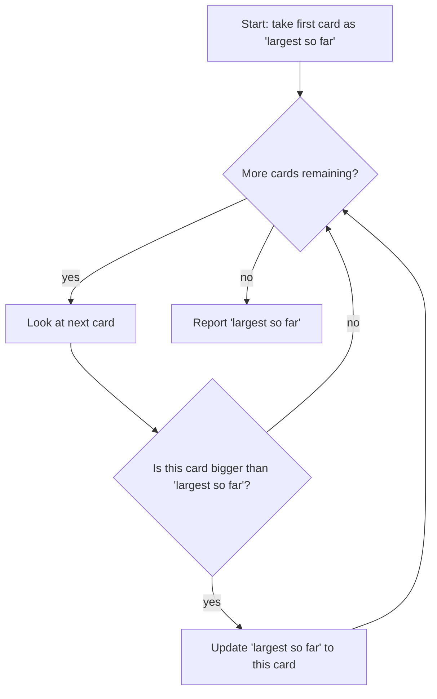

## Learning Objectives

- Explain what computational thinking is and how it differs from "thinking like a computer" or from programming itself.
- Identify decomposition, pattern recognition, abstraction, and algorithm design at work in a problem that has nothing to do with code.
- Predict which details of a problem can be safely abstracted away and which cannot.
- Distinguish a precise, executable procedure from a vague description that only sounds precise.
- Justify why this discipline is taught before any programming-language syntax.

## Context & Motivation

Before a single `for` loop or `if` statement appears in this curriculum, it is worth asking a question most courses skip: what does it actually mean to "compute" something, and why does a discipline organized around a general-purpose digital computer need its own vocabulary of thought at all? The answer that this track is built around comes from Jeannette Wing's 2006 paper "Computational Thinking," published in *Communications of the ACM*, which argued — against the intuition of the time — that this way of thinking is a fundamental skill for *everyone*, not a specialized skill reserved for computer scientists, in the same sense that literacy and arithmetic are fundamental. Wing's claim was not that everyone should learn to program. It was narrower and, in a way, more ambitious: everyone benefits from learning to formulate a problem so precisely, and break it down so carefully, that a computer — human or machine — could carry out the solution without any further clarification.

That distinction matters because it is easy, especially for a beginner, to conflate "learning to code" with "learning to think computationally." They are not the same activity, and confusing them produces a specific, recognizable kind of failure: a student who has memorized Python's `for`-loop syntax but freezes when handed an unfamiliar problem, because the syntax was never grounded in a habit of decomposing problems in the first place. The professional literature that followed Wing's paper — including the ISTE/CSTA operational definition of computational thinking, developed jointly by the International Society for Technology in Education and the Computer Science Teachers Association for K-12 curricula — converged on the same structure: computational thinking rests on a small number of describable habits of mind, and those habits can and should be practiced independently of any specific programming language, well before a learner is fluent in one.

This concept exists to make that separation explicit and to name the four habits precisely, so that everything that follows in this curriculum — variables, expressions, loops, functions, recursion — can be understood correctly, as *tools for expressing* computational thinking rather than as the thinking itself. A student who treats this concept as throat-clearing before the "real" material starts is set up to misunderstand every concept after it; a student who takes it seriously has already done the hardest part of learning to program, because the hardest part was never memorizing keywords.

## Core Theory

### The four pillars, named precisely

Wing's framework, and the operational definitions that followed it, converge on four component skills:

- **Decomposition** — breaking a problem, or a system, into smaller, more manageable parts that can be tackled (and understood) individually.
- **Pattern recognition** — noticing similarities, or recurring structure, either across different problems or within a single problem's own sub-parts.
- **Abstraction** — deciding which details of a problem actually matter for the solution and deliberately ignoring the rest, so that the solution generalizes instead of being tied to one specific instance.
- **Algorithm design** — expressing the solution as a precise, ordered, finite sequence of steps that removes any ambiguity about what to do next.

These four are not independent, disconnected skills exercised one at a time; they interact constantly. Recognizing a pattern (two problems are "the same shape") is often what makes a good abstraction possible (this detail can be ignored because the pattern doesn't depend on it), and a correct decomposition frequently falls directly out of a good abstraction (once you know what matters, the pieces that matter are your sub-problems).

### Worked structural example: finding the largest of a pile

Take a problem that involves no code at all: "find the largest number in a pile of index cards, each with one number written on it." Walking through all four pillars on this one problem shows how they compose:

- **Decomposition** splits the vague instruction "find the largest" into an ordered list of concrete steps: (1) look at the first card and remember it as the largest-so-far; (2) look at each remaining card, one at a time; (3) compare it to the largest-so-far, replacing that value if the new card is bigger; (4) after the last card has been examined, report the largest-so-far.
- **Pattern recognition** notices that this is the identical shape as "find the tallest person in a room" or "find the highest score posted on a leaderboard." Once the pattern is seen, the same four-step procedure solves any of them — the labor of decomposing is not wasted, it transfers.
- **Abstraction** notices that the procedure never needs to know what the numbers *represent* — ages, prices, temperatures — nor how many cards are in the pile. The only property that matters is "a sequence of values that can be compared to one another." Everything else is noise that a correct solution should not depend on.
- **Algorithm design** is the discipline of writing the four numbered steps precisely enough that a stranger — someone who has never seen this particular pile — could execute them and arrive at the right answer every time, including on edge cases most people forget to consider on a first pass, such as a pile containing exactly one card, or (a harder case) an empty pile, where step (1) has nothing to look at.

The following flow makes the control structure of that procedure explicit, independent of any programming language:



Only *after* this thinking is settled does it make sense to write it in a language:

```python
largest = None
for card in pile:
    if largest is None or card > largest:
        largest = card
print(largest)
```

Notice that the code is a direct transcription of the four numbered steps and the flowchart above — nothing new was invented at the syntax level, and the `if largest is None` check is exactly the edge case the algorithm-design step above flagged for an empty starting point. That ordering — think first, transcribe second — is the discipline this entire curriculum track is organized around.

### Abstraction is a judgment call, not a rule

A common misunderstanding is to treat abstraction as "throw away as many details as possible." That is not what the term means. Abstraction means keeping *exactly* the details the solution depends on and discarding the rest — and getting that boundary wrong in either direction causes real failures. Discarding too little produces a solution needlessly tied to one specific case (a "find the largest" procedure that only works for exactly ten cards). Discarding too much produces a solution that silently breaks on a case it needed to handle (a "find the largest" procedure that assumes the pile is never empty, and crashes — or worse, returns a wrong answer silently — when it is).

### Why algorithm design demands more precision than ordinary language

Ordinary natural-language instructions tolerate a huge amount of implicit shared understanding: "sort the mail" assumes the listener already knows what counts as "sorted" and what to do with a piece of mail that doesn't obviously belong anywhere. Algorithm design does not get to lean on that shared understanding, because the "listener" executing the algorithm — whether a machine or a person deliberately following the steps literally — is not permitted to fill gaps with judgment. This is precisely why the four-pillar framework insists algorithm design come last: only after decomposition, pattern recognition, and abstraction have clarified *what* the solution actually needs to do is it possible to write a version of "sort the mail" precise enough that it contains no hidden assumptions.

## Worked Examples

**Example 1 — Decomposing "plan a trip" into an algorithm.** The vague task "plan a trip to visit three cities" is not yet an algorithm; it is a goal. Decomposition breaks it into ordered sub-goals: (1) decide the order to visit the three cities in; (2) for each consecutive pair of cities in that order, find a way to travel between them; (3) for each city, decide how long to stay. Pattern recognition notices this is the same shape as visiting any number of cities, not just three — the procedure should not be hard-coded to "three." Abstraction decides that, for the purposes of ordering the cities, the specific mode of transport (car, train, plane) does not matter yet — only relative distances or costs do, deferred to a later, separate sub-problem. The algorithm-design step then writes out the ordering procedure precisely:

```python
cities = ["Lisbon", "Porto", "Coimbra"]
distances_from_start = {"Lisbon": 0, "Coimbra": 200, "Porto": 313}

visit_order = sorted(cities, key=lambda city: distances_from_start[city])
print(visit_order)   # ['Lisbon', 'Coimbra', 'Porto']
```

Notice that the ordering procedure is completely indifferent to *how many* cities are in the list — that indifference is the abstraction pillar paying off directly as a property of the code.

**Example 2 — Spotting a shared pattern across two "different" problems.** Consider two tasks presented separately: "find the average grade in a class" and "find the average temperature over a week." Presented cold, a beginner might treat these as unrelated. Pattern recognition asks: what is structurally identical here? Both require (a) summing a sequence of numeric values and (b) dividing by how many values there are. Once that pattern is named, one procedure solves both, with only the input data changing:

```python
def compute_average(values):
    total = 0
    count = 0
    for v in values:
        total = total + v
        count = count + 1
    return total / count

grades = [14, 16, 12, 18]
temperatures = [21.5, 19.0, 22.3, 20.1, 18.8, 23.0, 21.9]

print(compute_average(grades))         # 15.0
print(compute_average(temperatures))   # ~20.94
```

The abstraction here — "a collection of numbers to sum and count" — is exactly what makes this one function reusable for both problems, and the decomposition into "accumulate a running total" plus "accumulate a running count" is what made writing the function mechanical rather than a fresh invention each time.

**Example 3 — Catching an ambiguous step before it becomes a bug.** Suppose the plan for a simple game is stated as: "if the player's health reaches zero, end the game." Algorithm design demands asking: does "reaches zero" mean "exactly equal to zero" or "zero or below"? If a single attack can reduce health from 5 to -3 in one step, a check for exact equality (`health == 0`) would never trigger, and the game would never end. Writing the check as `health <= 0` closes that gap:

```python
health = 5
health = health - 8   # a single large attack
if health <= 0:
    print("Game over")
else:
    print("Health remaining:", health)
```

This is algorithm design doing its job: the ambiguity ("reaches zero" vs. "at or below zero") was caught and resolved on paper, in prose, before it had a chance to become a silent bug in running code.

## Common Misconceptions & Pitfalls

- **"Computational thinking means thinking like a computer."** It is closer to the reverse: it means thinking clearly and precisely enough that a computer — which has no judgment to fall back on — can execute the plan without guessing. The thinking is unmistakably human; only the execution is mechanical.
- **"This is just programming with extra steps."** Confusing the two leads students to skip straight to syntax and get stuck on unfamiliar problems. A student who can recite Python's `for`-loop grammar but cannot decompose "find the largest number" into steps has learned syntax without the thinking it is meant to express — the syntax alone doesn't generate the plan.
- **"Abstraction means simplifying as much as possible."** Over-abstracting is a real failure mode: deciding a detail "doesn't matter" when it actually does produces a solution that looks general but is silently wrong on the cases it dropped. The empty-pile case above (`largest = None` check) exists precisely because an earlier, sloppier abstraction ("the pile always has cards in it") would fail on that case:

  ```python
  largest = None
  pile = []
  for card in pile:
      if largest is None or card > largest:
          largest = card
  print(largest)   # None — a correct, explicit answer, not a crash
  ```
- **"Pattern recognition means 'this reminds me of that,' which is good enough."** A superficial resemblance is not the same as a structural match. Treating "find the largest value" and "find the most frequent value" as the same procedure, because both scan a list once, produces working-looking but wrong code — frequency requires counting occurrences of each value, not just comparing values pairwise. The pattern has to match at the level of what operations the solution actually performs, not at the level of "feels similar."

## Summary

Computational thinking, as formalized by Wing and operationalized by ISTE/CSTA for education, is a discipline of formulating problems precisely enough that a solution can be executed without guesswork — and it is learned and practiced independently of any programming language. Its four component habits — decomposition, pattern recognition, abstraction, and algorithm design — are not applied in strict isolation; a good decomposition and a good abstraction typically reinforce each other, and algorithm design is deliberately the last step because it depends on the other three having already clarified what actually needs to happen. Getting abstraction wrong in either direction (keeping too much irrelevant detail, or discarding a detail that matters) is a genuine, recoverable design mistake, not a sign the whole approach has failed. Every concept that follows in this curriculum — variables, expressions, loops, functions — should be read as a tool for *expressing* a computational-thinking solution in code, never as a substitute for having done that thinking first.

## Documentation Links

- [Wing, "Computational Thinking" — Communications of the ACM (2006)](https://dl.acm.org/doi/10.1145/1118178.1118215) — doc
- [ISTE/CSTA Operational Definition of Computational Thinking](https://iste.org/standards/computational-thinking-competencies) — doc
