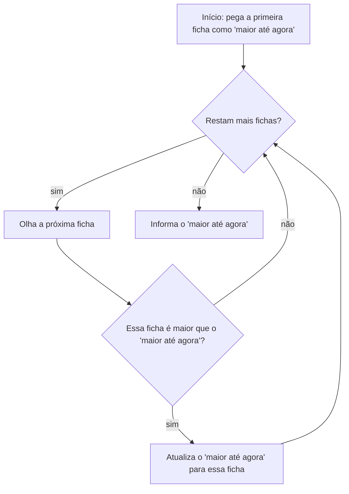

## Objetivos de Aprendizagem

- Explicar o que é pensamento computacional e como ele difere de "pensar como um computador" ou da própria programação.
- Identificar decomposição, reconhecimento de padrões, abstração e design de algoritmos em ação num problema que não tem nada a ver com código.
- Prever quais detalhes de um problema podem ser abstraídos com segurança e quais não podem.
- Distinguir um procedimento preciso e executável de uma descrição vaga que só parece precisa.
- Justificar por que essa disciplina é ensinada antes de qualquer sintaxe de linguagem de programação.

## Contexto e Motivação

Antes que um único loop `for` ou comando `if` apareça neste currículo, vale a pena fazer uma pergunta que a maioria dos cursos pula: o que realmente significa "computar" algo, e por que uma disciplina organizada em torno de um computador digital de propósito geral precisa até de seu próprio vocabulário de pensamento? A resposta em torno da qual esta trilha é construída vem do artigo de Jeannette Wing de 2006, "Computational Thinking," publicado na *Communications of the ACM*, que argumentou (contra a intuição da época) que essa forma de pensar é uma habilidade fundamental para *todo mundo*, não uma habilidade especializada reservada a cientistas da computação, no mesmo sentido em que alfabetização e aritmética são fundamentais. A afirmação de Wing não era que todo mundo deveria aprender a programar. Era mais restrita e, de certa forma, mais ambiciosa: todo mundo se beneficia ao aprender a formular um problema com tanta precisão, e a decompô-lo com tanto cuidado, que um computador (humano ou máquina) conseguiria executar a solução sem nenhum esclarecimento adicional.

Essa distinção importa porque é fácil, especialmente para um iniciante, confundir "aprender a programar" com "aprender a pensar computacionalmente." Não são a mesma atividade, e confundi-las produz um tipo específico e reconhecível de falha: um aluno que memorizou a sintaxe do loop `for` do Python, mas trava diante de um problema desconhecido, porque a sintaxe nunca foi fundamentada num hábito de decompor problemas em primeiro lugar. A literatura profissional que veio depois do artigo de Wing (incluindo a definição operacional de pensamento computacional da ISTE/CSTA, desenvolvida em conjunto pela International Society for Technology in Education e pela Computer Science Teachers Association para currículos do ensino básico) convergiu para a mesma estrutura: o pensamento computacional se apoia num pequeno número de hábitos mentais descritíveis, e esses hábitos podem e devem ser praticados de forma independente de qualquer linguagem de programação específica, bem antes de o aluno ser fluente em uma delas.

Este conceito existe para tornar essa separação explícita e nomear os quatro hábitos com precisão, de modo que tudo o que vem a seguir neste currículo (variáveis, expressões, loops, funções, recursão) possa ser entendido corretamente, como *ferramentas para expressar* o pensamento computacional, não como o pensamento em si. Um aluno que trata este conceito como um preâmbulo antes do "material de verdade" começar está fadado a entender mal todo conceito seguinte; um aluno que o leva a sério já fez a parte mais difícil de aprender a programar, porque a parte mais difícil nunca foi memorizar palavras-chave.

## Teoria Central

### Os quatro pilares, nomeados com precisão

O framework de Wing, e as definições operacionais que vieram depois dele, convergem para quatro habilidades componentes:

- **Decomposição**: quebrar um problema, ou um sistema, em partes menores e mais gerenciáveis, que podem ser atacadas (e entendidas) individualmente.
- **Reconhecimento de padrões**: perceber semelhanças, ou estrutura recorrente, seja entre problemas diferentes ou dentro das próprias subpartes de um único problema.
- **Abstração**: decidir quais detalhes de um problema realmente importam para a solução e ignorar deliberadamente o resto, de modo que a solução se generalize em vez de ficar presa a uma instância específica.
- **Design de algoritmos**: expressar a solução como uma sequência precisa, ordenada e finita de passos que elimina qualquer ambiguidade sobre o que fazer a seguir.

Esses quatro não são habilidades independentes e desconectadas, exercitadas uma de cada vez; elas interagem o tempo todo. Reconhecer um padrão (dois problemas têm "a mesma forma") é muitas vezes o que torna possível uma boa abstração (esse detalhe pode ser ignorado porque o padrão não depende dele), e uma decomposição correta frequentemente surge diretamente de uma boa abstração (uma vez que você sabe o que importa, as partes que importam são seus subproblemas).

### Exemplo estrutural resolvido: encontrando o maior de um monte

Pegue um problema que não envolve nenhum código: "encontre o maior número num monte de fichas, cada uma com um número escrito." Percorrer os quatro pilares nesse único problema mostra como eles se combinam:

- **Decomposição** divide a instrução vaga "encontre o maior" numa lista ordenada de passos concretos: (1) olhe a primeira ficha e guarde-a como o maior até agora; (2) olhe cada ficha restante, uma de cada vez; (3) compare com o maior até agora, substituindo esse valor se a nova ficha for maior; (4) depois que a última ficha for examinada, informe o maior até agora.
- **Reconhecimento de padrões** percebe que essa é a mesma forma de "encontre a pessoa mais alta numa sala" ou "encontre a maior pontuação postada num placar." Uma vez que o padrão é visto, o mesmo procedimento de quatro passos resolve qualquer um deles: o trabalho de decompor não foi desperdiçado, ele se transfere.
- **Abstração** percebe que o procedimento nunca precisa saber o que os números *representam* (idades, preços, temperaturas), nem quantas fichas há no monte. A única propriedade que importa é "uma sequência de valores que podem ser comparados entre si." Todo o resto é ruído do qual uma solução correta não deveria depender.
- **Design de algoritmos** é a disciplina de escrever os quatro passos numerados com precisão suficiente para que um estranho (alguém que nunca viu esse monte em particular) consiga executá-los e chegar à resposta certa sempre, incluindo em casos extremos que a maioria das pessoas esquece de considerar numa primeira passada, como um monte com exatamente uma ficha, ou (um caso mais difícil) um monte vazio, onde o passo (1) não tem nada para olhar.

O fluxo a seguir deixa explícita a estrutura de controle desse procedimento, independente de qualquer linguagem de programação:



Só *depois* que esse raciocínio está resolvido é que faz sentido escrevê-lo numa linguagem:

```python
maior = None
for ficha in monte:
    if maior is None or ficha > maior:
        maior = ficha
print(maior)
```

Note que o código é uma transcrição direta dos quatro passos numerados e do fluxograma acima: nada de novo foi inventado no nível da sintaxe, e a checagem `if maior is None` é exatamente o caso extremo que o passo de design de algoritmos acima sinalizou para um ponto de partida vazio. Essa ordem (pensar primeiro, transcrever depois) é a disciplina em torno da qual toda esta trilha do currículo é organizada.

### Abstração é uma decisão de julgamento, não uma regra

Um mal-entendido comum é tratar abstração como "descartar o máximo de detalhes possível." Não é isso que o termo significa. Abstração significa manter *exatamente* os detalhes dos quais a solução depende e descartar o resto, e errar esse limite em qualquer uma das direções causa falhas reais. Descartar de menos produz uma solução desnecessariamente presa a um caso específico (um procedimento de "encontrar o maior" que só funciona para exatamente dez fichas). Descartar demais produz uma solução que quebra silenciosamente num caso que precisava tratar (um procedimento de "encontrar o maior" que assume que o monte nunca está vazio, e trava, ou pior, retorna uma resposta errada silenciosamente, quando está).

### Por que o design de algoritmos exige mais precisão que a linguagem cotidiana

Instruções em linguagem natural comum toleram uma quantidade enorme de entendimento implícito compartilhado: "organize a correspondência" pressupõe que o ouvinte já sabe o que conta como "organizado" e o que fazer com uma carta que não se encaixa claramente em lugar nenhum. O design de algoritmos não pode se apoiar nesse entendimento compartilhado, porque o "ouvinte" que executa o algoritmo (seja uma máquina, seja uma pessoa seguindo os passos deliberadamente ao pé da letra) não tem permissão para preencher lacunas com julgamento próprio. É exatamente por isso que o framework dos quatro pilares insiste que o design de algoritmos venha por último: só depois que decomposição, reconhecimento de padrões e abstração esclareceram *o que* a solução realmente precisa fazer é que se torna possível escrever uma versão de "organize a correspondência" precisa o bastante para não conter nenhuma suposição escondida.

## Exemplos Resolvidos

**Exemplo 1: decompondo "planejar uma viagem" num algoritmo.** A tarefa vaga "planejar uma viagem para visitar três cidades" ainda não é um algoritmo; é um objetivo. A decomposição a quebra em subobjetivos ordenados: (1) decidir a ordem de visita às três cidades; (2) para cada par consecutivo de cidades nessa ordem, encontrar uma forma de viajar entre elas; (3) para cada cidade, decidir quanto tempo ficar. O reconhecimento de padrões percebe que essa é a mesma forma de visitar qualquer número de cidades, não só três; o procedimento não deveria estar fixado em "três." A abstração decide que, para fins de ordenar as cidades, o meio de transporte específico (carro, trem, avião) ainda não importa, só as distâncias ou custos relativos importam, isso fica para um subproblema posterior e separado. O passo de design de algoritmos então escreve o procedimento de ordenação com precisão:

```python
cidades = ["Lisboa", "Porto", "Coimbra"]
distancias_do_inicio = {"Lisboa": 0, "Coimbra": 200, "Porto": 313}

ordem_de_visita = sorted(cidades, key=lambda cidade: distancias_do_inicio[cidade])
print(ordem_de_visita)   # ['Lisboa', 'Coimbra', 'Porto']
```

Note que o procedimento de ordenação é completamente indiferente a *quantas* cidades há na lista: essa indiferença é o pilar da abstração compensando diretamente como uma propriedade do código.

**Exemplo 2: percebendo um padrão compartilhado entre dois problemas "diferentes."** Considere duas tarefas apresentadas separadamente: "encontrar a nota média de uma turma" e "encontrar a temperatura média ao longo de uma semana." Apresentado assim, de repente, um iniciante pode tratá-las como coisas sem relação. O reconhecimento de padrões pergunta: o que é estruturalmente idêntico aqui? Ambas exigem (a) somar uma sequência de valores numéricos e (b) dividir pela quantidade de valores. Uma vez que esse padrão é nomeado, um procedimento resolve as duas, só mudando os dados de entrada:

```python
def calcula_media(valores):
    total = 0
    quantidade = 0
    for v in valores:
        total = total + v
        quantidade = quantidade + 1
    return total / quantidade

notas = [14, 16, 12, 18]
temperaturas = [21.5, 19.0, 22.3, 20.1, 18.8, 23.0, 21.9]

print(calcula_media(notas))          # 15.0
print(calcula_media(temperaturas))   # ~20.94
```

A abstração aqui ("uma coleção de números para somar e contar") é exatamente o que torna essa função reaproveitável para os dois problemas, e a decomposição em "acumular um total corrente" mais "acumular uma contagem corrente" é o que tornou a escrita da função mecânica, em vez de uma invenção nova a cada vez.

**Exemplo 3: pegando um passo ambíguo antes que ele vire um bug.** Suponha que o plano de um jogo simples seja declarado assim: "se a vida do jogador chegar a zero, encerre o jogo." O design de algoritmos exige perguntar: "chegar a zero" significa "exatamente igual a zero" ou "zero ou menos"? Se um único ataque pode reduzir a vida de 5 para -3 num só passo, uma checagem de igualdade exata (`vida == 0`) nunca dispararia, e o jogo nunca terminaria. Escrever a checagem como `vida <= 0` fecha essa brecha:

```python
vida = 5
vida = vida - 8   # um único ataque forte
if vida <= 0:
    print("Fim de jogo")
else:
    print("Vida restante:", vida)
```

Isso é o design de algoritmos fazendo seu trabalho: a ambiguidade ("chega a zero" versus "está em zero ou abaixo") foi identificada e resolvida no papel, em prosa, antes de ter a chance de virar um bug silencioso no código em execução.

## Erros Comuns e Armadilhas

- **"Pensamento computacional significa pensar como um computador."** É quase o oposto disso: significa pensar de forma clara e precisa o suficiente para que um computador, que não tem julgamento próprio ao qual recorrer, consiga executar o plano sem precisar adivinhar. O pensamento é inconfundivelmente humano; só a execução é mecânica.
- **"Isso é só programação com passos extras."** Confundir as duas coisas leva os alunos a pular direto para a sintaxe e travar em problemas desconhecidos. Um aluno que consegue recitar a gramática do loop `for` do Python, mas não consegue decompor "encontrar o maior número" em passos, aprendeu a sintaxe sem o pensamento que ela deveria expressar: a sintaxe sozinha não gera o plano.
- **"Abstração significa simplificar o máximo possível."** Abstrair demais é um modo de falha real: decidir que um detalhe "não importa" quando na verdade importa produz uma solução que parece geral, mas está silenciosamente errada nos casos que ela descartou. O caso do monte vazio acima (a checagem `maior = None`) existe exatamente porque uma abstração anterior mais descuidada ("o monte sempre tem fichas") falharia nesse caso:

  ```python
  maior = None
  monte = []
  for ficha in monte:
      if maior is None or ficha > maior:
          maior = ficha
  print(maior)   # None: uma resposta correta e explícita, não uma falha
  ```
- **"Reconhecimento de padrões significa 'isso me lembra aquilo,' e isso já basta."** Uma semelhança superficial não é o mesmo que uma correspondência estrutural. Tratar "encontrar o maior valor" e "encontrar o valor mais frequente" como o mesmo procedimento, só porque os dois percorrem uma lista uma vez, produz um código que parece funcionar, mas está errado: frequência exige contar as ocorrências de cada valor, não apenas comparar valores dois a dois. O padrão precisa corresponder no nível das operações que a solução realmente executa, não no nível de "parece parecido."

## Resumo

O pensamento computacional, formalizado por Wing e operacionalizado pela ISTE/CSTA para a educação, é uma disciplina de formular problemas com precisão suficiente para que uma solução possa ser executada sem adivinhação, e é aprendido e praticado de forma independente de qualquer linguagem de programação. Seus quatro hábitos componentes (decomposição, reconhecimento de padrões, abstração e design de algoritmos) não são aplicados em isolamento estrito; uma boa decomposição e uma boa abstração normalmente se reforçam mutuamente, e o design de algoritmos é deliberadamente o último passo porque depende dos outros três já terem esclarecido o que realmente precisa acontecer. Errar a abstração em qualquer uma das direções (manter detalhes irrelevantes demais, ou descartar um detalhe que importa) é um erro de design genuíno e recuperável, não um sinal de que toda a abordagem falhou. Todo conceito que vem a seguir neste currículo (variáveis, expressões, loops, funções) deve ser lido como uma ferramenta para *expressar* em código uma solução de pensamento computacional, nunca como um substituto para ter feito esse pensamento antes.

## Documentation Links

- [Wing, "Computational Thinking", Communications of the ACM (2006)](https://dl.acm.org/doi/10.1145/1118178.1118215) (doc)
- [Definição Operacional de Pensamento Computacional da ISTE/CSTA](https://iste.org/standards/computational-thinking-competencies) (doc)
