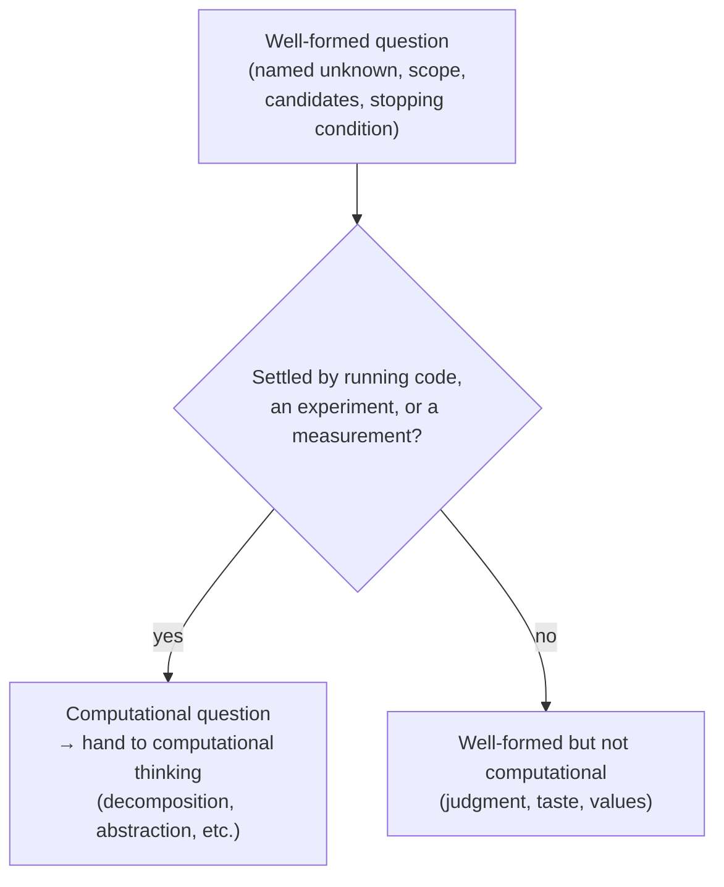

## Learning Objectives

- Distinguish posing a question from solving a problem, and place computational thinking's four pillars on the "solving" side of that line.
- Identify the specific properties that make a well-formed question a *computational* one.
- Classify a given question as computational, empirical-but-not-computational, or neither, with justification.
- Explain why a question can be well-formed (per the previous concept) without being computational.
- Translate a computational question into the kind of thing a program, an experiment, or a measurement could actually settle.

## Context & Motivation

This curriculum already covers, in "What Is Computation?," Jeannette Wing's four pillars of computational thinking: decomposition, pattern recognition, abstraction, and algorithm design. That concept is unambiguously about what happens *after* a problem exists — Wing's own framing treats the problem as given ("find the largest number in a pile of index cards") and asks how to break it down, spot its structure, decide what matters, and turn the result into a precise, executable procedure. Every one of the four pillars presupposes that someone has already handed you something to decompose, a pattern to recognize, a detail to abstract, an algorithm to design. Nothing in that framework tells you how the problem — or the question behind it — got onto the table in the first place. It is, deliberately and usefully, a theory of solving.

This concept sits on the other side of that line entirely. Before you can decompose "find the largest number," someone had to decide that finding the largest number was the thing worth doing — a decision that itself came from somewhere, usually from a vaguer question ("which of these matters most?") getting refined into something specific enough to hand to an algorithm designer. The previous two concepts in this discipline built the machinery for that refinement in general: turning curiosity into a question, and turning a question into one that names what would count as an answer. This concept adds one more constraint on top of "well-formed," specific to computational work: not every well-formed question is one a program, an experiment on a system, or a measurement can actually answer. "Which of these three operations dominates the running time under load X?" is well-formed *and* computational — an instrumented run settles it. "Which of these three design options is more elegant?" can be made just as well-formed (name three options, state a scope, define candidates) without ever becoming something a machine or a measurement could adjudicate, because "elegant" doesn't reduce to anything countable, timeable, or executable.

The distinction matters practically because computational thinking's pillars are extraordinarily good at solving a question once it clears this bar, and correspondingly useless for questions that never will — no amount of decomposition, pattern recognition, abstraction, or algorithm design turns "which is more elegant?" into something a program answers, because the pillars operate downstream of the question having already been posed in answerable terms. Learning to recognize, before investing any solving effort, whether a question is even the kind of thing computation can resolve is what this concept is for.

## Core Theory

### Posing versus solving: where the two disciplines split

Wing's four pillars — decomposition, pattern recognition, abstraction, algorithm design — form a complete toolkit for taking a stated problem and producing an executable solution to it. Notice what all four have in common: each one takes the problem as its input. Decomposition breaks *a given problem* into parts; pattern recognition compares *a given problem* to others already seen; abstraction decides which details of *a given problem* matter; algorithm design expresses *a given problem's* solution as precise steps. None of the four pillars contains a mechanism for generating the problem itself, and that is not an oversight — it is a division of labor. Computational thinking, as a discipline, begins at the moment a question already exists in a form precise enough to decompose. Everything this discipline (Questions & Scientific Thinking) covers happens strictly before that moment: it is the discipline of arriving at a question worth handing to computational thinking in the first place.

This split is not a minor sequencing detail. A learner who is excellent at all four pillars but has never practiced posing questions will reliably produce elegant, well-decomposed solutions to problems nobody needed solved, or to vague restatements of a problem that were never actually well-formed to begin with — decomposing "why is this slow?" produces nothing, because there is no problem there yet to decompose, only an observation wearing a problem's grammar (the exact failure mode covered two concepts ago). Conversely, a learner who is skilled at posing sharp, well-formed, computational questions but has no facility with the four pillars will correctly identify what needs answering and then be unable to build the thing that answers it. Both skills are necessary; neither substitutes for the other; and this curriculum deliberately separates them into two different disciplines rather than folding question-posing into computational thinking as an afterthought.

### What makes a well-formed question specifically computational

The previous concept established three properties of any well-formed question: a named unknown with finite candidates, a stated scope, and a structure such that some concrete investigation could settle it. A **computational question** adds a fourth requirement on top of those three: the "concrete investigation" that would settle it has to be one of exactly three kinds —

1. **Running a program** and observing its output or behavior (does this sorting routine produce a sorted list for all inputs in this test suite? does this function terminate on this input within N steps?).
2. **Running an experiment on a system** — instrumenting real software or hardware and measuring what happens under controlled conditions (which of these three operations dominates running time under load X? does increasing cache size reduce miss rate?).
3. **Taking a measurement** on something that already exists and can be objectively recorded (how many requests per second does this server currently sustain? how much memory does this process use at steady state?).

A well-formed question that cannot be settled by any of these three — no program to run, no experiment to instrument, no measurement to take, because the "answer" would depend on values, taste, or judgment that don't reduce to an executable check — is well-formed but not computational. "Under the current production read/write ratio, does the new caching layer reduce median read latency compared to the old one?" (from the previous concept) is computational: it is settled by an experiment, running both layers under matched conditions and measuring latency. "Which of these two API naming conventions is easier to read?" can be made well-formed (name two conventions, state a scope such as "for developers new to this codebase," define "easier" as, say, time-to-first-correct-usage) — and once *that* refinement happens, it actually becomes computational again, because "time-to-first-correct-usage" is a measurement you could take (a small user study). The lesson is not that questions about naming or elegance are permanently off-limits to computation, but that they only become computational once refined into a form where a program, experiment, or measurement is the thing doing the answering — refining "easier to read" down to a raw, unmeasured intuition keeps it outside computational reach.

### A quick test: what would the investigation look like?

Given a well-formed question, ask: if I actually went to answer this today, what would I be doing? If the honest answer is "running code and checking what happens," "instrumenting the system and taking measurements under different conditions," or "recording a value that already exists and can be objectively read off" — it's computational. If the honest answer is "asking people what they think," "consulting a value judgment," or "there's no procedure, I'd just have to decide" — it is not computational as stated, whether or not it is well-formed. This test is diagnostic, not judgmental: plenty of important, well-formed questions in engineering and life are not computational (is this API design maintainable in five years is partly a judgment call informed by, but not reducible to, any single measurement), and recognizing that honestly is more useful than forcing a false computational framing onto them.

## Worked Examples

### Example 1 — sorting a genuinely computational question out from a look-alike

**Starting curiosity:** "I wonder if our new recommendation algorithm is actually good."

**First well-formed attempt:** "Is the new recommendation algorithm better than the old one?" — this fails the well-formedness check from the previous concept (no named dimension for "better," no scope) before it even reaches the computational test.

**Refining toward well-formed:** "Under last month's real user traffic, does the new algorithm produce a higher click-through rate than the old one?" This now has a named unknown (higher/lower/no difference in click-through rate), a scope (last month's real traffic, or a controlled replay of it), and distinguishable candidates.

**Applying the computational test:** what would answering this look like? Running both algorithms (or a controlled A/B split) and measuring click-through rate — an experiment on a real system. This is computational.

**A nearby trap:** "Is the new algorithm's approach more principled than the old one?" sounds like a natural follow-up and can even be made well-formed (name the two approaches, state criteria for "principled"), but "principled" typically resists reduction to a program, experiment, or measurement — it usually collapses into a judgment about design philosophy. Unless "principled" is explicitly redefined as something measurable (e.g., "makes fewer undocumented assumptions, counted against a checklist"), this question stays outside computational reach even once well-formed, and should be recognized as such rather than force-fit into an experiment that can't actually answer it.

### Example 2 — a question that starts non-computational and gets refined into one

**Starting curiosity:** "I feel like our error messages are confusing."

**First attempt:** "Are our error messages good?" — not well-formed (no named dimension for "good," no scope) and, as stated, not obviously computational either, since "good" sounds like a taste judgment.

**Refining for well-formedness:** decide what "confusing" would concretely mean if it were true — perhaps: users who see this error message take unusually long to resolve the underlying issue, or abandon the task. Scope: users encountering this specific error message in the last quarter's support logs.

**Well-formed version:** "Among users who encountered this error message in the last quarter, is the time-to-resolution longer than for users who encountered a comparison error message with clearer wording?"

**Applying the computational test:** this is now settled by a measurement — pulling time-to-resolution data that already exists in support logs, or running a controlled experiment with two message wordings and measuring the outcome. What started as a taste-flavored curiosity ("confusing") became computational specifically because "confusing" was cashed out into something measurable (time-to-resolution) rather than left as an unrefined impression. This is the same move as the naming-convention example above: the question didn't become computational by accident, it became computational because the refinement step deliberately picked a measurable stand-in for the vague quality being investigated, and that choice should be stated explicitly (time-to-resolution is a proxy for "confusing," not a perfect synonym for it) rather than left implicit.

## Common Misconceptions & Pitfalls

- **Assuming any question about software is automatically computational.** "Is this codebase well-organized?" is about software but, as stated, resists any program, experiment, or measurement — it is a judgment question wearing a technical subject. Being *about* a computational system does not make a question computational; the investigation itself has to be executable, experimental, or measurable.
- **Believing computational thinking's four pillars can generate the question.** Decomposition, pattern recognition, abstraction, and algorithm design are all solving tools that require a problem as input; expecting them to produce a well-formed, computational question from scratch confuses the two disciplines this concept exists to separate.
- **Treating "not currently computational" as "never computational."** A question resisting the computational test today (like "which naming convention is easier to read") often becomes computational once someone does the refinement work of defining a measurable proxy for the vague quality in question — the fix is refinement, not abandoning the question.
- **Mistaking a measurable proxy for the real quality it stands in for.** Using time-to-resolution as a stand-in for "confusing," or click-through rate as a stand-in for "better," is a legitimate and often necessary move, but forgetting that the proxy is a proxy — and reporting "the error message is confusing" as a settled fact rather than "resolution took longer for this message, which we're treating as evidence of confusion" — overstates what the computational investigation actually established.
- **Assuming a question must be computational to be worth asking.** Plenty of genuinely important engineering and life questions are judgment calls informed by evidence rather than settled by it. Recognizing a question as non-computational is not a dismissal of it — it just means the four pillars, and this discipline's later material on experiments and evidence, are the wrong tools to expect a final, mechanical answer from.

## Summary

Computational thinking's four pillars — decomposition, pattern recognition, abstraction, algorithm design — are a toolkit for solving a problem that already exists in stated form; none of them address how that problem got posed. This discipline covers exactly that prior step, and this concept narrows it further: a well-formed question (named unknown, stated scope, checkable candidates) becomes specifically *computational* only when the investigation that would settle it is running a program, running an experiment on a system, or taking a measurement — not a judgment, a taste, or a values call. Many questions that look non-computational at first ("is this easier to read?", "is this confusing?") can be refined into computational ones by cashing out the vague quality into a measurable proxy, but that refinement is a deliberate, visible step, not something that happens automatically, and the proxy should always be reported as a proxy rather than mistaken for the original quality itself.

## Documentation Links

- [Hamming, "You and Your Research" (1986 transcript)](https://www.cs.virginia.edu/~robins/YouAndYourResearch.pdf) — doc
- [Peyton Jones, "How to Write a Great Research Paper"](https://www.microsoft.com/en-us/research/academic-program/write-great-research-paper/) — doc
