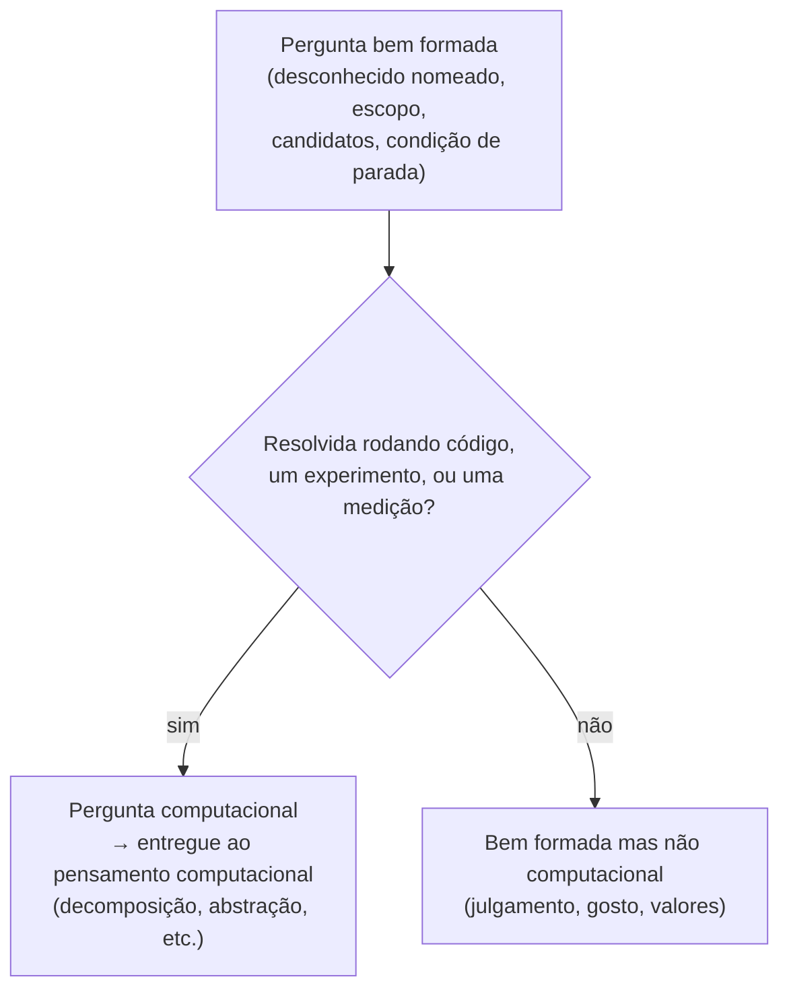

## Objetivos de Aprendizagem

- Distinguir formular uma pergunta de resolver um problema, e situar os quatro pilares do pensamento computacional do lado de "resolver" dessa linha.
- Identificar as propriedades específicas que tornam uma pergunta bem formada especificamente *computacional*.
- Classificar uma dada pergunta como computacional, empírica-mas-não-computacional, ou nenhuma das duas, com justificativa.
- Explicar por que uma pergunta pode ser bem formada (pelo conceito anterior) sem ser computacional.
- Traduzir uma pergunta computacional no tipo de coisa que um programa, um experimento, ou uma medição de fato poderia resolver.

## Contexto e Motivação

Este currículo já cobre, em "O Que É Computação?," os quatro pilares de Jeannette Wing de pensamento computacional: decomposição, reconhecimento de padrões, abstração, e design de algoritmo. Aquele conceito é inequivocamente sobre o que acontece *depois* de um problema existir, a própria formulação de Wing trata o problema como dado ("encontre o maior número em um monte de fichas") e pergunta como decompô-lo, identificar sua estrutura, decidir o que importa, e transformar o resultado em um procedimento preciso e executável. Cada um dos quatro pilares pressupõe que alguém já lhe entregou algo para decompor, um padrão para reconhecer, um detalhe para abstrair, um algoritmo para projetar. Nada naquela estrutura diz como o problema, ou a pergunta por trás dele, chegou à mesa em primeiro lugar. É, deliberada e utilmente, uma teoria de resolver.

Este conceito se situa inteiramente do outro lado dessa linha. Antes de você conseguir decompor "encontre o maior número," alguém teve que decidir que encontrar o maior número era a coisa que valia a pena fazer, uma decisão que ela mesma veio de algum lugar, geralmente de uma pergunta mais vaga ("qual desses importa mais?") sendo refinada em algo específico o suficiente para entregar a um projetista de algoritmo. Os dois conceitos anteriores desta disciplina construíram o maquinário para esse refinamento em geral: transformar curiosidade em uma pergunta, e transformar uma pergunta em uma que nomeia o que contaria como uma resposta. Este conceito adiciona mais uma restrição em cima de "bem formada," específica ao trabalho computacional: nem toda pergunta bem formada é uma que um programa, um experimento em um sistema, ou uma medição de fato pode responder. "Qual dessas três operações domina o tempo de execução sob carga X?" é bem formada *e* computacional, uma execução instrumentada a resolve. "Qual dessas três opções de design é mais elegante?" pode ser tornada igualmente bem formada (nomeie três opções, declare um escopo, defina candidatos) sem nunca se tornar algo que uma máquina ou medição poderia arbitrar, porque "elegante" não se reduz a nada contável, cronometrável, ou executável.

A distinção importa praticamente porque os pilares do pensamento computacional são extraordinariamente bons em resolver uma pergunta uma vez que ela ultrapassa essa barra, e correspondentemente inúteis para perguntas que nunca ultrapassarão, nenhuma quantidade de decomposição, reconhecimento de padrões, abstração, ou design de algoritmo transforma "qual é mais elegante?" em algo que um programa responde, porque os pilares operam a jusante da pergunta já ter sido formulada em termos respondíveis. Aprender a reconhecer, antes de investir qualquer esforço de resolução, se uma pergunta sequer é o tipo de coisa que computação pode resolver é para isso que este conceito serve.

## Teoria Central

### Formular versus resolver: onde as duas disciplinas se separam

Os quatro pilares de Wing, decomposição, reconhecimento de padrões, abstração, design de algoritmo, formam um kit de ferramentas completo para pegar um problema enunciado e produzir uma solução executável para ele. Note o que todos os quatro têm em comum: cada um pega o problema como sua entrada. Decomposição quebra *um problema dado* em partes; reconhecimento de padrões compara *um problema dado* a outros já vistos; abstração decide quais detalhes de *um problema dado* importam; design de algoritmo expressa a solução de *um problema dado* como passos precisos. Nenhum dos quatro pilares contém um mecanismo para gerar o próprio problema, e isso não é uma omissão, é uma divisão de trabalho. O pensamento computacional, como disciplina, começa no momento em que uma pergunta já existe em uma forma precisa o suficiente para decompor. Tudo que esta disciplina (Perguntas e Pensamento Científico) cobre acontece estritamente antes desse momento: é a disciplina de chegar a uma pergunta que vale a pena entregar ao pensamento computacional em primeiro lugar.

Essa separação não é um detalhe menor de sequenciamento. Um aprendiz que é excelente nos quatro pilares mas nunca praticou formular perguntas vai confiavelmente produzir soluções elegantes e bem decompostas para problemas que ninguém precisava resolvidos, ou para reformulações vagas de um problema que nunca foram de fato bem formadas para começar, decompor "por que isso está lento?" não produz nada, porque não há nenhum problema ali ainda para decompor, apenas uma observação vestindo a gramática de um problema (o exato modo de falha coberto dois conceitos atrás). Reciprocamente, um aprendiz habilidoso em formular perguntas computacionais nítidas e bem formadas mas sem nenhuma facilidade com os quatro pilares vai corretamente identificar o que precisa ser respondido e depois ser incapaz de construir a coisa que responde. Ambas as habilidades são necessárias; nenhuma substitui a outra; e este currículo deliberadamente separa elas em duas disciplinas diferentes em vez de dobrar formular-perguntas em pensamento computacional como uma reflexão tardia.

### O que torna uma pergunta bem formada especificamente computacional

O conceito anterior estabeleceu três propriedades de qualquer pergunta bem formada: um desconhecido nomeado com candidatos finitos, um escopo declarado, e uma estrutura tal que alguma investigação concreta poderia resolvê-la. Uma **pergunta computacional** adiciona uma quarta exigência em cima dessas três: a "investigação concreta" que a resolveria tem que ser um de exatamente três tipos:

1. **Rodar um programa** e observar sua saída ou comportamento (essa rotina de ordenação produz uma lista ordenada para todas as entradas nesta suíte de testes? essa função termina nesta entrada dentro de N passos?).
2. **Rodar um experimento em um sistema**, instrumentar software ou hardware real e medir o que acontece sob condições controladas (qual dessas três operações domina o tempo de execução sob carga X? aumentar o tamanho do cache reduz a taxa de miss?).
3. **Tomar uma medição** de algo que já existe e pode ser registrado objetivamente (quantas requisições por segundo esse servidor atualmente sustenta? quanta memória esse processo usa em estado estável?).

Uma pergunta bem formada que não pode ser resolvida por nenhum desses três, nenhum programa para rodar, nenhum experimento para instrumentar, nenhuma medição para tomar, porque a "resposta" dependeria de valores, gosto, ou julgamento que não se reduzem a uma verificação executável, é bem formada mas não computacional. "Sob a razão atual de leitura/escrita em produção, a nova camada de cache reduz a latência mediana de leitura comparada à antiga?" (do conceito anterior) é computacional: é resolvida por um experimento, rodar ambas as camadas sob condições equiparadas e medir latência. "Qual dessas duas convenções de nomenclatura de API é mais fácil de ler?" pode ser tornada igualmente bem formada (nomeie duas convenções, declare um escopo como "para desenvolvedores novos nesta base de código," defina "mais fácil" como, digamos, tempo-até-primeiro-uso-correto), e uma vez que *esse* refinamento acontece, ela de fato se torna computacional novamente, porque "tempo-até-primeiro-uso-correto" é uma medição que você poderia tomar (um pequeno estudo de usuário). A lição não é que perguntas sobre nomenclatura ou elegância estão permanentemente fora do alcance da computação, mas que elas só se tornam computacionais uma vez refinadas em uma forma onde um programa, experimento, ou medição é a coisa que dá a resposta, refinar "mais fácil de ler" até uma intuição bruta e não medida a mantém fora do alcance computacional.

### Um teste rápido: como a investigação se pareceria?

Dada uma pergunta bem formada, pergunte: se eu fosse de fato responder isso hoje, o que eu estaria fazendo? Se a resposta honesta é "rodar código e verificar o que acontece," "instrumentar o sistema e tomar medições sob condições diferentes," ou "registrar um valor que já existe e pode ser lido objetivamente", é computacional. Se a resposta honesta é "perguntar às pessoas o que elas acham," "consultar um julgamento de valor," ou "não há procedimento, eu simplesmente teria que decidir", não é computacional como enunciada, seja ou não bem formada. Este teste é diagnóstico, não julgador: muitas perguntas importantes e bem formadas em engenharia e na vida não são computacionais (se este design de API é sustentável em cinco anos é em parte uma decisão de julgamento informada por, mas não redutível a, nenhuma única medição), e reconhecer isso honestamente é mais útil do que forçar uma falsa formulação computacional sobre elas.

## Exemplos Resolvidos

### Exemplo 1 — separando uma pergunta genuinamente computacional de uma que se parece

**Curiosidade inicial:** "Eu me pergunto se nosso novo algoritmo de recomendação é de fato bom."

**Primeira tentativa bem formada:** "O novo algoritmo de recomendação é melhor que o antigo?", isso falha na verificação de boa formação do conceito anterior (nenhuma dimensão nomeada para "melhor," nenhum escopo) antes mesmo de chegar ao teste computacional.

**Refinando em direção a bem formada:** "Sob o tráfego real de usuário do mês passado, o novo algoritmo produz uma taxa de clique mais alta que o antigo?" Isso agora tem um desconhecido nomeado (mais alto/mais baixo/sem diferença na taxa de clique), um escopo (tráfego real do mês passado, ou uma reprodução controlada dele), e candidatos distinguíveis.

**Aplicando o teste computacional:** como responder isso se pareceria? Rodar ambos os algoritmos (ou um teste A/B controlado) e medir a taxa de clique, um experimento em um sistema real. Isso é computacional.

**Uma armadilha próxima:** "A abordagem do novo algoritmo é mais bem fundamentada que a antiga?" soa como um acompanhamento natural e pode até ser tornada bem formada (nomeie as duas abordagens, declare critérios para "bem fundamentada"), mas "bem fundamentada" tipicamente resiste a redução a um programa, experimento, ou medição, geralmente colapsa em um julgamento sobre filosofia de design. A menos que "bem fundamentada" seja explicitamente redefinida como algo mensurável (por exemplo, "faz menos suposições não documentadas, contadas contra uma checklist"), esta pergunta permanece fora do alcance computacional mesmo quando bem formada, e deveria ser reconhecida como tal em vez de forçada em um experimento que na verdade não pode respondê-la.

### Exemplo 2 — uma pergunta que começa não computacional e é refinada em uma

**Curiosidade inicial:** "Eu sinto que nossas mensagens de erro são confusas."

**Primeira tentativa:** "Nossas mensagens de erro são boas?", não é bem formada (nenhuma dimensão nomeada para "boas," nenhum escopo) e, como enunciada, também não é obviamente computacional, já que "boas" soa como um julgamento de gosto.

**Refinando para boa formação:** decida o que "confusas" concretamente significaria se fosse verdade, talvez: usuários que veem essa mensagem de erro demoram um tempo incomumente longo para resolver o problema subjacente, ou abandonam a tarefa. Escopo: usuários encontrando essa mensagem de erro específica nos logs de suporte do último trimestre.

**Versão bem formada:** "Entre usuários que encontraram essa mensagem de erro no último trimestre, o tempo-até-resolução é mais longo que para usuários que encontraram uma mensagem de erro de comparação com redação mais clara?"

**Aplicando o teste computacional:** isso agora é resolvido por uma medição, extrair dados de tempo-até-resolução que já existem nos logs de suporte, ou rodar um experimento controlado com duas redações de mensagem e medir o resultado. O que começou como uma curiosidade com sabor de gosto ("confusas") se tornou computacional especificamente porque "confusas" foi convertida em algo mensurável (tempo-até-resolução) em vez de deixada como uma impressão não refinada. Este é o mesmo movimento do exemplo de convenção de nomenclatura acima: a pergunta não se tornou computacional por acidente, tornou-se computacional porque a etapa de refinamento deliberadamente escolheu um substituto mensurável para a qualidade vaga sendo investigada, e essa escolha deveria ser declarada explicitamente (tempo-até-resolução é um proxy para "confusas," não um sinônimo perfeito para isso) em vez de deixada implícita.

## Equívocos Comuns e Armadilhas

- **Assumir que qualquer pergunta sobre software é automaticamente computacional.** "Esse código está bem organizado?" é sobre software mas, como enunciada, resiste a qualquer programa, experimento, ou medição, é uma pergunta de julgamento vestindo um assunto técnico. Ser *sobre* um sistema computacional não torna uma pergunta computacional; a própria investigação tem que ser executável, experimental, ou mensurável.
- **Acreditar que os quatro pilares do pensamento computacional podem gerar a pergunta.** Decomposição, reconhecimento de padrões, abstração, e design de algoritmo são todas ferramentas de resolução que exigem um problema como entrada; esperar que elas produzam uma pergunta computacional bem formada do zero confunde as duas disciplinas que este conceito existe para separar.
- **Tratar "não computacional atualmente" como "nunca computacional."** Uma pergunta que resiste ao teste computacional hoje (como "qual convenção de nomenclatura é mais fácil de ler") frequentemente se torna computacional uma vez que alguém faz o trabalho de refinamento de definir um proxy mensurável para a qualidade vaga em questão, o conserto é refinamento, não abandonar a pergunta.
- **Confundir um proxy mensurável com a qualidade real que ele representa.** Usar tempo-até-resolução como substituto para "confusas," ou taxa de clique como substituto para "melhor," é um movimento legítimo e frequentemente necessário, mas esquecer que o proxy é um proxy, e relatar "a mensagem de erro é confusa" como um fato resolvido em vez de "a resolução demorou mais para essa mensagem, que estamos tratando como evidência de confusão," superestima o que a investigação computacional de fato estabeleceu.
- **Assumir que uma pergunta precisa ser computacional para valer a pena ser feita.** Muitas perguntas genuinamente importantes de engenharia e da vida são decisões de julgamento informadas por evidência em vez de resolvidas por ela. Reconhecer uma pergunta como não computacional não é uma rejeição dela, apenas significa que os quatro pilares, e o material posterior desta disciplina sobre experimentos e evidência, são as ferramentas erradas para esperar uma resposta final e mecânica.

## Resumo

Os quatro pilares do pensamento computacional, decomposição, reconhecimento de padrões, abstração, design de algoritmo, são um kit de ferramentas para resolver um problema que já existe em forma enunciada; nenhum deles aborda como esse problema foi formulado. Esta disciplina cobre exatamente essa etapa anterior, e este conceito a estreita ainda mais: uma pergunta bem formada (desconhecido nomeado, escopo declarado, candidatos verificáveis) se torna especificamente *computacional* apenas quando a investigação que a resolveria é rodar um programa, rodar um experimento em um sistema, ou tomar uma medição, não um julgamento, um gosto, ou uma decisão de valores. Muitas perguntas que parecem não computacionais à primeira vista ("isso é mais fácil de ler?", "isso é confuso?") podem ser refinadas em computacionais convertendo a qualidade vaga em um proxy mensurável, mas esse refinamento é uma etapa deliberada e visível, não algo que acontece automaticamente, e o proxy deveria sempre ser relatado como um proxy em vez de confundido com a própria qualidade original.

## Documentation Links

- [Hamming, "You and Your Research" (1986 transcript)](https://www.cs.virginia.edu/~robins/YouAndYourResearch.pdf) — doc
- [Peyton Jones, "How to Write a Great Research Paper"](https://www.microsoft.com/en-us/research/academic-program/write-great-research-paper/) — doc
