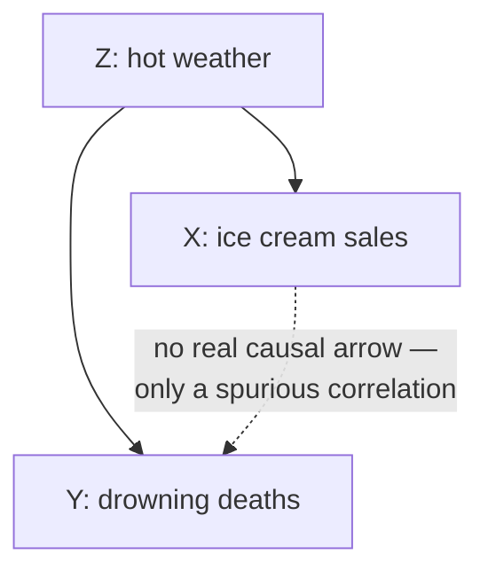

## Learning Objectives

- Define a confounding variable as a hidden factor that influences both of two variables being compared, producing a correlation neither one causes.
- Walk through a classic confounder example and identify exactly which causal arrows explain the observed correlation.
- Explain, using Pearl's ladder of causation, why passive observation alone cannot distinguish direct causation from confounding.
- Identify a plausible confounder in a described software or systems scenario before accepting a causal claim.
- Describe at least two ways to rule out a suspected confounder (randomized intervention, or explicit adjustment for the confounder).

## Context & Motivation

A confounding variable is a hidden third factor that influences two other variables at once, making them rise and fall together even though neither one has any direct causal effect on the other. Confounding is the single most common concrete way a correlation gets mistaken for causation, precisely because the confound is, by definition, sitting outside the two variables anyone happened to be looking at — it takes a deliberate step back from the data to even consider that a third factor might be doing all the work. Recognizing when a confounder is plausible, and knowing how to rule one out, is the practical payoff of everything built up in the previous two concepts: the controls needed to isolate a variable (*Controls and Isolating Variables*) exist specifically to prevent confounders from riding along uncontrolled, and the distinction between merely observing a correlation and actively intervening (*Correlation vs. Causation*, via Pearl's ladder) is exactly the distinction that lets a confounder be told apart from a genuine direct cause.

The textbook illustration of confounding is also one of the clearest available: ice cream sales and drowning deaths both rise and fall together across the year, tracking each other closely enough that, looked at as a bare correlation, one might suspect ice cream consumption somehow contributes to drowning, or that drowning incidents somehow drive up ice cream sales (perhaps through news coverage prompting comfort eating — a stretch, but no more of a stretch than the data alone rules out). Neither is true. Both ice cream sales and drowning deaths are driven by a third factor: hot weather. Hot weather increases how much ice cream people buy, and separately increases how much time people spend swimming — and more swimming means more opportunities for drowning. Ice cream sales and drowning deaths are correlated with each other purely as a side effect of both being correlated with the season, with no causal arrow running between the two of them at all.

## Core Theory

### The structure of a confound

A confound has a specific causal shape: a third variable Z causes both X and Y, with no direct causal arrow between X and Y themselves. This shape produces a real, measurable statistical correlation between X and Y — the correlation is not a fluke or a measurement error, it is a genuine mathematical consequence of both variables tracking Z — but the correlation is *spurious* in the specific sense that neither X nor Y is doing anything causally to the other. Distinguishing this shape from "X causes Y" or "Y causes X" is exactly the three-way ambiguity that Rung 1 (association) of Pearl's ladder of causation cannot resolve on its own, discussed in the previous concept: all three causal structures — X→Y, Y→X, and Z→X plus Z→Y — produce an observed correlation between X and Y that looks identical from the standpoint of passively collected data alone.

### Why confounding specifically defeats naive causal inference

The danger of a confound is not that it makes X and Y uncorrelated — it's the opposite: it makes them correlated exactly as strongly as a real causal link would, with no obvious signal in the raw numbers to tell the two situations apart. A policy or engineering decision built on the assumption "raising X will raise Y," when the real structure is "Z causes both," will fail: deliberately increasing X (say, discouraging ice cream sales, to push the drowning analogy to its logical if silly conclusion) does nothing to Y, because X was never a cause of Y to begin with — it only ever moved in step with Y because both were downstream of Z. This is precisely why Rung 2 (intervention) is the tool that exposes a confound: actively setting X's value, independent of Z, breaks the correlation that Z alone was producing, because now X no longer tracks Z automatically. If forcing X to change no longer produces a corresponding change in Y, that is strong evidence the earlier association was confounded rather than causal.

### Ruling out a suspected confound

There are two main routes to ruling out a confounder, corresponding to the two main routes for climbing the ladder. The first is a randomized intervention: assign the value of X at random, independent of everything else, and measure Y. Randomization severs any link between X and a potential confounder Z — if Z still affects Y but no longer affects X (because X is now assigned by a coin flip instead of by whatever value Z would have naturally pushed it to), any correlation that persists between the randomly-assigned X and Y can no longer be explained by Z, since Z's influence on X has been eliminated by design. The second route, used when a true intervention is impossible or unethical (this is common in fields studying naturally occurring populations, and often in software contexts where re-running history isn't an option), is **explicit adjustment**: if the suspected confounder Z can be measured, statistically controlling for it — comparing X and Y only within groups that share the same value of Z — removes Z's ability to produce a spurious correlation, because within any one fixed value of Z, Z can no longer vary to drive X and Y in tandem. Both routes require, as a precondition, that the confounder has actually been identified as a candidate worth checking; a confound that nobody thought to consider can't be adjusted for, which is why deliberately asking "what third factor could be driving both of these?" is a necessary habit, not an optional extra step.

### Confounding in a software setting

Confounders are just as available in engineering data as in the ice-cream example. Suppose a team notices that services written in a newer internal framework have a lower average incident rate than services written in an older one, and concludes the newer framework causes fewer incidents. A plausible confounder: the newer framework was adopted mostly by teams formed more recently, who also tend to have smaller, more tightly scoped services and more recently reviewed on-call practices — team maturity and service scope, not the framework itself, could be driving both "which framework got chosen" and "how many incidents happen." Here, "team/service characteristics" plays the role hot weather played for ice cream and drowning: a factor upstream of both the observed predictor (framework choice) and the observed outcome (incident rate), producing a correlation between them that a framework migration alone might not reproduce.

## Worked Examples

### Example 1 — ice cream and drowning, worked through Pearl's framework

**The raw data.** Monthly ice cream sales and monthly drowning deaths, plotted over several years, rise and fall together with a strong positive correlation.

**Two wrong causal readings.** "Ice cream causes drowning" (perhaps via cramping myths) and "drowning causes ice cream sales" (implausible, but the bare correlation doesn't rule it out by itself) are both consistent with the association alone — Rung 1 evidence cannot distinguish either of these from the true explanation.

**The actual structure.** Season (specifically, hot weather) is a common cause: it increases ice cream sales (people buy more ice cream when it's hot) and separately increases both time spent swimming and, therefore, drowning incidents (more swimming exposure, more opportunity for accidents). Neither ice cream nor drowning has a causal arrow pointing at the other.

**How this would be confirmed rather than assumed.** Adjusting for season — comparing ice cream sales and drowning deaths only within the same month, or the same temperature band, across different years — should make the correlation between ice cream and drowning largely disappear, because within a fixed temperature band, hot weather is no longer varying to drive both quantities together. If the correlation vanishes under this adjustment, that's strong support for the confounding explanation over either direct-causation story; if it persisted even after holding season fixed, that would instead be a signal that something besides pure confounding by weather was going on.

### Example 2 — a suspected confound in an engineering metric

**The observation.** Among a company's microservices, the ones deployed more frequently (multiple times per day) have a noticeably lower rate of production incidents per month than the ones deployed rarely (weekly or less). A plausible-sounding causal story: frequent deployment forces smaller, safer changes and faster feedback, which causally reduces incidents.

**A candidate confounder.** Service age and team investment. Older, more critical, more complex legacy services often get deployed less frequently precisely because they're riskier to touch and have less active engineering investment — and being older, more complex, and less actively maintained is independently associated with a higher incident rate, for reasons having nothing to do with deployment frequency itself. Team investment (or lack of it) could be a Z that drives both "how often this service gets deployed" and "how often it breaks."

**Testing the confound.** Two options mirror the two general routes above. Adjustment: compare deploy frequency to incident rate only among services of similar age and similar team staffing level, and see whether the correlation survives — if it shrinks substantially once age and staffing are held roughly fixed, that supports the confounding explanation. Intervention: pick a subset of comparable services and deliberately change their deployment cadence (holding everything else about them fixed), then measure whether incident rate actually responds — this is the Rung-2 test that a purely observational adjustment can only approximate, and it directly answers "does deployment frequency cause lower incidents" rather than "is deployment frequency associated with lower incidents."

**The lesson.** Both the ice cream/drowning case and the deployment-frequency case show the same shape: a real, non-spurious statistical correlation between X and Y, fully explained by a third factor Z that a naive read of the data doesn't surface, and only exposed by explicitly asking what else might vary alongside both X and Y, then either adjusting for it or intervening around it.

## Common Misconceptions & Pitfalls

- **"If the correlation is statistically strong, it's probably not confounded."** Confounding produces correlations of completely ordinary statistical strength — a strong correlation is no less likely to be confounded than a weak one, because the strength of the correlation reflects how strongly Z drives both X and Y, not whether X and Y have a direct causal link between them. Statistical significance and causal structure are separate questions entirely.
- **"Once I've thought of one possible confounder and ruled it out, the correlation is causal."** Ruling out one candidate confounder only eliminates that specific alternative explanation; it says nothing about a different confounder nobody has considered yet. This is one more reason a genuine intervention is stronger evidence than any amount of adjustment for known confounders — adjustment can only correct for factors that were actually measured and considered.
- **"A confounder has to be some external, uncontrollable factor like weather."** Confounders are just as often internal and organizational, as in the deployment-frequency example — team staffing, service age, code complexity, and similar factors are every bit as capable of driving two metrics in tandem as a seasonal weather pattern is.
- **"Correlation vs. causation and confounding variables are basically the same topic covered twice."** Confounding is one specific, concrete *mechanism* by which a correlation can fail to be causal (a third variable driving both); "correlation isn't causation" is the broader warning that also covers reversed causation (Y causes X) and pure coincidence. Naming the confounder explicitly, as this concept requires, is a sharper and more actionable diagnosis than the general warning alone.

## Summary

A confounding variable is a hidden factor Z that causes both of two variables X and Y being compared, producing a genuine statistical correlation between X and Y even though neither one causes the other — the classic illustration being hot weather driving up both ice cream sales and drowning deaths with no causal link between the two. This is exactly the ambiguity that Pearl's Rung 1 (association) evidence cannot resolve on its own: X→Y, Y→X, and Z→(X,Y) all produce the same observed correlation, and only climbing to Rung 2 — either a randomized intervention that severs X's link to Z, or, when that's impossible, explicit statistical adjustment for a measured Z — can tell a confound apart from a genuine direct cause. Confounders show up constantly in engineering data (service age or team investment confounding a deploy-frequency-vs-incident-rate comparison) as readily as in the textbook weather example, and the discipline of actively asking "what third factor could be driving both of these?" before accepting a causal story is what separates a checked causal claim from an unchecked one.

## Documentation Links

- [Judea Pearl — The Book of Why (UCLA Causality Lab)](https://bayes.cs.ucla.edu/WHY/) — doc
- [Stanford Encyclopedia of Philosophy — Science and Pseudo-Science](https://plato.stanford.edu/entries/pseudo-science/) — doc
