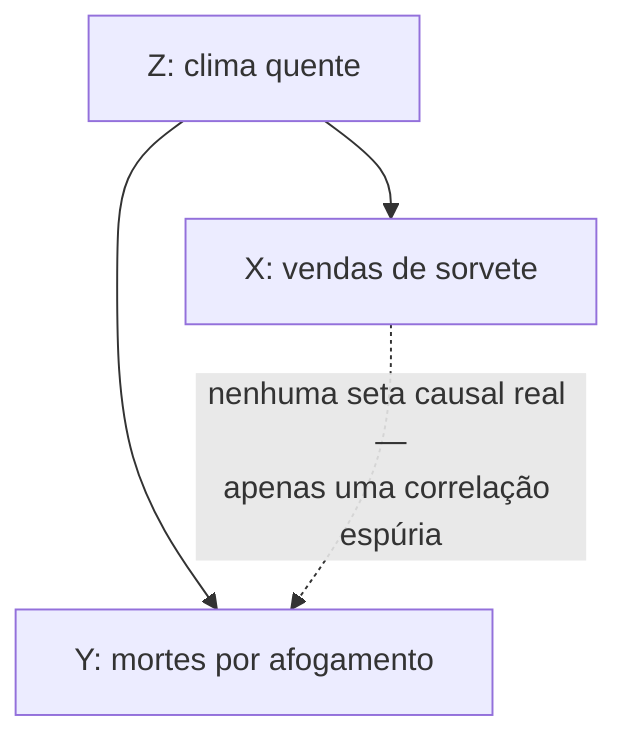

## Objetivos de Aprendizagem

- Definir uma variável de confusão como um fator escondido que influencia ambas as duas variáveis sendo comparadas, produzindo uma correlação que nenhuma delas causa.
- Percorrer um exemplo clássico de confundidor e identificar exatamente quais setas causais explicam a correlação observada.
- Explicar, usando a escada da causalidade de Pearl, por que observação passiva sozinha não consegue distinguir causação direta de confusão.
- Identificar um confundidor plausível em um cenário de software ou sistemas descrito antes de aceitar uma afirmação causal.
- Descrever pelo menos duas formas de descartar um confundidor suspeito (intervenção randomizada, ou ajuste explícito para o confundidor).

## Contexto e Motivação

Uma variável de confusão é um terceiro fator escondido que influencia duas outras variáveis ao mesmo tempo, fazendo-as subir e descer juntas mesmo que nenhuma delas tenha qualquer efeito causal direto sobre a outra. Confusão é a forma concreta mais comum pela qual uma correlação é confundida com causação, precisamente porque o confundidor está, por definição, fora das duas variáveis que alguém aconteceu de estar observando, é preciso um passo deliberado para trás dos dados para sequer considerar que um terceiro fator poderia estar fazendo todo o trabalho. Reconhecer quando um confundidor é plausível, e saber como descartar um, é o retorno prático de tudo construído nos dois conceitos anteriores: os controles necessários para isolar uma variável (*Controles e Isolando Variáveis*) existem especificamente para prevenir que confundidores sigam junto sem controle, e a distinção entre meramente observar uma correlação e intervir ativamente (*Correlação vs. Causação*, via a escada de Pearl) é exatamente a distinção que permite que um confundidor seja diferenciado de uma causa direta genuína.

A ilustração de livro-texto de confusão também é uma das mais claras disponíveis: vendas de sorvete e mortes por afogamento ambas sobem e descem juntas ao longo do ano, seguindo uma à outra de perto o suficiente para que, olhado como uma correlação nua, alguém pudesse suspeitar que consumo de sorvete de alguma forma contribui para afogamento, ou que incidentes de afogamento de alguma forma aumentam vendas de sorvete (talvez através de cobertura de notícias levando a comer por conforto, um exagero, mas não mais exagero do que os dados sozinhos descartam). Nenhuma é verdade. Tanto vendas de sorvete quanto mortes por afogamento são conduzidas por um terceiro fator: clima quente. Clima quente aumenta quanto sorvete as pessoas compram, e separadamente aumenta quanto tempo as pessoas passam nadando, e mais natação significa mais oportunidades de afogamento. Vendas de sorvete e mortes por afogamento são correlacionadas entre si puramente como efeito colateral de ambas serem correlacionadas com a estação, sem nenhuma seta causal correndo entre as duas de forma alguma.

## Teoria Central

### A estrutura de uma confusão

Uma confusão tem um formato causal específico: uma terceira variável Z causa tanto X quanto Y, sem nenhuma seta causal direta entre os próprios X e Y. Esse formato produz uma correlação estatística real e mensurável entre X e Y, a correlação não é um acaso ou um erro de medição, é uma consequência matemática genuína de ambas as variáveis seguindo Z, mas a correlação é *espúria* no sentido específico de que nem X nem Y está fazendo nada causalmente ao outro. Distinguir esse formato de "X causa Y" ou "Y causa X" é exatamente a ambiguidade de três vias que o Degrau 1 (associação) da escada da causalidade de Pearl não consegue resolver sozinho, discutido no conceito anterior: todas as três estruturas causais, X→Y, Y→X, e Z→X mais Z→Y, produzem uma correlação observada entre X e Y que parece idêntica do ponto de vista de dados coletados passivamente sozinhos.

### Por que confusão especificamente derrota inferência causal ingênua

O perigo de um confundidor não é que ele torna X e Y não correlacionados, é o oposto: ele os torna correlacionados exatamente tão fortemente quanto uma ligação causal real teria, sem nenhum sinal óbvio nos números brutos para distinguir as duas situações. Uma política ou decisão de engenharia construída na suposição "aumentar X vai aumentar Y," quando a estrutura real é "Z causa ambos," falhará: aumentar deliberadamente X (digamos, desencorajar vendas de sorvete, para levar a analogia de afogamento à sua conclusão lógica embora boba) não faz nada com Y, porque X nunca foi uma causa de Y para começar, apenas sempre se moveu em sintonia com Y porque ambos eram a jusante de Z. Isso é precisamente por que o Degrau 2 (intervenção) é a ferramenta que expõe um confundidor: definir ativamente o valor de X, independentemente de Z, quebra a correlação que Z sozinho estava produzindo, porque agora X não mais segue Z automaticamente. Se forçar X a mudar não mais produz uma mudança correspondente em Y, isso é evidência forte de que a associação anterior era confundida em vez de causal.

### Descartando um confundidor suspeito

Há duas rotas principais para descartar um confundidor, correspondendo às duas rotas principais para subir a escada. A primeira é uma intervenção randomizada: atribua o valor de X aleatoriamente, independentemente de tudo mais, e meça Y. Randomização corta qualquer ligação entre X e um confundidor potencial Z, se Z ainda afeta Y mas não mais afeta X (porque X agora é atribuído por um lançamento de moeda em vez de por qualquer valor que Z o teria empurrado naturalmente), qualquer correlação que persista entre o X atribuído aleatoriamente e Y não pode mais ser explicada por Z, já que a influência de Z sobre X foi eliminada por design. A segunda rota, usada quando uma intervenção verdadeira é impossível ou antiética (isso é comum em campos estudando populações que ocorrem naturalmente, e frequentemente em contextos de software onde reexecutar a história não é uma opção), é **ajuste explícito**: se o confundidor suspeito Z pode ser medido, controlar estatisticamente por ele, comparando X e Y apenas dentro de grupos que compartilham o mesmo valor de Z, remove a capacidade de Z de produzir uma correlação espúria, porque dentro de qualquer único valor fixo de Z, Z não pode mais variar para conduzir X e Y em tandem. Ambas as rotas exigem, como pré-condição, que o confundidor tenha sido de fato identificado como um candidato que vale a pena verificar; um confundidor que ninguém pensou em considerar não pode ser ajustado, que é por que perguntar deliberadamente "qual terceiro fator poderia estar conduzindo ambos desses?" é um hábito necessário, não um passo extra opcional.

### Confusão em um cenário de software

Confundidores estão tão disponíveis em dados de engenharia quanto no exemplo do sorvete. Suponha que uma equipe note que serviços escritos em um framework interno mais novo têm uma taxa média de incidente mais baixa que serviços escritos em um mais antigo, e conclua que o framework mais novo causa menos incidentes. Um confundidor plausível: o framework mais novo foi adotado principalmente por equipes formadas mais recentemente, que também tendem a ter serviços menores e com escopo mais restrito e práticas de plantão revisadas mais recentemente, maturidade de equipe e escopo de serviço, não o framework em si, poderiam estar conduzindo tanto "qual framework foi escolhido" quanto "quantos incidentes acontecem." Aqui, "características de equipe/serviço" desempenha o papel que clima quente desempenhou para sorvete e afogamento: um fator a montante tanto do preditor observado (escolha de framework) quanto do resultado observado (taxa de incidente), produzindo uma correlação entre eles que uma migração de framework sozinha poderia não reproduzir.

## Exemplos Resolvidos

### Exemplo 1 — sorvete e afogamento, trabalhado através da estrutura de Pearl

**Os dados brutos.** Vendas mensais de sorvete e mortes mensais por afogamento, plotadas ao longo de vários anos, sobem e descem juntas com uma correlação positiva forte.

**Duas leituras causais erradas.** "Sorvete causa afogamento" (talvez via mitos de cãibra) e "afogamento causa vendas de sorvete" (implausível, mas a correlação nua não a descarta por si só) são ambas consistentes com a associação sozinha, evidência do Degrau 1 não pode distinguir nenhuma delas da explicação verdadeira.

**A estrutura real.** Estação (especificamente, clima quente) é uma causa comum: aumenta vendas de sorvete (pessoas compram mais sorvete quando está quente) e separadamente aumenta tanto o tempo gasto nadando quanto, portanto, incidentes de afogamento (mais exposição de natação, mais oportunidade de acidentes). Nem sorvete nem afogamento tem uma seta causal apontando para o outro.

**Como isso seria confirmado em vez de assumido.** Ajustar para estação, comparando vendas de sorvete e mortes por afogamento apenas dentro do mesmo mês, ou da mesma faixa de temperatura, através de diferentes anos, deveria fazer a correlação entre sorvete e afogamento amplamente desaparecer, porque dentro de uma faixa de temperatura fixa, clima quente não está mais variando para conduzir ambas as quantidades juntas. Se a correlação desaparece sob esse ajuste, isso é apoio forte para a explicação de confusão sobre qualquer uma das histórias de causação direta; se persistisse mesmo depois de manter a estação fixa, isso seria em vez disso um sinal de que algo além de pura confusão por clima estava acontecendo.

### Exemplo 2 — um confundidor suspeito em uma métrica de engenharia

**A observação.** Entre os microserviços de uma empresa, os implantados mais frequentemente (múltiplas vezes por dia) têm uma taxa notavelmente mais baixa de incidentes de produção por mês que os implantados raramente (semanalmente ou menos). Uma história causal de aparência plausível: implantação frequente força mudanças menores e mais seguras e feedback mais rápido, que causalmente reduz incidentes.

**Um confundidor candidato.** Idade do serviço e investimento de equipe. Serviços legados mais antigos, mais críticos, mais complexos frequentemente são implantados com menos frequência precisamente porque são mais arriscados de tocar e têm menos investimento ativo de engenharia, e ser mais antigo, mais complexo, e menos ativamente mantido é independentemente associado com uma taxa de incidente mais alta, por razões que não têm nada a ver com a própria frequência de implantação. Investimento de equipe (ou falta dele) poderia ser um Z que conduz tanto "com que frequência esse serviço é implantado" quanto "com que frequência ele quebra."

**Testando a confusão.** Duas opções espelham as duas rotas gerais acima. Ajuste: compare frequência de implantação com taxa de incidente apenas entre serviços de idade similar e nível de equipe similar, e veja se a correlação sobrevive, se encolhe substancialmente uma vez que idade e equipe são mantidas aproximadamente fixas, isso apoia a explicação de confusão. Intervenção: escolha um subconjunto de serviços comparáveis e deliberadamente mude sua cadência de implantação (mantendo tudo mais sobre eles fixo), depois meça se a taxa de incidente de fato responde, este é o teste de Degrau 2 que um ajuste puramente observacional só pode aproximar, e ele responde diretamente "a frequência de implantação causa menos incidentes" em vez de "a frequência de implantação está associada com menos incidentes."

**A lição.** Tanto o caso sorvete/afogamento quanto o caso de frequência de implantação mostram o mesmo formato: uma correlação estatística real e não espúria entre X e Y, totalmente explicada por um terceiro fator Z que uma leitura ingênua dos dados não revela, e apenas exposto perguntando explicitamente o que mais poderia variar junto com ambos X e Y, depois ou ajustando para isso ou intervindo em torno disso.

## Equívocos Comuns e Armadilhas

- **"Se a correlação é estatisticamente forte, provavelmente não é confundida."** Confusão produz correlações de força estatística completamente comum, uma correlação forte não é menos provável de ser confundida do que uma fraca, porque a força da correlação reflete quão fortemente Z conduz tanto X quanto Y, não se X e Y têm uma ligação causal direta entre eles. Significância estatística e estrutura causal são perguntas inteiramente separadas.
- **"Uma vez que eu pensei em um possível confundidor e o descartei, a correlação é causal."** Descartar um confundidor candidato apenas elimina aquela explicação alternativa específica; não diz nada sobre um confundidor diferente que ninguém considerou ainda. Esta é mais uma razão pela qual uma intervenção genuína é evidência mais forte do que qualquer quantidade de ajuste para confundidores conhecidos, ajuste só pode corrigir para fatores que foram de fato medidos e considerados.
- **"Um confundidor tem que ser algum fator externo e incontrolável como clima."** Confundidores são tão frequentemente internos e organizacionais quanto no exemplo de frequência de implantação, equipe de pessoal, idade de serviço, complexidade de código, e fatores similares são tão capazes de conduzir duas métricas em tandem quanto um padrão climático sazonal é.
- **"Correlação vs. causação e variáveis de confusão são basicamente o mesmo tópico coberto duas vezes."** Confusão é um *mecanismo* específico e concreto pelo qual uma correlação pode falhar em ser causal (uma terceira variável conduzindo ambas); "correlação não é causação" é o alerta mais amplo que também cobre causação invertida (Y causa X) e coincidência pura. Nomear o confundidor explicitamente, como este conceito exige, é um diagnóstico mais afiado e mais acionável do que o alerta geral sozinho.

## Resumo

Uma variável de confusão é um fator escondido Z que causa ambas as duas variáveis X e Y sendo comparadas, produzindo uma correlação estatística genuína entre X e Y mesmo que nenhuma cause a outra, sendo a ilustração clássica clima quente aumentando tanto vendas de sorvete quanto mortes por afogamento sem ligação causal entre os dois. Esta é exatamente a ambiguidade que a evidência do Degrau 1 (associação) de Pearl não pode resolver sozinha: X→Y, Y→X, e Z→(X,Y) todas produzem a mesma correlação observada, e apenas subir para o Degrau 2, ou uma intervenção randomizada que corta a ligação de X com Z, ou, quando isso é impossível, ajuste estatístico explícito para um Z medido, pode distinguir um confundidor de uma causa direta genuína. Confundidores aparecem constantemente em dados de engenharia (idade de serviço ou investimento de equipe confundindo uma comparação de frequência-de-implantação-vs-taxa-de-incidente) tão prontamente quanto no exemplo de clima do livro-texto, e a disciplina de perguntar ativamente "que terceiro fator poderia estar conduzindo ambos desses?" antes de aceitar uma história causal é o que separa uma afirmação causal verificada de uma não verificada.

## Documentation Links

- [Judea Pearl — The Book of Why (UCLA Causality Lab)](https://bayes.cs.ucla.edu/WHY/) — doc
- [Stanford Encyclopedia of Philosophy — Science and Pseudo-Science](https://plato.stanford.edu/entries/pseudo-science/) — doc
