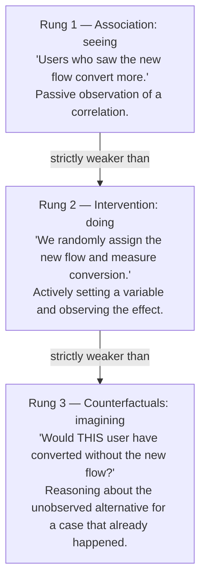

## Learning Objectives

- State Judea Pearl's three-rung "ladder of causation" (association, intervention, counterfactuals) and what each rung can and cannot establish.
- Explain why observing a correlation ("seeing") is fundamentally weaker evidence for causation than actively intervening ("doing").
- Distinguish an observational study from a randomized controlled experiment in terms of which rung of the ladder each one climbs.
- Construct a concrete example of an observed correlation that a real intervention could either confirm or refute as causal.
- Recognize when a claim of causation has only been supported at the association rung, and identify what additional evidence would be needed to climb higher.

## Context & Motivation

"Correlation is not causation" is one of the most repeated phrases in any discussion of evidence, and also one of the most hollow when left at that — it names a failure mode without explaining what would actually fix it. The computer scientist and statistician Judea Pearl spent much of his career building the missing explanation: a rigorous framework for exactly what separates the different kinds of causal claims people make, and what kind of evidence each one requires. His book *The Book of Why*, co-written with Dana Mackenzie, and the accompanying UCLA Causality Lab describe this framework as a **ladder of causation** with three distinct rungs, each strictly more powerful than the one below it, and each requiring a different kind of access to the system being studied. Understanding this ladder — not just the cliché about correlation — is what lets someone say precisely why a given piece of evidence does or doesn't support a causal claim, and precisely what additional evidence would be needed to support a stronger one.

This matters directly in software and product work, where correlational data is often the *only* data available at first, and the temptation to read it as causal is constant. A company observes that users who see a redesigned onboarding flow convert to paying customers at a higher rate than users who saw the old flow — but "users who saw the redesign" might not be a fair comparison group at all; perhaps a marketing campaign that drove more motivated users to the site happened to launch in the same window as the redesign, or the redesign was rolled out gradually and reached more engaged existing users first. The raw correlation between "saw the new flow" and "converted" is compatible with the redesign causing the higher conversion, but it is equally compatible with several other explanations having nothing to do with the redesign's actual effect. Pearl's framework gives the precise vocabulary for why this is genuinely ambiguous at the level of mere observation, and for what specifically would resolve the ambiguity.

## Core Theory

### Rung 1 — Association: "seeing"

The bottom rung of Pearl's ladder is **association**, sometimes described as "seeing." At this level, a system is observed passively: data is collected on however things naturally occur, and patterns — correlations — are detected within it. Almost all traditional statistical pattern-matching operates at this rung: computing that two variables tend to move together, that a symptom tends to co-occur with a diagnosis, that a metric tends to be higher in one segment of users than another. Association answers questions of the form "if I observe X, what should I expect to also see?" It is genuinely useful — it can generate hypotheses, flag things worth investigating further, and drive predictions — but it cannot, on its own, answer "if I *change* X, what happens to Y?" A purely associational analysis has no way to distinguish "X causes Y," "Y causes X," and "some third factor causes both X and Y" — all three produce the identical observed correlation between X and Y, and no amount of additional passive observation of the same kind resolves which one is true.

### Rung 2 — Intervention: "doing"

The second rung is **intervention**, or "doing." Here, rather than merely observing how a variable happens to vary on its own, an experimenter actively sets its value and watches what happens to the rest of the system. This is what a genuine controlled experiment does (the mechanism developed in *Controls and Isolating Variables*, immediately prior in this track): by randomly assigning which condition each subject receives, and then comparing the outcomes, an intervention breaks the tie that pure association could not break. If forcing X to a particular value reliably changes the distribution of Y, while everything else that could affect Y is held fixed or randomized away, that is direct evidence for a causal effect of X on Y specifically — not evidence for a mere co-occurrence, and not vulnerable to being explained away by some third factor Z, because randomization scrambles whatever Z happens to be across the compared groups. In Pearl's notation this is written as the *do*-operator — asking about P(Y | do(X)), the distribution of Y when X is actively set, as opposed to P(Y | X), the distribution of Y when X merely happens to be observed at that value. Randomized controlled experiments (and the A/B tests from the previous concept) are how intervention is practiced outside a physics lab; they are strictly more informative than any observational study of the same variables, because they are the only kind of evidence in this framework that can directly answer a "doing" question rather than only a "seeing" one.

### Rung 3 — Counterfactuals: "imagining"

The top rung is **counterfactual** reasoning, or "imagining": reasoning about what *would have* happened under a different action than the one actually taken, in a specific case that already occurred. "Would this particular user have converted if they had *not* seen the redesigned onboarding flow?" is a counterfactual question — it isn't answerable by observing other users (association) or even by running a fresh randomized experiment on a new population (intervention), because it asks about the one specific case that already happened, under the one condition that did not occur for that case. Counterfactual reasoning underlies concepts like individual treatment effects, blame and credit assignment ("did this specific code change cause this specific outage?"), and explanation more generally, and it requires the richest kind of causal model — typically built up from evidence gathered at the lower two rungs, formalized well enough to support reasoning about hypothetical alternate worlds. It is the rung most relevant to diagnosing a single past incident rather than establishing a general causal law, and it is correspondingly the hardest to support with direct evidence, since the alternate scenario, by definition, is not something that was ever actually observed.

### Why climbing the ladder matters for a causal claim

Each rung answers a different question, and evidence gathered at a lower rung cannot, by itself, answer a higher rung's question — no matter how much of it is collected. A mountain of associational data showing users-who-saw-flow-B convert more than users-who-saw-flow-A never becomes intervention-level evidence just by accumulating more of the same kind of observation; the ambiguity between "B causes higher conversion," "higher-conversion users happened to see B," and "some third factor drove both" is structural, not a matter of sample size. Climbing from association to intervention requires *actually intervening* — running the randomized experiment — not analyzing the observational data more cleverly. This is precisely why a correlation observed in the wild, however strong or however large the dataset behind it, does not settle a causal question that only a controlled experiment (or a sufficiently well-specified causal model, in cases where a literal intervention is impossible or unethical) can settle.

## Worked Examples

### Example 1 — a UI change, observed vs. intervened

**Observation (Rung 1).** Product analytics show that among users who were shown a new checkout-page layout, 6% converted to a completed purchase, versus 4% among users who saw the old layout, over the same month. This is a real, measured correlation between "saw new layout" and "converted."

**Why this alone doesn't establish causation.** The two groups of users were not necessarily comparable to begin with. Suppose the new layout was rolled out preferentially to users on a newer app version, and users on the newer app version also tend to be more recently acquired, more engaged, and more likely to convert for reasons having nothing to do with checkout-page design. The observed 6%-vs-4% gap is fully consistent with the layout genuinely causing higher conversion, but equally consistent with "more engaged users happened to get the new layout," a confound that the observational comparison has no way to rule out from the data alone.

**Climbing to Rung 2.** A randomized A/B test resolves this: incoming users are randomly assigned to see the new or old layout, independent of app version, engagement level, or anything else. If the randomized comparison still shows a meaningfully higher conversion rate for the new layout, that is now evidence at the intervention rung — the random assignment guarantees the two groups are, on average, identical in every respect except which layout they saw, so a remaining conversion difference can be attributed to the layout itself rather than to some pre-existing difference between the groups.

**The lesson.** The observational number (6% vs. 4%) and the randomized-experiment number might turn out to be similar, or might turn out to be very different — and the only way to know which is to actually run the intervention. The associational data alone never tells you which world you're in.

### Example 2 — server response time and error rate

**Observation (Rung 1).** Logs show that requests with higher response times also have a higher error rate — as latency climbs, errors climb too. It's tempting to read this as "slowness causes errors" (perhaps timeouts cascading into failures) or "errors cause slowness" (perhaps retries after failures adding latency) — the plain correlation supports either story, or a third one.

**A plausible third factor.** Suppose both response time and error rate spike whenever a particular downstream dependency is under heavy load: the dependency being slow directly increases response time for calls that reach it, and separately increases error rate because calls that exceed its retry budget fail outright. Here, downstream load is a common cause of both the observed variables, and neither one causes the other at all — a case pure association genuinely cannot distinguish from the two direct-causation stories, since all three produce the same correlated pattern in the logs. (This kind of hidden common cause is developed in detail in the next concept, *Confounding Variables*.)

**Climbing to Rung 2.** An intervention settles it: artificially inject a fixed amount of extra latency into a controlled subset of requests, independent of any real downstream load, and see whether error rate rises in step. If it does, that's direct evidence that latency (at least at the injected level) causes errors; if it doesn't, the earlier correlation was more likely driven by the shared downstream-load cause, not by a direct causal link between the two.

## Common Misconceptions & Pitfalls

- **"A big enough dataset can settle a causal question without an experiment."** Sample size reduces sampling noise around an association; it does nothing to distinguish "X causes Y" from "Y causes X" from "Z causes both" — that ambiguity is structural to Rung 1 evidence and is not resolved by collecting more of it. Only intervention-level evidence (or, in some cases, a carefully justified causal model) can climb past it.
- **"Correlation isn't causation, so this data tells us nothing."** This overcorrects. Association is a real, useful rung — it's exactly the right kind of evidence for generating hypotheses and flagging what's worth intervening on next. The mistake isn't using correlational data at all; it's treating it as if it had already answered the intervention-level question.
- **"We ran an A/B test, so we've now answered every causal question about this feature."** A randomized experiment establishes an *average* causal effect across the tested population under the tested conditions — a Rung 2 result. It does not, by itself, answer a Rung 3 question like "would this specific user have converted anyway" or generalize automatically to a different population or a different time period; those require additional reasoning beyond the experiment's direct result.
- **"Intervention just means changing something and seeing what happens next, informally."** An informal "we shipped it and metrics went up" is not an intervention in Pearl's sense unless there's a proper comparison — a control that experienced everything else the treatment did, as covered in the previous concept. Without that comparison, an informal "change and observe" is still association wearing intervention's clothes.

## Summary

Judea Pearl's ladder of causation separates causal claims into three strictly ordered levels: association ("seeing"), which detects correlations through passive observation but cannot distinguish X-causes-Y from Y-causes-X from a shared third cause; intervention ("doing"), which actively sets a variable's value — the logic behind every real controlled experiment — and can establish a direct causal effect precisely because it breaks that three-way ambiguity; and counterfactuals ("imagining"), which reason about what would have happened under an action not actually taken, for a specific case that already occurred. No amount of additional Rung 1 evidence climbs to Rung 2 on its own — climbing requires actually intervening, which is exactly what distinguishes an observed UI-conversion correlation from a randomized A/B test of the same UI change, or an observed latency-error correlation from a controlled latency-injection experiment.

## Documentation Links

- [Judea Pearl — The Book of Why (UCLA Causality Lab)](https://bayes.cs.ucla.edu/WHY/) — doc
- [Stanford Encyclopedia of Philosophy — Science and Pseudo-Science](https://plato.stanford.edu/entries/pseudo-science/) — doc
