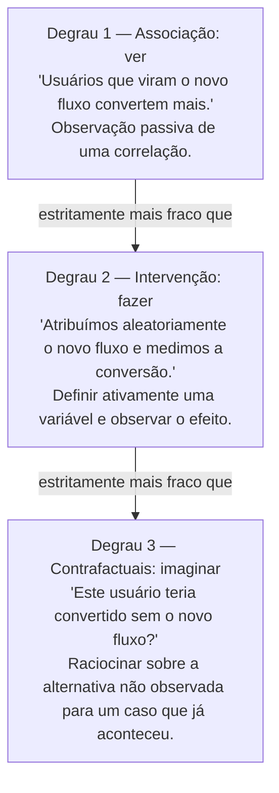

## Objetivos de Aprendizagem

- Enunciar a "escada da causalidade" de três degraus de Judea Pearl (associação, intervenção, contrafactuais) e o que cada degrau pode e não pode estabelecer.
- Explicar por que observar uma correlação ("ver") é evidência fundamentalmente mais fraca para causação do que intervir ativamente ("fazer").
- Distinguir um estudo observacional de um experimento controlado randomizado em termos de qual degrau da escada cada um alcança.
- Construir um exemplo concreto de uma correlação observada que uma intervenção real poderia confirmar ou refutar como causal.
- Reconhecer quando uma afirmação de causação foi apoiada apenas no degrau de associação, e identificar que evidência adicional seria necessária para subir mais alto.

## Contexto e Motivação

"Correlação não é causação" é uma das frases mais repetidas em qualquer discussão de evidência, e também uma das mais vazias quando deixada assim, ela nomeia um modo de falha sem explicar o que de fato o consertaria. O cientista da computação e estatístico Judea Pearl passou grande parte de sua carreira construindo a explicação faltante: uma estrutura rigorosa para exatamente o que separa os diferentes tipos de afirmações causais que as pessoas fazem, e que tipo de evidência cada uma exige. Seu livro *The Book of Why*, escrito com Dana Mackenzie, e o UCLA Causality Lab que o acompanha descrevem essa estrutura como uma **escada da causalidade** com três degraus distintos, cada um estritamente mais poderoso que o abaixo dele, e cada um exigindo um tipo diferente de acesso ao sistema sendo estudado. Entender essa escada, não apenas o clichê sobre correlação, é o que permite a alguém dizer precisamente por que um dado pedaço de evidência apoia ou não uma afirmação causal, e precisamente que evidência adicional seria necessária para apoiar uma mais forte.

Isso importa diretamente em trabalho de software e produto, onde dados correlacionais são frequentemente os *únicos* dados disponíveis a princípio, e a tentação de lê-los como causais é constante. Uma empresa observa que usuários que veem um fluxo de onboarding redesenhado convertem para clientes pagantes a uma taxa mais alta que usuários que viram o fluxo antigo, mas "usuários que viram o redesign" pode não ser um grupo de comparação justo de forma alguma; talvez uma campanha de marketing que trouxe usuários mais motivados ao site aconteceu de lançar na mesma janela que o redesign, ou o redesign foi lançado gradualmente e alcançou usuários existentes mais engajados primeiro. A correlação bruta entre "viu o novo fluxo" e "converteu" é compatível com o redesign causando a conversão mais alta, mas é igualmente compatível com várias outras explicações que não têm nada a ver com o efeito real do redesign. A estrutura de Pearl dá o vocabulário preciso para por que isso é genuinamente ambíguo no nível de mera observação, e para o que especificamente resolveria a ambiguidade.

## Teoria Central

### Degrau 1 — Associação: "ver"

O degrau inferior da escada de Pearl é **associação**, às vezes descrita como "ver." Neste nível, um sistema é observado passivamente: dados são coletados de como as coisas naturalmente ocorrem, e padrões, correlações, são detectados neles. Quase toda comparação de padrão estatística tradicional opera neste degrau: calcular que duas variáveis tendem a se mover juntas, que um sintoma tende a co-ocorrer com um diagnóstico, que uma métrica tende a ser mais alta em um segmento de usuários que outro. Associação responde perguntas da forma "se eu observo X, o que eu deveria também esperar ver?" É genuinamente útil, pode gerar hipóteses, sinalizar coisas que valem a pena investigar mais, e conduzir previsões, mas não pode, sozinha, responder "se eu *mudar* X, o que acontece com Y?" Uma análise puramente associacional não tem forma de distinguir "X causa Y," "Y causa X," e "algum terceiro fator causa ambos X e Y," todos os três produzem a correlação observada idêntica entre X e Y, e nenhuma quantidade de observação passiva adicional do mesmo tipo resolve qual é verdadeira.

### Degrau 2 — Intervenção: "fazer"

O segundo degrau é **intervenção**, ou "fazer." Aqui, em vez de meramente observar como uma variável acontece de variar por conta própria, um experimentador ativamente define seu valor e observa o que acontece com o resto do sistema. Isso é o que um experimento controlado genuíno faz (o mecanismo desenvolvido em *Controles e Isolando Variáveis*, imediatamente anterior nesta trilha): ao atribuir aleatoriamente qual condição cada sujeito recebe, e depois comparar os resultados, uma intervenção quebra o empate que a associação pura não conseguia quebrar. Se forçar X a um valor particular confiavelmente muda a distribuição de Y, enquanto tudo mais que poderia afetar Y é mantido fixo ou randomizado, isso é evidência direta para um efeito causal de X sobre Y especificamente, não evidência para uma mera co-ocorrência, e não vulnerável a ser explicado por algum terceiro fator Z, porque randomização embaralha o que quer que Z aconteça de ser através dos grupos comparados. Na notação de Pearl isso é escrito como o operador *do*, perguntando sobre P(Y | do(X)), a distribuição de Y quando X é ativamente definido, em oposição a P(Y | X), a distribuição de Y quando X meramente acontece de ser observado naquele valor. Experimentos controlados randomizados (e os testes A/B do conceito anterior) são como intervenção é praticada fora de um laboratório de física; são estritamente mais informativos que qualquer estudo observacional das mesmas variáveis, porque são o único tipo de evidência nesta estrutura que pode responder diretamente uma pergunta de "fazer" em vez de apenas de "ver."

### Degrau 3 — Contrafactuais: "imaginar"

O degrau superior é o raciocínio **contrafactual**, ou "imaginar": raciocinar sobre o que *teria* acontecido sob uma ação diferente da que de fato foi tomada, em um caso específico que já ocorreu. "Este usuário específico teria convertido se ele *não* tivesse visto o fluxo de onboarding redesenhado?" é uma pergunta contrafactual, ela não é respondível observando outros usuários (associação) ou mesmo rodando um novo experimento randomizado em uma nova população (intervenção), porque ela pergunta sobre o único caso específico que já aconteceu, sob a única condição que não ocorreu para aquele caso. Raciocínio contrafactual sustenta conceitos como efeitos de tratamento individual, atribuição de culpa e crédito ("essa mudança de código específica causou essa queda específica?"), e explicação de forma mais geral, e exige o tipo mais rico de modelo causal, tipicamente construído a partir de evidência coletada nos dois degraus inferiores, formalizado bem o suficiente para apoiar raciocínio sobre mundos alternativos hipotéticos. É o degrau mais relevante para diagnosticar um único incidente passado em vez de estabelecer uma lei causal geral, e é correspondentemente o mais difícil de apoiar com evidência direta, já que o cenário alternativo, por definição, não é algo que jamais foi de fato observado.

### Por que subir a escada importa para uma afirmação causal

Cada degrau responde a uma pergunta diferente, e evidência coletada em um degrau inferior não pode, por si só, responder à pergunta de um degrau superior, não importa quanto seja coletada. Uma montanha de dados associacionais mostrando usuários-que-viram-fluxo-B convertendo mais que usuários-que-viram-fluxo-A nunca se torna evidência de nível de intervenção apenas acumulando mais do mesmo tipo de observação; a ambiguidade entre "B causa conversão mais alta," "usuários de conversão mais alta acontecem de ver B," e "algum terceiro fator conduziu ambos" é estrutural, não uma questão de tamanho de amostra. Subir de associação para intervenção exige *de fato intervir*, rodar o experimento randomizado, não analisar os dados observacionais de forma mais inteligente. Isso é precisamente por que uma correlação observada na natureza, por mais forte ou por maior que seja o conjunto de dados por trás dela, não resolve uma pergunta causal que apenas um experimento controlado (ou um modelo causal suficientemente bem especificado, em casos onde uma intervenção literal é impossível ou antiética) pode resolver.

## Exemplos Resolvidos

### Exemplo 1 — uma mudança de UI, observada vs. intervenção

**Observação (Degrau 1).** Análises de produto mostram que entre usuários que foram mostrados um novo layout de página de checkout, 6% converteram para uma compra completa, versus 4% entre usuários que viram o layout antigo, ao longo do mesmo mês. Esta é uma correlação real e medida entre "viu novo layout" e "converteu."

**Por que isso sozinho não estabelece causação.** Os dois grupos de usuários não eram necessariamente comparáveis para começar. Suponha que o novo layout foi lançado preferencialmente para usuários em uma versão mais nova do app, e usuários na versão mais nova do app também tendem a ser adquiridos mais recentemente, mais engajados, e mais propensos a converter por razões que não têm nada a ver com o design da página de checkout. A lacuna observada de 6%-vs-4% é totalmente consistente com o layout genuinamente causando conversão mais alta, mas igualmente consistente com "usuários mais engajados aconteceram de receber o novo layout," uma confusão que a comparação observacional não tem forma de descartar apenas a partir dos dados.

**Subindo para o Degrau 2.** Um teste A/B randomizado resolve isso: usuários recebidos são atribuídos aleatoriamente para ver o novo ou antigo layout, independentemente de versão do app, nível de engajamento, ou qualquer outra coisa. Se a comparação randomizada ainda mostra uma taxa de conversão significativamente mais alta para o novo layout, isso agora é evidência no degrau de intervenção, a atribuição aleatória garante que os dois grupos são, em média, idênticos em todo aspecto exceto qual layout viram, então uma diferença de conversão remanescente pode ser atribuída ao próprio layout em vez de a alguma diferença pré-existente entre os grupos.

**A lição.** O número observacional (6% vs. 4%) e o número do experimento randomizado podem acabar sendo similares, ou podem acabar sendo muito diferentes, e a única forma de saber qual é de fato rodar a intervenção. Os dados associacionais sozinhos nunca dizem em qual mundo você está.

### Exemplo 2 — tempo de resposta de servidor e taxa de erro

**Observação (Degrau 1).** Logs mostram que requisições com tempos de resposta mais altos também têm uma taxa de erro mais alta, conforme a latência sobe, os erros também sobem. É tentador ler isso como "lentidão causa erros" (talvez timeouts se transformando em falhas) ou "erros causam lentidão" (talvez retentativas depois de falhas adicionando latência), a correlação simples apoia qualquer uma das histórias, ou uma terceira.

**Um terceiro fator plausível.** Suponha que tanto o tempo de resposta quanto a taxa de erro disparam sempre que uma dependência específica a jusante está sob carga pesada: a dependência estar lenta diretamente aumenta o tempo de resposta para chamadas que a alcançam, e separadamente aumenta a taxa de erro porque chamadas que excedem seu orçamento de retentativa falham completamente. Aqui, carga a jusante é uma causa comum de ambas as variáveis observadas, e nenhuma delas causa a outra de forma alguma, um caso que a associação pura genuinamente não consegue distinguir das duas histórias de causação direta, já que todas as três produzem o mesmo padrão correlacionado nos logs. (Este tipo de causa comum escondida é desenvolvido em detalhe no próximo conceito, *Variáveis de Confusão*.)

**Subindo para o Degrau 2.** Uma intervenção resolve isso: injete artificialmente uma quantidade fixa de latência extra em um subconjunto controlado de requisições, independentemente de qualquer carga real a jusante, e veja se a taxa de erro sobe em sintonia. Se sobe, isso é evidência direta de que latência (pelo menos no nível injetado) causa erros; se não sobe, a correlação anterior era mais provavelmente conduzida pela causa compartilhada de carga a jusante, não por uma ligação causal direta entre os dois.

## Equívocos Comuns e Armadilhas

- **"Um conjunto de dados grande o suficiente pode resolver uma pergunta causal sem um experimento."** Tamanho de amostra reduz ruído de amostragem em torno de uma associação; não faz nada para distinguir "X causa Y" de "Y causa X" de "Z causa ambos", essa ambiguidade é estrutural à evidência do Degrau 1 e não é resolvida coletando mais dela. Apenas evidência de nível de intervenção (ou, em alguns casos, um modelo causal cuidadosamente justificado) pode subir além dela.
- **"Correlação não é causação, então esses dados não nos dizem nada."** Isso supercorrige. Associação é um degrau real e útil, é exatamente o tipo certo de evidência para gerar hipóteses e sinalizar o que vale a pena intervir a seguir. O erro não é usar dados correlacionais de forma alguma; é tratá-los como se já tivessem respondido à pergunta de nível de intervenção.
- **"Rodamos um teste A/B, então agora respondemos toda pergunta causal sobre essa funcionalidade."** Um experimento randomizado estabelece um efeito causal *médio* através da população testada sob as condições testadas, um resultado do Degrau 2. Não responde, por si só, uma pergunta do Degrau 3 como "esse usuário específico teria convertido de qualquer forma" ou generaliza automaticamente para uma população diferente ou um período de tempo diferente; esses exigem raciocínio adicional além do resultado direto do experimento.
- **"Intervenção apenas significa mudar algo e ver o que acontece a seguir, informalmente."** Um informal "implantamos isso e as métricas subiram" não é uma intervenção no sentido de Pearl a menos que haja uma comparação apropriada, um controle que experimentou tudo mais que o tratamento experimentou, como coberto no conceito anterior. Sem essa comparação, um informal "mude e observe" ainda é associação vestindo roupas de intervenção.

## Resumo

A escada da causalidade de Judea Pearl separa afirmações causais em três níveis estritamente ordenados: associação ("ver"), que detecta correlações através de observação passiva mas não pode distinguir X-causa-Y de Y-causa-X de uma terceira causa compartilhada; intervenção ("fazer"), que ativamente define o valor de uma variável, a lógica por trás de todo experimento controlado real, e pode estabelecer um efeito causal direto precisamente porque quebra essa ambiguidade de três vias; e contrafactuais ("imaginar"), que raciocinam sobre o que teria acontecido sob uma ação de fato não tomada, para um caso específico que já ocorreu. Nenhuma quantidade de evidência adicional do Degrau 1 sobe para o Degrau 2 por conta própria, subir exige de fato intervir, que é exatamente o que distingue uma correlação de conversão de UI observada de um teste A/B randomizado da mesma mudança de UI, ou uma correlação de latência-erro observada de um experimento controlado de injeção de latência.

## Documentation Links

- [Judea Pearl — The Book of Why (UCLA Causality Lab)](https://bayes.cs.ucla.edu/WHY/) — doc
- [Stanford Encyclopedia of Philosophy — Science and Pseudo-Science](https://plato.stanford.edu/entries/pseudo-science/) — doc
