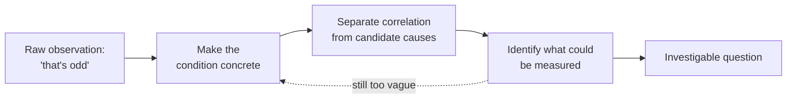

## Learning Objectives

- Distinguish noticing something puzzling from having a question that can actually be investigated.
- Identify the specific gap between a vague observation ("huh, that's odd") and an investigable question.
- Apply a refinement process that turns an inchoate curiosity into something precise enough to act on.
- Recognize the warning signs that an apparent "question" is still just a restated observation.
- Explain why skipping this step is the most common reason investigations stall before they start.

## Context & Motivation

Almost every worthwhile investigation begins the same way: something doesn't sit right. A number looks off, a system behaves in a way nobody predicted, a pattern shows up that shouldn't be there. This moment of noticing is real and valuable — it is the raw material every question is eventually built from — but it is not yet a question, and treating it as one is the single most common way an investigation stalls before it ever gets moving. "Huh, that's odd" is a feeling, not a plan. It tells you that your attention has been caught, but it does not tell you what to look at next, what would count as an explanation, or how you would know if you found one.

Richard Hamming, in his 1986 Bell Labs talk "You and Your Research," spent a great deal of time on exactly this gap, though from the angle of a working scientist rather than a student. Hamming's central observation was that most people who fail to do important work do not fail because they lack curiosity — plenty of people notice plenty of odd things — they fail because they never convert that noticing into a question sharp enough to organize sustained effort around. He pointed out that the researchers who did great work were not necessarily smarter or luckier; they were the ones who took a vague itch seriously enough to keep asking "but what, exactly, would I need to find out?" until an actual question fell out of it. That refinement step — not the initial noticing — is the part most people skip, and it is the part this concept exists to make explicit.

This gap matters especially in a computational setting, where "that's odd" observations are constant and cheap: a build that sometimes times out, a page that loads slowly on some days but not others, a test suite that flakes for no obvious reason. Any of these can be waved away, endlessly re-observed without progress, or — with a bit of deliberate work — turned into something you can actually chase down. The difference between an engineer who spends months vaguely annoyed by "that's slow sometimes" and one who resolves it in an afternoon is rarely raw skill. It is almost always whether they did the unglamorous work of turning the observation into a question before touching any tool.

## Core Theory

### Two things that look alike but are not

An **observation** describes a state of the world: "this page sometimes takes much longer to load than other times." A **question** specifies something you don't yet know and could, in principle, find out: "does the page's load time depend on the size of the response payload, the number of concurrent requests, or something else?" The observation and the question can be about the exact same phenomenon, phrased in superficially similar language, and yet only one of them tells you what to do next. An observation just sits there, restatable in more words but never more useful. A question points somewhere — at data to gather, an experiment to run, a measurement to take.

The tell that separates the two is simple to check: can you imagine a concrete next action that would move you closer to an answer? "This is odd" invites no next action beyond continuing to notice it is odd. "Does load time correlate with payload size?" invites an obvious next action: go measure payload size and load time together and look at the relationship. If you cannot name a next action, you likely still have an observation dressed up in question-shaped words — often visible in the fact that it starts with "why" and ends with nothing more specific than the original puzzlement ("why is this happening?").

### The refinement process, made explicit

Turning curiosity into a question is not a single leap; it is a short sequence of narrowing moves, each one cutting away part of what is still vague:

1. **State the raw observation plainly**, resisting the urge to explain it yet. ("The page feels slow sometimes.")
2. **Make "sometimes" concrete.** Under what conditions, specifically, have you actually noticed it? Not a guess about the cause — just a more precise description of when the phenomenon occurs. ("It seems slow in the afternoon, and especially on Mondays.")
3. **Separate correlated-in-time from mechanism.** "Afternoon" and "Monday" are candidate variables, not answers. The observation is still just an observation, but now it has structure you can query.
4. **Ask what you could actually measure** that would distinguish between candidate explanations. This is the pivotal move — it converts "I wonder why" into "I could check whether X, Y, or Z accounts for this."
5. **Write the question down as a single sentence naming what you'd need to find out.** If you can't compress it to one sentence, it usually means step 4 wasn't finished — there are still multiple unresolved things tangled together.

This process is not mechanical in the sense of guaranteeing a good question on the first pass — it often takes several iterations, and an early attempt at step 4 frequently reveals that step 2 was still too vague, sending you back a step. That back-and-forth is normal and is not a sign of doing it wrong; it is the actual work.

### Why the gap is so easy to skip

Skipping straight from observation to action feels productive — you start looking at logs, changing settings, re-running things — but without a question guiding the search, this activity has no way of terminating. You cannot know you're done if you never specified what "done" would look like. Hamming's own framing of this, discussed at more length in the next concept, was that people without a clear question tend to work on whatever is in front of them rather than on what matters, precisely because a clear question is what tells you what matters. Recognizing the gap between curiosity and a question is therefore not academic throat-clearing before "the real work" — it is the decision that determines whether the real work has a chance of converging at all.

## Worked Examples

### Example 1 — the slow website, refined step by step

**Raw observation:** "This website feels slow sometimes." This is where almost every real investigation starts — and where most stall.

**Step 1 (state plainly):** Nothing further to add; this is already the raw form.

**Step 2 (make "sometimes" concrete):** After paying attention over a few days, the actual pattern noticed is: "it feels slow around midday, and especially when a lot of people seem to be using it at once."

**Step 3 (separate time-correlation from mechanism):** "Midday" and "a lot of people at once" are two different candidate variables that happen to be correlated with each other (midday probably is when usage is highest) — this is itself worth noting, because it means a naive test that only checks "is it midday?" could be confounded by usage volume, and vice versa.

**Step 4 (what could be measured):** Response time per request, concurrent request count at the moment of each measurement, and time of day, all logged together over a representative window.

**Step 5 (compress to one sentence):** "Does response time increase specifically with the number of concurrent requests, independent of time of day, or is time of day itself doing something (e.g., a scheduled batch job) that happens to coincide with high concurrency?"

Notice what changed: the original observation gave no next action. The final question gives an immediate one — instrument concurrent request count and response time, log them together, and check whether the relationship holds even after controlling for time of day. That instruction did not exist before step 4; it was manufactured by the refinement process, not discovered lying around.

### Example 2 — the flaky test, and a wrong turn along the way

**Raw observation:** "Our test suite fails randomly, maybe one run in twenty."

**Step 2 (make concrete):** Checking the CI history, the failures cluster on one specific test file, not spread evenly across the suite.

**A tempting but premature move:** at this point it is common to jump straight to "the test file has a race condition," skipping steps 3 and 4 entirely. This looks like a question but is actually a hypothesis smuggled in before the question was ever finished — a distinction developed further in this discipline's next topic. The risk of jumping here is that "race condition" becomes the assumed explanation before anyone checked whether the failures even correlate with anything timing-related at all.

**Correcting course — step 3:** What else changes between passing and failing runs of that file? Checking further: failing runs also tend to be ones where the test suite ran in parallel with more workers than usual.

**Step 4 (what could be measured):** Whether failure rate of that specific file changes as a function of the number of parallel workers, holding the test code itself fixed.

**Step 5 (one sentence):** "Does this test file's failure rate increase measurably as the number of parallel test workers increases?"

This is now a question with a clear next action (vary the worker count deliberately and record the failure rate at each setting) rather than a hunch that happened to sound technical. The wrong turn is worth keeping in the example because it is the single most common failure mode in practice: mistaking a plausible-sounding explanation for the work of actually forming the question.

## Common Misconceptions & Pitfalls

- **"I already have a question — I want to know why it's slow."** "Why is it slow?" is grammatically a question but functionally still an observation, because it names no candidate variables and suggests no next action. A useful test: if you cannot say what data you'd gather tomorrow morning, you don't have a question yet.
- **Treating the first candidate explanation as the question itself.** Landing on "it's probably the database" and calling that the question skips the refinement process and quietly turns curiosity into an assumed answer before any investigating has happened — see the flaky-test example above.
- **Believing more noticing is the same as progress.** Continuing to observe the phenomenon ("yep, still slow today") without narrowing what "sometimes" means or what could be measured produces more data points about the existence of the puzzle, not more clarity about it.
- **Refining prematurely into something unfalsifiable or untestable.** Occasionally the narrowing process produces a "question" no measurement could actually answer (this is examined properly under falsifiability later in this discipline); if step 4 keeps failing to produce anything measurable, that is a signal to revisit step 2, not to give up on precision.
- **Assuming the first well-stated question is the final one.** Refinement is iterative; a perfectly clear question can still turn out, once measurement starts, to have been aimed at the wrong variable. That is a normal outcome of investigation, not evidence the original refinement work was wasted.

## Summary

Noticing something puzzling and having an investigable question are two different things, and the gap between them is where most attempts at inquiry quietly stall. An observation describes a state of the world; a question specifies something unknown and points at a next action that could resolve it. Hamming's central point in "You and Your Research" was that this refinement — not raw curiosity — is what separates people who do important work from people who merely notice interesting things. The refinement process itself is a short, often iterative sequence: state the observation plainly, make its vague conditions concrete, separate what's merely correlated from what might explain it, identify something measurable that would distinguish between candidate explanations, and compress the result into a single sentence naming what you'd need to find out. Skipping this work does not make an investigation faster — it removes the only thing that would have told you when you were done.

## Documentation Links

- [Hamming, "You and Your Research" (1986 transcript)](https://www.cs.virginia.edu/~robins/YouAndYourResearch.pdf) — doc
- [Stanford Encyclopedia of Philosophy — Science and Pseudo-Science](https://plato.stanford.edu/entries/pseudo-science/) — doc
