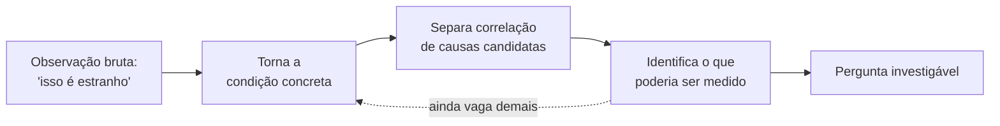

## Objetivos de Aprendizagem

- Distinguir notar algo intrigante de ter uma pergunta que de fato pode ser investigada.
- Identificar a lacuna específica entre uma observação vaga ("hein, isso é estranho") e uma pergunta investigável.
- Aplicar um processo de refinamento que transforma uma curiosidade inicial em algo preciso o suficiente para agir.
- Reconhecer os sinais de alerta de que uma aparente "pergunta" ainda é apenas uma observação reformulada.
- Explicar por que pular essa etapa é a razão mais comum pela qual investigações emperram antes de começar.

## Contexto e Motivação

Quase toda investigação que vale a pena começa da mesma forma: algo não se encaixa direito. Um número parece estranho, um sistema se comporta de uma forma que ninguém previu, um padrão aparece onde não deveria estar. Esse momento de notar é real e valioso, é a matéria-prima da qual toda pergunta é eventualmente construída, mas ainda não é uma pergunta, e tratá-lo como se fosse é a forma mais comum pela qual uma investigação emperra antes mesmo de começar a se mover. "Hein, isso é estranho" é um sentimento, não um plano. Ele diz que sua atenção foi capturada, mas não diz o que olhar em seguida, o que contaria como uma explicação, ou como você saberia se encontrou uma.

Richard Hamming, em sua palestra de 1986 no Bell Labs "You and Your Research," dedicou bastante tempo exatamente a essa lacuna, embora do ângulo de um cientista em atividade em vez de um estudante. A observação central de Hamming foi que a maioria das pessoas que falham em fazer trabalho importante não falham por falta de curiosidade, muitas pessoas notam muitas coisas estranhas, elas falham porque nunca convertem esse notar em uma pergunta afiada o suficiente para organizar esforço sustentado ao redor dela. Ele apontou que os pesquisadores que fizeram grandes trabalhos não eram necessariamente mais inteligentes ou mais sortudos; eram aqueles que levaram uma coceira vaga a sério o suficiente para continuar perguntando "mas o que, exatamente, eu precisaria descobrir?" até que uma pergunta real caísse disso. Essa etapa de refinamento, não o notar inicial, é a parte que a maioria das pessoas pula, e é a parte que este conceito existe para tornar explícita.

Essa lacuna importa especialmente em um contexto computacional, onde observações do tipo "isso é estranho" são constantes e baratas: um build que às vezes dá timeout, uma página que carrega devagar em alguns dias mas não em outros, uma suíte de testes que falha intermitentemente sem razão óbvia. Qualquer uma dessas pode ser descartada, reobservada infinitamente sem progresso, ou, com um pouco de trabalho deliberado, transformada em algo que você de fato pode perseguir. A diferença entre um engenheiro que passa meses vagamente incomodado com "isso é lento às vezes" e um que resolve isso em uma tarde raramente é habilidade bruta. É quase sempre se ele fez o trabalho pouco glamouroso de transformar a observação em uma pergunta antes de tocar em qualquer ferramenta.

## Teoria Central

### Duas coisas que parecem iguais mas não são

Uma **observação** descreve um estado do mundo: "essa página às vezes demora muito mais para carregar que outras vezes." Uma **pergunta** especifica algo que você ainda não sabe e que poderia, em princípio, descobrir: "o tempo de carregamento da página depende do tamanho do payload da resposta, do número de requisições concorrentes, ou de outra coisa?" A observação e a pergunta podem ser sobre o exato mesmo fenômeno, formuladas em linguagem superficialmente similar, e ainda assim apenas uma delas diz o que fazer a seguir. Uma observação simplesmente fica ali, reformulável com mais palavras mas nunca mais útil. Uma pergunta aponta para algum lugar, para dados a coletar, um experimento a rodar, uma medição a fazer.

O sinal que separa as duas é simples de verificar: você consegue imaginar uma próxima ação concreta que o aproximaria de uma resposta? "Isso é estranho" não convida a nenhuma próxima ação além de continuar a notar que é estranho. "O tempo de carregamento se correlaciona com o tamanho do payload?" convida a uma próxima ação óbvia: vá medir o tamanho do payload e o tempo de carregamento juntos e observe a relação. Se você não consegue nomear uma próxima ação, provavelmente ainda tem uma observação disfarçada em palavras com formato de pergunta, frequentemente visível no fato de que ela começa com "por que" e termina sem nada mais específico que a intrigação original ("por que isso está acontecendo?").

### O processo de refinamento, tornado explícito

Transformar curiosidade em uma pergunta não é um único salto; é uma curta sequência de movimentos de estreitamento, cada um cortando parte do que ainda é vago:

1. **Enuncie a observação bruta claramente**, resistindo à urgência de explicá-la ainda. ("A página parece lenta às vezes.")
2. **Torne "às vezes" concreto.** Sob quais condições, especificamente, você de fato notou isso? Não um palpite sobre a causa, apenas uma descrição mais precisa de quando o fenômeno ocorre. ("Parece lenta à tarde, e especialmente às segundas-feiras.")
3. **Separe correlacionado-no-tempo de mecanismo.** "Tarde" e "segunda-feira" são variáveis candidatas, não respostas. A observação ainda é apenas uma observação, mas agora tem estrutura que você pode consultar.
4. **Pergunte o que você poderia de fato medir** que distinguiria entre explicações candidatas. Este é o movimento crucial, converte "eu me pergunto por quê" em "eu poderia verificar se X, Y, ou Z explica isso."
5. **Escreva a pergunta como uma única frase nomeando o que você precisaria descobrir.** Se você não consegue comprimi-la em uma frase, geralmente significa que o passo 4 não foi concluído, ainda há múltiplas coisas não resolvidas emaranhadas juntas.

Este processo não é mecânico no sentido de garantir uma boa pergunta na primeira tentativa, frequentemente leva várias iterações, e uma tentativa inicial no passo 4 frequentemente revela que o passo 2 ainda estava vago demais, mandando você de volta um passo. Esse vai e vem é normal e não é sinal de estar fazendo errado; é o trabalho real.

### Por que a lacuna é tão fácil de pular

Pular direto da observação para a ação parece produtivo, você começa a olhar logs, mudar configurações, rodar coisas de novo, mas sem uma pergunta guiando a busca, essa atividade não tem como terminar. Você não pode saber que terminou se nunca especificou como "terminado" pareceria. A própria formulação de Hamming disso, discutida com mais profundidade no próximo conceito, foi que pessoas sem uma pergunta clara tendem a trabalhar no que está na frente delas em vez de no que importa, precisamente porque uma pergunta clara é o que diz o que importa. Reconhecer a lacuna entre curiosidade e uma pergunta portanto não é preâmbulo acadêmico antes do "trabalho de verdade," é a decisão que determina se o trabalho de verdade tem alguma chance de convergir.

## Exemplos Resolvidos

### Exemplo 1 — o site lento, refinado passo a passo

**Observação bruta:** "Esse site parece lento às vezes." É onde quase toda investigação real começa, e onde a maioria emperra.

**Passo 1 (enuncie claramente):** Nada mais a acrescentar; esta já é a forma bruta.

**Passo 2 (torne "às vezes" concreto):** Depois de prestar atenção por alguns dias, o padrão real notado é: "parece lento por volta do meio-dia, e especialmente quando muitas pessoas parecem estar usando ao mesmo tempo."

**Passo 3 (separe correlação-no-tempo de mecanismo):** "Meio-dia" e "muitas pessoas ao mesmo tempo" são duas variáveis candidatas diferentes que acontecem de se correlacionar entre si (o meio-dia provavelmente é quando o uso é mais alto), isso em si vale a pena notar, porque significa que um teste ingênuo que só verifica "é meio-dia?" poderia ser confundido pelo volume de uso, e vice-versa.

**Passo 4 (o que poderia ser medido):** Tempo de resposta por requisição, contagem de requisições concorrentes no momento de cada medição, e horário do dia, todos registrados juntos ao longo de uma janela representativa.

**Passo 5 (comprima em uma frase):** "O tempo de resposta aumenta especificamente com o número de requisições concorrentes, independentemente do horário do dia, ou o próprio horário do dia está fazendo algo (por exemplo, um job em lote agendado) que acontece de coincidir com alta concorrência?"

Note o que mudou: a observação original não deu nenhuma próxima ação. A pergunta final dá uma imediata, instrumentar a contagem de requisições concorrentes e o tempo de resposta, registrá-los juntos, e verificar se a relação se mantém mesmo depois de controlar pelo horário do dia. Essa instrução não existia antes do passo 4; foi fabricada pelo processo de refinamento, não descoberta por aí.

### Exemplo 2 — o teste intermitente, e um desvio errado ao longo do caminho

**Observação bruta:** "Nossa suíte de testes falha aleatoriamente, talvez uma execução em vinte."

**Passo 2 (torne concreto):** Verificando o histórico de CI, as falhas se agrupam em um arquivo de teste específico, não espalhadas uniformemente pela suíte.

**Um movimento tentador mas prematuro:** neste ponto é comum pular direto para "o arquivo de teste tem uma condição de corrida," pulando os passos 3 e 4 inteiramente. Isso parece uma pergunta mas na verdade é uma hipótese contrabandeada antes de a pergunta sequer ter sido terminada, uma distinção desenvolvida mais adiante no próximo tópico desta disciplina. O risco de pular aqui é que "condição de corrida" se torna a explicação assumida antes de alguém verificar se as falhas sequer se correlacionam com algo relacionado a tempo.

**Corrigindo o rumo, passo 3:** O que mais muda entre execuções bem-sucedidas e falhas daquele arquivo? Verificando mais: execuções que falham também tendem a ser aquelas onde a suíte de testes rodou em paralelo com mais workers que o usual.

**Passo 4 (o que poderia ser medido):** Se a taxa de falha daquele arquivo específico muda em função do número de workers paralelos, mantendo o próprio código de teste fixo.

**Passo 5 (uma frase):** "A taxa de falha desse arquivo de teste aumenta mensuravelmente conforme o número de workers de teste paralelos aumenta?"

Isso agora é uma pergunta com uma próxima ação clara (variar o número de workers deliberadamente e registrar a taxa de falha em cada configuração) em vez de um palpite que aconteceu de soar técnico. O desvio errado vale a pena manter no exemplo porque é o modo de falha mais comum na prática: confundir uma explicação de aparência plausível com o trabalho de de fato formar a pergunta.

## Equívocos Comuns e Armadilhas

- **"Eu já tenho uma pergunta, quero saber por que está lento."** "Por que está lento?" é gramaticalmente uma pergunta mas funcionalmente ainda uma observação, porque não nomeia nenhuma variável candidata e não sugere nenhuma próxima ação. Um teste útil: se você não consegue dizer quais dados coletaria amanhã de manhã, você ainda não tem uma pergunta.
- **Tratar a primeira explicação candidata como a própria pergunta.** Pousar em "provavelmente é o banco de dados" e chamar isso de pergunta pula o processo de refinamento e silenciosamente transforma curiosidade em uma resposta assumida antes de qualquer investigação ter acontecido, veja o exemplo do teste intermitente acima.
- **Acreditar que mais notar é o mesmo que progresso.** Continuar a observar o fenômeno ("é, ainda está lento hoje") sem estreitar o que "às vezes" significa ou o que poderia ser medido produz mais pontos de dados sobre a existência do quebra-cabeça, não mais clareza sobre ele.
- **Refinar prematuramente para algo infalsificável ou não testável.** Ocasionalmente o processo de estreitamento produz uma "pergunta" que nenhuma medição poderia de fato responder (isso é examinado apropriadamente sob falsificabilidade mais adiante nesta disciplina); se o passo 4 continuar falhando em produzir algo mensurável, isso é um sinal para revisitar o passo 2, não para desistir da precisão.
- **Assumir que a primeira pergunta bem enunciada é a final.** Refinamento é iterativo; uma pergunta perfeitamente clara ainda pode acabar, uma vez que a medição começa, tendo sido direcionada à variável errada. Isso é um resultado normal da investigação, não evidência de que o trabalho de refinamento original foi desperdiçado.

## Resumo

Notar algo intrigante e ter uma pergunta investigável são duas coisas diferentes, e a lacuna entre elas é onde a maioria das tentativas de investigação silenciosamente emperra. Uma observação descreve um estado do mundo; uma pergunta especifica algo desconhecido e aponta para uma próxima ação que poderia resolvê-lo. O ponto central de Hamming em "You and Your Research" foi que esse refinamento, não a curiosidade bruta, é o que separa pessoas que fazem trabalho importante de pessoas que meramente notam coisas interessantes. O próprio processo de refinamento é uma sequência curta, frequentemente iterativa: enuncie a observação claramente, torne suas condições vagas concretas, separe o que é meramente correlacionado do que pode explicá-lo, identifique algo mensurável que distinguiria entre explicações candidatas, e comprima o resultado em uma única frase nomeando o que você precisaria descobrir. Pular esse trabalho não torna uma investigação mais rápida, remove a única coisa que teria dito quando você terminou.

## Documentation Links

- [Hamming, "You and Your Research" (1986 transcript)](https://www.cs.virginia.edu/~robins/YouAndYourResearch.pdf) — doc
- [Stanford Encyclopedia of Philosophy — Science and Pseudo-Science](https://plato.stanford.edu/entries/pseudo-science/) — doc
