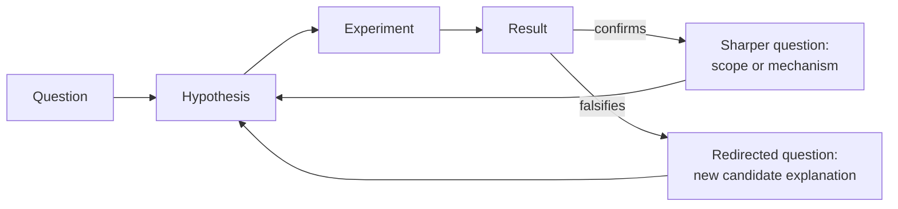

## Learning Objectives

- Explain why a single question-to-answer pass is not sufficient to build real understanding, and why inquiry is structured as a cycle instead.
- Distinguish how a confirming result and a falsifying result each generate a different, specific kind of next question.
- Trace a concrete example through at least two full turns of the question-hypothesis-experiment-result cycle.
- Identify when a result sharpens the current question versus when it redirects investigation toward a genuinely different question.
- Recognize the failure mode of treating a single result as a terminal answer rather than as input to the next question.

## Context & Motivation

The two previous concepts in this discipline each dealt with a single junction: what to do when one hypothesis meets one contradicting result, and — zoomed out — what happens when an entire field's shared framework accumulates anomalies it cannot resolve. Both of those concepts share an underlying assumption that this concept now makes explicit: a result, whatever it turns out to be, is never the end of an investigation. It is the input to the next question.

This is worth stating plainly because the earlier stages of this discipline can create a misleading impression of a straight line: notice something curious, refine it into a question, turn the question into a testable hypothesis, design an experiment, run it, get a result. Told this way, it sounds like a single pass with a clean finish line. In practice, and in the actual history of how computational and scientific knowledge gets built, almost no real result is a finish line. A confirmed hypothesis narrows down what's true but almost always exposes a next, more specific thing worth asking. A falsified hypothesis, as the earlier concept on contradicting evidence established, is itself valuable new information that reshapes what the next reasonable question even is. Either way, the honest response to a result is not to stop, but to ask what it makes newly askable.

Richard Hamming's "You and Your Research" is unusually direct about this point from the practitioner's side: he observed that people who did consistently important work were rarely working on a single, isolated question in isolation — they were running a sustained process in which each result, good or bad, fed directly into deciding what to work on next, and he contrasted this with researchers who treated each project as a self-contained unit with no throughline connecting one result to the next question. The Stanford Encyclopedia of Philosophy's entry on scientific revolutions makes a structurally similar point at the level of an entire field: Kuhn's normal science is itself an iterative process, in which the resolution (or non-resolution) of one puzzle determines which puzzle gets tackled next, over and over, for as long as the paradigm holds. Both sources, from very different angles, are describing the same shape: inquiry is a cycle, not a single pass, and this concept is about learning to close that loop deliberately rather than letting it happen by accident.

## Core Theory

### Why "one pass" understates what a result actually does

A single pass through question → hypothesis → experiment → result treats the result as an endpoint: you now know the answer, and the investigation is complete. This is rarely accurate for any question interesting enough to have been worth asking in the first place. A result — confirming or falsifying — changes what you know, which changes what the *next* most valuable question is. Treating the result as a terminus rather than as new information about what to ask next throws away exactly the part of the investigation that makes it cumulative rather than a series of disconnected one-offs.

### How a confirming result generates a next question

When a hypothesis is confirmed, the natural and usually productive next question is one of **scope** or **mechanism**: does this hold under other conditions I haven't tested yet? Now that I know *that* it's true, do I know *why*? A confirmation narrows uncertainty about the specific claim tested, but it almost never establishes the full boundary of where that claim holds, nor does confirming that something happens automatically explain the mechanism by which it happens. Both of those gaps are exactly what the next question should target.

### How a falsifying result generates a next question

A falsifying result, per the previous concept, should trigger honest revision rather than ad-hoc rescue — and the revised hypothesis is, structurally, already a new, sharper question waiting to be tested. Falsification is often the more informative branch precisely because it eliminates a specific candidate explanation, narrowing the remaining space of plausible answers more decisively than a confirmation usually does. The next question after a falsification is typically not "was I wrong?" (already answered: yes) but "given that this specific mechanism is now ruled out, what does the evidence actually point to instead?"

### Sharpening versus redirecting

Not every next question is the same kind of move relative to the one before it. It helps to distinguish two patterns:

- **Sharpening** keeps investigating essentially the same phenomenon but narrows the question — from "is X faster than Y?" (answered: yes) to "under what specific input sizes is X faster than Y?" This is the more common pattern after a confirming result.
- **Redirecting** abandons the original question's frame because the result revealed that a different variable entirely is doing the real work — from "does concurrency cause the slowdown?" (answered: no) to "does the slowdown instead track with the batch job that happens to run at the same time?" This is the more common pattern after a falsifying result, especially one that pointed at an unexpected alternative.

Recognizing which of these two moves a given result calls for is itself a skill: sharpening a question that actually needed redirecting wastes effort refining a frame that was never the right one, while redirecting away from a question that only needed sharpening throws away real progress already made.

### The cycle, made explicit

This is the same shape, at a smaller and more deliberate scale, as the loop this discipline's final concept will connect explicitly to two larger, already-documented cycles elsewhere in this curriculum — one describing this entire track's philosophy, and one describing the dedicated later module built specifically to run this cycle for real, at length. The point to internalize here is the mechanism of one full turn: a result is never just an answer, it is also, always, a new question in waiting.

## Worked Examples

### Example 1 — one full iteration, hash table load factor

**Question 1:** "Why does this hash-table-backed cache's lookup time degrade under heavy write load?"

**Hypothesis 1:** "Lookups slow down because the table's load factor rises as more entries are written, increasing collision chains."

**Experiment 1:** Measure average lookup time at several fixed load factors, holding table size constant while varying entry count.

**Result 1:** Lookup time does increase with load factor, but the increase is much smaller than collision-chain theory alone predicts at the observed load factors — the hypothesis is partially confirmed (load factor does matter) but doesn't fully account for the magnitude observed.

**Question 2 (sharpened, not redirected — the phenomenon is the same, but the explanation is incomplete):** "Given that load factor accounts for only part of the slowdown, what else scales with write volume that could account for the rest?"

**Hypothesis 2:** "The remaining slowdown comes from resize events — each time the table grows past its load factor threshold, a full rehash pauses lookups, and heavy write load simply triggers more of these resizes within the measurement window."

**Experiment 2:** Pre-size the table to avoid any resize events during the test, then repeat the original load-factor measurement.

**Result 2:** With resizing eliminated, lookup time now tracks collision-chain theory closely, confirming that the previously "unexplained" portion of the slowdown was resize pauses, not an additional flaw in the collision-chain model.

**What changed between iterations:** Question 1 asked about a broad phenomenon. Result 1, a partial confirmation, did not close the investigation — it revealed a specific gap (the magnitude mismatch) that became the entire content of Question 2. Nothing about this second question could have been formulated without first running the first experiment; the cycle is not optional scaffolding, it is where Question 2 actually came from.

### Example 2 — one full iteration after a falsification, API latency

**Question 1:** "Does response latency for this API endpoint depend on payload size?"

**Hypothesis 1:** "Larger request payloads cause proportionally higher latency due to increased parsing time."

**Experiment 1:** Vary payload size across a wide range while holding all other request characteristics fixed, and measure latency at each size.

**Result 1:** Latency is essentially flat across the entire range of payload sizes tested — the hypothesis is falsified; parsing time for payloads in this range is evidently negligible compared to whatever else determines latency.

**Honest revision (per the earlier concept, not a rescue):** Rather than explaining away the flat result, the finding is accepted: payload size is not the driver, at least in the range tested. This directly redirects the next question toward a different candidate variable, since the original frame (payload size) has now been eliminated as an explanation, not merely qualified.

**Question 2 (redirected — a genuinely different candidate, not a narrower version of the same one):** "If not payload size, does latency instead depend on which downstream database index is used to serve the request?"

**Hypothesis 2:** "Requests that require a full table scan (no usable index for the given filter) have substantially higher latency than requests served by an indexed lookup, independent of payload size."

**Experiment 2:** Compare latency for requests matched to an indexed field versus requests requiring a full scan, holding payload size fixed across both groups.

**Result 2:** A large, consistent latency gap appears between the two groups, confirming the new hypothesis.

**What changed between iterations:** The falsification of Hypothesis 1 did not end the investigation into "why is this endpoint sometimes slow" — it eliminated one candidate explanation and, in doing so, made a different candidate (query plan / indexing) the natural next thing to test. The redirected question in this example is not a rephrasing of the first; it is a different question that the first result made newly reasonable to ask.

## Common Misconceptions & Pitfalls

- **"A confirmed hypothesis means the investigation is finished."** Confirmation narrows what's known about the specific claim tested but rarely establishes its full scope or its mechanism — both worked examples show a confirming or informative result immediately generating a further, more specific question rather than closing the topic.
- **"After a falsification, the next question should just be a differently worded version of the same question."** Sometimes sharpening is right, but a falsification that clearly rules out an entire candidate variable (as in Example 2) usually calls for redirecting toward a different variable altogether — repeating the same frame with minor rewording wastes the specific information the falsification provided.
- **"Iterating means repeating the same experiment until you get the result you expected."** This is not iteration in the sense meant here; it is a variant of the ad-hoc rescue pattern from the previous concept, applied to experiment design rather than to hypothesis wording. Genuine iteration changes the question or hypothesis in response to what the last result actually showed, not the experimental conditions in search of a preferred outcome.
- **"Each new question in the cycle is unrelated to the last, so nothing is really accumulating."** The worked examples show the opposite: each new question is directly derived from the specific gap or elimination the previous result produced, and could not have been formulated in a well-motivated way without that previous result. The cycle accumulates understanding even though the surface-level question changes each turn.
- **"Only falsifying results are informative enough to justify continuing to the next question."** Example 1 shows a (partial) confirmation generating just as sharp and necessary a follow-up question as a falsification does — the mechanism differs (narrowing scope versus eliminating a candidate) but both directions keep the cycle moving.

## Summary

No single question-hypothesis-experiment-result pass is a finished investigation, because every result — confirming or falsifying — changes what is worth asking next. A confirming result typically sharpens the question, pushing toward scope or mechanism the original test didn't establish; a falsifying result typically redirects it, eliminating a candidate explanation and pointing toward a different one. Both patterns showed up as concrete, two-iteration worked examples above, and both trace back to the same underlying point made from different angles by Hamming (results feeding the choice of what to work on next) and by Kuhn's account of normal science (puzzle resolution determining the next puzzle). Scientific and computational inquiry is structured as a cycle, not a line, and treating a result as a terminus rather than as new input is the specific failure mode this concept is meant to prevent.

## Documentation Links

- [Stanford Encyclopedia of Philosophy — Scientific Revolutions](https://plato.stanford.edu/entries/scientific-revolutions/) — doc
- [Hamming, "You and Your Research" (1986 transcript)](https://www.cs.virginia.edu/~robins/YouAndYourResearch.pdf) — doc
