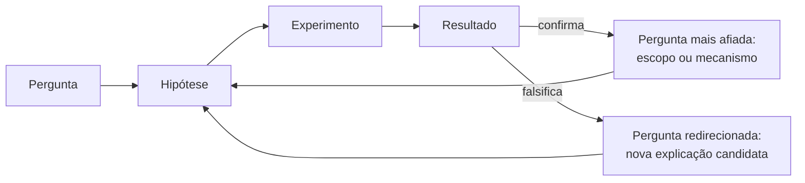

## Objetivos de Aprendizagem

- Explicar por que uma única passagem pergunta-para-resposta não é suficiente para construir entendimento real, e por que investigação é estruturada como um ciclo em vez disso.
- Distinguir como um resultado confirmador e um resultado falsificador cada um gera um tipo diferente e específico de próxima pergunta.
- Rastrear um exemplo concreto através de pelo menos duas voltas completas do ciclo pergunta-hipótese-experimento-resultado.
- Identificar quando um resultado afia a pergunta atual versus quando redireciona a investigação para uma pergunta genuinamente diferente.
- Reconhecer o modo de falha de tratar um único resultado como uma resposta terminal em vez de entrada para a próxima pergunta.

## Contexto e Motivação

Os dois conceitos anteriores nesta disciplina cada um tratou de uma única junção: o que fazer quando uma hipótese encontra um resultado contraditório, e, com o zoom para fora, o que acontece quando o framework compartilhado de um campo inteiro acumula anomalias que não consegue resolver. Ambos esses conceitos compartilham uma suposição subjacente que este conceito agora torna explícita: um resultado, o que quer que acabe sendo, nunca é o fim de uma investigação. É a entrada para a próxima pergunta.

Vale a pena enunciar isso claramente porque os estágios anteriores desta disciplina podem criar uma impressão enganosa de uma linha reta: note algo curioso, refine-o em uma pergunta, transforme a pergunta em uma hipótese testável, projete um experimento, rode-o, obtenha um resultado. Contado dessa forma, soa como uma única passagem com uma linha de chegada limpa. Na prática, e na história real de como conhecimento computacional e científico é construído, quase nenhum resultado real é uma linha de chegada. Uma hipótese confirmada restringe o que é verdade mas quase sempre expõe uma próxima coisa, mais específica, que vale a pena perguntar. Uma hipótese falsificada, como o conceito anterior sobre evidência contraditória estabeleceu, é em si nova informação valiosa que remodela qual é a próxima pergunta razoável. De qualquer forma, a resposta honesta a um resultado não é parar, mas perguntar o que ele torna novamente perguntável.

O "You and Your Research" de Richard Hamming é incomumente direto sobre esse ponto do lado do praticante: ele observou que pessoas que faziam trabalho consistentemente importante raramente estavam trabalhando em uma única pergunta isolada, elas estavam rodando um processo sustentado no qual cada resultado, bom ou ruim, alimentava diretamente a decisão de no que trabalhar a seguir, e ele contrastou isso com pesquisadores que tratavam cada projeto como uma unidade autocontida sem nenhum fio condutor conectando um resultado à próxima pergunta. A entrada da Stanford Encyclopedia of Philosophy sobre revoluções científicas faz um ponto estruturalmente similar no nível de um campo inteiro: a ciência normal de Kuhn é ela mesma um processo iterativo, no qual a resolução (ou não resolução) de um quebra-cabeça determina qual quebra-cabeça é atacado a seguir, repetidamente, enquanto o paradigma se mantiver. Ambas as fontes, de ângulos muito diferentes, estão descrevendo o mesmo formato: investigação é um ciclo, não uma única passagem, e este conceito é sobre aprender a fechar esse laço deliberadamente em vez de deixar que aconteça por acidente.

## Teoria Central

### Por que "uma passagem" subestima o que um resultado de fato faz

Uma única passagem por pergunta → hipótese → experimento → resultado trata o resultado como um ponto final: agora você sabe a resposta, e a investigação está completa. Isso raramente é preciso para qualquer pergunta interessante o suficiente para ter valido a pena fazer em primeiro lugar. Um resultado, confirmador ou falsificador, muda o que você sabe, o que muda qual é a próxima pergunta mais valiosa. Tratar o resultado como um término em vez de como nova informação sobre o que perguntar a seguir descarta exatamente a parte da investigação que a torna cumulativa em vez de uma série de eventos desconectados.

### Como um resultado confirmador gera uma próxima pergunta

Quando uma hipótese é confirmada, a próxima pergunta natural e geralmente produtiva é uma de **escopo** ou **mecanismo**: isso se mantém sob outras condições que eu ainda não testei? Agora que eu sei *que* é verdade, eu sei *por quê*? Uma confirmação restringe incerteza sobre a afirmação específica testada, mas quase nunca estabelece a fronteira completa de onde essa afirmação se mantém, nem confirmar que algo acontece automaticamente explica o mecanismo pelo qual acontece. Ambas essas lacunas são exatamente o que a próxima pergunta deveria mirar.

### Como um resultado falsificador gera uma próxima pergunta

Um resultado falsificador, pelo conceito anterior, deveria disparar revisão honesta em vez de resgate ad hoc, e a hipótese revisada é, estruturalmente, já uma nova pergunta mais afiada esperando para ser testada. Falsificação frequentemente é o ramo mais informativo precisamente porque elimina uma explicação candidata específica, restringindo o espaço remanescente de respostas plausíveis mais decisivamente do que uma confirmação geralmente faz. A próxima pergunta depois de uma falsificação tipicamente não é "eu estava errado?" (já respondida: sim) mas "dado que esse mecanismo específico agora está descartado, para o que a evidência de fato aponta em vez disso?"

### Afiar versus redirecionar

Nem toda próxima pergunta é o mesmo tipo de movimento em relação à anterior. Ajuda distinguir dois padrões:

- **Afiar** continua investigando essencialmente o mesmo fenômeno mas estreita a pergunta, de "X é mais rápido que Y?" (respondido: sim) para "sob quais tamanhos de entrada específicos X é mais rápido que Y?" Este é o padrão mais comum depois de um resultado confirmador.
- **Redirecionar** abandona o quadro da pergunta original porque o resultado revelou que uma variável inteiramente diferente está fazendo o trabalho real, de "concorrência causa a lentidão?" (respondido: não) para "a lentidão em vez disso acompanha o job em lote que acontece de rodar ao mesmo tempo?" Este é o padrão mais comum depois de um resultado falsificador, especialmente um que apontou para uma alternativa inesperada.

Reconhecer qual desses dois movimentos um dado resultado exige é em si uma habilidade: afiar uma pergunta que de fato precisava ser redirecionada desperdiça esforço refinando um quadro que nunca foi o certo, enquanto redirecionar para longe de uma pergunta que só precisava ser afiada descarta progresso real já feito.

### O ciclo, tornado explícito

Este é o mesmo formato, em uma escala menor e mais deliberada, que o laço ao qual o conceito final desta disciplina vai conectar explicitamente dois ciclos maiores já documentados em outro lugar neste currículo, um descrevendo a filosofia desta trilha inteira, e um descrevendo o módulo posterior dedicado construído especificamente para rodar esse ciclo de verdade, extensamente. O ponto a internalizar aqui é o mecanismo de uma volta completa: um resultado nunca é apenas uma resposta, é também, sempre, uma nova pergunta esperando.

## Exemplos Resolvidos

### Exemplo 1 — uma iteração completa, fator de carga de tabela hash

**Pergunta 1:** "Por que o tempo de busca desse cache apoiado em tabela hash degrada sob carga pesada de escrita?"

**Hipótese 1:** "Buscas ficam mais lentas porque o fator de carga da tabela sobe conforme mais entradas são escritas, aumentando cadeias de colisão."

**Experimento 1:** Meça o tempo médio de busca em vários fatores de carga fixos, mantendo o tamanho da tabela constante enquanto varia a contagem de entradas.

**Resultado 1:** O tempo de busca de fato aumenta com o fator de carga, mas o aumento é muito menor do que a teoria de cadeia de colisão sozinha prevê nos fatores de carga observados, a hipótese é parcialmente confirmada (fator de carga de fato importa) mas não dá conta totalmente da magnitude observada.

**Pergunta 2 (afiada, não redirecionada, o fenômeno é o mesmo, mas a explicação está incompleta):** "Dado que o fator de carga responde por apenas parte da lentidão, o que mais escala com volume de escrita que poderia responder pelo resto?"

**Hipótese 2:** "A lentidão remanescente vem de eventos de redimensionamento, cada vez que a tabela cresce além de seu limiar de fator de carga, um rehash completo pausa buscas, e carga pesada de escrita simplesmente dispara mais desses redimensionamentos dentro da janela de medição."

**Experimento 2:** Pré-dimensione a tabela para evitar qualquer evento de redimensionamento durante o teste, depois repita a medição original de fator de carga.

**Resultado 2:** Com redimensionamento eliminado, o tempo de busca agora acompanha a teoria de cadeia de colisão de perto, confirmando que a porção anteriormente "não explicada" da lentidão eram pausas de redimensionamento, não uma falha adicional no modelo de cadeia de colisão.

**O que mudou entre iterações:** A Pergunta 1 perguntou sobre um fenômeno amplo. O Resultado 1, uma confirmação parcial, não fechou a investigação, revelou uma lacuna específica (a discrepância de magnitude) que se tornou todo o conteúdo da Pergunta 2. Nada sobre essa segunda pergunta poderia ter sido formulado sem primeiro rodar o primeiro experimento; o ciclo não é andaime opcional, é de onde a Pergunta 2 de fato veio.

### Exemplo 2 — uma iteração completa depois de uma falsificação, latência de API

**Pergunta 1:** "A latência de resposta para esse endpoint de API depende do tamanho do payload?"

**Hipótese 1:** "Payloads de requisição maiores causam latência proporcionalmente mais alta devido a tempo de parsing aumentado."

**Experimento 1:** Varie o tamanho do payload através de uma ampla faixa enquanto mantém todas as outras características de requisição fixas, e meça latência em cada tamanho.

**Resultado 1:** A latência é essencialmente plana através de toda a faixa de tamanhos de payload testada, a hipótese é falsificada; o tempo de parsing para payloads nessa faixa é evidentemente insignificante comparado a qualquer outra coisa que determine latência.

**Revisão honesta (pelo conceito anterior, não um resgate):** Em vez de explicar o resultado plano, a descoberta é aceita: tamanho do payload não é o condutor, pelo menos na faixa testada. Isso diretamente redireciona a próxima pergunta para uma variável candidata diferente, já que o quadro original (tamanho do payload) agora foi eliminado como explicação, não meramente qualificado.

**Pergunta 2 (redirecionada, um candidato genuinamente diferente, não uma versão mais estreita do mesmo):** "Se não tamanho do payload, a latência em vez disso depende de qual índice de banco de dados a jusante é usado para servir a requisição?"

**Hipótese 2:** "Requisições que exigem uma varredura completa de tabela (nenhum índice utilizável para o filtro dado) têm latência substancialmente mais alta que requisições servidas por uma busca indexada, independentemente do tamanho do payload."

**Experimento 2:** Compare latência para requisições correspondendo a um campo indexado versus requisições exigindo uma varredura completa, mantendo o tamanho do payload fixo em ambos os grupos.

**Resultado 2:** Uma lacuna de latência grande e consistente aparece entre os dois grupos, confirmando a nova hipótese.

**O que mudou entre iterações:** A falsificação da Hipótese 1 não encerrou a investigação de "por que esse endpoint às vezes é lento", eliminou uma explicação candidata e, ao fazer isso, tornou um candidato diferente (plano de consulta/indexação) a próxima coisa natural a testar. A pergunta redirecionada neste exemplo não é uma reformulação da primeira; é uma pergunta diferente que o primeiro resultado tornou novamente razoável de fazer.

## Equívocos Comuns e Armadilhas

- **"Uma hipótese confirmada significa que a investigação está terminada."** Confirmação restringe o que é conhecido sobre a afirmação específica testada mas raramente estabelece seu escopo completo ou seu mecanismo, ambos os exemplos resolvidos mostram um resultado confirmador ou informativo imediatamente gerando uma pergunta adicional e mais específica em vez de fechar o tópico.
- **"Depois de uma falsificação, a próxima pergunta deveria ser apenas uma versão formulada de forma diferente da mesma pergunta."** Às vezes afiar é certo, mas uma falsificação que claramente descarta uma variável candidata inteira (como no Exemplo 2) geralmente pede para redirecionar para uma variável totalmente diferente, repetir o mesmo quadro com reformulação menor desperdiça a informação específica que a falsificação forneceu.
- **"Iterar significa repetir o mesmo experimento até obter o resultado que você esperava."** Isso não é iteração no sentido pretendido aqui; é uma variante do padrão de resgate ad hoc do conceito anterior, aplicada ao design de experimento em vez da formulação de hipótese. Iteração genuína muda a pergunta ou hipótese em resposta ao que o último resultado de fato mostrou, não as condições experimentais em busca de um resultado preferido.
- **"Cada nova pergunta no ciclo não está relacionada à última, então nada está realmente se acumulando."** Os exemplos resolvidos mostram o oposto: cada nova pergunta é diretamente derivada da lacuna específica ou eliminação que o resultado anterior produziu, e não poderia ter sido formulada de forma bem motivada sem esse resultado anterior. O ciclo acumula entendimento mesmo que a pergunta de nível superficial mude a cada volta.
- **"Apenas resultados falsificadores são informativos o suficiente para justificar continuar para a próxima pergunta."** O Exemplo 1 mostra uma confirmação (parcial) gerando uma pergunta de acompanhamento tão afiada e necessária quanto uma falsificação faz, o mecanismo difere (estreitar escopo versus eliminar um candidato) mas ambas as direções mantêm o ciclo se movendo.

## Resumo

Nenhuma única passagem pergunta-hipótese-experimento-resultado é uma investigação terminada, porque todo resultado, confirmador ou falsificador, muda o que vale a pena perguntar a seguir. Um resultado confirmador tipicamente afia a pergunta, empurrando em direção a escopo ou mecanismo que o teste original não estabeleceu; um resultado falsificador tipicamente a redireciona, eliminando uma explicação candidata e apontando para uma diferente. Ambos os padrões apareceram como exemplos resolvidos concretos de duas iterações acima, e ambos remontam ao mesmo ponto subjacente feito de ângulos diferentes por Hamming (resultados alimentando a escolha do que trabalhar a seguir) e pelo relato de Kuhn de ciência normal (resolução de quebra-cabeça determinando o próximo quebra-cabeça). Investigação científica e computacional é estruturada como um ciclo, não uma linha, e tratar um resultado como um término em vez de nova entrada é o modo de falha específico que este conceito serve para prevenir.

## Documentation Links

- [Stanford Encyclopedia of Philosophy — Scientific Revolutions](https://plato.stanford.edu/entries/scientific-revolutions/) — doc
- [Hamming, "You and Your Research" (1986 transcript)](https://www.cs.virginia.edu/~robins/YouAndYourResearch.pdf) — doc
