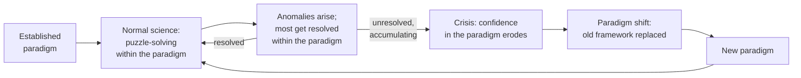

## Learning Objectives

- Define Kuhn's notion of a "paradigm" as a framework of shared assumptions, methods, and accepted problems that guides a field's work.
- Explain what "normal science" consists of, and why Kuhn considered it puzzle-solving rather than open-ended discovery.
- Describe how anomalies accumulate within normal science and what distinguishes an anomaly that gets absorbed from one that eventually forces a crisis.
- Contrast Kuhn's picture of scientific progress (long stable periods punctuated by rare, disruptive shifts) with a simple steady-accumulation picture.
- Identify a real historical example of a paradigm shift and explain, in Kuhn's terms, why it counts as one.

## Context & Motivation

The previous concept in this discipline established what should happen when a single hypothesis meets contradicting evidence: it gets honestly revised, not ad-hoc-rescued. That concept operates at the scale of one investigator, one hypothesis, one result. Thomas Kuhn's work, summarized carefully in the Stanford Encyclopedia of Philosophy's entries on Kuhn and on scientific revolutions, operates at a much larger scale: not what one person does with one anomalous result, but what an entire field does over decades as anomalies accumulate faster than they can be individually explained away.

Kuhn's central claim, developed in *The Structure of Scientific Revolutions*, was that science does not progress the way a naive picture suggests — steadily accumulating true facts, one confirmed hypothesis added to the pile after another, in a smooth upward line. Instead, Kuhn described most of a mature science's history as **normal science**: long stretches of work conducted entirely within a shared framework of assumptions, standard methods, exemplary past achievements, and agreed-upon open problems — what Kuhn called a **paradigm**. During normal science, researchers are not testing whether the paradigm itself is right; they take it as settled and spend their effort solving the specific puzzles it defines, in the way it says a puzzle should be solved. This is not a criticism — Kuhn considered normal science highly productive, precisely because not having to re-litigate the foundations every time frees enormous effort for detailed, cumulative puzzle-solving.

What makes Kuhn's picture different from a simple accumulation story is what happens to the puzzles a paradigm cannot solve. Every paradigm generates some number of persistent **anomalies** — observations or results that resist explanation within its own terms. Most of the time, normal science treats an anomaly as a puzzle not yet solved, not as a refutation, and keeps working; this is genuinely reasonable, not stubbornness, because most anomalies really do get resolved eventually within the existing framework. But Kuhn observed that anomalies can also accumulate, deepen, and interact until they produce a state he called **crisis** — and it is only out of crisis, rarely and irregularly, that a **paradigm shift** occurs: the wholesale replacement of the old framework by a new one that is often not just an extension of the old one but genuinely incommensurable with it, asking different questions, using different standards of what counts as a solved problem. This concept matters for this discipline specifically because it gives the honest-revision habit from the previous concept its proper scale: sometimes what needs revising is not a single hypothesis but the shared framework that made that hypothesis look reasonable to test in the first place.

## Core Theory

### What a paradigm actually is

Kuhn used "paradigm" to mean something broader than a single theory. A paradigm, per the Stanford Encyclopedia of Philosophy's treatment, bundles together: a body of accepted theory, standard methods and instruments for investigating problems within it, exemplary solved problems that model what a good solution looks like, and — critically — a shared sense of which questions are worth asking and which are premature, uninteresting, or simply outside the field's current business. Two researchers working under the same paradigm can disagree sharply about a specific result while still sharing all of this deeper scaffolding; the scaffolding itself is usually invisible precisely because it is not being argued about.

### Normal science as puzzle-solving

Kuhn deliberately chose the word "puzzle" rather than "problem" or "mystery" to describe what normal science does, and the distinction is load-bearing. A puzzle, in Kuhn's sense, is a challenge that is expected to have a solution reachable using the paradigm's existing tools — a crossword clue, not an open question about whether crosswords make sense as a genre. Normal science's job is to work out the paradigm's remaining puzzles: extending its predictions to new cases, refining its measurements, resolving apparent discrepancies between theory and observation using techniques the paradigm itself supplies. If a puzzle resists solution, the default and usually correct inference within normal science is that the researcher hasn't yet found the right technique — not that the paradigm is wrong. This is exactly analogous to the earlier point about not abandoning a hypothesis after a single anomalous result: normal science treats most anomalies the same way, as unsolved puzzles rather than refutations, and this is typically the right call.

### From anomaly to crisis

An anomaly becomes dangerous to a paradigm not by being severe in isolation but by resisting repeated, serious attempts at resolution using the paradigm's own best tools, especially when several such stubborn anomalies accumulate and start to look connected rather than coincidental. Kuhn described the resulting state as **crisis**: a period in which confidence in the existing paradigm's ability to eventually solve its own outstanding puzzles genuinely erodes among practitioners, competing modifications proliferate in an attempt to patch the paradigm without replacing it, and — crucially — researchers begin exploring fundamentally different ways of framing the field's core questions. Crisis is the necessary precondition for a paradigm shift in Kuhn's account; a shift does not occur just because a new theory is proposed, but because the old paradigm has stopped commanding the field's confidence.

### The paradigm shift itself

A **paradigm shift** (Kuhn's term; the Stanford Encyclopedia of Philosophy's "Scientific Revolutions" entry treats this as the technical core of a scientific revolution) is the replacement of the old paradigm by a new one that is typically not a simple refinement of the old — it can redefine what counts as a legitimate question, what counts as an adequate solution, and even what the basic entities of the field are taken to be. Kuhn's own leading historical example was the shift from Newtonian mechanics to Einsteinian relativity: this was not merely a case of relativity extending Newtonian mechanics to cover a few extra cases Newton hadn't reached. It changed the meaning of basic terms shared by both theories — "mass," "space," and "time" no longer meant quite the same thing in each framework, since Newtonian mass is absolute while relativistic mass depends on the observer's frame. Practitioners on either side of the shift were, in a real sense Kuhn insisted on taking seriously, working with different concepts even when using the same words. A second classic example from the history of astronomy is the shift from the geocentric (Earth-centered) Ptolemaic model to the heliocentric (Sun-centered) Copernican model: centuries of normal science within the Ptolemaic paradigm had produced an elaborate, genuinely useful system of epicycles for predicting planetary positions, but persistent anomalies in those predictions, accumulating over generations, eventually contributed to a crisis that the heliocentric reframing resolved — not merely by predicting better, but by changing what kind of explanation for planetary motion counted as satisfying at all.

This is Kuhn's most distinctive and, per the Stanford Encyclopedia of Philosophy's careful treatment, most contested claim: scientific progress is not simply the steady accumulation of ever-more-accurate facts about a fixed subject matter. It is punctuated by rare episodes in which the very framework for what counts as a fact, a good question, or an adequate solution is itself replaced.

### Why this is a genuinely different picture, not just new vocabulary

It would be easy to read "paradigm shift" as a fancy synonym for "big scientific discovery," but Kuhn's actual claim is stronger and more specific than that. The claim is that scientific knowledge does not grow by simple addition — new true facts stacked on old true facts, all measured against one fixed, stable standard of what a correct answer looks like. Instead, the standard itself is a historically contingent product of whichever paradigm currently holds, and that standard can be swept away and replaced along with the theory, rather than surviving as a neutral yardstick outside the whole process. This is why the Stanford Encyclopedia of Philosophy treats Kuhn's account as a genuine challenge to earlier, more cumulative pictures of scientific progress, not a footnote to them.

## Worked Examples

### Example 1 — the geocentric-to-heliocentric shift, mapped onto Kuhn's stages

**Paradigm:** The Ptolemaic, Earth-centered model of the cosmos, refined over roughly a millennium of normal science into a sophisticated system of circles-upon-circles ("epicycles") used to predict planetary positions.

**Normal science:** Generations of astronomers within this paradigm treated discrepancies between predicted and observed planetary positions as puzzles to be solved by adding further epicycles or adjusting existing ones — a legitimate, often successful strategy that is exactly what normal science is supposed to do with an anomaly.

**Accumulating anomalies:** Over time, the system needed an increasing number of increasingly intricate adjustments to keep matching observation, and certain irregularities (notably in the motion of Mars) proved stubbornly resistant to clean resolution within the geocentric framework, however many epicycles were added.

**Crisis:** By Copernicus's and later Kepler's time, the accumulated patchwork had become a recognized burden, and alternative framings — placing the Sun rather than the Earth at the center — began to be taken seriously not merely as a mathematical curiosity but as a candidate replacement for the whole framework.

**The shift:** The heliocentric model did not just add new epicycles of its own; it changed what a "satisfying" explanation of planetary motion looked like, eventually replacing uniform circular motion around the Earth with elliptical motion around the Sun (via Kepler) as the basic picture. Practitioners after the shift were not merely holding a more accurate version of the old paradigm — they were working inside a differently structured one.

### Example 2 — recognizing normal science versus crisis in a smaller-scale, non-historical setting

**Scenario:** A programming language community has, for years, treated garbage-collected memory management as the unquestioned foundation for how "safe, productive" languages should work; performance-sensitive work is simply routed to a different, manually-managed language instead. This is the paradigm: not a single claim, but a whole bundle of shared assumptions about what a safe/productive language must look like and which problems (manual memory management for performance) are considered outside its business.

**Normal science within this paradigm:** Enormous, genuinely productive effort goes into improving garbage collector algorithms, tuning pause times, and inventing new heap layouts — all puzzle-solving that never questions whether garbage collection itself is the right foundation.

**An anomaly that gets absorbed:** Certain latency-sensitive applications report unacceptable GC pause spikes; this is treated, successfully, as a puzzle solvable by better GC algorithms (e.g., concurrent or generational collectors), and indeed it substantially is solved this way for most applications — normal science working as intended.

**A potential crisis-in-progress:** A persistent, unresolved category of workloads (real-time systems, certain systems-programming domains) keeps finding that no amount of GC tuning removes the fundamental unpredictability that comes from not controlling deallocation directly, and this dissatisfaction, sustained across enough of the field for long enough, is part of what created space for languages built around a genuinely different foundational assumption — ownership and compile-time-checked lifetimes instead of runtime garbage collection. Whether this particular episode fully counts as a Kuhnian paradigm shift for the field of systems programming, or is better described as a durable coexistence of two paradigms for two different problem classes, is exactly the kind of judgment call Kuhn's framework requires making carefully rather than declaring "paradigm shift" reflexively — a point returned to below.

## Common Misconceptions & Pitfalls

- **Using "paradigm shift" as a generic synonym for any significant change or improvement.** In Kuhn's actual framework, the term names something specific and comparatively rare: the replacement of a field's whole shared framework of assumptions, methods, and standards — not any new library, tool, or well-received idea. Most genuine progress in a field, including most genuinely important progress, is normal science, not a paradigm shift, and Kuhn considered normal science the more common and in some sense more typical mode of scientific work.
- **"An anomaly is basically the same thing as a falsified hypothesis."** They are related but not identical. A falsified hypothesis, as covered in the previous concept, is a specific claim shown wrong by a specific test, at the scale of one investigator's work. An anomaly, in Kuhn's sense, is a puzzle the paradigm as a whole persistently fails to resolve using its own accepted tools — it operates at the scale of an entire field's shared framework, and most anomalies, unlike most falsified hypotheses, are expected to eventually be resolved rather than to force any large-scale change.
- **"Kuhn claimed a new paradigm is simply better, in a fully objective, framework-independent sense, than the one it replaced."** The Stanford Encyclopedia of Philosophy is careful to flag this as one of the most debated aspects of Kuhn's actual position — he argued paradigms can be genuinely difficult to compare on completely neutral terms because they can define "better" differently, a claim (incommensurability) that generated substantial philosophical controversy rather than being an uncontroversial add-on to his account.
- **Believing normal science is somehow lesser or unscientific because it doesn't question foundations.** Kuhn's account treats normal science as the engine of most real scientific productivity — detailed, cumulative, and only possible because foundational questions are, for the duration, settled. Constantly re-litigating foundations would make the detailed puzzle-solving that produces most real knowledge impossible.
- **Treating every stretch of accumulating minor anomalies as an impending crisis.** Most anomalies, historically, get absorbed by normal science exactly as intended; recognizing a genuine crisis requires the anomalies to resist sustained, serious effort and to accumulate in a way that erodes practitioners' actual confidence — not merely the retrospective judgment, easy to make once a shift has already happened, that "the signs were all there."

## Summary

Kuhn's picture divides a mature field's history into long stretches of normal science — puzzle-solving within an accepted paradigm's shared assumptions, methods, and standards — punctuated rarely by paradigm shifts, in which accumulated, unresolved anomalies produce a crisis that the old paradigm cannot survive, and a new, often genuinely incommensurable framework replaces it. The Newtonian-to-relativistic shift and the geocentric-to-heliocentric shift are Kuhn's own paradigm cases: in both, the replacement did not just add facts to the old framework but changed what counted as an adequate explanation at all. This is a genuinely different picture of scientific progress than steady, framework-neutral accumulation of facts, and it scales up the previous concept's lesson about honest revision from a single hypothesis to an entire field's foundational assumptions — sometimes what resists explanation is not one claim, but the shared paradigm that made the claim seem like the obvious thing to test.

## Documentation Links

- [Stanford Encyclopedia of Philosophy — Thomas Kuhn](https://plato.stanford.edu/entries/thomas-kuhn/) — doc
- [Stanford Encyclopedia of Philosophy — Scientific Revolutions](https://plato.stanford.edu/entries/scientific-revolutions/) — doc
