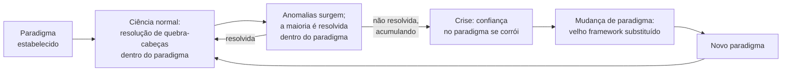

## Objetivos de Aprendizagem

- Definir a noção de "paradigma" de Kuhn como um framework de suposições compartilhadas, métodos, e problemas aceitos que guia o trabalho de um campo.
- Explicar em que consiste "ciência normal", e por que Kuhn a considerava resolução de quebra-cabeças em vez de descoberta aberta.
- Descrever como anomalias se acumulam dentro da ciência normal e o que distingue uma anomalia que é absorvida de uma que eventualmente força uma crise.
- Contrastar a imagem de Kuhn de progresso científico (longos períodos estáveis pontuados por mudanças raras e disruptivas) com uma imagem simples de acumulação constante.
- Identificar um exemplo histórico real de mudança de paradigma e explicar, nos termos de Kuhn, por que conta como uma.

## Contexto e Motivação

O conceito anterior nesta disciplina estabeleceu o que deveria acontecer quando uma única hipótese encontra evidência contraditória: ela é honestamente revisada, não resgatada ad hoc. Aquele conceito opera na escala de um investigador, uma hipótese, um resultado. O trabalho de Thomas Kuhn, resumido cuidadosamente nas entradas da Stanford Encyclopedia of Philosophy sobre Kuhn e sobre revoluções científicas, opera em uma escala muito maior: não o que uma pessoa faz com um resultado anômalo, mas o que um campo inteiro faz ao longo de décadas conforme anomalias se acumulam mais rápido do que podem ser individualmente explicadas.

A afirmação central de Kuhn, desenvolvida em *The Structure of Scientific Revolutions*, foi que a ciência não progride da forma que uma imagem ingênua sugere, acumulando constantemente fatos verdadeiros, uma hipótese confirmada adicionada à pilha depois da outra, em uma linha ascendente suave. Em vez disso, Kuhn descreveu a maior parte da história de uma ciência madura como **ciência normal**: longos trechos de trabalho conduzidos inteiramente dentro de um framework compartilhado de suposições, métodos padrão, conquistas passadas exemplares, e problemas em aberto acordados, o que Kuhn chamou de **paradigma**. Durante ciência normal, pesquisadores não estão testando se o próprio paradigma está certo; eles o tomam como resolvido e gastam seu esforço resolvendo os quebra-cabeças específicos que ele define, da forma que ele diz que um quebra-cabeça deveria ser resolvido. Isso não é uma crítica, Kuhn considerava a ciência normal altamente produtiva, precisamente porque não ter que relitigar os fundamentos toda vez libera enorme esforço para resolução de quebra-cabeças detalhada e cumulativa.

O que torna a imagem de Kuhn diferente de uma história de acumulação simples é o que acontece com os quebra-cabeças que um paradigma não consegue resolver. Todo paradigma gera algum número de **anomalias** persistentes, observações ou resultados que resistem a explicação nos próprios termos dele. Na maior parte do tempo, ciência normal trata uma anomalia como um quebra-cabeça ainda não resolvido, não como uma refutação, e continua trabalhando; isso é genuinamente razoável, não teimosia, porque a maioria das anomalias realmente acaba sendo resolvida dentro do framework existente. Mas Kuhn observou que anomalias também podem se acumular, se aprofundar, e interagir até produzir um estado que ele chamou de **crise**, e é apenas fora da crise, rara e irregularmente, que uma **mudança de paradigma** ocorre: a substituição completa do velho framework por um novo que frequentemente não é apenas uma extensão do antigo mas genuinamente incomensurável com ele, fazendo perguntas diferentes, usando padrões diferentes do que conta como um problema resolvido. Este conceito importa para esta disciplina especificamente porque dá ao hábito de revisão honesta do conceito anterior sua escala apropriada: às vezes o que precisa ser revisado não é uma única hipótese mas o framework compartilhado que fez essa hipótese parecer razoável de testar em primeiro lugar.

## Teoria Central

### O que um paradigma de fato é

Kuhn usou "paradigma" para significar algo mais amplo que uma única teoria. Um paradigma, segundo o tratamento da Stanford Encyclopedia of Philosophy, agrupa: um corpo de teoria aceita, métodos e instrumentos padrão para investigar problemas dentro dela, problemas resolvidos exemplares que modelam como uma boa solução se parece, e, criticamente, um senso compartilhado de quais perguntas valem a pena fazer e quais são prematuras, sem interesse, ou simplesmente fora do negócio atual do campo. Dois pesquisadores trabalhando sob o mesmo paradigma podem discordar fortemente sobre um resultado específico enquanto ainda compartilham todo esse andaime mais profundo; o próprio andaime geralmente é invisível precisamente porque não está sendo discutido.

### Ciência normal como resolução de quebra-cabeças

Kuhn deliberadamente escolheu a palavra "quebra-cabeça" em vez de "problema" ou "mistério" para descrever o que a ciência normal faz, e a distinção é estrutural. Um quebra-cabeça, no sentido de Kuhn, é um desafio esperado a ter uma solução alcançável usando as ferramentas existentes do paradigma, uma dica de palavras cruzadas, não uma pergunta aberta sobre se palavras cruzadas fazem sentido como gênero. O trabalho da ciência normal é resolver os quebra-cabeças remanescentes do paradigma: estender suas previsões para novos casos, refinar suas medições, resolver discrepâncias aparentes entre teoria e observação usando técnicas que o próprio paradigma fornece. Se um quebra-cabeça resiste a solução, a inferência padrão e geralmente correta dentro da ciência normal é que o pesquisador ainda não encontrou a técnica certa, não que o paradigma está errado. Isso é exatamente análogo ao ponto anterior sobre não abandonar uma hipótese depois de um único resultado anômalo: ciência normal trata a maioria das anomalias da mesma forma, como quebra-cabeças não resolvidos em vez de refutações, e isso tipicamente é a decisão certa.

### De anomalia a crise

Uma anomalia se torna perigosa para um paradigma não por ser severa isoladamente mas por resistir a tentativas repetidas e sérias de resolução usando as melhores ferramentas do próprio paradigma, especialmente quando várias dessas anomalias teimosas se acumulam e começam a parecer conectadas em vez de coincidentes. Kuhn descreveu o estado resultante como **crise**: um período em que a confiança na capacidade do paradigma existente de eventualmente resolver seus próprios quebra-cabeças pendentes genuinamente se corrói entre praticantes, modificações concorrentes proliferam em uma tentativa de remendar o paradigma sem substituí-lo, e, criticamente, pesquisadores começam a explorar formas fundamentalmente diferentes de formular as perguntas centrais do campo. Crise é a precondição necessária para uma mudança de paradigma no relato de Kuhn; uma mudança não ocorre apenas porque uma nova teoria é proposta, mas porque o velho paradigma parou de comandar a confiança do campo.

### A própria mudança de paradigma

Uma **mudança de paradigma** (termo de Kuhn; a entrada "Scientific Revolutions" da Stanford Encyclopedia of Philosophy trata isso como o núcleo técnico de uma revolução científica) é a substituição do velho paradigma por um novo que tipicamente não é um simples refinamento do antigo, ele pode redefinir o que conta como uma pergunta legítima, o que conta como uma solução adequada, e até o que as entidades básicas do campo são tomadas como sendo. O exemplo histórico principal do próprio Kuhn foi a mudança da mecânica Newtoniana para a relatividade Einsteiniana: isso não foi meramente um caso da relatividade estender a mecânica Newtoniana para cobrir alguns casos extras que Newton não tinha alcançado. Mudou o significado de termos básicos compartilhados por ambas as teorias, "massa," "espaço," e "tempo" não mais significavam exatamente a mesma coisa em cada framework, já que massa Newtoniana é absoluta enquanto massa relativística depende do referencial do observador. Praticantes de cada lado da mudança estavam, em um sentido real que Kuhn insistia em levar a sério, trabalhando com conceitos diferentes mesmo usando as mesmas palavras. Um segundo exemplo clássico da história da astronomia é a mudança do modelo geocêntrico (centrado na Terra) Ptolomaico para o modelo heliocêntrico (centrado no Sol) Copernicano: séculos de ciência normal dentro do paradigma Ptolomaico tinham produzido um sistema elaborado e genuinamente útil de epiciclos para prever posições planetárias, mas anomalias persistentes nessas previsões, acumulando ao longo de gerações, eventualmente contribuíram para uma crise que a reformulação heliocêntrica resolveu, não meramente prevendo melhor, mas mudando que tipo de explicação para o movimento planetário contava como satisfatória em absoluto.

Esta é a afirmação mais distintiva de Kuhn e, segundo o tratamento cuidadoso da Stanford Encyclopedia of Philosophy, mais contestada: progresso científico não é simplesmente a acumulação constante de fatos cada vez mais precisos sobre um assunto fixo. É pontuado por episódios raros nos quais o próprio framework do que conta como um fato, uma boa pergunta, ou uma solução adequada é ele mesmo substituído.

### Por que isso é uma imagem genuinamente diferente, não apenas vocabulário novo

Seria fácil ler "mudança de paradigma" como um sinônimo chique para "grande descoberta científica," mas a afirmação real de Kuhn é mais forte e mais específica que isso. A afirmação é que o conhecimento científico não cresce por adição simples, novos fatos verdadeiros empilhados sobre velhos fatos verdadeiros, todos medidos contra um único padrão fixo e estável do que uma resposta correta parece. Em vez disso, o próprio padrão é um produto historicamente contingente de qualquer que seja o paradigma atualmente vigente, e esse padrão pode ser varrido e substituído junto com a teoria, em vez de sobreviver como uma régua neutra fora de todo o processo. É por isso que a Stanford Encyclopedia of Philosophy trata o relato de Kuhn como um desafio genuíno a imagens anteriores e mais cumulativas de progresso científico, não uma nota de rodapé a elas.

## Exemplos Resolvidos

### Exemplo 1 — a mudança geocêntrico-para-heliocêntrico, mapeada nos estágios de Kuhn

**Paradigma:** O modelo Ptolomaico, centrado na Terra, do cosmos, refinado ao longo de aproximadamente um milênio de ciência normal em um sistema sofisticado de círculos-sobre-círculos ("epiciclos") usado para prever posições planetárias.

**Ciência normal:** Gerações de astrônomos dentro desse paradigma trataram discrepâncias entre posições planetárias previstas e observadas como quebra-cabeças a serem resolvidos adicionando mais epiciclos ou ajustando os existentes, uma estratégia legítima e frequentemente bem-sucedida que é exatamente o que ciência normal deveria fazer com uma anomalia.

**Anomalias acumulando:** Ao longo do tempo, o sistema precisou de um número crescente de ajustes cada vez mais intrincados para continuar correspondendo à observação, e certas irregularidades (notavelmente no movimento de Marte) se provaram teimosamente resistentes a uma resolução limpa dentro do framework geocêntrico, não importa quantos epiciclos fossem adicionados.

**Crise:** Na época de Copérnico e mais tarde Kepler, o remendo acumulado tinha se tornado um fardo reconhecido, e formulações alternativas, colocando o Sol em vez da Terra no centro, começaram a ser levadas a sério não meramente como uma curiosidade matemática mas como uma substituição candidata para o framework inteiro.

**A mudança:** O modelo heliocêntrico não apenas adicionou seus próprios novos epiciclos; mudou como uma explicação "satisfatória" do movimento planetário se parecia, eventualmente substituindo movimento circular uniforme ao redor da Terra por movimento elíptico ao redor do Sol (via Kepler) como a imagem básica. Praticantes depois da mudança não estavam meramente segurando uma versão mais precisa do velho paradigma, eles estavam trabalhando dentro de um estruturado de forma diferente.

### Exemplo 2 — reconhecendo ciência normal versus crise em um cenário de escala menor e não histórico

**Cenário:** Uma comunidade de linguagem de programação tratou, por anos, gerenciamento de memória com coleta de lixo como a fundação inquestionável de como linguagens "seguras e produtivas" deveriam funcionar; trabalho sensível a desempenho é simplesmente roteado para uma linguagem diferente e gerenciada manualmente em vez disso. Este é o paradigma: não uma única afirmação, mas um pacote inteiro de suposições compartilhadas sobre como uma linguagem segura/produtiva deve parecer e quais problemas (gerenciamento manual de memória para desempenho) são considerados fora do seu negócio.

**Ciência normal dentro desse paradigma:** Esforço enorme e genuinamente produtivo vai para melhorar algoritmos de coletor de lixo, ajustar tempos de pausa, e inventar novos layouts de heap, tudo resolução de quebra-cabeças que nunca questiona se a própria coleta de lixo é a fundação certa.

**Uma anomalia que é absorvida:** Certas aplicações sensíveis a latência relatam picos de pausa de GC inaceitáveis; isso é tratado, com sucesso, como um quebra-cabeça solucionável por melhores algoritmos de GC (por exemplo, coletores concorrentes ou geracionais), e de fato é substancialmente resolvido dessa forma para a maioria das aplicações, ciência normal funcionando como pretendido.

**Uma potencial crise em progresso:** Uma categoria persistente e não resolvida de cargas de trabalho (sistemas em tempo real, certos domínios de programação de sistemas) continua descobrindo que nenhuma quantidade de ajuste de GC remove a imprevisibilidade fundamental que vem de não controlar desalocação diretamente, e essa insatisfação, sustentada através de bastante do campo por tempo suficiente, é parte do que criou espaço para linguagens construídas em torno de uma suposição fundacional genuinamente diferente, propriedade e tempos de vida verificados em tempo de compilação em vez de coleta de lixo em tempo de execução. Se esse episódio específico conta totalmente como uma mudança de paradigma Kuhniana para o campo de programação de sistemas, ou é melhor descrito como uma coexistência durável de dois paradigmas para duas classes de problema diferentes, é exatamente o tipo de julgamento que o framework de Kuhn exige fazer cuidadosamente em vez de declarar "mudança de paradigma" reflexivamente, um ponto retomado abaixo.

## Equívocos Comuns e Armadilhas

- **Usar "mudança de paradigma" como um sinônimo genérico para qualquer mudança ou melhoria significativa.** No framework real de Kuhn, o termo nomeia algo específico e comparativamente raro: a substituição de todo o framework compartilhado de suposições, métodos, e padrões de um campo, não qualquer nova biblioteca, ferramenta, ou ideia bem recebida. A maioria do progresso genuíno em um campo, incluindo a maioria do progresso genuinamente importante, é ciência normal, não uma mudança de paradigma, e Kuhn considerava ciência normal o modo mais comum e em certo sentido mais típico de trabalho científico.
- **"Uma anomalia é basicamente a mesma coisa que uma hipótese falsificada."** Elas são relacionadas mas não idênticas. Uma hipótese falsificada, como coberta no conceito anterior, é uma afirmação específica mostrada errada por um teste específico, na escala do trabalho de um investigador. Uma anomalia, no sentido de Kuhn, é um quebra-cabeça que o paradigma como um todo persistentemente falha em resolver usando suas próprias ferramentas aceitas, opera na escala do framework compartilhado de um campo inteiro, e a maioria das anomalias, ao contrário da maioria das hipóteses falsificadas, é esperada a eventualmente ser resolvida em vez de forçar qualquer mudança em larga escala.
- **"Kuhn afirmou que um novo paradigma é simplesmente melhor, em um sentido totalmente objetivo e independente de framework, que o que substituiu."** A Stanford Encyclopedia of Philosophy é cuidadosa em sinalizar isso como um dos aspectos mais debatidos da posição real de Kuhn, ele argumentou que paradigmas podem ser genuinamente difíceis de comparar em termos completamente neutros porque podem definir "melhor" diferentemente, uma afirmação (incomensurabilidade) que gerou controvérsia filosófica substancial em vez de ser um complemento não controverso de seu relato.
- **Acreditar que ciência normal é de alguma forma inferior ou não científica porque não questiona fundamentos.** O relato de Kuhn trata ciência normal como o motor da maior parte da produtividade científica real, detalhada, cumulativa, e possível apenas porque perguntas fundacionais estão, durante a duração, resolvidas. Relitigar constantemente fundamentos tornaria a resolução detalhada de quebra-cabeças que produz a maior parte do conhecimento real impossível.
- **Tratar todo trecho de anomalias menores acumulando como uma crise iminente.** A maioria das anomalias, historicamente, é absorvida pela ciência normal exatamente como pretendido; reconhecer uma crise genuína exige que as anomalias resistam a esforço sustentado e sério e se acumulem de uma forma que corrói a confiança real dos praticantes, não meramente o julgamento retrospectivo, fácil de fazer uma vez que uma mudança já aconteceu, de que "os sinais estavam todos lá."

## Resumo

A imagem de Kuhn divide a história de um campo maduro em longos trechos de ciência normal, resolução de quebra-cabeças dentro das suposições, métodos, e padrões compartilhados de um paradigma aceito, pontuados raramente por mudanças de paradigma, nas quais anomalias acumuladas e não resolvidas produzem uma crise que o velho paradigma não consegue sobreviver, e um novo framework, frequentemente genuinamente incomensurável, o substitui. A mudança Newtoniana-para-relativística e a mudança geocêntrico-para-heliocêntrico são os próprios casos paradigmáticos de Kuhn: em ambos, a substituição não apenas adicionou fatos ao velho framework mas mudou o que contava como uma explicação adequada em absoluto. Esta é uma imagem genuinamente diferente de progresso científico do que acumulação constante e neutra de fatos, e escala a lição do conceito anterior sobre revisão honesta de uma única hipótese para as suposições fundacionais de um campo inteiro, às vezes o que resiste a explicação não é uma afirmação, mas o paradigma compartilhado que fez a afirmação parecer a coisa óbvia a testar.

## Documentation Links

- [Stanford Encyclopedia of Philosophy — Thomas Kuhn](https://plato.stanford.edu/entries/thomas-kuhn/) — doc
- [Stanford Encyclopedia of Philosophy — Scientific Revolutions](https://plato.stanford.edu/entries/scientific-revolutions/) — doc
