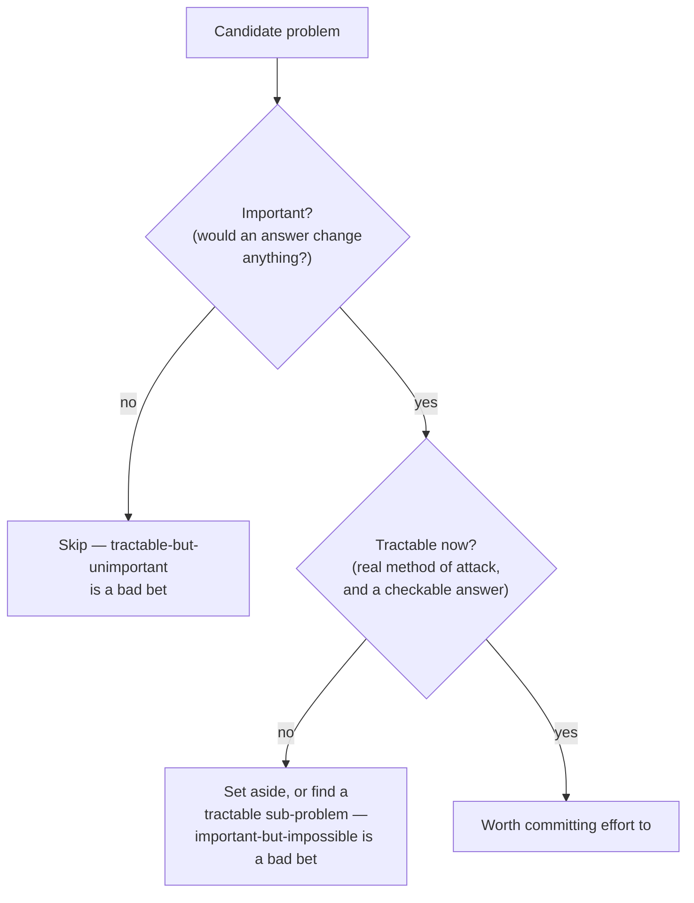

## Learning Objectives

- State Hamming's argument, from "You and Your Research," for why most people do not work on important problems even when they could.
- Explain the open-door versus closed-door observation and what it claims about the habits that lead to important work.
- Distinguish a question's importance from its current tractability, and explain why both are required before committing effort to it.
- Evaluate a candidate problem along both axes (importance, tractability) and justify whether it is currently worth working on.
- Identify the difference between an important-but-currently-impossible problem and a tractable-but-unimportant one, and why both are bad bets.

## Context & Motivation

Having a well-formed, computational question is not yet a reason to spend time on it. A perfectly precise question — named unknown, stated scope, a program or measurement that would settle it — can still be a question nobody should bother answering, because the answer wouldn't matter to anyone, including you, six months from now. Richard Hamming built an entire section of "You and Your Research" around this exact problem, and it is worth engaging with his argument directly rather than in paraphrase, because the specifics of what he observed are more useful than the general moral "work on important things."

Hamming's argument starts from a puzzle he says he tried directly on colleagues at Bell Labs: he would ask a scientist, "what are the important problems in your field?" Most could answer this without much trouble — people generally know, in outline, what the big open questions in their area are. He would then ask a second question: "why aren't you working on one of them?" This is the question that exposed the real problem. Most people, in his account, had no good answer — or the honest answer amounted to "it's too hard" or "I wouldn't know how to start," which is a different and more interesting kind of answer than it first appears, because it points at the second half of Hamming's argument rather than away from it.

## Core Theory

### The open-door, closed-door observation

Hamming reports a specific, concrete pattern he noticed over years at Bell Labs, watching who eventually did great work and who did competent but unremarkable work despite comparable talent. The people who kept their office door open were interrupted constantly — by colleagues, by questions, by unrelated conversations — and lost measurable chunks of uninterrupted time to it. The people who kept their door closed protected that time and, by most immediate measures, got more done per week on whatever they were already working on. And yet, Hamming observed, it was disproportionately the open-door people who ended up doing the important work over the long run, while many of the closed-door people produced a steady stream of solid, forgettable results on safe problems.

His explanation was not that interruptions are secretly productive. It was that the open-door habit kept people in continuous contact with what the rest of the field considered urgent, unresolved, and worth solving — the open door was a channel for absorbing which problems actually mattered, updated constantly by casual contact with other people's frustrations and half-formed ideas. The closed-door habit, whatever its short-term efficiency, cut a researcher off from that channel, leaving them free to become extremely good at solving a problem that had quietly stopped being one anyone else cared about. The lesson Hamming draws is specific and uncomfortable: protecting your unbroken focus is not free, even though it looks like pure gain on any given afternoon, because focus applied to the wrong problem is not an efficient use of a career, it's an efficient way to avoid noticing the problem is wrong.

### Importance is necessary but not sufficient

The "why aren't you working on one of them?" question exposes the second half of Hamming's argument. Naming a big, important open question in your field is easy. Actually working on it requires believing you have some method of attack — some concrete angle that gives you a real chance of making progress, not just restating the problem's importance to yourself. Hamming's point is that most people, when honest, do not have that method for the problems they'd call most important — and rather than go looking for one, or picking a genuinely important sub-problem where they *do* have an angle, they quietly drift toward safer, tractable, well-understood problems and stop asking whether those problems still matter.

This produces a two-axis judgment that has to be made deliberately, because it will not resolve itself by default:

- **Importance** — if you got a clean answer to this question, would it actually change what anyone does, believes, or builds? An important question is one whose answer has consequences beyond the satisfaction of having answered it.
- **Tractability** — given what's currently known, what tools exist, and what you personally have access to, is there a real method of attack, or would working on this right now mean flailing with no way to tell progress from motion?

A question can fail on either axis independently, and failing on either one makes it a bad bet:

- **Important but not currently tractable**: a genuinely significant question with no available method of attack. Time spent here usually produces motion, not progress — the honest move is either to look harder for an angle, work on a tractable piece of it, or set it aside until the field's tools catch up, not to grind on it anyway out of a sense that importance alone justifies the effort.
- **Tractable but not important**: a question you could resolve cleanly and quickly, with a real method of attack, whose answer would change nothing anyone cares about. This is the closed-door failure mode exactly — comfortable, measurable progress on a problem that stopped mattering, or never did.

Only a question that is both — a real method of attack *and* a consequential answer — is worth committing sustained effort to. Hamming's own framing of this, elsewhere in the talk, is closer to a bet than a rule: you are trading effort for expected impact, and a problem's expected value is something like its importance multiplied by your real chance of actually cracking it, not either quantity alone.

### Tractability includes being able to check the answer

Part of having "a real method of attack" is being able to tell, once you think you have an answer, whether you actually do — a problem is not tractable if even a correct answer to it couldn't be distinguished from a wrong one. This connects to a criterion developed at length later in this discipline: a problem is a poor bet not only when there's no way to make progress toward an answer, but also when there would be no way to check a proposed answer against reality even if a promising angle existed. Karl Popper's insistence, discussed properly in this discipline's next topic-group, that a scientific claim has to be capable of being shown wrong by some conceivable observation is the same underlying requirement viewed from the endpoint rather than the starting line: a "problem" whose candidate solutions can never be tested against anything is not tractable no matter how clever the attempted method of attack looks, because there is no way to tell, afterward, whether it worked.

## Worked Examples

### Example 1 — applying Hamming's two questions to a real engineering choice

**Setting:** a small backend team notices their service occasionally times out under load and is deciding what to spend the next sprint investigating.

**Candidate 1 — "Can we build a fully automated root-cause diagnosis system that identifies the source of any future outage without a human involved?"** Asking Hamming's first question — would this matter? — the answer is genuinely yes; this would save real engineering time indefinitely if it existed. Asking the second — is there a method of attack, right now, with this team's tools and time budget? — the honest answer is no: this is an open research problem in automated diagnosis that well-resourced teams elsewhere have not solved cleanly. This is important but not currently tractable for this team; committing the sprint to it would produce motion (a partially-working prototype, probably) without a real chance of the stated goal.

**Candidate 2 — "Can we rename three internal config variables to be more consistent?"** This has an obvious method of attack (it's a mechanical refactor) and a clean, checkable outcome. But applying the importance question honestly: would this change anything anyone outside the team notices, or unblock any real work? No. This is tractable but not important — exactly the closed-door failure mode, comfortable and measurable but not worth the sprint.

**Candidate 3 — "Under peak load, which of our three most latency-sensitive endpoints is closest to its timeout threshold, and what's the dominant cost in that one?"** (This is the well-formed, computational question style from earlier concepts, applied here.) Importance: yes — this directly targets the actual timeout complaints. Tractability: yes — the team already has request tracing in place, so there's a concrete method of attack, and the answer (a specific endpoint, a specific dominant cost) is checkable against the trace data. This clears both bars and is the one worth the sprint.

### Example 2 — the "why aren't you working on it?" test applied to a research-flavored question

**Setting:** a graduate student names, when asked, "developing a general algorithm that always picks the optimal move in any board game in reasonable time" as an important problem in their field.

**Applying Hamming's second question honestly:** why aren't they working on it? The honest answer is that this runs directly into known computational complexity barriers — many such games are provably intractable in the general case, so "a real method of attack" for the fully general version does not currently exist, and no amount of individual effort changes that; the barrier isn't a lack of cleverness; it's a proven limit.

**The productive move, per Hamming's own advice elsewhere in the talk, is not to abandon the area but to find a tractable sub-problem that keeps a real connection to the important one:** "for this specific, commercially relevant class of games with property X, can a heuristic be found that provably gets within some bounded factor of optimal, in practical time?" This keeps the importance (it's still aimed at the thing that matters) while regaining tractability (there's now an actual angle: bounded approximation rather than full generality), which is exactly the trade Hamming describes great researchers as making constantly rather than as a one-time compromise.

## Common Misconceptions & Pitfalls

- **"Important problems are always worth working on immediately."** Hamming's own point is closer to the opposite in the short term: an important problem with no available method of attack is a trap, not a badge of ambition — the discipline is in recognizing when a genuinely important question should be set aside, or narrowed, rather than grinding on it out of principle.
- **"Tractability is just about difficulty."** Tractability is about whether a real method of attack exists *and* whether a proposed answer could be checked against something — a problem can be "easy" in the sense of requiring little cleverness and still fail to be tractable if there's no way to verify whether the result is actually correct.
- **Mistaking the closed-door habit for discipline or focus.** Protecting uninterrupted time looks, on any single day, like the more disciplined choice — Hamming's observation is that it can simultaneously be the mechanism by which someone loses contact with which problems still matter, so the habit's short-term efficiency and its long-term cost are not in tension, they're the same habit.
- **Treating "what are the important problems?" as a one-time question.** Hamming's colleagues could usually answer this once, when asked directly — the actual failure was not knowing the answer, it was not returning to the question regularly enough to notice when the honest answer, or their own tractability with respect to it, had changed.
- **Assuming importance is purely a matter of personal interest.** In Hamming's framing, importance is judged by whether an answer would change what other people do or believe, not by how interesting the question feels to the person asking it — a question can feel very compelling and still be, by this test, unimportant, and vice versa.

## Summary

A well-formed, even computational, question is not automatically worth answering — Hamming's argument in "You and Your Research" is that most people fail to work on important problems not from lack of awareness (they can usually name the important open questions in their field) but from lack of a real method of attack, and that the habit of staying in contact with what matters (his open-door observation) matters as much as raw ability in ending up on the right problems at all. Two independent axes have to both clear the bar: importance (would an answer actually change anything) and tractability (is there a genuine angle of attack, and could a proposed answer be checked). An important-but-currently-impossible problem and a tractable-but-unimportant one are both bad bets, for different reasons, and the productive move when a problem fails on tractability alone is usually to find a narrower sub-problem that keeps the connection to what matters while regaining a real method of attack.

## Documentation Links

- [Hamming, "You and Your Research" (1986 transcript)](https://www.cs.virginia.edu/~robins/YouAndYourResearch.pdf) — doc
- [Stanford Encyclopedia of Philosophy — Karl Popper](https://plato.stanford.edu/entries/popper/) — doc
