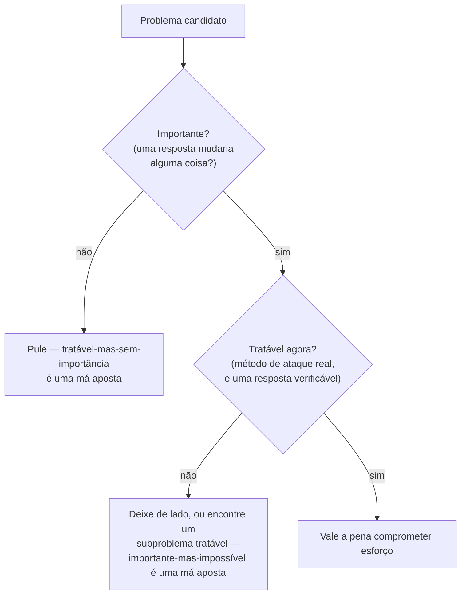

## Objetivos de Aprendizagem

- Enunciar o argumento de Hamming, de "You and Your Research," para por que a maioria das pessoas não trabalha em problemas importantes mesmo quando poderia.
- Explicar a observação porta-aberta versus porta-fechada e o que ela afirma sobre os hábitos que levam a trabalho importante.
- Distinguir a importância de uma pergunta de sua tratabilidade atual, e explicar por que ambas são exigidas antes de comprometer esforço a ela.
- Avaliar um problema candidato ao longo de ambos os eixos (importância, tratabilidade) e justificar se ele atualmente vale a pena trabalhar.
- Identificar a diferença entre um problema importante-mas-atualmente-impossível e um tratável-mas-sem-importância, e por que ambos são más apostas.

## Contexto e Motivação

Ter uma pergunta bem formada, mesmo computacional, ainda não é uma razão para gastar tempo nela. Uma pergunta perfeitamente precisa, desconhecido nomeado, escopo declarado, um programa ou medição que a resolveria, ainda pode ser uma pergunta que ninguém deveria se dar ao trabalho de responder, porque a resposta não importaria a ninguém, incluindo você, daqui a seis meses. Richard Hamming construiu uma seção inteira de "You and Your Research" em torno exatamente desse problema, e vale a pena engajar com seu argumento diretamente em vez de em paráfrase, porque os detalhes do que ele observou são mais úteis do que a moral geral "trabalhe em coisas importantes."

O argumento de Hamming começa com um enigma que ele diz ter tentado diretamente com colegas no Bell Labs: ele perguntava a um cientista, "quais são os problemas importantes no seu campo?" A maioria conseguia responder isso sem muita dificuldade, as pessoas geralmente sabem, em esboço, quais são as grandes perguntas em aberto em sua área. Ele então fazia uma segunda pergunta: "por que você não está trabalhando em um deles?" Esta é a pergunta que expôs o problema real. A maioria das pessoas, em seu relato, não tinha uma boa resposta, ou a resposta honesta se resumia a "é difícil demais" ou "eu não saberia por onde começar," que é um tipo de resposta diferente e mais interessante do que parece à primeira vista, porque aponta para a segunda metade do argumento de Hamming em vez de se afastar dela.

## Teoria Central

### A observação porta-aberta, porta-fechada

Hamming relata um padrão específico e concreto que ele notou ao longo de anos no Bell Labs, observando quem eventualmente fazia grande trabalho e quem fazia trabalho competente mas sem destaque apesar de talento comparável. As pessoas que mantinham a porta de seu escritório aberta eram interrompidas constantemente, por colegas, por perguntas, por conversas não relacionadas, e perdiam pedaços mensuráveis de tempo ininterrupto por causa disso. As pessoas que mantinham a porta fechada protegiam esse tempo e, pela maioria das medidas imediatas, conseguiam fazer mais por semana em qualquer coisa que já estivessem trabalhando. E ainda assim, Hamming observou, eram desproporcionalmente as pessoas de porta aberta que acabavam fazendo o trabalho importante no longo prazo, enquanto muitas das pessoas de porta fechada produziam um fluxo constante de resultados sólidos mas esquecíveis em problemas seguros.

Sua explicação não foi que interrupções são secretamente produtivas. Foi que o hábito de porta aberta mantinha as pessoas em contato contínuo com o que o resto do campo considerava urgente, não resolvido, e que valia a pena resolver, a porta aberta era um canal para absorver quais problemas de fato importavam, atualizado constantemente pelo contato casual com as frustrações e ideias meio-formadas de outras pessoas. O hábito de porta fechada, qualquer que fosse sua eficiência de curto prazo, cortava um pesquisador desse canal, deixando-o livre para se tornar extremamente bom em resolver um problema que silenciosamente tinha deixado de ser um com o qual qualquer outra pessoa se importava. A lição que Hamming tira é específica e desconfortável: proteger seu foco ininterrupto não é grátis, mesmo que pareça ganho puro em qualquer tarde específica, porque foco aplicado ao problema errado não é um uso eficiente de uma carreira, é uma forma eficiente de evitar notar que o problema está errado.

### Importância é necessária mas não suficiente

A pergunta "por que você não está trabalhando em um deles?" expõe a segunda metade do argumento de Hamming. Nomear uma grande e importante pergunta em aberto em seu campo é fácil. De fato trabalhar nela exige acreditar que você tem algum método de ataque, algum ângulo concreto que lhe dá uma chance real de progresso, não apenas reafirmar a importância do problema para si mesmo. O ponto de Hamming é que a maioria das pessoas, quando honestas, não têm esse método para os problemas que chamariam de mais importantes, e em vez de ir procurar um, ou escolher um subproblema genuinamente importante onde elas *de fato* têm um ângulo, elas silenciosamente derivam para problemas mais seguros, tratáveis, bem compreendidos, e param de perguntar se esses problemas ainda importam.

Isso produz um julgamento de dois eixos que precisa ser feito deliberadamente, porque não se resolverá sozinho por padrão:

- **Importância**, se você obtivesse uma resposta limpa a essa pergunta, isso de fato mudaria o que alguém faz, acredita, ou constrói? Uma pergunta importante é uma cuja resposta tem consequências além da satisfação de tê-la respondido.
- **Tratabilidade**, dado o que atualmente é conhecido, quais ferramentas existem, e ao que você pessoalmente tem acesso, há um método de ataque real, ou trabalhar nisso agora significaria se debater sem forma de distinguir progresso de movimento?

Uma pergunta pode falhar em qualquer um dos eixos independentemente, e falhar em qualquer um deles a torna uma má aposta:

- **Importante mas não atualmente tratável**: uma pergunta genuinamente significativa sem método de ataque disponível. Tempo gasto aqui geralmente produz movimento, não progresso, o movimento honesto é ou procurar mais intensamente por um ângulo, trabalhar em um pedaço tratável dela, ou deixá-la de lado até que as ferramentas do campo alcancem, não moê-la de qualquer forma por um senso de que importância sozinha justifica o esforço.
- **Tratável mas não importante**: uma pergunta que você poderia resolver limpa e rapidamente, com um método de ataque real, cuja resposta não mudaria nada com que ninguém se importa. Este é exatamente o modo de falha da porta fechada, progresso confortável e mensurável em um problema que deixou de importar, ou nunca importou.

Apenas uma pergunta que é ambas, um método de ataque real *e* uma resposta consequente, vale a pena comprometer esforço sustentado. A própria formulação de Hamming disso, em outro lugar na palestra, está mais próxima de uma aposta do que uma regra: você está trocando esforço por impacto esperado, e o valor esperado de um problema é algo como sua importância multiplicada pela sua chance real de de fato resolvê-lo, não qualquer quantidade sozinha.

### Tratabilidade inclui ser capaz de verificar a resposta

Parte de ter "um método de ataque real" é ser capaz de dizer, uma vez que você acha que tem uma resposta, se de fato tem, um problema não é tratável se mesmo uma resposta correta a ele não pudesse ser distinguida de uma errada. Isso se conecta a um critério desenvolvido extensamente mais adiante nesta disciplina: um problema é uma aposta ruim não apenas quando não há forma de fazer progresso em direção a uma resposta, mas também quando não haveria forma de verificar uma resposta proposta contra a realidade mesmo que um ângulo promissor existisse. A insistência de Karl Popper, discutida adequadamente no próximo grupo de tópicos desta disciplina, de que uma afirmação científica tem que ser capaz de ser mostrada errada por alguma observação concebível é a mesma exigência subjacente vista do ponto final em vez da linha de partida: um "problema" cujas soluções candidatas nunca podem ser testadas contra nada não é tratável não importa quão engenhoso o método de ataque tentado pareça, porque não há forma de dizer, depois, se funcionou.

## Exemplos Resolvidos

### Exemplo 1 — aplicando as duas perguntas de Hamming a uma escolha real de engenharia

**Cenário:** uma pequena equipe de backend nota que seu serviço ocasionalmente dá timeout sob carga e está decidindo o que investigar na próxima sprint.

**Candidato 1 — "Podemos construir um sistema de diagnóstico de causa raiz totalmente automatizado que identifica a fonte de qualquer futura queda sem envolvimento humano?"** Fazendo a primeira pergunta de Hamming, isso importaria? A resposta é genuinamente sim; isso pouparia tempo real de engenharia indefinidamente se existisse. Fazendo a segunda, há um método de ataque, agora, com as ferramentas e o orçamento de tempo desta equipe? A resposta honesta é não: este é um problema de pesquisa em aberto em diagnóstico automatizado que equipes bem-recursadas em outros lugares não resolveram limpamente. Isso é importante mas não atualmente tratável para essa equipe; comprometer a sprint a isso produziria movimento (um protótipo parcialmente funcional, provavelmente) sem uma chance real do objetivo declarado.

**Candidato 2 — "Podemos renomear três variáveis de configuração internas para serem mais consistentes?"** Isso tem um método de ataque óbvio (é uma refatoração mecânica) e um resultado limpo e verificável. Mas aplicando a pergunta de importância honestamente: isso mudaria alguma coisa que alguém fora da equipe notaria, ou desbloquearia algum trabalho real? Não. Isso é tratável mas não importante, exatamente o modo de falha de porta fechada, confortável e mensurável mas não digno da sprint.

**Candidato 3 — "Sob pico de carga, qual dos nossos três endpoints mais sensíveis a latência está mais próximo de seu limite de timeout, e qual é o custo dominante naquele?"** (Este é o estilo de pergunta bem formada e computacional de conceitos anteriores, aplicado aqui.) Importância: sim, isso mira diretamente as reclamações reais de timeout. Tratabilidade: sim, a equipe já tem rastreamento de requisições implementado, então há um método de ataque concreto, e a resposta (um endpoint específico, um custo dominante específico) é verificável contra os dados de rastro. Isso ultrapassa ambas as barras e é o que vale a sprint.

### Exemplo 2 — o teste "por que você não está trabalhando nisso?" aplicado a uma pergunta com sabor de pesquisa

**Cenário:** um estudante de pós-graduação nomeia, quando perguntado, "desenvolver um algoritmo geral que sempre escolhe o movimento ótimo em qualquer jogo de tabuleiro em tempo razoável" como um problema importante em seu campo.

**Aplicando a segunda pergunta de Hamming honestamente:** por que ele não está trabalhando nisso? A resposta honesta é que isso esbarra diretamente em barreiras conhecidas de complexidade computacional, muitos desses jogos são comprovadamente intratáveis no caso geral, então "um método de ataque real" para a versão totalmente geral atualmente não existe, e nenhuma quantidade de esforço individual muda isso; a barreira não é falta de engenhosidade; é um limite comprovado.

**O movimento produtivo, pelo próprio conselho de Hamming em outro lugar na palestra, não é abandonar a área mas encontrar um subproblema tratável que mantém uma conexão real com o importante:** "para essa classe específica e comercialmente relevante de jogos com propriedade X, uma heurística pode ser encontrada que comprovadamente fica dentro de algum fator limitado do ótimo, em tempo prático?" Isso mantém a importância (ainda está mirado na coisa que importa) enquanto recupera a tratabilidade (agora há um ângulo real: aproximação limitada em vez de generalidade completa), que é exatamente a troca que Hamming descreve grandes pesquisadores fazendo constantemente em vez de como um compromisso único.

## Equívocos Comuns e Armadilhas

- **"Problemas importantes sempre valem a pena trabalhar imediatamente."** O próprio ponto de Hamming está mais próximo do oposto no curto prazo: um problema importante sem método de ataque disponível é uma armadilha, não uma insígnia de ambição, a disciplina está em reconhecer quando uma pergunta genuinamente importante deveria ser deixada de lado, ou estreitada, em vez de moída por princípio.
- **"Tratabilidade é apenas sobre dificuldade."** Tratabilidade é sobre se um método de ataque real existe *e* se uma resposta proposta poderia ser verificada contra algo, um problema pode ser "fácil" no sentido de exigir pouca engenhosidade e ainda falhar em ser tratável se não há forma de verificar se o resultado é de fato correto.
- **Confundir o hábito de porta fechada com disciplina ou foco.** Proteger tempo ininterrupto parece, em qualquer dia específico, a escolha mais disciplinada, a observação de Hamming é que ela pode ser simultaneamente o mecanismo pelo qual alguém perde contato com quais problemas ainda importam, então a eficiência de curto prazo do hábito e seu custo de longo prazo não estão em tensão, são o mesmo hábito.
- **Tratar "quais são os problemas importantes?" como uma pergunta de uma única vez.** Os colegas de Hamming geralmente conseguiam responder isso uma vez, quando perguntados diretamente, a falha real não era não saber a resposta, era não retornar à pergunta com frequência suficiente para notar quando a resposta honesta, ou sua própria tratabilidade em relação a ela, tinha mudado.
- **Assumir que importância é puramente uma questão de interesse pessoal.** Na formulação de Hamming, importância é julgada por se uma resposta mudaria o que outras pessoas fazem ou acreditam, não por quão atraente a pergunta parece à pessoa que a faz, uma pergunta pode parecer muito atraente e ainda assim ser, por esse teste, sem importância, e vice-versa.

## Resumo

Uma pergunta bem formada, mesmo computacional, não vale automaticamente a pena responder, o argumento de Hamming em "You and Your Research" é que a maioria das pessoas falha em trabalhar em problemas importantes não por falta de consciência (geralmente conseguem nomear as importantes perguntas em aberto em seu campo) mas por falta de um método de ataque real, e que o hábito de permanecer em contato com o que importa (sua observação de porta aberta) importa tanto quanto habilidade bruta para acabar nos problemas certos. Dois eixos independentes precisam ambos ultrapassar a barra: importância (uma resposta de fato mudaria alguma coisa) e tratabilidade (há um ângulo de ataque genuíno, e uma resposta proposta poderia ser verificada). Um problema importante-mas-atualmente-impossível e um tratável-mas-sem-importância são ambos más apostas, por razões diferentes, e o movimento produtivo quando um problema falha na tratabilidade sozinha geralmente é encontrar um subproblema mais estreito que mantém a conexão com o que importa enquanto recupera um método de ataque real.

## Documentation Links

- [Hamming, "You and Your Research" (1986 transcript)](https://www.cs.virginia.edu/~robins/YouAndYourResearch.pdf) — doc
- [Stanford Encyclopedia of Philosophy — Karl Popper](https://plato.stanford.edu/entries/popper/) — doc
