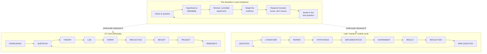

## Learning Objectives

- Assemble every concept taught in this discipline into a single, explicit end-to-end cycle, from noticing something puzzling to communicating a result.
- Map this discipline's cycle onto the Ciência da Computação track's own overall philosophy: KNOWLEDGE → QUESTION → THEORY → LAB → PAPER → REFLECTION → REVISIT → PROJECT → RESEARCH → (new QUESTION).
- Map this discipline's cycle onto the later `research` module's planned cycle: QUESTION → LITERATURE → PAPERS → HYPOTHESIS → IMPLEMENTATION → EXPERIMENT → RESULT → REFLECTION → NEW QUESTION.
- Explain why this discipline is explicitly a miniature, foundational rehearsal of both of those larger, already-documented cycles, not a third, unrelated cycle invented for its own sake.
- Trace a single realistic investigation through the full cycle end to end, naming which concept from this discipline governs each stage.

## Context & Motivation

Every concept in this discipline has, up to now, been examined mostly on its own: how to turn curiosity into a question, how to build a falsifiable hypothesis, how to design a minimal experiment with real controls, how to weigh evidence honestly, what to do when a hypothesis fails, how a single result reshapes the next question, why almost no question is asked for the first time, and how to communicate a result so it is actually usable by someone else. This final concept does not introduce new philosophical machinery. Its job is to put all of that back together into the single loop it was always part of, and — this is the specific, real point worth taking seriously rather than treating as a closing platitude — to show that this loop is not a generic "science is a cycle" observation invented for this discipline. It is a small-scale, deliberately simplified rehearsal of two cycles that already exist, by name, elsewhere in this exact curriculum.

The first of these is the founding philosophy of the entire Ciência da Computação (CC) track this discipline belongs to. That track is organized not as a sequence of semesters but as a knowledge graph of modules, and its own stated philosophy is written as a loop:

```
KNOWLEDGE → QUESTION → THEORY → LAB → PAPER → REFLECTION → REVISIT → PROJECT → RESEARCH → (new QUESTION)
```

This is not a metaphor borrowed for this discipline's benefit — it is the actual, documented shape the whole CC track is built around, describing how a student is meant to move through the curriculum overall: absorb existing knowledge, form a question it raises, work through the relevant theory, test understanding in a lab, communicate findings as a paper, reflect on what was learned, revisit earlier material in light of that reflection, extend it into a project, push further into research, and land on a new question that starts the loop again.

The second is more specific and further ahead in the curriculum: a dedicated module, simply named `research`, still unwritten at the time of this concept but already planned with its own explicit cycle:

```
QUESTION → LITERATURE → PAPERS → HYPOTHESIS → IMPLEMENTATION → EXPERIMENT → RESULT → REFLECTION → NEW QUESTION
```

That module has no traditional capstone thesis; instead, a student picks a real research question and walks it through this exact sequence, for real, at length, potentially producing software, a paper reproduction, an experiment, a theoretical study, or a new tool — with no single prescribed kind of output, because the module is explicitly framed as the entry point into open-ended, continuing learning that does not terminate at graduation.

This discipline, `questions-scientific-thinking`, is the place both of those cycles get taught for the first time, in miniature, at a scale small enough to practice safely before the stakes rise. Every concept covered here is a scaled-down version of a stage in one or both of those larger cycles, and this final concept's job is to make that mapping completely explicit, so that the transition, much later in the curriculum, into the full-scale `research` module feels like doing the same thing again at greater depth — not like encountering something unfamiliar.

## Core Theory

### The cycle this discipline actually taught, stage by stage

Read end to end, the concepts in this discipline trace out their own version of the same loop:

1. **Noticing and questioning** ("From Curiosity to a Question," "What Makes a Question Well-Formed," "Computational Questions vs. Questions in General," "Picking Problems Worth Working On") — turning a vague observation into a precise, worthwhile, answerable question.
2. **Hypothesis and falsifiability** ("Turning a Question into a Testable Hypothesis," "Falsifiability: What Makes a Claim Scientific," "Distinguishing a Claim from an Assumption") — converting the question into a specific, checkable, genuinely falsifiable guess.
3. **Experiment design** ("Designing a Minimal Experiment," "Controls and Isolating Variables") — building the smallest test that could actually distinguish the hypothesis from its alternative.
4. **Evidence and reasoning** ("Correlation vs. Causation," "Confounding Variables," "Collecting and Weighing Evidence") — running the test and interpreting what came back honestly, including the ways a result can mislead.
5. **Responding to the result** ("When Evidence Contradicts the Hypothesis," "Normal Science and Paradigm Shifts") — revising rather than rescuing a falsified hypothesis, and recognizing that the same honesty scales up to an entire field's shared framework.
6. **Closing the loop** ("Iterating: From Result to New Question," "Reading and Building on Prior Work," "Communicating a Question and Its Answer," and this concept) — using the result to generate the next question, checking that question against what's already known, and communicating the answer clearly enough for someone else to build on it.

### Mapping onto the CC track's own KNOWLEDGE → RESEARCH loop

| This discipline's stage | CC track stage |
|---|---|
| Absorbing background before noticing something puzzling | KNOWLEDGE |
| Refining curiosity into a well-formed, worthwhile, computational question | QUESTION |
| Building a falsifiable hypothesis and distinguishing it from its assumptions | THEORY |
| Designing and running a minimal, controlled experiment | LAB |
| Communicating the question and its answer clearly enough to verify | PAPER |
| Honestly responding to a confirming or falsifying result | REFLECTION |
| Checking the result and question against prior work already covered | REVISIT |
| Extending a confirmed or revised hypothesis into further, larger work | PROJECT |
| Iterating from result to a new, sharper or redirected question | RESEARCH → (new QUESTION) |

This is not a forced or approximate correspondence — the CC track's loop is a broader, curriculum-wide version of exactly this discipline's cycle, at the scale of an entire learning path rather than a single small investigation. Reflection and revisiting, in the track's own terms, are precisely the honest-response and prior-work-checking habits this discipline built in detail.

### Mapping onto the `research` module's QUESTION → NEW QUESTION loop

| This discipline's stage | `research` module stage |
|---|---|
| Forming a well-formed, worthwhile question | QUESTION |
| Reading and building on prior work | LITERATURE / PAPERS |
| Turning the question into a testable, falsifiable hypothesis | HYPOTHESIS |
| Designing a minimal, controlled experiment | IMPLEMENTATION |
| Running the experiment | EXPERIMENT |
| Collecting and weighing the evidence produced | RESULT |
| Responding honestly — revision, not rescue — to what the evidence shows | REFLECTION |
| Iterating from that result to the next question | NEW QUESTION |

This correspondence is closer still, because the `research` module's cycle was written specifically to describe the professional practice of research, and this discipline's concepts were built to teach exactly that practice at a scale appropriate for a first pass. The `LITERATURE`/`PAPERS` stage, in particular, is the direct, larger-scale continuation of the "Reading and Building on Prior Work" concept taught here — the same check, done properly and at length, against the actual research record rather than a quick sanity check against a nearby, well-known result.



### Why "miniature" is the right word, not "unrelated" or "identical"

This discipline's cycle is not identical to either larger cycle — it deliberately compresses stages, uses smaller, more contained examples, and does not require the sustained, independent, often months-long effort the `research` module will eventually ask for. But it is also not an unrelated, generic "scientific method" lesson coincidentally resembling those cycles. Every stage this discipline taught corresponds to a real, named stage in at least one of the two larger cycles, and several — hypothesis formation, controlled experimentation, honest response to results, iteration, literature-checking, communication — correspond to stages in both at once. The purpose of learning it here, first, at small scale, is exactly what "Reading and Building on Prior Work" argued for in general: understanding what's already been established (in this case, by direct earlier experience in this discipline) is what turns the larger, later version of the same task from an unfamiliar leap into a deliberate scaling-up of habits already practiced.

## Worked Examples

### Example 1 — one full pass through the miniature cycle, mapped to both larger cycles

**Notice & question:** A student observes that a particular sorting routine in their own code seems slower than expected on certain inputs — refined, per "From Curiosity to a Question" and "What Makes a Question Well-Formed," into: "Does this sort's running time depend on how nearly-sorted the input already is?"

**Reading prior work:** A quick check (per "Reading and Building on Prior Work") confirms this is a well-known property of some sorting algorithms (e.g., insertion sort performs well on nearly-sorted input) but not others — situating the question against what's already established, and sharpening it to: "Does *this specific* implementation show that adaptive behavior, or does it not?"

**Hypothesis:** "This implementation's running time scales roughly linearly, not quadratically, as the input's degree of disorder decreases" — falsifiable per "Falsifiability: What Makes a Claim Scientific," since a clear counter-observation (running time staying quadratic regardless of disorder) would refute it.

**Minimal, controlled experiment:** Per "Designing a Minimal Experiment" and "Controls and Isolating Variables," inputs of fixed size but varying, precisely measured degrees of disorder are run through the implementation, holding array size, data type, and machine load constant, varying only disorder.

**Weighing the evidence:** Per "Collecting and Weighing Evidence" and "Correlation vs. Causation," the measured running times are checked for a genuine, not merely coincidental, relationship to disorder, ruling out confounds like cache effects tied to array size rather than disorder.

**Responding to the result:** Suppose the result partially confirms the hypothesis but reveals a threshold effect the hypothesis didn't anticipate — per "When Evidence Contradicts the Hypothesis," this is honestly incorporated into a revised, sharper hypothesis about the threshold, not explained away.

**Iterating and communicating:** Per "Iterating: From Result to New Question" and "Communicating a Question and Its Answer," the revised hypothesis about the threshold becomes the next question, and the whole pass — question, hypothesis, method, result, revision — is written up precisely enough for someone else to rerun it.

**Mapped to the CC track's loop:** background knowledge of sorting (KNOWLEDGE) → the disorder question (QUESTION) → the falsifiable hypothesis (THEORY) → the controlled measurement (LAB) → the written-up finding (PAPER) → the honest handling of the partial confirmation (REFLECTION) → the check against known algorithmic theory (REVISIT) → extending the investigation to other algorithms (PROJECT) → the threshold question as the seed of further work (RESEARCH → new QUESTION).

**Mapped to the `research` module's loop:** the disorder question (QUESTION) → the check against known adaptive-sort literature (LITERATURE/PAPERS) → the falsifiable running-time hypothesis (HYPOTHESIS) → building the measurement harness (IMPLEMENTATION) → running it (EXPERIMENT) → the measured running times (RESULT) → the honest revision around the threshold (REFLECTION) → the sharpened threshold question (NEW QUESTION).

### Example 2 — where the same result would sit if it involved a full field, not one student

**Scenario:** Suppose, hypothetically, that the threshold effect discovered in Example 1 turned out to be far more general — present across many implementations and many languages, resistant to explanation by any existing model of how these algorithms behave, and increasingly discussed as a real, unresolved anomaly across the field's normal science.

**Connecting to "Normal Science and Paradigm Shifts":** This is precisely the scale distinction that concept introduced — Example 1's single revised hypothesis is standard, healthy iteration within an accepted framework (Kuhn's normal science, working exactly as intended). A genuinely field-wide, sustained, unresolved anomaly of the kind just hypothesized would instead be a candidate contributor to the rarer, larger-scale event that concept described: a crisis potentially serious enough to eventually motivate revising the field's shared assumptions themselves, not just one algorithm's expected running time. Recognizing which scale a given result sits at — one investigator's normal iteration, or a field-level anomaly — is itself part of what this discipline built toward, and it is exactly the judgment a student will need again, at much higher stakes, inside the `research` module's own LITERATURE and REFLECTION stages.

## Common Misconceptions & Pitfalls

- **"This discipline's cycle is just a simplified version of 'the scientific method' in general, unconnected to anything specific in this curriculum."** It is specifically and deliberately a rehearsal of two named, documented cycles already established elsewhere in this exact curriculum — the CC track's own KNOWLEDGE-to-RESEARCH loop and the later `research` module's QUESTION-to-NEW-QUESTION loop — not a generic, free-floating restatement of scientific method.
- **"Since the `research` module doesn't exist yet, this connection is speculative or aspirational."** The module's cycle is already documented in the curriculum's own founding structure, with its stages named exactly as shown here; this discipline is built to align with that existing plan, not to guess at a future one.
- **"Completing this discipline means the student has already done what the `research` module will ask for."** This discipline teaches the same stages at a deliberately small, contained scale, using brief, mostly self-contained examples. The `research` module asks for the same cycle run for real, at length, on a genuine open question, typically without a known answer already available to check against — a substantially higher-stakes undertaking that this discipline prepares for but does not substitute for.
- **"The cycle ends once you reach a well-communicated result."** Both documented cycles this discipline maps onto explicitly loop back to a new question (RESEARCH → new QUESTION; NEW QUESTION as an explicit terminal stage that becomes the next QUESTION) — a well-communicated result is a milestone inside the loop, not its exit point.
- **"Every stage of this discipline maps to exactly one stage in exactly one of the two larger cycles."** Several stages — experiment design, honest response to evidence, iteration, communication — map onto stages in both larger cycles simultaneously, which is precisely why this discipline was designed as the shared, foundational rehearsal for both rather than being split into two separate preparatory tracks.

## Summary

This discipline's own cycle — notice, question, hypothesize, test, weigh evidence, respond honestly, iterate, check prior work, communicate — is not an invented, standalone structure. It is a small-scale, explicit rehearsal of two real cycles already documented elsewhere in this curriculum: the Ciência da Computação track's own founding philosophy, KNOWLEDGE → QUESTION → THEORY → LAB → PAPER → REFLECTION → REVISIT → PROJECT → RESEARCH → (new QUESTION), and the later, dedicated `research` module's planned cycle, QUESTION → LITERATURE → PAPERS → HYPOTHESIS → IMPLEMENTATION → EXPERIMENT → RESULT → REFLECTION → NEW QUESTION. Every concept taught across this discipline corresponds to a real stage in one or both of those larger loops, and the worked example above traced one full pass through all three simultaneously, alongside a second example showing when a result's scale shifts the appropriate response from ordinary iteration to something closer to Kuhn's account of a field-wide crisis. What this discipline has taught, end to end, is not a self-contained finished skill but the first, foundational pass at a cycle this curriculum will ask its students to run again — for real, at far greater length and with far higher stakes — later on.

## Documentation Links

- [Hamming, "You and Your Research" (1986 transcript)](https://www.cs.virginia.edu/~robins/YouAndYourResearch.pdf) — doc
- [Peyton Jones, "How to Write a Great Research Paper"](https://www.microsoft.com/en-us/research/academic-program/write-great-research-paper/) — doc
