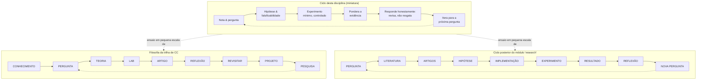

## Objetivos de Aprendizagem

- Montar todo conceito ensinado nesta disciplina em um único ciclo explícito de ponta a ponta, de notar algo intrigante até comunicar um resultado.
- Mapear o ciclo desta disciplina na própria filosofia geral da trilha de Ciência da Computação: CONHECIMENTO → PERGUNTA → TEORIA → LAB → ARTIGO → REFLEXÃO → REVISITAR → PROJETO → PESQUISA → (nova PERGUNTA).
- Mapear o ciclo desta disciplina no ciclo planejado do módulo `research` posterior: PERGUNTA → LITERATURA → ARTIGOS → HIPÓTESE → IMPLEMENTAÇÃO → EXPERIMENTO → RESULTADO → REFLEXÃO → NOVA PERGUNTA.
- Explicar por que esta disciplina é explicitamente um ensaio fundacional em miniatura de ambos os ciclos maiores já documentados, não um terceiro ciclo não relacionado inventado por si só.
- Rastrear uma investigação realista única através do ciclo completo de ponta a ponta, nomeando qual conceito desta disciplina governa cada estágio.

## Contexto e Motivação

Todo conceito nesta disciplina foi, até agora, examinado principalmente por si só: como transformar curiosidade em uma pergunta, como construir uma hipótese falsificável, como projetar um experimento mínimo com controles reais, como ponderar evidência honestamente, o que fazer quando uma hipótese falha, como um único resultado remodela a próxima pergunta, por que quase nenhuma pergunta é feita pela primeira vez, e como comunicar um resultado para que seja de fato utilizável por outra pessoa. Este conceito final não introduz novo maquinário filosófico. Seu trabalho é juntar tudo isso de volta no único laço do qual sempre fez parte, e, este é o ponto específico e real que vale a pena levar a sério em vez de tratar como um clichê de encerramento, mostrar que esse laço não é uma observação genérica de "ciência é um ciclo" inventada para esta disciplina. É um ensaio em pequena escala, deliberadamente simplificado, de dois ciclos que já existem, pelo nome, em outro lugar neste exato currículo.

O primeiro desses é a filosofia fundadora de toda a trilha de Ciência da Computação (CC) à qual esta disciplina pertence. Aquela trilha é organizada não como uma sequência de semestres mas como um grafo de conhecimento de módulos, e sua própria filosofia declarada é escrita como um laço:

```
CONHECIMENTO → PERGUNTA → TEORIA → LAB → ARTIGO → REFLEXÃO → REVISITAR → PROJETO → PESQUISA → (nova PERGUNTA)
```

Isso não é uma metáfora emprestada para o benefício desta disciplina, é o formato real e documentado em torno do qual toda a trilha de CC é construída, descrevendo como um estudante deve se mover pelo currículo em geral: absorver conhecimento existente, formar uma pergunta que ele levanta, trabalhar através da teoria relevante, testar entendimento em um laboratório, comunicar descobertas como um artigo, refletir sobre o que foi aprendido, revisitar material anterior à luz dessa reflexão, estendê-lo em um projeto, empurrar mais para pesquisa, e chegar a uma nova pergunta que inicia o laço novamente.

O segundo é mais específico e mais adiante no currículo: um módulo dedicado, simplesmente nomeado `research`, ainda não escrito no momento deste conceito mas já planejado com seu próprio ciclo explícito:

```
PERGUNTA → LITERATURA → ARTIGOS → HIPÓTESE → IMPLEMENTAÇÃO → EXPERIMENTO → RESULTADO → REFLEXÃO → NOVA PERGUNTA
```

Esse módulo não tem uma tese de conclusão tradicional; em vez disso, um estudante escolhe uma pergunta de pesquisa real e a percorre através dessa sequência exata, de verdade, extensamente, potencialmente produzindo software, uma reprodução de artigo, um experimento, um estudo teórico, ou uma nova ferramenta, sem nenhum tipo único prescrito de saída, porque o módulo é explicitamente formulado como o ponto de entrada para aprendizado contínuo e aberto que não termina na formatura.

Esta disciplina, `questions-scientific-thinking`, é o lugar onde ambos esses ciclos são ensinados pela primeira vez, em miniatura, em uma escala pequena o suficiente para praticar com segurança antes de os riscos subirem. Todo conceito coberto aqui é uma versão reduzida de um estágio em um ou ambos os ciclos maiores, e o trabalho deste conceito final é tornar esse mapeamento completamente explícito, para que a transição, muito mais adiante no currículo, para o módulo `research` em escala completa pareça fazer a mesma coisa novamente em maior profundidade, não como encontrar algo não familiar.

## Teoria Central

### O ciclo que esta disciplina de fato ensinou, estágio por estágio

Lidos de ponta a ponta, os conceitos nesta disciplina traçam sua própria versão do mesmo laço:

1. **Notando e perguntando** ("Da Curiosidade a uma Pergunta," "O Que Torna uma Pergunta Bem Formada," "Perguntas Computacionais vs. Perguntas em Geral," "Escolhendo Problemas que Valem a Pena") — transformar uma observação vaga em uma pergunta precisa, valiosa, e respondível.
2. **Hipótese e falsificabilidade** ("Transformando uma Pergunta em uma Hipótese Testável," "Falsificabilidade: O Que Torna uma Afirmação Científica," "Distinguindo uma Afirmação de uma Suposição") — converter a pergunta em um palpite específico, verificável, e genuinamente falsificável.
3. **Design de experimento** ("Projetando um Experimento Mínimo," "Controles e Isolando Variáveis") — construir o menor teste que de fato pudesse distinguir a hipótese de sua alternativa.
4. **Evidência e raciocínio** ("Correlação vs. Causação," "Variáveis de Confusão," "Coletando e Ponderando Evidência") — rodar o teste e interpretar honestamente o que voltou, incluindo as formas pelas quais um resultado pode enganar.
5. **Respondendo ao resultado** ("Quando a Evidência Contradiz a Hipótese," "Ciência Normal e Mudanças de Paradigma") — revisar em vez de resgatar uma hipótese falsificada, e reconhecer que a mesma honestidade escala para o framework compartilhado de um campo inteiro.
6. **Fechando o laço** ("Iterando: Do Resultado para uma Nova Pergunta," "Lendo e Construindo sobre Trabalho Anterior," "Comunicando uma Pergunta e sua Resposta," e este conceito) — usar o resultado para gerar a próxima pergunta, verificar essa pergunta contra o que já é conhecido, e comunicar a resposta claramente o suficiente para que outra pessoa construa sobre ela.

### Mapeando na própria trilha de CONHECIMENTO → PESQUISA da trilha de CC

| Estágio desta disciplina | Estágio da trilha de CC |
|---|---|
| Absorver conhecimento de fundo antes de notar algo intrigante | CONHECIMENTO |
| Refinar curiosidade em uma pergunta bem formada, valiosa, e computacional | PERGUNTA |
| Construir uma hipótese falsificável e distingui-la de suas suposições | TEORIA |
| Projetar e rodar um experimento mínimo e controlado | LAB |
| Comunicar a pergunta e sua resposta claramente o suficiente para verificar | ARTIGO |
| Responder honestamente a um resultado confirmador ou falsificador | REFLEXÃO |
| Verificar o resultado e a pergunta contra trabalho anterior já coberto | REVISITAR |
| Estender uma hipótese confirmada ou revisada em trabalho posterior maior | PROJETO |
| Iterar do resultado para uma pergunta nova, mais afiada ou redirecionada | PESQUISA → (nova PERGUNTA) |

Essa não é uma correspondência forçada ou aproximada, o laço da trilha de CC é uma versão mais ampla e em escala de currículo inteiro exatamente do ciclo desta disciplina, na escala de uma trilha de aprendizado inteira em vez de uma única pequena investigação. Reflexão e revisitar, nos próprios termos da trilha, são precisamente os hábitos de resposta honesta e verificação de trabalho anterior que esta disciplina construiu em detalhe.

### Mapeando no laço PERGUNTA → NOVA PERGUNTA do módulo `research`

| Estágio desta disciplina | Estágio do módulo `research` |
|---|---|
| Formar uma pergunta bem formada e valiosa | PERGUNTA |
| Ler e construir sobre trabalho anterior | LITERATURA / ARTIGOS |
| Transformar a pergunta em uma hipótese testável e falsificável | HIPÓTESE |
| Projetar um experimento mínimo e controlado | IMPLEMENTAÇÃO |
| Rodar o experimento | EXPERIMENTO |
| Coletar e ponderar a evidência produzida | RESULTADO |
| Responder honestamente, revisão, não resgate, ao que a evidência mostra | REFLEXÃO |
| Iterar desse resultado para a próxima pergunta | NOVA PERGUNTA |

Essa correspondência é ainda mais próxima, porque o ciclo do módulo `research` foi escrito especificamente para descrever a prática profissional de pesquisa, e os conceitos desta disciplina foram construídos para ensinar exatamente essa prática em uma escala apropriada para uma primeira passagem. O estágio `LITERATURA`/`ARTIGOS`, em particular, é a continuação direta e em escala maior do conceito "Lendo e Construindo sobre Trabalho Anterior" ensinado aqui, a mesma verificação, feita apropriadamente e extensamente, contra o registro de pesquisa real em vez de uma verificação de sanidade rápida contra um resultado próximo e bem conhecido.



### Por que "miniatura" é a palavra certa, não "não relacionado" ou "idêntico"

O ciclo desta disciplina não é idêntico a nenhum dos ciclos maiores, ele deliberadamente comprime estágios, usa exemplos menores e mais contidos, e não exige o esforço sustentado, independente, e frequentemente de meses que o módulo `research` eventualmente vai pedir. Mas também não é uma lição de "método científico" genérica e não relacionada que coincidentemente se assemelha a esses ciclos. Todo estágio que esta disciplina ensinou corresponde a um estágio real e nomeado em pelo menos um dos dois ciclos maiores, e vários, formação de hipótese, experimentação controlada, resposta honesta a resultados, iteração, verificação de literatura, comunicação, correspondem a estágios em ambos ao mesmo tempo. O propósito de aprendê-lo aqui, primeiro, em pequena escala, é exatamente o que "Lendo e Construindo sobre Trabalho Anterior" argumentou em geral: entender o que já foi estabelecido (nesse caso, por experiência direta anterior nesta disciplina) é o que transforma a versão maior e posterior da mesma tarefa de um salto não familiar em uma escalada deliberada de hábitos já praticados.

## Exemplos Resolvidos

### Exemplo 1 — uma passagem completa pelo ciclo em miniatura, mapeada em ambos os ciclos maiores

**Nota & pergunta:** Um estudante observa que uma rotina de ordenação específica em seu próprio código parece mais lenta que o esperado em certas entradas, refinada, pelo "Da Curiosidade a uma Pergunta" e "O Que Torna uma Pergunta Bem Formada," em: "O tempo de execução dessa ordenação depende de quão quase ordenada a entrada já está?"

**Lendo trabalho anterior:** Uma verificação rápida (pelo "Lendo e Construindo sobre Trabalho Anterior") confirma que essa é uma propriedade bem conhecida de alguns algoritmos de ordenação (por exemplo, ordenação por inserção se sai bem em entrada quase ordenada) mas não outros, situando a pergunta contra o que já é estabelecido, e afiando-a para: "*Essa implementação específica* mostra esse comportamento adaptativo, ou não?"

**Hipótese:** "O tempo de execução dessa implementação escala aproximadamente linearmente, não quadraticamente, conforme o grau de desordem da entrada diminui", falsificável pelo "Falsificabilidade: O Que Torna uma Afirmação Científica," já que uma contraobservação clara (tempo de execução permanecendo quadrático independentemente da desordem) a refutaria.

**Experimento mínimo e controlado:** Pelo "Projetando um Experimento Mínimo" e "Controles e Isolando Variáveis," entradas de tamanho fixo mas graus de desordem variados e precisamente medidos são rodadas através da implementação, mantendo tamanho de array, tipo de dado, e carga de máquina constantes, variando apenas desordem.

**Ponderando a evidência:** Pelo "Coletando e Ponderando Evidência" e "Correlação vs. Causação," os tempos de execução medidos são verificados por uma relação genuína, não meramente coincidente, com desordem, descartando confusões como efeitos de cache ligados ao tamanho do array em vez da desordem.

**Respondendo ao resultado:** Suponha que o resultado parcialmente confirme a hipótese mas revele um efeito de limiar que a hipótese não antecipou, pelo "Quando a Evidência Contradiz a Hipótese," isso é honestamente incorporado em uma hipótese revisada e mais afiada sobre o limiar, não explicado.

**Iterando e comunicando:** Pelo "Iterando: Do Resultado para uma Nova Pergunta" e "Comunicando uma Pergunta e sua Resposta," a hipótese revisada sobre o limiar se torna a próxima pergunta, e toda a passagem, pergunta, hipótese, método, resultado, revisão, é escrita precisamente o suficiente para que outra pessoa a rerode.

**Mapeada no laço da trilha de CC:** conhecimento de fundo sobre ordenação (CONHECIMENTO) → a pergunta de desordem (PERGUNTA) → a hipótese falsificável (TEORIA) → a medição controlada (LAB) → a descoberta escrita (ARTIGO) → o tratamento honesto da confirmação parcial (REFLEXÃO) → a verificação contra teoria algorítmica conhecida (REVISITAR) → estender a investigação para outros algoritmos (PROJETO) → a pergunta de limiar como semente de trabalho posterior (PESQUISA → nova PERGUNTA).

**Mapeada no laço do módulo `research`:** a pergunta de desordem (PERGUNTA) → a verificação contra literatura de ordenação adaptativa conhecida (LITERATURA/ARTIGOS) → a hipótese falsificável de tempo de execução (HIPÓTESE) → construir o arcabouço de medição (IMPLEMENTAÇÃO) → rodá-lo (EXPERIMENTO) → os tempos de execução medidos (RESULTADO) → a revisão honesta em torno do limiar (REFLEXÃO) → a pergunta de limiar afiada (NOVA PERGUNTA).

### Exemplo 2 — onde o mesmo resultado se situaria se envolvesse um campo inteiro, não um estudante

**Cenário:** Suponha, hipoteticamente, que o efeito de limiar descoberto no Exemplo 1 acabasse sendo muito mais geral, presente através de muitas implementações e muitas linguagens, resistente a explicação por qualquer modelo existente de como esses algoritmos se comportam, e cada vez mais discutido como uma anomalia real e não resolvida através da ciência normal do campo.

**Conectando a "Ciência Normal e Mudanças de Paradigma":** Esta é precisamente a distinção de escala que aquele conceito introduziu, a hipótese única revisada do Exemplo 1 é iteração padrão e saudável dentro de um framework aceito (ciência normal de Kuhn, funcionando exatamente como pretendido). Uma anomalia genuinamente ampla do campo, sustentada e não resolvida do tipo acabado de hipotetizar seria em vez disso um contribuinte candidato ao evento mais raro e maior escala que aquele conceito descreveu: uma crise potencialmente séria o suficiente para eventualmente motivar revisar as próprias suposições compartilhadas do campo, não apenas o tempo de execução esperado de um algoritmo. Reconhecer em qual escala um dado resultado se situa, iteração normal de um investigador, ou anomalia de nível de campo, é em si parte do que esta disciplina construiu, e é exatamente o julgamento que um estudante vai precisar novamente, com riscos muito mais altos, dentro dos próprios estágios LITERATURA e REFLEXÃO do módulo `research`.

## Equívocos Comuns e Armadilhas

- **"O ciclo desta disciplina é apenas uma versão simplificada de 'o método científico' em geral, desconectada de qualquer coisa específica neste currículo."** É específica e deliberadamente um ensaio de dois ciclos nomeados e documentados já estabelecidos em outro lugar neste exato currículo, o próprio laço de CONHECIMENTO-a-PESQUISA da trilha de CC e o laço de PERGUNTA-a-NOVA-PERGUNTA do módulo `research` posterior, não uma reformulação genérica e flutuante de método científico.
- **"Já que o módulo `research` ainda não existe, essa conexão é especulativa ou aspiracional."** O ciclo do módulo já está documentado na própria estrutura fundadora do currículo, com seus estágios nomeados exatamente como mostrado aqui; esta disciplina é construída para se alinhar com esse plano existente, não para adivinhar um futuro.
- **"Completar esta disciplina significa que o estudante já fez o que o módulo `research` vai pedir."** Esta disciplina ensina os mesmos estágios em uma escala deliberadamente pequena e contida, usando exemplos breves e majoritariamente autocontidos. O módulo `research` pede o mesmo ciclo rodado de verdade, extensamente, em uma pergunta aberta genuína, tipicamente sem uma resposta conhecida já disponível para verificar contra, um empreendimento substancialmente de maior risco para o qual esta disciplina prepara mas não substitui.
- **"O ciclo termina uma vez que você alcança um resultado bem comunicado."** Ambos os ciclos documentados nos quais esta disciplina mapeia explicitamente voltam em laço para uma nova pergunta (PESQUISA → nova PERGUNTA; NOVA PERGUNTA como um estágio terminal explícito que se torna a próxima PERGUNTA), um resultado bem comunicado é um marco dentro do laço, não seu ponto de saída.
- **"Todo estágio desta disciplina mapeia para exatamente um estágio em exatamente um dos dois ciclos maiores."** Vários estágios, design de experimento, resposta honesta a evidência, iteração, comunicação, mapeiam em estágios em ambos os ciclos maiores simultaneamente, que é precisamente por que esta disciplina foi projetada como o ensaio fundacional compartilhado para ambos em vez de ser dividida em duas trilhas preparatórias separadas.

## Resumo

O próprio ciclo desta disciplina, notar, perguntar, hipotetizar, testar, ponderar evidência, responder honestamente, iterar, verificar trabalho anterior, comunicar, não é uma estrutura autônoma inventada. É um ensaio explícito em pequena escala de dois ciclos reais já documentados em outro lugar neste currículo: a própria filosofia fundadora da trilha de Ciência da Computação, CONHECIMENTO → PERGUNTA → TEORIA → LAB → ARTIGO → REFLEXÃO → REVISITAR → PROJETO → PESQUISA → (nova PERGUNTA), e o ciclo planejado do módulo dedicado `research` posterior, PERGUNTA → LITERATURA → ARTIGOS → HIPÓTESE → IMPLEMENTAÇÃO → EXPERIMENTO → RESULTADO → REFLEXÃO → NOVA PERGUNTA. Todo conceito ensinado ao longo desta disciplina corresponde a um estágio real em um ou ambos desses laços maiores, e o exemplo resolvido acima traçou uma passagem completa através dos três simultaneamente, junto com um segundo exemplo mostrando quando a escala de um resultado muda a resposta apropriada de iteração comum para algo mais próximo do relato de Kuhn de uma crise ampla do campo. O que esta disciplina ensinou, de ponta a ponta, não é uma habilidade acabada e autocontida mas a primeira passagem fundacional de um ciclo que este currículo vai pedir a seus estudantes para rodar novamente, de verdade, com muito mais extensão e com riscos muito mais altos, mais adiante.

## Documentation Links

- [Hamming, "You and Your Research" (1986 transcript)](https://www.cs.virginia.edu/~robins/YouAndYourResearch.pdf) — doc
- [Peyton Jones, "How to Write a Great Research Paper"](https://www.microsoft.com/en-us/research/academic-program/write-great-research-paper/) — doc
