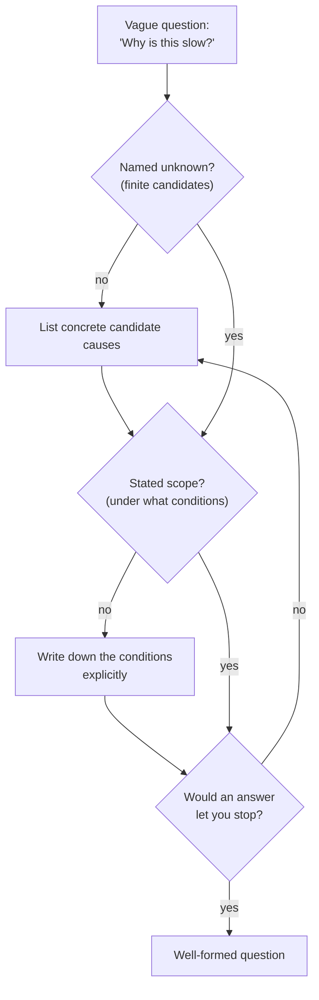

## Learning Objectives

- Define what it means for a question to be "well-formed" in terms of what would count as an answer.
- Contrast a vague question against a well-formed version of the same underlying curiosity, identifying exactly what changed.
- Apply a checklist of concrete properties (named unknowns, a stated scope, a distinguishable answer) to test whether a question is well-formed.
- Diagnose why a vague question resists being answered even when plenty of effort is spent on it.
- Rewrite a vague question into a well-formed one for a computational scenario.

## Context & Motivation

The previous concept established that noticing something puzzling is not the same as having a question. This one goes a step further: not every question is equally usable, even once you've cleared that first bar. Some questions, despite sounding perfectly reasonable out loud, cannot actually be answered as stated — not because the answer is hard to find, but because the question never specified what an answer would even look like. "Why is this slow?" is a real question, in the sense that it is grammatically a question and points at a genuine phenomenon, but it does not say what would satisfy it. Slow compared to what? Slow under which conditions? An answer naming one plausible cause could always be met with "sure, but is that really the reason?" — and the question itself gives you no way to settle that, because it never named a criterion for being settled.

This is the property Hamming was circling when he insisted, throughout "You and Your Research," that people learn to state their problems clearly enough to know what they're actually trying to establish — his repeated advice to "know what problem you want to solve" was not a platitude about focus, it was a claim about precision: a problem you cannot state precisely is a problem you cannot know you've solved. Simon Peyton Jones makes essentially the same point from the opposite end of the research process, in "How to Write a Great Research Paper": he argues that a paper should be organized around stating, as early and as sharply as possible, exactly what question it answers, because a reader (and, just as often, the author) cannot evaluate whether the paper succeeds without that statement fixed in advance. Both are describing the same underlying requirement from different sides of the timeline — Hamming from before the work starts, Peyton Jones from after it's done and needs to be communicated — and the requirement is the same: a question is only useful once it names, concretely, what would count as answering it.

In computational work this shows up constantly, because computational systems produce huge amounts of ambiguous-feeling puzzlement ("it's slow," "it's flaky," "it doesn't scale") that all sound like starting points for investigation but, left as stated, cannot be resolved by any amount of staring at the system. Turning "why is this slow?" into "which of these three operations dominates the running time under load X?" doesn't just make the question sound more technical — it changes it from something no measurement could settle into something a single profiling run could.

## Core Theory

### The defining property: naming what counts as an answer

A question is **well-formed** when answering it is, in principle, a matter of going and checking something — when you can describe, before doing any investigating, the shape of a response that would satisfy the question. This does not require already knowing the answer; it requires knowing what an answer would look like if you had it. "Which of these three operations dominates the running time under load X?" is well-formed because an answer to it is obviously one of exactly three things (operation A, B, or C), determinable by measurement, and once you have that measurement you know you're done. "Why is this slow?" is not well-formed, because no amount of investigation tells you when to stop — any finding can always be met with "yes, but why is *that*?", because the question never bounded what would count as a sufficient stopping point.

### Three concrete properties of a well-formed question

Comparing well-formed and vague versions of the same curiosity reveals that the difference is not one property but usually three, all of which the vague version is missing:

1. **A named unknown.** The well-formed version specifies exactly what is not known — "which of these three operations" names a specific unknown (a choice among three named options). The vague version's unknown ("why") is open-ended in a way that admits infinitely many candidate answers, none of them ruled in or out by the question itself.
2. **A stated scope.** "Under load X" fixes the conditions the question applies to. Without this, an answer that's true under one condition (say, low traffic) can be presented as though it answers the question generally, when it doesn't — the vague question has no scope to hold anyone (including yourself) to.
3. **A distinguishable set of candidate answers.** The well-formed version is built so that finding out the answer actually distinguishes between real alternatives — operation A, B, or C are mutually exclusive, checkable possibilities. A vague question like "why is this slow?" has no such structure; there's no finite list of candidates it's choosing among, so no single measurement can ever be said to have resolved it.

All three properties point at the same underlying idea from different angles: the question has to be shaped so that some concrete, finite piece of investigation could, in principle, settle it. If you cannot describe that piece of investigation in advance, the question is missing at least one of the three properties above.

### The rewriting move, made explicit

Going from a vague question to a well-formed one is usually a matter of applying pressure at each of the three properties in turn:

- Take the vague unknown ("why is it slow") and force it into a **short, named list of candidates** — this usually requires some domain knowledge (three plausible operations, not an open-ended "any possible cause").
- Take the implicit, unstated scope and **write it down explicitly** — under what load, on what data, on what hardware. If you're not sure yet, "under the load I can currently reproduce in staging" is a legitimate, honest scope; an unstated scope is not more rigorous, it is just hidden.
- Check that the resulting question, once answered, would actually let you stop — if you can imagine a satisfying answer still being met with "but why," the named-unknown list probably still has a hidden vague option in it (often something like "it's probably a combination of several things," which is not a candidate that can be checked against the others).

## Worked Examples

### Example 1 — from "why is this slow?" to a well-formed question

**Vague question:** "Why is this API endpoint slow?"

**Diagnosing what's missing:** No named unknown (the space of possible causes is unbounded — network, database, serialization, downstream service, garbage collection...); no stated scope (slow compared to what baseline, under what traffic); no way to know when an answer is complete.

**Applying pressure:** A quick look at available tooling shows a request tracer that can break total latency into time spent in three stages: database query time, serialization time, and network transit time. This gives a natural, finite candidate list. Checking recent incident reports shows the complaint specifically concerns behavior "under peak evening traffic," which becomes the scope.

**Well-formed rewrite:** "Under peak evening traffic, which of the three latency stages — database query, serialization, network transit — accounts for the largest share of total request time?"

**What changed, concretely:** the named unknown went from "any possible cause" to "one of three measurable stages"; the scope went from unstated to "peak evening traffic" explicitly; and the answer is now something a single trace, aggregated over a representative sample of peak-hour requests, can actually supply — three numbers that must sum to (approximately) the total, with a clear largest one.

### Example 2 — a question that looks well-formed but isn't

**Candidate question:** "Is our new caching layer better than the old one?"

**First glance:** this sounds specific — it names two things being compared. But applying the three-property check exposes the gap: "better" is not a named unknown with distinguishable candidates, because "better" could mean lower latency, lower memory use, fewer cache misses, or some combination, and the question doesn't say which. There's also no scope: better under what workload?

**Rewriting:** the fix is not to answer "better" more thoroughly, but to force it to name a specific measurable dimension and a specific workload: "Under the current production read/write ratio, does the new caching layer reduce median read latency compared to the old one?" This is now well-formed — one measurable quantity (median read latency), one comparison (new vs. old), one stated scope (current production read/write ratio), and a clear stopping condition (you have an answer once you've measured both).

**A residual trap worth naming:** even this rewrite silently picked "median read latency" as the dimension that matters, discarding memory use and cache-miss rate. That is a legitimate scoping decision, not a flaw — but it should be made consciously and stated, not left implicit, because someone could otherwise mistake this narrow question's answer for a verdict on whether the new layer is "better" overall.

## Common Misconceptions & Pitfalls

- **Believing specificity of wording is the same as being well-formed.** "Why exactly is this incredibly, unbelievably slow?" adds emphasis and detail without adding a named unknown, a scope, or distinguishable candidates — it is exactly as unanswerable as "why is this slow?", just longer.
- **Mistaking a well-formed question for one that already assumes the answer.** "Is the database causing the slowdown?" looks well-formed (yes/no, checkable) but often smuggles in an unexamined assumption that the database is even a live candidate; a genuinely well-formed version usually needs at least one plausible alternative explicitly named alongside it, so a "no" answer still leaves you somewhere useful to go next.
- **Treating scope as optional when you're "just exploring."** Skipping the scope statement because the investigation feels informal or early-stage means any answer found can later be misapplied outside the conditions it was actually true under — the well-formed question's scope is what prevents that misapplication, at any stage of formality.
- **Assuming a well-formed question must have exactly two candidate answers.** Well-formed does not mean binary; "which of these three operations dominates" has three candidates and is well-formed. The requirement is a finite, checkable set of candidates, not a specific count.
- **Confusing a well-formed question with an easy one.** Well-formedness is about knowing what an answer looks like, not about how hard the investigation will be. "Under load X, which of these three operations dominates the running time?" can still require substantial profiling work to answer — it is well-formed and difficult at the same time.

## Summary

A question is well-formed when it names what would count as an answer: a specific unknown with a finite, checkable set of candidates; an explicit scope bounding the conditions it applies to; and a structure such that some concrete piece of investigation could, in principle, settle it. "Why is this slow?" fails on all three counts — it names no candidates, states no scope, and gives no stopping condition. "Which of these three operations dominates the running time under load X?" satisfies all three, which is the entire difference between them, not any change in topic. Hamming's insistence on stating a problem precisely, and Peyton Jones's insistence on stating a paper's question precisely before anything else, are the same requirement viewed from opposite ends of a research effort: you cannot know you have solved, or finished writing up, what you never specified in checkable terms to begin with.

## Documentation Links

- [Hamming, "You and Your Research" (1986 transcript)](https://www.cs.virginia.edu/~robins/YouAndYourResearch.pdf) — doc
- [Peyton Jones, "How to Write a Great Research Paper"](https://www.microsoft.com/en-us/research/academic-program/write-great-research-paper/) — doc
