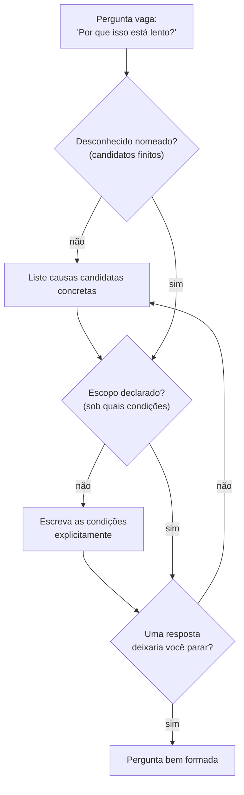

## Objetivos de Aprendizagem

- Definir o que significa uma pergunta ser "bem formada" em termos do que contaria como uma resposta.
- Contrastar uma pergunta vaga com uma versão bem formada da mesma curiosidade subjacente, identificando exatamente o que mudou.
- Aplicar uma checklist de propriedades concretas (desconhecidos nomeados, um escopo declarado, uma resposta distinguível) para testar se uma pergunta é bem formada.
- Diagnosticar por que uma pergunta vaga resiste a ser respondida mesmo quando bastante esforço é gasto nela.
- Reescrever uma pergunta vaga em uma bem formada para um cenário computacional.

## Contexto e Motivação

O conceito anterior estabeleceu que notar algo intrigante não é o mesmo que ter uma pergunta. Este vai um passo além: nem toda pergunta é igualmente utilizável, mesmo depois de você ter superado aquela primeira barra. Algumas perguntas, apesar de soarem perfeitamente razoáveis em voz alta, não podem de fato ser respondidas como enunciadas, não porque a resposta é difícil de encontrar, mas porque a pergunta nunca especificou como uma resposta sequer se pareceria. "Por que isso está lento?" é uma pergunta real, no sentido de que é gramaticalmente uma pergunta e aponta para um fenômeno genuíno, mas não diz o que a satisfaria. Lento comparado a quê? Lento sob quais condições? Uma resposta nomeando uma causa plausível sempre poderia ser recebida com "certo, mas isso é realmente a razão?", e a própria pergunta não dá a você nenhuma forma de resolver isso, porque nunca nomeou um critério para ser resolvida.

Esta é a propriedade que Hamming estava rondando quando insistiu, ao longo de "You and Your Research," que as pessoas aprendam a enunciar seus problemas com clareza suficiente para saber o que estão de fato tentando estabelecer, seu conselho repetido de "saiba qual problema você quer resolver" não era um lugar-comum sobre foco, era uma afirmação sobre precisão: um problema que você não consegue enunciar precisamente é um problema que você não pode saber que resolveu. Simon Peyton Jones faz essencialmente o mesmo ponto do extremo oposto do processo de pesquisa, em "How to Write a Great Research Paper": ele argumenta que um artigo deveria ser organizado em torno de enunciar, o mais cedo e o mais nitidamente possível, exatamente qual pergunta ele responde, porque um leitor (e, quase tão frequentemente, o autor) não consegue avaliar se o artigo tem sucesso sem essa afirmação fixada de antemão. Ambos estão descrevendo a mesma exigência subjacente de lados diferentes da linha do tempo, Hamming de antes de o trabalho começar, Peyton Jones de depois de ele estar feito e precisar ser comunicado, e a exigência é a mesma: uma pergunta só é útil uma vez que nomeia, concretamente, o que contaria como respondê-la.

Em trabalho computacional isso aparece constantemente, porque sistemas computacionais produzem enormes quantidades de intrigação de sensação ambígua ("está lento," "está intermitente," "não escala") que todas soam como pontos de partida para investigação mas, deixadas como enunciadas, não podem ser resolvidas por nenhuma quantidade de olhar fixamente para o sistema. Transformar "por que isso está lento?" em "qual dessas três operações domina o tempo de execução sob carga X?" não apenas faz a pergunta soar mais técnica, ela a muda de algo que nenhuma medição poderia resolver para algo que uma única execução de profiling poderia.

## Teoria Central

### A propriedade definidora: nomear o que conta como resposta

Uma pergunta é **bem formada** quando respondê-la é, em princípio, uma questão de ir e verificar algo, quando você consegue descrever, antes de fazer qualquer investigação, o formato de uma resposta que satisfaria a pergunta. Isso não exige já saber a resposta; exige saber como uma resposta se pareceria se você a tivesse. "Qual dessas três operações domina o tempo de execução sob carga X?" é bem formada porque uma resposta a ela é obviamente uma de exatamente três coisas (operação A, B, ou C), determinável por medição, e uma vez que você tem essa medição você sabe que terminou. "Por que isso está lento?" não é bem formada, porque nenhuma quantidade de investigação diz quando parar, qualquer descoberta sempre pode ser recebida com "sim, mas por que *isso*?", porque a pergunta nunca limitou o que contaria como um ponto de parada suficiente.

### Três propriedades concretas de uma pergunta bem formada

Comparar versões bem formadas e vagas da mesma curiosidade revela que a diferença não é uma propriedade mas geralmente três, todas as quais a versão vaga está faltando:

1. **Um desconhecido nomeado.** A versão bem formada especifica exatamente o que não é conhecido, "qual dessas três operações" nomeia um desconhecido específico (uma escolha entre três opções nomeadas). O desconhecido da versão vaga ("por que") é aberto de uma forma que admite infinitas respostas candidatas, nenhuma delas incluída ou excluída pela própria pergunta.
2. **Um escopo declarado.** "Sob carga X" fixa as condições às quais a pergunta se aplica. Sem isso, uma resposta que é verdadeira sob uma condição (digamos, tráfego baixo) pode ser apresentada como se respondesse à pergunta em geral, quando não responde, a pergunta vaga não tem escopo para responsabilizar ninguém (incluindo você mesmo).
3. **Um conjunto distinguível de respostas candidatas.** A versão bem formada é construída de modo que descobrir a resposta de fato distingue entre alternativas reais, operação A, B, ou C são possibilidades mutuamente exclusivas e verificáveis. Uma pergunta vaga como "por que isso está lento?" não tem tal estrutura; não há uma lista finita de candidatos entre os quais ela está escolhendo, então nenhuma única medição jamais pode ser dita como tendo a resolvido.

Todas as três propriedades apontam para a mesma ideia subjacente de ângulos diferentes: a pergunta tem que ser moldada de modo que algum pedaço concreto e finito de investigação pudesse, em princípio, resolvê-la. Se você não consegue descrever esse pedaço de investigação de antemão, a pergunta está faltando pelo menos uma das três propriedades acima.

### O movimento de reescrita, tornado explícito

Ir de uma pergunta vaga para uma bem formada geralmente é uma questão de aplicar pressão em cada uma das três propriedades por vez:

- Pegue o desconhecido vago ("por que está lento") e force-o em uma **lista curta e nomeada de candidatos**, isso geralmente exige algum conhecimento de domínio (três operações plausíveis, não uma "qualquer causa possível" aberta).
- Pegue o escopo implícito e não declarado e **escreva-o explicitamente**, sob qual carga, em quais dados, em qual hardware. Se você ainda não tem certeza, "sob a carga que consigo atualmente reproduzir em staging" é um escopo legítimo e honesto; um escopo não declarado não é mais rigoroso, é apenas escondido.
- Verifique se a pergunta resultante, uma vez respondida, de fato deixaria você parar, se você consegue imaginar uma resposta satisfatória ainda sendo recebida com "mas por quê," a lista de desconhecido nomeado provavelmente ainda tem uma opção vaga escondida nela (frequentemente algo como "provavelmente é uma combinação de várias coisas," que não é um candidato que pode ser verificado contra os outros).

## Exemplos Resolvidos

### Exemplo 1 — de "por que isso está lento?" a uma pergunta bem formada

**Pergunta vaga:** "Por que esse endpoint de API está lento?"

**Diagnosticando o que falta:** Nenhum desconhecido nomeado (o espaço de causas possíveis é ilimitado, rede, banco de dados, serialização, serviço a jusante, coleta de lixo...); nenhum escopo declarado (lento comparado a qual referência, sob qual tráfego); nenhuma forma de saber quando uma resposta está completa.

**Aplicando pressão:** Uma olhada rápida nas ferramentas disponíveis mostra um rastreador de requisições que pode decompor a latência total em tempo gasto em três estágios: tempo de consulta ao banco de dados, tempo de serialização, e tempo de trânsito na rede. Isso dá uma lista de candidatos natural e finita. Verificar relatórios de incidentes recentes mostra que a reclamação especificamente diz respeito ao comportamento "sob pico de tráfego noturno," que se torna o escopo.

**Reescrita bem formada:** "Sob pico de tráfego noturno, qual dos três estágios de latência, consulta ao banco de dados, serialização, trânsito de rede, é responsável pela maior parcela do tempo total de requisição?"

**O que mudou, concretamente:** o desconhecido nomeado foi de "qualquer causa possível" para "um de três estágios mensuráveis"; o escopo foi de não declarado para "pico de tráfego noturno" explicitamente; e a resposta agora é algo que um único rastro, agregado sobre uma amostra representativa de requisições de horário de pico, pode de fato fornecer, três números que devem somar (aproximadamente) o total, com um claramente maior.

### Exemplo 2 — uma pergunta que parece bem formada mas não é

**Pergunta candidata:** "Nossa nova camada de cache é melhor que a antiga?"

**Primeira olhada:** isso soa específico, nomeia duas coisas sendo comparadas. Mas aplicar a verificação de três propriedades expõe a lacuna: "melhor" não é um desconhecido nomeado com candidatos distinguíveis, porque "melhor" poderia significar menor latência, menor uso de memória, menos cache misses, ou alguma combinação, e a pergunta não diz qual. Também não há escopo: melhor sob qual carga de trabalho?

**Reescrevendo:** o conserto não é responder "melhor" mais completamente, mas forçá-lo a nomear uma dimensão mensurável específica e uma carga de trabalho específica: "Sob a razão atual de leitura/escrita em produção, a nova camada de cache reduz a latência mediana de leitura comparada à antiga?" Isso agora é bem formado, uma quantidade mensurável (latência mediana de leitura), uma comparação (nova vs. antiga), um escopo declarado (razão atual de leitura/escrita em produção), e uma condição de parada clara (você tem uma resposta uma vez que mediu ambas).

**Uma armadilha residual que vale a pena nomear:** mesmo esta reescrita silenciosamente escolheu "latência mediana de leitura" como a dimensão que importa, descartando uso de memória e taxa de cache miss. Isso é uma decisão de escopo legítima, não uma falha, mas deveria ser feita conscientemente e declarada, não deixada implícita, porque alguém poderia de outra forma confundir a resposta desta pergunta estreita com um veredito sobre se a nova camada é "melhor" no geral.

## Equívocos Comuns e Armadilhas

- **Acreditar que especificidade de formulação é o mesmo que ser bem formada.** "Por que exatamente isso está tão incrivelmente, inacreditavelmente lento?" adiciona ênfase e detalhe sem adicionar um desconhecido nomeado, um escopo, ou candidatos distinguíveis, é exatamente tão irrespondível quanto "por que isso está lento?", apenas mais longa.
- **Confundir uma pergunta bem formada com uma que já assume a resposta.** "O banco de dados está causando a lentidão?" parece bem formada (sim/não, verificável) mas frequentemente contrabandeia uma suposição não examinada de que o banco de dados sequer é um candidato ativo; uma versão genuinamente bem formada geralmente precisa de pelo menos uma explicação alternativa plausível nomeada explicitamente ao lado dela, para que uma resposta "não" ainda deixe você em algum lugar útil para ir a seguir.
- **Tratar escopo como opcional quando você está "apenas explorando."** Pular a declaração de escopo porque a investigação parece informal ou em estágio inicial significa que qualquer resposta encontrada mais tarde pode ser mal aplicada fora das condições sob as quais era de fato verdadeira, o escopo da pergunta bem formada é o que previne essa má aplicação, em qualquer estágio de formalidade.
- **Assumir que uma pergunta bem formada deve ter exatamente duas respostas candidatas.** Bem formada não significa binária; "qual dessas três operações domina" tem três candidatos e é bem formada. A exigência é um conjunto finito e verificável de candidatos, não uma contagem específica.
- **Confundir uma pergunta bem formada com uma fácil.** Ser bem formada é sobre saber como uma resposta se parece, não sobre quão difícil será a investigação. "Sob carga X, qual dessas três operações domina o tempo de execução?" ainda pode exigir trabalho substancial de profiling para responder, é bem formada e difícil ao mesmo tempo.

## Resumo

Uma pergunta é bem formada quando nomeia o que contaria como uma resposta: um desconhecido específico com um conjunto finito e verificável de candidatos; um escopo explícito limitando as condições às quais se aplica; e uma estrutura tal que algum pedaço concreto de investigação pudesse, em princípio, resolvê-la. "Por que isso está lento?" falha nas três contagens, não nomeia candidatos, não declara escopo, e não dá condição de parada. "Qual dessas três operações domina o tempo de execução sob carga X?" satisfaz todas as três, que é toda a diferença entre elas, não qualquer mudança de tópico. A insistência de Hamming em enunciar um problema precisamente, e a insistência de Peyton Jones em enunciar a pergunta de um artigo precisamente antes de qualquer outra coisa, são a mesma exigência vista de extremos opostos de um esforço de pesquisa: você não pode saber que resolveu, ou terminou de escrever, o que nunca especificou em termos verificáveis para começar.

## Documentation Links

- [Hamming, "You and Your Research" (1986 transcript)](https://www.cs.virginia.edu/~robins/YouAndYourResearch.pdf) — doc
- [Peyton Jones, "How to Write a Great Research Paper"](https://www.microsoft.com/en-us/research/academic-program/write-great-research-paper/) — doc
