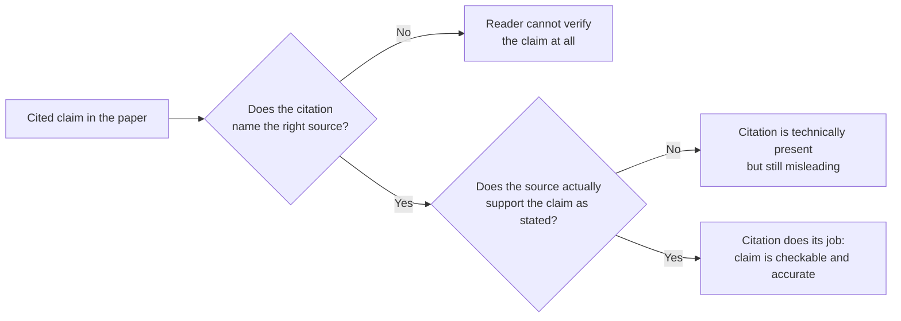

## Learning Objectives

- Explain why citation is how a paper's claim of novelty is actually made credible, not a formality added to a finished draft.
- State when a claim requires a citation, and distinguish acceptable paraphrase from plagiarism.
- Define plagiarism and self-plagiarism as ACM's current publications policy defines and penalizes them, including why redundant publication of one's own prior work is treated as a real violation.
- Describe what a citation, as a factual claim in itself, is responsible for getting right, and the role a formal reference style like IEEE's plays in keeping that claim checkable.

## Context & Motivation

`the-shape-of-a-paper-scope-story-and-organization` treated related work as one of the parts of a paper's standard shape, answering a skeptical reader's question of "how do I know this hasn't been done." This concept goes one level deeper, into the specific mechanics and ethics of how that "how do I know" question gets answered honestly, sentence by sentence, everywhere a paper draws on, builds on, or responds to someone else's prior work.

Zobel treats citation, in "Reference and Citation," as functionally load-bearing rather than decorative: a paper's claim to contribute something new is only as credible as the precision with which it draws the line between what is already known, attributed accurately to whoever established it, and what this paper adds. Get that line wrong, understating prior work, misattributing a finding, or omitting a citation a reader would reasonably expect, and the paper's central claim of novelty becomes suspect regardless of how sound the new work itself actually is. That is why this concept treats citation together with its most serious violation, plagiarism, as one subject rather than two: the discipline of citing carefully and the ethical obligation not to misrepresent authorship are two views of the same underlying responsibility.

## Core Theory

### When a claim needs a citation

A citation is needed whenever a claim, a fact, a method, or a result did not originate with the paper's own authors and was not independently derived within the paper itself. This includes obviously borrowed material, a quoted definition, an adopted algorithm, but also less obvious cases: a widely repeated claim about a field's history, a specific numerical result used as a baseline, or a framing of a problem that came from a particular earlier paper even if the paper's own wording is different. Zobel's guidance is that when in doubt, a fact's origin is worth citing, because omitting a citation a knowledgeable reader would expect reads, at minimum, as unfamiliarity with the field, and, at worst, as an implicit claim of originality the author knows is false.

### Quotation versus paraphrase, and why paraphrase must still be attributed

```text
Quotation:  reproduces the source's exact wording, in quotation marks,
            with a citation; appropriate when the exact phrasing itself
            matters (a formal definition, a precise claim being disputed).

Paraphrase: restates the source's idea in the author's own words; still
            requires a citation, because the citation attributes the
            IDEA, not just the specific sentence it was copied from.
```

A common and serious misconception, addressed directly below, is that changing the wording of a borrowed idea removes the obligation to cite it. It does not: the citation's job is to attribute the idea or finding to whoever established it, and paraphrasing changes only the sentence's surface form, not who actually did the intellectual work being drawn on.

### Plagiarism and self-plagiarism, as ACM's current policy defines them

ACM's Policy on Plagiarism, Misrepresentation, and Falsification, last updated by the ACM Publications Board in 2023, treats plagiarism as presenting someone else's words, ideas, or results as one's own without adequate attribution, whether the copying is verbatim or only lightly reworded. The policy also names, explicitly, a less obvious violation graduate researchers specifically need to understand: self-plagiarism, or redundant publication, submitting substantially the same work, or reusing substantial portions of one's own previously published text, as though it were new, without disclosing the overlap. This is treated as a real violation, not a lesser one, because it misrepresents to reviewers and readers how much genuinely new contribution a paper actually contains, the same underlying harm ordinary plagiarism causes, just directed at one's own prior work instead of someone else's.

### The citation itself as a factual claim



A citation is itself a factual assertion, that the cited source actually says or shows what the citing sentence claims it does, and getting this wrong, citing a source that does not quite support the specific claim attached to it, is a real, if often unintentional, form of misrepresentation. This is why Zobel treats checking one's own citations against the actual cited text, not against memory of it, as part of the discipline of citing carefully, closing the same loop `reading-critically-and-writing-a-literature-review` opened when verifying a review's claims against its sources.

### Formal reference style as a checkability requirement

A citation's practical usefulness depends on a reader being able to actually locate and check the source, which is what a consistent formal reference style, IEEE's editorial style manual being one of the field's standard formats, exists to guarantee: enough bibliographic detail, consistently formatted, that a citation is not just an assertion of "someone said this" but a specific, followable pointer to exactly where.

## Worked Examples

### Example 1: paraphrase that still needs a citation

A student reads a paper's explanation of why a particular consensus algorithm tolerates up to one-third faulty nodes, then writes their own explanation of the same bound in their own words, with no citation, reasoning that since the wording is original, no citation is needed. This is exactly the scenario ACM's plagiarism policy is written to cover: the idea, the specific bound and its origin, came from the cited paper regardless of whose sentences describe it, and the citation is required.

### Example 2: a citation that does not quite support its claim

A paper states "prior work has shown this approach does not scale," citing a paper that actually showed the approach scales well up to a specific size before degrading. The citation is present but misleading, because the cited source does not fully support the blanket claim attached to it; the accurate version would state the specific scaling limit the source actually demonstrated.

### Example 3: self-plagiarism across two papers

A researcher publishes a workshop paper, then later submits a conference paper reusing several paragraphs of the workshop paper's background section verbatim, without disclosing the overlap or citing the earlier paper. Even though both papers are the researcher's own work, ACM's policy treats this as a real violation, redundant publication, because the conference submission implicitly presents previously published material as new writing without disclosure.

## Common Misconceptions & Pitfalls

- **"If I reword it, I don't need to cite it."** The citation attributes the idea, not the specific sentence; paraphrasing without attribution is still plagiarism under ACM's policy, because the intellectual origin of the claim is unchanged.
- **"I can't plagiarize my own work."** ACM's policy explicitly treats redundant publication of one's own material, without disclosure, as a real violation, self-plagiarism, because it misrepresents how much of a submission is genuinely new.
- **"A citation just needs to point to a roughly related paper."** A citation is a factual claim that the source actually supports the specific statement attached to it; a technically present but poorly matched citation is still a form of misrepresentation, not a minor stylistic issue.

## Summary

Citation is the mechanism that makes a paper's claim of novelty checkable and credible, drawing an accurate line between prior work and new contribution, and both quotation and paraphrase carry the same obligation to attribute an idea's origin, since a citation attributes the idea, not merely the sentence it was copied from. ACM's current publications policy treats plagiarism, including the less obvious case of self-plagiarism through undisclosed redundant publication, as a serious violation precisely because it misrepresents how much of a submission is genuinely new, and a citation itself is a factual claim, that the cited source actually supports what is attributed to it, which a consistent formal reference style like IEEE's exists to keep checkable.

## Documentation Links

- [ACM Digital Library: Justin Zobel, Writing for Computer Science (3rd Edition, Springer, 2014)](https://dl.acm.org/doi/10.5555/2742708): Chapter 6's "Reference and Citation" and "Quotation" sections are the direct source for the citation-mechanics guidance covered here.
- [ACM: Policy on Plagiarism, Misrepresentation, and Falsification](https://www.acm.org/publications/policies/plagiarism-overview): the current, official policy defining plagiarism and self-plagiarism used throughout this concept.
- [IEEE Author Center: IEEE Editorial Style Manual for Authors](https://journals.ieeeauthorcenter.ieee.org/create-your-ieee-journal-article/create-the-text-of-your-article/ieee-editorial-style-manual/): a real, current example of the formal reference-style conventions that keep a citation checkable.
