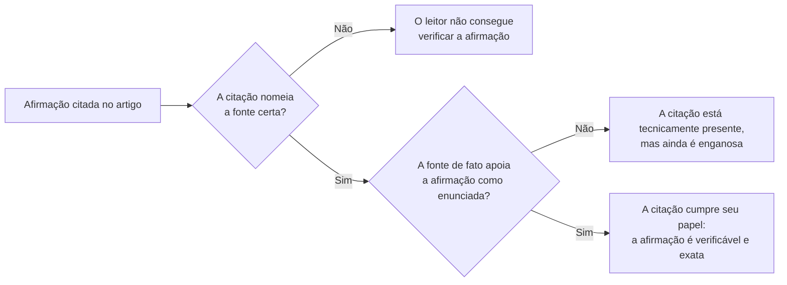

## Objetivos de Aprendizagem

- Explicar por que a citação é como a alegação de novidade de um artigo de fato se torna crível, e não uma formalidade acrescentada a um rascunho pronto.
- Dizer quando uma afirmação exige citação, e distinguir a paráfrase aceitável do plágio.
- Definir plágio e autoplágio como a política atual de publicações da ACM os define e pune, incluindo por que a publicação redundante do próprio trabalho anterior é tratada como uma violação real.
- Descrever o que uma citação, como afirmação factual por si só, é responsável por acertar, e o papel que um estilo formal de referência, como o da IEEE, cumpre para manter essa afirmação verificável.

## Contexto e Motivação

`the-shape-of-a-paper-scope-story-and-organization` tratou os trabalhos relacionados como uma das partes do formato padrão de um artigo, respondendo à pergunta de um leitor cético, "como eu sei que isto já não foi feito". Este conceito vai um nível mais fundo, na mecânica específica e na ética de como essa pergunta "como eu sei" é respondida com honestidade, frase por frase, em todo lugar em que um artigo se apoia, constrói sobre ou responde ao trabalho anterior de outra pessoa.

Zobel trata a citação, em "Reference and Citation", como funcionalmente estrutural, e não decorativa: a alegação de um artigo de contribuir com algo novo só é tão crível quanto a precisão com que ele traça a linha entre o que já se sabe, atribuído com exatidão a quem o estabeleceu, e o que este artigo acrescenta. Erre essa linha (subestimando o trabalho anterior, atribuindo mal uma descoberta ou omitindo uma citação que um leitor razoavelmente esperaria) e a alegação central de novidade do artigo fica suspeita, por mais sólido que o próprio trabalho novo de fato seja. É por isso que este conceito trata a citação junto com sua violação mais séria, o plágio, como um só assunto, e não dois: a disciplina de citar com cuidado e a obrigação ética de não deturpar a autoria são duas visões da mesma responsabilidade subjacente.

## Teoria Central

### Quando uma afirmação precisa de citação

Uma citação é necessária sempre que uma afirmação, um fato, um método ou um resultado não se originou com os próprios autores do artigo e não foi derivado de forma independente dentro do próprio artigo. Isso inclui material obviamente emprestado (uma definição citada, um algoritmo adotado), mas também casos menos óbvios: uma afirmação amplamente repetida sobre a história de uma área, um resultado numérico específico usado como linha de base, ou um enquadramento de um problema que veio de um artigo anterior específico, mesmo que a redação do próprio artigo seja diferente. A orientação de Zobel é que, na dúvida, a origem de um fato vale a citação, porque omitir uma citação que um leitor informado esperaria soa, no mínimo, como desconhecimento da área e, no pior caso, como uma alegação implícita de originalidade que o autor sabe ser falsa.

### Citação literal versus paráfrase, e por que a paráfrase ainda precisa ser atribuída

```text
Citação literal:  reproduz a redação exata da fonte, entre aspas, com uma
                  citação; apropriada quando a própria formulação exata
                  importa (uma definição formal, uma afirmação precisa sendo contestada).

Paráfrase:        reformula a ideia da fonte com as palavras do autor; ainda
                  exige uma citação, porque a citação atribui a IDEIA, e não só
                  a frase específica de onde ela foi copiada.
```

Um equívoco comum e sério, tratado diretamente abaixo, é o de que mudar a redação de uma ideia emprestada remove a obrigação de citá-la. Não remove: o trabalho da citação é atribuir a ideia ou descoberta a quem a estabeleceu, e parafrasear muda só a forma superficial da frase, não quem de fato fez o trabalho intelectual do qual se está tirando proveito.

### Plágio e autoplágio, como a política atual da ACM os define

A Política de Plágio, Deturpação e Falsificação da ACM, atualizada pela última vez pelo Conselho de Publicações da ACM em 2023, trata o plágio como apresentar palavras, ideias ou resultados de outra pessoa como se fossem próprios sem atribuição adequada, seja a cópia literal ou só levemente reescrita. A política também nomeia, de forma explícita, uma violação menos óbvia que os pesquisadores de pós-graduação precisam especificamente entender: o autoplágio, ou publicação redundante, submeter substancialmente o mesmo trabalho, ou reutilizar partes substanciais do próprio texto já publicado, como se fosse novo, sem revelar a sobreposição. Isso é tratado como uma violação real, e não como uma menor, porque deturpa, para revisores e leitores, quanta contribuição genuinamente nova um artigo de fato contém: o mesmo dano subjacente que o plágio comum causa, só que dirigido ao próprio trabalho anterior, em vez do de outra pessoa.

### A própria citação como afirmação factual



Uma citação é ela mesma uma asserção factual, a de que a fonte citada de fato diz ou mostra o que a frase que a cita afirma que ela diz, e errar isso (citar uma fonte que não apoia bem a afirmação específica anexada a ela) é uma forma real, ainda que muitas vezes não intencional, de deturpação. É por isso que Zobel trata conferir as próprias citações contra o texto citado de fato, e não contra a memória dele, como parte da disciplina de citar com cuidado, fechando o mesmo ciclo que `reading-critically-and-writing-a-literature-review` abriu ao verificar as afirmações de uma revisão contra suas fontes.

### Estilo formal de referência como exigência de verificabilidade

A utilidade prática de uma citação depende de um leitor conseguir de fato localizar e conferir a fonte, que é o que um estilo formal de referência consistente (sendo o manual de estilo editorial da IEEE um dos formatos padrão da área) existe para garantir: detalhes bibliográficos suficientes, formatados de forma consistente, para que uma citação não seja só uma asserção de "alguém disse isto", mas um ponteiro específico e rastreável para exatamente onde.

## Exemplos Resolvidos

### Exemplo 1: paráfrase que ainda precisa de citação

Um estudante lê a explicação de um artigo sobre por que um algoritmo de consenso específico tolera até um terço de nós falhos, e então escreve sua própria explicação do mesmo limite com as próprias palavras, sem citação, raciocinando que, como a redação é original, nenhuma citação é necessária. Esse é exatamente o cenário que a política de plágio da ACM foi escrita para cobrir: a ideia, o limite específico e sua origem, veio do artigo citado, independentemente de quem escreva as frases que o descrevem, e a citação é exigida.

### Exemplo 2: uma citação que não apoia bem sua afirmação

Um artigo afirma "trabalhos anteriores mostraram que esta abordagem não escala", citando um artigo que, na verdade, mostrou que a abordagem escala bem até um tamanho específico antes de se degradar. A citação está presente, mas é enganosa, porque a fonte citada não apoia por completo a afirmação genérica anexada a ela; a versão exata enunciaria o limite específico de escalabilidade que a fonte de fato demonstrou.

### Exemplo 3: autoplágio entre dois artigos

Um pesquisador publica um artigo de workshop e depois submete um artigo de conferência reutilizando literalmente vários parágrafos da seção de contexto do artigo de workshop, sem revelar a sobreposição nem citar o artigo anterior. Mesmo que os dois artigos sejam trabalho do próprio pesquisador, a política da ACM trata isso como uma violação real, a publicação redundante, porque a submissão à conferência apresenta implicitamente material já publicado como escrita nova, sem revelação.

## Equívocos Comuns e Armadilhas

- **"Se eu reescrever, não preciso citar."** A citação atribui a ideia, e não a frase específica; parafrasear sem atribuição ainda é plágio sob a política da ACM, porque a origem intelectual da afirmação não muda.
- **"Não posso plagiar o meu próprio trabalho."** A política da ACM trata explicitamente a publicação redundante do próprio material, sem revelação, como uma violação real, o autoplágio, porque deturpa quanto de uma submissão é genuinamente novo.
- **"Uma citação só precisa apontar para um artigo mais ou menos relacionado."** Uma citação é uma afirmação factual de que a fonte de fato apoia a declaração específica anexada a ela; uma citação tecnicamente presente, mas mal correspondida, ainda é uma forma de deturpação, e não uma questão estilística menor.

## Resumo

A citação é o mecanismo que torna a alegação de novidade de um artigo verificável e crível, traçando uma linha exata entre o trabalho anterior e a contribuição nova, e tanto a citação literal quanto a paráfrase carregam a mesma obrigação de atribuir a origem de uma ideia, já que uma citação atribui a ideia, e não só a frase de onde ela foi copiada. A política atual de publicações da ACM trata o plágio, incluindo o caso menos óbvio do autoplágio por publicação redundante não revelada, como uma violação séria precisamente porque ele deturpa quanto de uma submissão é genuinamente novo, e uma citação é ela mesma uma afirmação factual, a de que a fonte citada de fato apoia o que lhe é atribuído, que um estilo formal de referência consistente, como o da IEEE, existe para manter verificável.

## Documentation Links

- [ACM Digital Library: Justin Zobel, Writing for Computer Science (3ª edição, Springer, 2014)](https://dl.acm.org/doi/10.5555/2742708): as seções "Reference and Citation" e "Quotation" do Capítulo 6 são a fonte direta da orientação sobre a mecânica de citação coberta aqui.
- [ACM: Policy on Plagiarism, Misrepresentation, and Falsification](https://www.acm.org/publications/policies/plagiarism-overview): a política atual e oficial que define plágio e autoplágio usada ao longo deste conceito.
- [IEEE Author Center: IEEE Editorial Style Manual for Authors](https://journals.ieeeauthorcenter.ieee.org/create-your-ieee-journal-article/create-the-text-of-your-article/ieee-editorial-style-manual/): um exemplo real e atual das convenções formais de estilo de referência que mantêm uma citação verificável.
