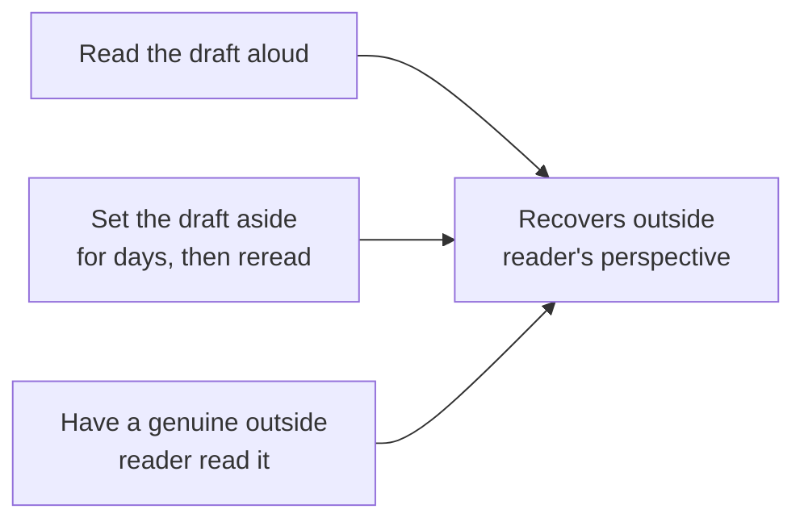

## Learning Objectives

- Explain why a first draft cannot reliably be judged by its own author, and what editing is meant to recover: the outside reader's perspective the author loses while writing.
- Distinguish revising content, checking the argument and organization are actually sound, from proofreading, checking the surface-level correctness of what has already been written, as genuinely separate passes.
- Describe concrete, practical techniques for recovering an outside perspective on one's own draft: reading aloud, setting a draft aside, and checking consistency of terminology and notation.
- Apply an editing pass to a completed draft that addresses content, consistency, and surface correctness as three distinct concerns rather than one undifferentiated "polishing" step.

## Context & Motivation

`the-shape-of-a-paper-scope-story-and-organization` treated a first draft as deliberately rough, its purpose is getting a paper's argument down in the right shape, not being well-written. This concept covers what happens next: the deliberate, separate discipline of testing that rough draft against a reader's actual experience of it, rather than trusting that a paper reads the way its author intended simply because the author knows what they meant to say. Zobel's chapter on "Editing" treats this as a real, teachable skill with its own techniques, not an incidental final pass squeezed in before submission.

## Core Theory

### Why an author cannot reliably judge their own first draft

The author of a draft already knows what every sentence is supposed to mean, which is exactly what makes an author a poor judge of whether the sentence actually, unambiguously conveys that meaning to someone who does not already know it. This is the same problem `kinds-of-scientific-publication-and-writing-for-a-skeptical-reader` raised at the level of the whole discipline: the gap between what an author intends and what a reader without that context actually receives. Editing exists specifically to recover the outside reader's perspective the author has lost by being too close to the material.

### Three separate passes, not one

```text
1. Revising content:    Is the argument actually sound? Is the scope right?
                         Does the organization still make sense once the
                         whole draft exists, not just the outline it was
                         planned from?

2. Consistency checking: Does terminology mean the same thing everywhere
                          it's used? Does notation introduced in Section 2
                          still mean the same thing in Section 5? Do claims
                          made early still match what the results actually
                          show, once the results section is finished?

3. Proofreading:        Surface-level correctness: typos, grammar, broken
                         references, formatting inconsistencies. Checked
                         LAST, once content and consistency are settled,
                         since content changes would otherwise re-introduce
                         surface errors into already-proofread text.
```

Zobel treats these as genuinely separate concerns deserving separate passes, rather than one undifferentiated "polishing" step, because they require different kinds of attention: revising content asks whether the argument itself holds up, consistency checking asks whether the paper is internally coherent across sections often written on different days or weeks, and proofreading asks only whether what is already, correctly, on the page is free of surface errors. Doing all three at once means content-level flaws are often missed while attention is spent catching typos, exactly the wrong ordering of effort.

### Practical techniques for recovering an outside perspective



Reading a draft aloud forces a slower, more literal engagement with the actual words on the page, rather than the fast, meaning-filling read an author's own eyes tend to default to when they already know what a sentence is supposed to say; awkward phrasing and genuine ambiguity are often much more noticeable spoken than silently skimmed. Setting a draft aside for several days before rereading works for a related reason: enough time passes that the author partially forgets the exact intended meaning of specific sentences, approximating, imperfectly but usefully, how an actual outside reader encounters the text for the first time. An outside reader, when available, remains the most direct way to recover this perspective, since neither of the other two techniques fully substitutes for someone who genuinely does not already know what the author meant.

### Consistency across a draft written over time

A paper is rarely written start to finish in one sitting; sections are often drafted weeks apart, revised independently, and reordered as the organization settles, which creates real opportunities for inconsistency, a term defined one way in Section 2 and used slightly differently in Section 5, a claim stated confidently in the introduction that the eventual results section only partially supports. Checking for this kind of drift specifically, not just checking each section in isolation, is what the dedicated consistency pass is for.

## Worked Examples

### Example 1: catching a content-level flaw only revision surfaces

Rereading a completed draft, an author notices the introduction promises a comparison against three baseline methods, but the results section, added later, only actually evaluates two of them. Proofreading would never catch this, since every individual sentence is grammatically and stylistically fine; only a revision pass checking the argument's internal consistency surfaces it.

### Example 2: reading aloud surfaces an ambiguous sentence

A sentence reads smoothly when skimmed silently: "The system processes requests using the cache when available and the database otherwise, which improves throughput." Read aloud, it becomes unclear whether "which improves throughput" refers to using the cache specifically or to the whole request-processing scheme; rewritten for clarity: "Using the cache when available, rather than always querying the database, improves throughput."

### Example 3: a consistency pass catching notational drift

A paper defines a symbol n as the number of nodes in Section 2, then, in a later section drafted separately, reuses n for the number of experimental trials. A dedicated consistency check, reading through specifically for notation reuse rather than for content or grammar, catches this before it reaches a reader who would otherwise have to guess, from context, which meaning applies in the later section.

## Common Misconceptions & Pitfalls

- **"If I understand my own draft clearly, it's probably ready."** This is exactly the gap editing exists to close: an author's own clarity about intended meaning is not evidence the draft conveys that meaning to a reader who does not already share it.
- **"Proofreading and revising are the same activity, just done together at the end."** Content-level flaws are easier to miss when attention is split with surface-level correctness checking; doing them as separate, sequential passes, content first, then consistency, then proofreading, catches more of both.
- **"Setting a draft aside is just procrastination dressed up as a technique."** The time gap serves a specific, real function, letting the author partially forget the intended meaning of specific sentences well enough to notice, on reread, where the actual words fail to convey it.

## Summary

A first draft cannot be reliably judged by the person who wrote it, since an author already knows what every sentence is meant to say, which is exactly what editing exists to work around: recovering an outside reader's actual experience of the text. Revising content, checking consistency of terminology and notation, and proofreading for surface correctness are three genuinely separate concerns best handled as separate, sequential passes rather than one undifferentiated polishing step, and concrete techniques, reading aloud, setting a draft aside, seeking a genuine outside reader, each work by approximating, to varying degrees, the perspective of a reader encountering the text for the first time.

## Documentation Links

- [ACM Digital Library: Justin Zobel, Writing for Computer Science (3rd Edition, Springer, 2014)](https://dl.acm.org/doi/10.5555/2742708): Chapter 13, "Editing," is the direct source for the revision, consistency, and proofreading discipline covered here.
