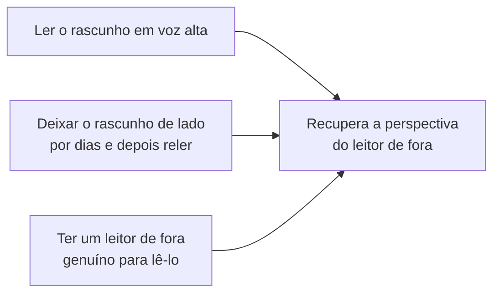

## Objetivos de Aprendizagem

- Explicar por que um primeiro rascunho não pode ser julgado de forma confiável pelo seu próprio autor, e o que a edição pretende recuperar: a perspectiva do leitor de fora que o autor perde enquanto escreve.
- Distinguir revisar o conteúdo (conferir se o argumento e a organização são de fato sólidos) de revisar o texto (conferir a correção superficial do que já foi escrito) como passagens genuinamente separadas.
- Descrever técnicas concretas e práticas para recuperar uma perspectiva de fora sobre o próprio rascunho: ler em voz alta, deixar um rascunho de lado e conferir a consistência de terminologia e notação.
- Aplicar uma passagem de edição a um rascunho completo que trate conteúdo, consistência e correção superficial como três preocupações distintas, e não como um único passo indiferenciado de "polimento".

## Contexto e Motivação

`the-shape-of-a-paper-scope-story-and-organization` tratou um primeiro rascunho como deliberadamente tosco: seu propósito é colocar o argumento de um artigo no formato certo, e não ser bem escrito. Este conceito cobre o que vem depois: a disciplina deliberada e separada de testar esse rascunho tosco contra a experiência real de um leitor com ele, em vez de confiar que um artigo se lê do jeito que o autor pretendia só porque o autor sabe o que quis dizer. O capítulo de Zobel sobre "Editing" trata isso como uma habilidade real e ensinável, com suas próprias técnicas, e não como uma passagem final incidental encaixada antes da submissão.

## Teoria Central

### Por que um autor não consegue julgar de forma confiável o próprio primeiro rascunho

O autor de um rascunho já sabe o que cada frase deveria significar, e é exatamente isso que faz de um autor um mau juiz de se a frase de fato transmite esse significado, sem ambiguidade, a alguém que ainda não o conhece. É o mesmo problema que `kinds-of-scientific-publication-and-writing-for-a-skeptical-reader` levantou no nível da disciplina inteira: a lacuna entre o que um autor pretende e o que um leitor sem esse contexto de fato recebe. A edição existe especificamente para recuperar a perspectiva do leitor de fora que o autor perdeu por estar perto demais do material.

### Três passagens separadas, e não uma

```text
1. Revisar o conteúdo:    O argumento é de fato sólido? O escopo está certo?
                          A organização ainda faz sentido quando o rascunho
                          inteiro existe, e não só o esboço a partir do qual
                          ele foi planejado?

2. Conferir a consistência: A terminologia significa a mesma coisa em todo
                            lugar em que é usada? A notação apresentada na
                            Seção 2 ainda significa a mesma coisa na Seção 5?
                            As afirmações feitas cedo ainda batem com o que os
                            resultados de fato mostram, quando a seção de
                            resultados fica pronta?

3. Revisar o texto:       Correção superficial: erros de digitação, gramática,
                          referências quebradas, inconsistências de formatação.
                          Conferida POR ÚLTIMO, quando conteúdo e consistência
                          estão resolvidos, já que mudanças de conteúdo, de outra
                          forma, reintroduziriam erros superficiais num texto já revisado.
```

Zobel trata essas como preocupações genuinamente separadas que merecem passagens separadas, em vez de um único passo indiferenciado de "polimento", porque elas exigem tipos diferentes de atenção: revisar o conteúdo pergunta se o próprio argumento se sustenta, conferir a consistência pergunta se o artigo é internamente coerente entre seções muitas vezes escritas em dias ou semanas diferentes, e revisar o texto pergunta só se o que já está, corretamente, na página está livre de erros superficiais. Fazer as três de uma vez significa que falhas em nível de conteúdo muitas vezes passam despercebidas enquanto a atenção é gasta pegando erros de digitação, exatamente a ordem errada de esforço.

### Técnicas práticas para recuperar uma perspectiva de fora



Ler um rascunho em voz alta força um envolvimento mais lento e mais literal com as palavras de fato na página, em vez da leitura rápida, que preenche sentido, à qual os próprios olhos de um autor tendem a recorrer quando já sabem o que uma frase deveria dizer; formulações desajeitadas e ambiguidade genuína costumam ser muito mais perceptíveis ditas do que lidas em silêncio por alto. Deixar um rascunho de lado por vários dias antes de reler funciona por um motivo relacionado: passa tempo suficiente para que o autor esqueça em parte o significado exato pretendido de frases específicas, aproximando, de forma imperfeita, mas útil, como um leitor de fora de verdade encontra o texto pela primeira vez. Um leitor de fora, quando disponível, continua sendo a forma mais direta de recuperar essa perspectiva, já que nenhuma das outras duas técnicas substitui por completo alguém que genuinamente ainda não sabe o que o autor quis dizer.

### Consistência num rascunho escrito ao longo do tempo

Um artigo raramente é escrito do início ao fim numa só sentada; as seções costumam ser rascunhadas com semanas de distância, revisadas de forma independente e reordenadas conforme a organização se assenta, o que cria oportunidades reais de inconsistência: um termo definido de um jeito na Seção 2 e usado de forma um pouco diferente na Seção 5, uma afirmação feita com confiança na introdução que a eventual seção de resultados só apoia em parte. Conferir especificamente esse tipo de deriva, e não só conferir cada seção isoladamente, é para o que serve a passagem dedicada de consistência.

## Exemplos Resolvidos

### Exemplo 1: pegando uma falha de conteúdo que só a revisão revela

Relendo um rascunho completo, um autor repara que a introdução promete uma comparação com três métodos de linha de base, mas a seção de resultados, acrescentada depois, só avalia de fato dois deles. Revisar o texto nunca pegaria isso, já que cada frase individual está gramatical e estilisticamente bem; só uma passagem de revisão de conteúdo que confere a consistência interna do argumento o revela.

### Exemplo 2: ler em voz alta revela uma frase ambígua

Uma frase se lê de forma fluida quando lida em silêncio por alto: "O sistema processa requisições usando a cache quando disponível e o banco de dados caso contrário, o que melhora a vazão." Lida em voz alta, fica incerto se "o que melhora a vazão" se refere a usar a cache especificamente ou ao esquema inteiro de processamento de requisições; reescrita por clareza: "Usar a cache quando disponível, em vez de sempre consultar o banco de dados, melhora a vazão."

### Exemplo 3: uma passagem de consistência pegando deriva de notação

Um artigo define um símbolo n como o número de nós na Seção 2 e depois, numa seção posterior rascunhada em separado, reutiliza n para o número de experimentos. Uma checagem dedicada de consistência, lendo especificamente em busca de reutilização de notação, e não de conteúdo ou gramática, pega isso antes de chegar a um leitor que, de outra forma, teria de adivinhar, pelo contexto, qual significado se aplica na seção posterior.

## Equívocos Comuns e Armadilhas

- **"Se eu entendo o meu próprio rascunho com clareza, ele provavelmente está pronto."** É exatamente a lacuna que a edição existe para fechar: a clareza do próprio autor sobre o significado pretendido não é evidência de que o rascunho transmite esse significado a um leitor que ainda não o compartilha.
- **"Revisar o texto e revisar o conteúdo são a mesma atividade, só feita junta no fim."** Falhas em nível de conteúdo são mais fáceis de escapar quando a atenção é dividida com a checagem de correção superficial; fazê-las como passagens separadas e sequenciais (conteúdo primeiro, depois consistência, depois revisão do texto) pega mais das duas.
- **"Deixar um rascunho de lado é só procrastinação disfarçada de técnica."** O intervalo de tempo cumpre uma função específica e real: deixar o autor esquecer em parte o significado pretendido de frases específicas o bastante para notar, na releitura, onde as palavras de fato falham em transmiti-lo.

## Resumo

Um primeiro rascunho não pode ser julgado de forma confiável por quem o escreveu, já que um autor já sabe o que cada frase deveria dizer, que é exatamente aquilo que a edição existe para contornar: recuperar a experiência real de um leitor de fora com o texto. Revisar o conteúdo, conferir a consistência de terminologia e notação e revisar o texto quanto à correção superficial são três preocupações genuinamente separadas, mais bem tratadas como passagens separadas e sequenciais, em vez de um único passo indiferenciado de polimento, e técnicas concretas (ler em voz alta, deixar um rascunho de lado, buscar um leitor de fora genuíno) funcionam cada uma aproximando, em graus variados, a perspectiva de um leitor que encontra o texto pela primeira vez.

## Documentation Links

- [ACM Digital Library: Justin Zobel, Writing for Computer Science (3ª edição, Springer, 2014)](https://dl.acm.org/doi/10.5555/2742708): o Capítulo 13, "Editing", é a fonte direta da disciplina de revisão de conteúdo, consistência e revisão de texto coberta aqui.
