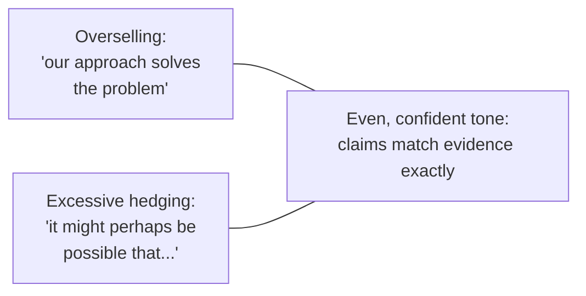

## Learning Objectives

- Explain why good scientific style is an engineering constraint on reader effort, not a matter of decoration or personal taste.
- Apply the principle of economy: identifying words, clauses, and sentences that cost the reader effort without adding information.
- Describe what an even, confident tone means in research writing, and the two failure modes, overselling and excessive hedging, it sits between.
- Explain why knowing the intended audience precisely changes concrete writing decisions, not just word choice.

## Context & Motivation

`the-shape-of-a-paper-scope-story-and-organization` covered getting a paper's large-scale structure right: the right scope, the right order of sections. This concept moves one level down, to the sentence- and paragraph-level choices that determine whether that well-organized structure is actually easy to read once a reader is inside it. Zobel's chapter on "Good Style" and Simon Peyton Jones's independently developed talk agree on something worth stating plainly before any specific technique: style in research writing is not primarily an aesthetic concern. It is a direct, measurable constraint on how much of a reader's limited attention is spent reconstructing what a sentence means, attention that is then unavailable for evaluating whether the sentence's claim is actually true.

## Core Theory

### Economy: every word earns its place

Economy does not mean short sentences for their own sake; a precise, longer sentence can be more economical than an ambiguous, shorter one that forces a second reading. Economy means every word, clause, and qualifier in a sentence is doing real work, and anything that is not, throat-clearing phrases, redundant restatement, hedges added out of habit rather than genuine uncertainty, is a real cost charged to the reader with no corresponding benefit.

```text
Uneconomical:  "It is important to note that, in general, the algorithm
                that we have proposed tends to perform in a manner that
                is faster than the baseline approach in most cases."

Economical:    "The proposed algorithm is faster than the baseline on
                most workloads tested."
```

Both sentences make the same claim. The second costs the reader noticeably less effort to parse, without losing any actual information the first one contained; the extra length in the first version was entirely padding, not precision.

### Tone: between overselling and excessive hedging



An even tone states claims with exactly the confidence the evidence supports, no more and no less. Overselling, claiming a solved problem when the evidence supports only an improvement, or a general result when the evidence supports only a specific case, damages credibility with a skeptical reader the moment the gap between claim and evidence becomes visible, and it often becomes visible quickly, once the reader reaches the actual results section. Excessive hedging has a quieter but real cost: qualifying every sentence past the point the actual uncertainty warrants makes genuine, real uncertainty indistinguishable from reflexive caution, so that a reader can no longer tell which hedges are meaningful.

### Voice, balance, and the "upper hand"

Zobel treats a paper's voice, broadly, first person plural ("we present"), passive constructions ("a method is presented"), or a mix, as a real stylistic choice with tradeoffs rather than a fixed convention, though consistency within one paper matters more than which specific choice is made. A related, subtler concern Zobel raises directly is what he calls the "upper hand": the temptation to write in a way that makes a reader feel they must already agree with the author's framing to follow the argument at all, rather than earning agreement through visible evidence. A confident, even tone earns the reader's agreement; a paper that assumes it in advance, through loaded language or dismissive treatment of alternative views, tends to alienate the exact skeptical reader it needs to persuade.

### Audience: who, precisely, is this written for

"Know your audience" is common advice stated so generally it is easy to nod along with and then ignore in practice. Zobel's version is more concrete: a paper's intended audience determines specific, checkable decisions, what background can be assumed without explanation, which terms need defining versus which are standard vocabulary in the subfield, and how much motivation a claim needs before a reader accepts it as worth investigating at all. A paper submitted to a specialist workshop can assume far more background than the same result submitted to a broader venue, and writing as though the audience were the broader one, over-explaining standard terms to a specialist audience, costs exactly the same kind of reader effort that economy is meant to eliminate.

## Worked Examples

### Example 1: trimming for economy without losing meaning

Original: "In this paper, what we attempt to do is to present and describe a new approach which we believe has the potential to be able to improve upon existing methods in terms of efficiency." Trimmed: "This paper presents a new approach that improves on existing methods' efficiency." The claim, its subject, and its scope are unchanged; only the padding is gone.

### Example 2: matching tone to evidence

A paper's evaluation shows a 12% improvement on 6 of 8 tested workloads, with a small regression on the other two. "Our method solves the performance problem" oversells this result. "Our method improves performance on the majority of workloads tested, with a small regression observed on two workloads involving small input sizes" matches the tone to exactly what the evidence shows, neither overclaiming nor burying the genuine positive result under excessive qualification.

### Example 3: adjusting for a specialist audience

A paper on a new Byzantine fault tolerant protocol, submitted to a distributed systems venue whose readers are assumed to already know what Byzantine fault tolerance means, does not need to define the term or motivate why it matters; doing so anyway signals a misjudged audience and costs specialist readers real attention on material they did not need. The same paper adapted for a broader systems venue would need that context restored.

## Common Misconceptions & Pitfalls

- **"Longer, more formal-sounding sentences are more scientific."** Economy directly contradicts this: formality that adds no information is a cost to the reader, not a signal of rigor, and Zobel treats padded prose as a stylistic failure regardless of how technical it sounds.
- **"Hedging every claim is the safe, honest choice."** Excessive hedging is its own failure mode, not a neutral default; it makes genuine uncertainty indistinguishable from reflexive caution, which is a real cost to a reader trying to calibrate how much to trust each claim.
- **"Style is subjective, so there's no real standard to meet."** Zobel and Peyton Jones's converging, independently-derived guidance on economy, tone, and audience treats style as a set of concrete, evaluable properties, closer to an engineering constraint than a matter of unconstrained personal taste.

## Summary

Good scientific style reduces to a small number of concrete, learnable properties rather than untaught taste: economy, ensuring every word in a sentence earns its place rather than costing the reader effort for no informational gain; an even, confident tone that matches the actual strength of the evidence, avoiding both overselling and excessive hedging; and a precise, specific sense of the intended audience, which changes real decisions about what can be assumed and what needs explaining. Together these determine how much of a reader's limited attention is spent understanding a sentence versus evaluating whether its claim is true.

## Documentation Links

- [ACM Digital Library: Justin Zobel, Writing for Computer Science (3rd Edition, Springer, 2014)](https://dl.acm.org/doi/10.5555/2742708): Chapter 6, "Good Style," is the direct source for the economy, tone, voice, balance, and audience guidance covered here.
- [Microsoft Research: Simon Peyton Jones, How to Write a Great Research Paper](https://www.microsoft.com/en-us/research/academic-program/write-great-research-paper/): independently developed advice converging on the same reader-effort framing of good style.
