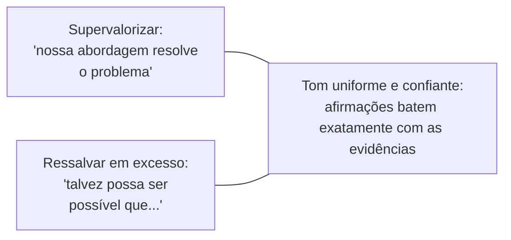

## Objetivos de Aprendizagem

- Explicar por que o bom estilo científico é uma restrição de engenharia sobre o esforço do leitor, e não uma questão de decoração ou gosto pessoal.
- Aplicar o princípio da economia: identificar palavras, orações e frases que custam esforço ao leitor sem acrescentar informação.
- Descrever o que significa um tom uniforme e confiante na escrita de pesquisa, e os dois modos de falha, supervalorizar e ressalvar em excesso, entre os quais ele fica.
- Explicar por que conhecer o público pretendido com precisão muda decisões concretas de escrita, e não só a escolha de palavras.

## Contexto e Motivação

`the-shape-of-a-paper-scope-story-and-organization` cobriu acertar a estrutura em larga escala de um artigo: o escopo certo, a ordem certa das seções. Este conceito desce um nível, até as escolhas em nível de frase e de parágrafo que determinam se essa estrutura bem organizada é de fato fácil de ler uma vez que o leitor está dentro dela. O capítulo de Zobel sobre "Good Style" e a palestra desenvolvida de forma independente por Simon Peyton Jones concordam em algo que vale enunciar de forma clara antes de qualquer técnica específica: o estilo na escrita de pesquisa não é, antes de mais nada, uma preocupação estética. É uma restrição direta e mensurável sobre quanto da atenção limitada de um leitor é gasto reconstruindo o que uma frase significa, atenção que fica então indisponível para avaliar se a afirmação da frase é de fato verdadeira.

## Teoria Central

### Economia: cada palavra merece o seu lugar

Economia não significa frases curtas por si mesmas; uma frase precisa e mais longa pode ser mais econômica do que uma mais curta e ambígua que força uma segunda leitura. Economia significa que cada palavra, oração e qualificador numa frase está fazendo trabalho real, e tudo que não está (frases de enrolação, repetição redundante, ressalvas acrescentadas por hábito, e não por incerteza genuína) é um custo real cobrado do leitor sem benefício correspondente.

```text
Sem economia:  "É importante notar que, de modo geral, o algoritmo
                que propusemos tende a ter um desempenho de uma forma
                que é mais rápida do que a abordagem de linha de base na
                maioria dos casos."

Econômico:     "O algoritmo proposto é mais rápido do que a linha de base
                na maioria das cargas testadas."
```

Ambas as frases fazem a mesma afirmação. A segunda custa ao leitor um esforço de leitura perceptivelmente menor, sem perder nenhuma informação de fato contida na primeira; o comprimento extra da primeira versão era inteiramente enchimento, e não precisão.

### Tom: entre supervalorizar e ressalvar em excesso



Um tom uniforme enuncia as afirmações com exatamente a confiança que a evidência sustenta, nem mais nem menos. Supervalorizar (alegar um problema resolvido quando a evidência sustenta só uma melhoria, ou um resultado geral quando a evidência sustenta só um caso específico) prejudica a credibilidade perante um leitor cético no instante em que a lacuna entre afirmação e evidência fica visível, e ela costuma ficar visível depressa, assim que o leitor chega à seção de resultados de fato. Ressalvar em excesso tem um custo mais silencioso, mas real: qualificar cada frase para além do ponto que a incerteza de fato justifica torna a incerteza genuína e real indistinguível da cautela reflexa, de modo que o leitor não consegue mais dizer quais ressalvas são significativas.

### Voz, equilíbrio e a "vantagem"

Zobel trata a voz de um artigo, de forma ampla, primeira pessoa do plural ("apresentamos"), construções passivas ("um método é apresentado"), ou uma mistura, como uma escolha estilística real com trade-offs, e não como uma convenção fixa, embora a consistência dentro de um mesmo artigo importe mais do que qual escolha específica é feita. Uma preocupação relacionada e mais sutil que Zobel levanta diretamente é o que ele chama de "vantagem" (upper hand): a tentação de escrever de um jeito que faça o leitor sentir que já precisa concordar com o enquadramento do autor para sequer acompanhar o argumento, em vez de conquistar a concordância por meio de evidências visíveis. Um tom confiante e uniforme conquista a concordância do leitor; um artigo que a presume de antemão, por meio de linguagem carregada ou de tratamento dispensivo de visões alternativas, tende a afastar exatamente o leitor cético que precisa persuadir.

### Público: para quem, precisamente, isto está escrito

"Conheça o seu público" é um conselho comum enunciado de forma tão genérica que é fácil concordar com a cabeça e depois ignorar na prática. A versão de Zobel é mais concreta: o público pretendido de um artigo determina decisões específicas e conferíveis, que contexto pode ser assumido sem explicação, quais termos precisam de definição versus quais são vocabulário padrão na subárea, e quanta motivação uma afirmação precisa antes de um leitor aceitá-la como digna de investigação. Um artigo submetido a um workshop de especialistas pode assumir muito mais contexto do que o mesmo resultado submetido a um veículo mais amplo, e escrever como se o público fosse o mais amplo, superexplicando termos padrão para um público de especialistas, custa exatamente o mesmo tipo de esforço do leitor que a economia pretende eliminar.

## Exemplos Resolvidos

### Exemplo 1: enxugar por economia sem perder sentido

Original: "Neste artigo, o que tentamos fazer é apresentar e descrever uma nova abordagem que acreditamos ter o potencial de ser capaz de melhorar os métodos existentes em termos de eficiência." Enxugado: "Este artigo apresenta uma nova abordagem que melhora a eficiência dos métodos existentes." A afirmação, seu sujeito e seu escopo ficam inalterados; só o enchimento sumiu.

### Exemplo 2: ajustar o tom à evidência

A avaliação de um artigo mostra uma melhoria de 12% em 6 de 8 cargas testadas, com uma pequena regressão nas outras duas. "Nosso método resolve o problema de desempenho" supervaloriza esse resultado. "Nosso método melhora o desempenho na maioria das cargas testadas, com uma pequena regressão observada em duas cargas que envolvem entradas de tamanho pequeno" ajusta o tom a exatamente o que a evidência mostra, nem exagerando na alegação nem soterrando o resultado positivo genuíno sob qualificação excessiva.

### Exemplo 3: ajustar para um público de especialistas

Um artigo sobre um novo protocolo tolerante a falhas bizantinas, submetido a um veículo de sistemas distribuídos cujos leitores já sabem, por suposição, o que significa tolerância a falhas bizantinas, não precisa definir o termo nem motivar por que ele importa; fazê-lo mesmo assim sinaliza um público mal avaliado e custa aos leitores especialistas atenção real sobre material de que não precisavam. O mesmo artigo adaptado para um veículo de sistemas mais amplo precisaria desse contexto restaurado.

## Equívocos Comuns e Armadilhas

- **"Frases mais longas e de som mais formal são mais científicas."** A economia contradiz isso diretamente: formalidade que não acrescenta informação é um custo para o leitor, e não um sinal de rigor, e Zobel trata a prosa inchada como uma falha estilística, por mais técnica que ela soe.
- **"Ressalvar cada afirmação é a escolha segura e honesta."** Ressalvar em excesso é um modo de falha próprio, e não um padrão neutro; torna a incerteza genuína indistinguível da cautela reflexa, o que é um custo real para um leitor que tenta calibrar quanto confiar em cada afirmação.
- **"Estilo é subjetivo, então não há padrão real a cumprir."** A orientação convergente e derivada de forma independente de Zobel e Peyton Jones sobre economia, tom e público trata o estilo como um conjunto de propriedades concretas e avaliáveis, mais perto de uma restrição de engenharia do que de uma questão de gosto pessoal sem amarras.

## Resumo

O bom estilo científico se reduz a um pequeno número de propriedades concretas e aprendíveis, e não a um gosto não ensinado: economia, garantir que cada palavra numa frase mereça seu lugar em vez de custar esforço ao leitor sem ganho de informação; um tom uniforme e confiante que bate com a força real da evidência, evitando tanto supervalorizar quanto ressalvar em excesso; e um senso preciso e específico do público pretendido, que muda decisões reais sobre o que pode ser assumido e o que precisa ser explicado. Juntas, essas propriedades determinam quanto da atenção limitada de um leitor é gasto entendendo uma frase versus avaliando se a sua afirmação é verdadeira.

## Documentation Links

- [ACM Digital Library: Justin Zobel, Writing for Computer Science (3ª edição, Springer, 2014)](https://dl.acm.org/doi/10.5555/2742708): o Capítulo 6, "Good Style", é a fonte direta da orientação sobre economia, tom, voz, equilíbrio e público coberta aqui.
- [Microsoft Research: Simon Peyton Jones, How to Write a Great Research Paper](https://www.microsoft.com/en-us/research/academic-program/write-great-research-paper/): conselho desenvolvido de forma independente que converge para o mesmo enquadramento do bom estilo em termos de esforço do leitor.
