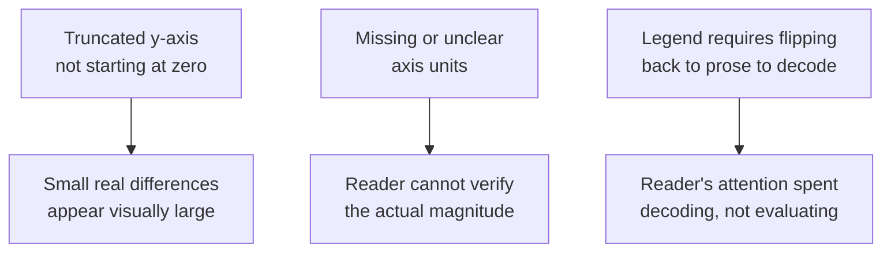

## Learning Objectives

- Explain why a results graph functions as an argument, not a decoration, and why axis, scale, and label choices affect how persuasive it is to a skeptical reader.
- Identify the most common honest-versus-misleading presentation failures in results graphs: truncated axes, missing units, and legends requiring the reader to consult the surrounding text.
- Distinguish what a diagram should be used for, showing structure, from what it should not be used for, restating prose that is already stated in words nearby.
- Decide when a table, rather than a graph, is the right way to present a given set of results.

## Context & Motivation

`the-shape-of-a-paper-scope-story-and-organization` established that a paper's results section answers a skeptical reader's question of "how do I know the claim is true." Much of that answering, in computer science research specifically, happens visually, through graphs, diagrams, and tables, which means the same skeptical-reader standard this whole discipline is built around applies just as directly to a figure as to a sentence. Zobel's chapter on "Graphs, Figures, and Tables" treats this visual content as making claims exactly the way prose does, claims that can be honestly presented or, whether deliberately or through carelessness, presented in ways that mislead.

## Core Theory

### A graph as an argument

```text
A results graph implicitly claims: "the effect shown here is real, and this
is its actual size." Every choice in constructing the graph, the axis
range, the scale (linear or logarithmic), which baseline is included,
either supports a reader's ability to verify that claim or works against
it.
```

Because a graph makes this kind of claim, the same standard `the-shape-of-a-paper-scope-story-and-organization` applied to a paper's central claim applies here too: a skeptical reader should be able to look at the graph and verify, not just be told, that the described effect is real and roughly the size claimed.

### Common failures: truncated axes, missing units, disconnected legends



A truncated y-axis is the most commonly cited example, and it is worth being precise about why it is a problem: it is not that truncated axes are always dishonest, sometimes a legitimate, small but real effect genuinely needs a zoomed-in view to be visible at all, but that a truncated axis without a visible, honest indication of the truncation makes a modest difference look dramatic to a reader's eye, which is a visual claim the underlying data may not actually support. Missing or ambiguous axis units make a graph impossible to verify quantitatively even if its qualitative shape is honest. A legend that forces a reader to leave the figure and search the surrounding prose to decode which line or bar represents what is a real cost to exactly the limited reader attention `good-style-economy-tone-and-audience` already established as a scarce resource worth protecting.

### Diagrams: showing structure, not restating prose

A diagram earns its place in a paper when it shows something that is genuinely easier to understand visually than to describe in words, structure, relationships between components, the flow of data or control through a system, not when it simply illustrates, in boxes and arrows, a sentence the surrounding prose already states plainly. A diagram that restates prose costs a reader time without adding information; a diagram that shows real structure, the kind of relationship a sentence would need several sentences to convey precisely, earns the space it occupies.

### When a table beats a graph

A graph is well suited to showing a trend or comparison a reader is meant to grasp visually, how does performance change as load increases, which of several methods is generally better. A table is the better choice when a reader needs exact values, not a visual impression, for instance when reporting the precise numbers behind a claimed result so another researcher could compare directly against them in future work, or when there are too many precise data points for a graph to display without becoming visually cluttered.

## Worked Examples

### Example 1: fixing a truncated axis

A bar chart comparing two systems' throughput has a y-axis starting at 800 rather than 0, making a genuine 5% difference look like one system is roughly twice as fast as the other. Corrected, the axis starts at zero, and the real, smaller difference is now what the reader actually sees, matching the claim the surrounding text should also make about the result's actual size.

### Example 2: a diagram that earns its place

A paper describing a new replication protocol includes a diagram showing the message flow between a coordinator and three replicas during a commit, including the order and direction of messages. This relationship, several messages in a specific sequence across four components, would take a long, hard-to-follow paragraph to state precisely in prose; the diagram conveys it far more directly, and is a legitimate use of figure space.

### Example 3: choosing a table over a graph

A paper reports exact latency measurements, in milliseconds, for five different configurations across three workloads, fifteen precise values a future researcher might want to compare directly against. A table listing these fifteen values precisely is more useful here than a bar chart, which would show the same relative comparisons visually but lose the exact figures a reader might need for a direct follow-up comparison.

## Common Misconceptions & Pitfalls

- **"A graph just illustrates what the text already says, so its exact construction doesn't matter much."** A graph makes its own visual claim about the size and reality of an effect, and a misleading construction, even an unintentional one, can suggest a stronger or different result than the data actually supports, regardless of what the surrounding text says.
- **"More figures make a paper look more thorough."** A diagram that restates prose already stated in words costs a reader time without adding information; figures earn their place by showing something genuinely clearer visually than in words, not by their mere presence.
- **"Graphs are always more effective than tables for presenting results."** When a reader needs exact, precise values, for direct comparison or reuse, a table serves that need better than a graph, which is built to convey a visual trend or comparison, not exact figures.

## Summary

A results graph is an argument, implicitly claiming that a described effect is real and roughly the size shown, and choices like axis range, scale, and unit labeling either support or undermine a skeptical reader's ability to verify that claim, with truncated axes, missing units, and legends disconnected from the figure among the most common, avoidable failures. A diagram earns its place in a paper by showing structure or relationships genuinely clearer visually than in prose, not by restating what the surrounding text already says, and a table is the right choice over a graph specifically when a reader needs exact values rather than a visual trend.

## Documentation Links

- [ACM Digital Library: Justin Zobel, Writing for Computer Science (3rd Edition, Springer, 2014)](https://dl.acm.org/doi/10.5555/2742708): Chapter 11, "Graphs, Figures, and Tables," is the direct source for the axis, legend, diagram, and table-versus-graph guidance covered here.
- [IEEE Author Center: IEEE Editorial Style Manual for Authors](https://journals.ieeeauthorcenter.ieee.org/create-your-ieee-journal-article/create-the-text-of-your-article/ieee-editorial-style-manual/): a real, current example of the figure, caption, and axis-labeling conventions a formal publication venue enforces.
