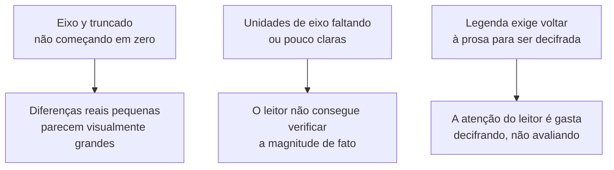

## Objetivos de Aprendizagem

- Explicar por que um gráfico de resultados funciona como um argumento, e não como uma decoração, e por que as escolhas de eixo, escala e rótulo afetam quão persuasivo ele é para um leitor cético.
- Identificar as falhas de apresentação mais comuns entre o honesto e o enganoso em gráficos de resultados: eixos truncados, unidades faltando e legendas que exigem que o leitor consulte o texto ao redor.
- Distinguir para que um diagrama deve ser usado, mostrar estrutura, daquilo para que ele não deve ser usado, repetir uma prosa que já está enunciada em palavras ali perto.
- Decidir quando uma tabela, em vez de um gráfico, é a forma certa de apresentar um dado conjunto de resultados.

## Contexto e Motivação

`the-shape-of-a-paper-scope-story-and-organization` estabeleceu que a seção de resultados de um artigo responde à pergunta de um leitor cético, "como eu sei que a afirmação é verdadeira". Grande parte dessa resposta, na pesquisa em ciência da computação especificamente, acontece visualmente, por meio de gráficos, diagramas e tabelas, o que significa que o mesmo padrão do leitor cético em torno do qual esta disciplina inteira é construída se aplica tão diretamente a uma figura quanto a uma frase. O capítulo de Zobel sobre "Graphs, Figures, and Tables" trata esse conteúdo visual como fazendo afirmações exatamente do jeito que a prosa faz, afirmações que podem ser apresentadas de forma honesta ou, seja de propósito, seja por descuido, apresentadas de maneiras que enganam.

## Teoria Central

### Um gráfico como argumento

```text
Um gráfico de resultados afirma, implicitamente: "o efeito mostrado aqui é
real, e este é o seu tamanho de fato." Toda escolha na construção do gráfico,
o intervalo do eixo, a escala (linear ou logarítmica), qual linha de base
é incluída, ou apoia a capacidade de um leitor de verificar essa afirmação
ou trabalha contra ela.
```

Como um gráfico faz esse tipo de afirmação, o mesmo padrão que `the-shape-of-a-paper-scope-story-and-organization` aplicou à afirmação central de um artigo se aplica aqui também: um leitor cético deve conseguir olhar para o gráfico e verificar, não só ouvir, que o efeito descrito é real e mais ou menos do tamanho alegado.

### Falhas comuns: eixos truncados, unidades faltando, legendas desconectadas



Um eixo y truncado é o exemplo mais citado, e vale ser preciso sobre por que ele é um problema: não é que eixos truncados sejam sempre desonestos, às vezes um efeito legítimo, pequeno mas real, de fato precisa de uma visão ampliada para sequer ser visível, mas que um eixo truncado sem uma indicação visível e honesta do truncamento faz uma diferença modesta parecer dramática aos olhos do leitor, o que é uma afirmação visual que os dados subjacentes podem não sustentar de fato. Unidades de eixo faltando ou ambíguas tornam um gráfico impossível de verificar quantitativamente, mesmo que o seu formato qualitativo seja honesto. Uma legenda que força o leitor a deixar a figura e vasculhar a prosa ao redor para decifrar qual linha ou barra representa o quê é um custo real sobre exatamente aquela atenção limitada do leitor que `good-style-economy-tone-and-audience` já estabeleceu como um recurso escasso que vale proteger.

### Diagramas: mostrar estrutura, não repetir a prosa

Um diagrama merece o seu lugar num artigo quando mostra algo que é genuinamente mais fácil de entender visualmente do que de descrever em palavras, estrutura, relações entre componentes, o fluxo de dados ou de controle por um sistema, e não quando simplesmente ilustra, em caixas e setas, uma frase que a prosa ao redor já enuncia de forma clara. Um diagrama que repete a prosa custa tempo ao leitor sem acrescentar informação; um diagrama que mostra estrutura real, o tipo de relação que uma frase precisaria de várias frases para transmitir com precisão, merece o espaço que ocupa.

### Quando uma tabela vence um gráfico

Um gráfico é bem adequado para mostrar uma tendência ou comparação que o leitor deve captar visualmente, como o desempenho muda conforme a carga aumenta, qual de vários métodos é geralmente melhor. Uma tabela é a melhor escolha quando um leitor precisa de valores exatos, e não de uma impressão visual, por exemplo, ao relatar os números precisos por trás de um resultado alegado para que outro pesquisador possa comparar diretamente com eles em trabalhos futuros, ou quando há pontos de dados precisos demais para um gráfico exibir sem ficar visualmente poluído.

## Exemplos Resolvidos

### Exemplo 1: corrigindo um eixo truncado

Um gráfico de barras comparando a vazão de dois sistemas tem um eixo y começando em 800, e não em 0, fazendo uma diferença genuína de 5% parecer que um sistema é mais ou menos duas vezes mais rápido que o outro. Corrigido, o eixo começa em zero, e a diferença real e menor é agora o que o leitor de fato enxerga, batendo com a afirmação que o texto ao redor também deveria fazer sobre o tamanho de fato do resultado.

### Exemplo 2: um diagrama que merece o seu lugar

Um artigo que descreve um novo protocolo de replicação inclui um diagrama mostrando o fluxo de mensagens entre um coordenador e três réplicas durante um commit, incluindo a ordem e a direção das mensagens. Essa relação, várias mensagens numa sequência específica por entre quatro componentes, levaria um parágrafo longo e difícil de acompanhar para ser enunciada com precisão em prosa; o diagrama a transmite de forma muito mais direta, e é um uso legítimo do espaço de figura.

### Exemplo 3: escolhendo uma tabela em vez de um gráfico

Um artigo relata medições exatas de latência, em milissegundos, para cinco configurações diferentes ao longo de três cargas, quinze valores precisos que um pesquisador futuro poderia querer comparar diretamente. Uma tabela listando esses quinze valores com precisão é mais útil aqui do que um gráfico de barras, que mostraria as mesmas comparações relativas visualmente, mas perderia os números exatos de que um leitor poderia precisar para uma comparação de acompanhamento direta.

## Equívocos Comuns e Armadilhas

- **"Um gráfico só ilustra o que o texto já diz, então a sua construção exata não importa muito."** Um gráfico faz a sua própria afirmação visual sobre o tamanho e a realidade de um efeito, e uma construção enganosa, mesmo que não intencional, pode sugerir um resultado mais forte ou diferente do que os dados de fato sustentam, independentemente do que diz o texto ao redor.
- **"Mais figuras fazem um artigo parecer mais completo."** Um diagrama que repete uma prosa já enunciada em palavras custa tempo ao leitor sem acrescentar informação; as figuras merecem o seu lugar mostrando algo genuinamente mais claro visualmente do que em palavras, e não pela sua mera presença.
- **"Gráficos são sempre mais eficazes do que tabelas para apresentar resultados."** Quando um leitor precisa de valores exatos e precisos, para comparação direta ou reuso, uma tabela atende a essa necessidade melhor do que um gráfico, que é feito para transmitir uma tendência ou comparação visual, e não números exatos.

## Resumo

Um gráfico de resultados é um argumento, afirmando implicitamente que um efeito descrito é real e mais ou menos do tamanho mostrado, e escolhas como o intervalo do eixo, a escala e a rotulação de unidades ou apoiam ou minam a capacidade de um leitor cético de verificar essa afirmação, estando entre as falhas mais comuns e evitáveis os eixos truncados, as unidades faltando e as legendas desconectadas da figura. Um diagrama merece o seu lugar num artigo mostrando estrutura ou relações genuinamente mais claras visualmente do que em prosa, e não repetindo o que o texto ao redor já diz, e uma tabela é a escolha certa em vez de um gráfico especificamente quando um leitor precisa de valores exatos, e não de uma tendência visual.

## Documentation Links

- [ACM Digital Library: Justin Zobel, Writing for Computer Science (3ª edição, Springer, 2014)](https://dl.acm.org/doi/10.5555/2742708): o Capítulo 11, "Graphs, Figures, and Tables", é a fonte direta da orientação sobre eixos, legendas, diagramas e tabela versus gráfico coberta aqui.
- [IEEE Author Center: IEEE Editorial Style Manual for Authors](https://journals.ieeeauthorcenter.ieee.org/create-your-ieee-journal-article/create-the-text-of-your-article/ieee-editorial-style-manual/): um exemplo real e atual das convenções de figura, legenda e rotulação de eixos que um veículo de publicação formal impõe.
