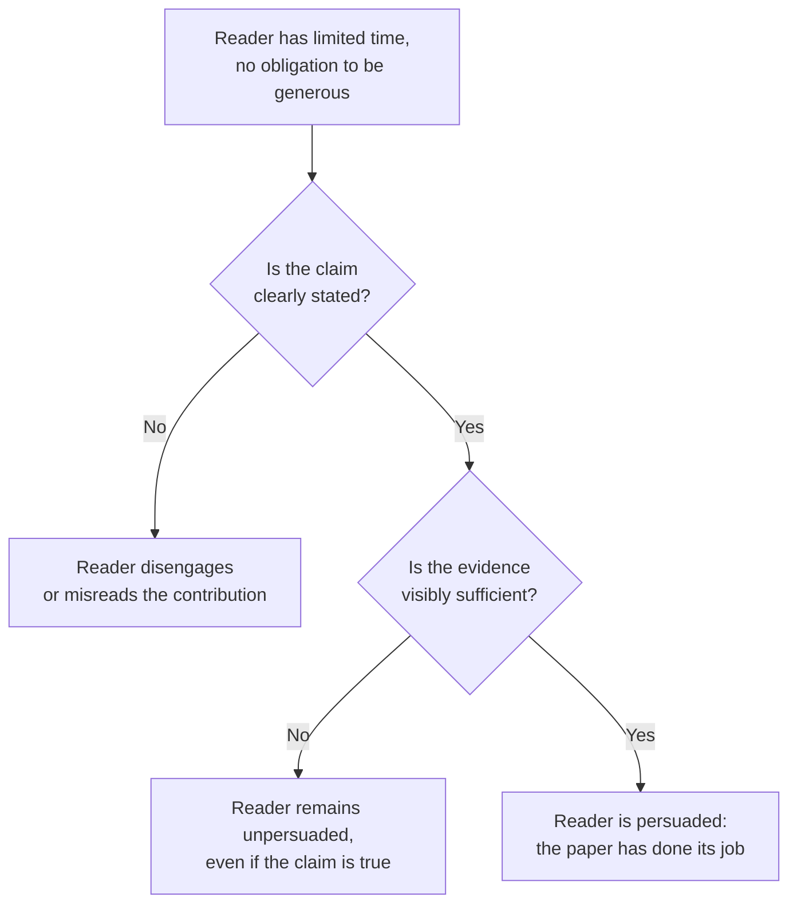

## Learning Objectives

- Name the main forms scientific results are published in (book, thesis, journal article, conference or workshop paper, technical report) and state what distinguishes each one's purpose and audience.
- Explain why a textbook is generally better written, and more settled, than a paper, and why that difference is a structural property of the genre rather than a matter of individual authors trying harder.
- State the core working assumption this whole discipline is built on: a paper's reader is a skeptical scientist who must be persuaded, not a sympathetic audience who already agrees.
- Explain why poor writing has a real, lasting cost, not just an aesthetic one, given how long a published paper can remain relevant and how many readers a piece of ambiguous prose can mislead.

## Context & Motivation

Every discipline in `graduate-studies` assumes the reader is already comfortable writing code, comfortable reading a textbook, and now needs a different, adjacent skill: producing writing that itself counts as a contribution to a field. That skill has its own literature, its own established authorities, and its own well-documented failure modes, the same way software construction or distributed systems does. The single most complete, most directly applicable treatment of it for this exact audience, graduate students and researchers in computing, is Justin Zobel's *Writing for Computer Science*, now in its third edition, used as the primary source across this discipline. Zobel is not writing in the abstract about "academic writing" in general; the book's worked examples, its checklists, and its running argument are all specifically about computer science research, which is why it anchors this discipline rather than a generic writing guide.

The book opens with a distinction worth taking seriously before writing a single sentence of research prose: scientific results are communicated through a small number of genuinely different publication forms, and each one is read differently, so each one demands different choices from the person writing it. A book, the form most students are already comfortable reading, usually collects settled knowledge into an accessible, readable presentation; its job is pedagogical, and it is generally better written than a paper precisely because that is its whole purpose. A thesis is a deep, sometimes definitive, exploration of a single problem, read by a small number of examiners whose job is to certify the work meets a standard, not simply to be entertained or quickly persuaded. A journal article is typically an end product of a research process, revised over multiple rounds of review, while a paper or extended abstract in conference proceedings can be an end product too, but is just as often a report of work still in progress, read by a wider, faster-moving, more skeptical audience under real time pressure. None of these differences are cosmetic; they change what "good writing" even means for a given piece.

What ties them together, and what Simon Peyton Jones's own widely watched talk on the subject converges on independently of Zobel, is a single working assumption that should discipline every later concept in this discipline: the reader of a research paper is a busy, skeptical scientist, not a friendly reviewer inclined to fill in gaps generously. That reader has, realistically, hours to spend on a paper that took its authors months or years to produce, and no obligation to work hard to extract the paper's meaning. Every later concept in `academic-writing`, from organization to citation to the mechanics of a sentence, is really one specific answer to the same underlying question this concept exists to state explicitly: what does it take to persuade that particular reader.

## Core Theory

### The publication forms and what each one is actually for

```text
Book              — settled knowledge, pedagogical purpose, generally the most
                     polished writing because that IS the job
Thesis             — one problem, explored deeply (sometimes definitively),
                     read by a small number of examiners who must certify it
Journal article    — typically an end product: new results, revised across
                     rounds of peer review before publication
Conference paper   — can be an end product too, but often reports work still
                     in progress, read faster and more skeptically
Technical report   — not peer reviewed; a way to publish work quickly, often
                     before or alongside a paper covering the same material
```

A common early mistake is to write every one of these the same way, on the theory that "good writing is good writing." The forms share underlying skills (clarity, honest argument, economy of language), covered by the concepts that follow, but they differ in how much context a reader already has, how skeptically that reader is reading, and how much of the paper's claim the reader is trusted to accept on the author's word alone. A textbook reader trusts the author to have already done the skeptical work. A journal reviewer explicitly has not, and is being asked to do exactly that skeptical work as their job.

### Why a book reads better than a paper, structurally

It is tempting to conclude that book authors are simply more skilled writers than paper authors, but the more accurate explanation is structural. A textbook's entire purpose is communicating already-verified knowledge as clearly as possible; nothing about a textbook's success depends on convincing a skeptical peer that a *new* claim is true, because a textbook, by definition, is not making new claims. A paper's purpose is the opposite: convincing a reader, who has every professional reason to doubt an unfamiliar claim, that something new and non-obvious is actually correct. That is a harder rhetorical task than exposition alone, and it is why paper-writing has its own literature (this discipline) distinct from technical-writing-in-general.

### The skeptical reader as the organizing constraint



Treating the reader as skeptical rather than sympathetic changes concrete decisions throughout a paper, not just its tone. It means a claim has to be stated precisely enough that it can be checked, not just gestured at. It means evidence has to be visibly sufficient on the page, not merely available to an author who "did the work" but never wrote the strongest version of it down. And it means ambiguity, which a sympathetic reader might resolve charitably in the author's favor, is a real cost with a skeptical reader, who has no obligation to resolve anything in the author's favor at all.

### The real, lasting cost of writing badly

Zobel makes a point worth taking literally rather than as rhetorical flourish: a published paper can remain relevant, and be read, for years or decades, and every reader whose understanding is slowed or corrupted by ambiguous writing pays a real cost, multiplied by however many readers the paper eventually has. This is different from a private email or an internal document, where a single confused reader can simply ask the author what they meant. A paper has no such recovery path once published; whatever ambiguity is in it stays in it.

## Worked Examples

### Example 1: choosing the right publication form for the same result

A student has built a new caching algorithm and evaluated it on three workloads. Should this become a workshop paper, a conference paper, or wait for a thesis chapter? If the algorithm is genuinely new and the evaluation is complete enough to stand alone, a conference paper is the right form: it is read by peers actively working in the area, under time pressure, and the paper's job is narrowly to persuade them this one contribution is real. If the evaluation is still partial, or the student wants fast, low-stakes feedback before investing in a full paper, a workshop paper or technical report is more honest about the work's actual state. If the algorithm is one chapter of a larger, multi-part investigation the student is building toward a degree, the fuller, more defensible version belongs in the thesis, where an examiner, not a time-pressured reviewer, is the intended reader.

### Example 2: the same sentence read two different ways

Consider the sentence "the algorithm is faster in most cases." A sympathetic reader might read this as basically true and move on. A skeptical reader immediately asks: faster than what, exactly, measured how, and what fraction of cases, precisely, count as "most"? Rewriting it as "the algorithm is faster than the baseline on 8 of the 10 workloads tested, with the two exceptions occurring on workloads with fewer than 100 elements" survives the skeptical reading, because it gives the reader everything needed to check the claim rather than trust it.

### Example 3: a technical report used correctly

A research group discovers a subtle flaw in a widely used consensus protocol and wants the finding available to the community quickly, before a full peer-reviewed paper can be written and reviewed, a process that can take months. Publishing the finding as a technical report first, then following with a fully reviewed paper later, is a legitimate, commonly used strategy precisely because a technical report is not peer reviewed and can be published immediately; it is a distinct genre serving a distinct, real need, not a lesser or lazier version of a paper.

## Common Misconceptions & Pitfalls

- **"If I understand it, a careful reader will too."** The skeptical-reader assumption exists specifically because this is false in practice: understanding built up over months of doing the work is not automatically reconstructable by a reader spending an hour with the finished paper.
- **"A technical report and a conference paper are basically the same thing, just formatted differently."** They differ in the single most consequential way a publication can differ, whether the claims in it have been independently checked by peer review, and conflating them misrepresents how much scrutiny a given piece of writing has actually survived.
- **"Good writing is a talent some researchers have and others don't."** Both Zobel and Peyton Jones treat this as false: writing well is a learnable, largely mechanical skill built from specific, teachable habits, which is precisely why this discipline exists as a sequence of concrete concepts rather than one piece of general encouragement.

## Summary

Scientific results are published through a small number of genuinely distinct forms, books, theses, journal articles, conference papers, and technical reports, each read by a different audience under different assumptions about how much scrutiny the content has already survived, and each therefore demanding different writing choices from its author. Underneath all of them sits one organizing assumption this entire discipline is built to serve: a paper's real reader is a busy, skeptical scientist who must be actively persuaded, not a friendly audience predisposed to agree, and the specific, lasting cost of ignoring that assumption, a paper misread or discounted by every reader it reaches for years after publication, is what makes writing well a genuine research skill rather than a cosmetic one.

## Documentation Links

- [ACM Digital Library: Justin Zobel, Writing for Computer Science (3rd Edition, Springer, 2014)](https://dl.acm.org/doi/10.5555/2742708): the discipline's primary source; Chapter 1, "Introduction," is the direct source for the publication-forms taxonomy and the skeptical-reader framing used throughout.
- [Microsoft Research: Simon Peyton Jones, How to Write a Great Research Paper](https://www.microsoft.com/en-us/research/academic-program/write-great-research-paper/): an independently developed, widely cited talk that converges on the same reader-centered view of what makes research writing succeed or fail.
