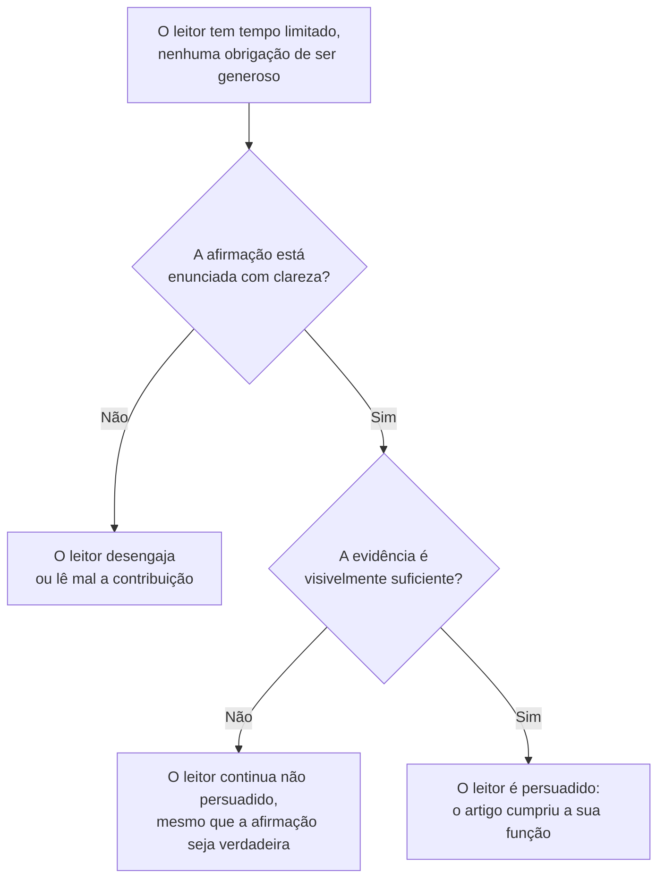

## Objetivos de Aprendizagem

- Nomear as principais formas em que os resultados científicos são publicados (livro, tese, artigo de periódico, artigo de conferência ou workshop, relatório técnico) e enunciar o que distingue o propósito e o público de cada uma.
- Explicar por que um livro-texto é, de modo geral, mais bem escrito, e mais assentado, do que um artigo, e por que essa diferença é uma propriedade estrutural do gênero, e não uma questão de autores individuais se esforçando mais.
- Enunciar a suposição central de trabalho sobre a qual esta disciplina inteira é construída: o leitor de um artigo é um cientista cético que precisa ser persuadido, e não um público simpático que já concorda.
- Explicar por que a escrita ruim tem um custo real e duradouro, e não só estético, dado quanto tempo um artigo publicado pode continuar relevante e quantos leitores uma prosa ambígua pode enganar.

## Contexto e Motivação

Toda disciplina em `graduate-studies` assume que o leitor já está à vontade escrevendo código, à vontade lendo um livro-texto, e agora precisa de uma habilidade diferente e adjacente: produzir uma escrita que ela mesma conte como uma contribuição para uma área. Essa habilidade tem a sua própria literatura, as suas próprias autoridades estabelecidas e os seus próprios modos de falha bem documentados, do mesmo jeito que a construção de software ou os sistemas distribuídos têm. O tratamento mais completo e mais diretamente aplicável dela para exatamente este público, estudantes de pós-graduação e pesquisadores em computação, é *Writing for Computer Science*, de Justin Zobel, agora em sua terceira edição, usado como fonte primária ao longo desta disciplina. Zobel não escreve de forma abstrata sobre "escrita acadêmica" em geral; os exemplos resolvidos do livro, as suas listas de checagem e o seu argumento condutor são todos especificamente sobre pesquisa em ciência da computação, e é por isso que ele ancora esta disciplina, em vez de um guia de escrita genérico.

O livro abre com uma distinção que vale levar a sério antes de escrever uma única frase de prosa de pesquisa: os resultados científicos são comunicados por um pequeno número de formas de publicação genuinamente diferentes, e cada uma é lida de forma diferente, então cada uma exige escolhas diferentes da pessoa que escreve. Um livro, a forma que a maioria dos estudantes já está à vontade lendo, costuma reunir conhecimento assentado numa apresentação acessível e legível; a sua função é pedagógica, e ele é, de modo geral, mais bem escrito do que um artigo precisamente porque esse é o seu propósito inteiro. Uma tese é uma exploração profunda, às vezes definitiva, de um único problema, lida por um pequeno número de examinadores cuja função é certificar que o trabalho atinge um padrão, e não simplesmente se entreter ou se persuadir depressa. Um artigo de periódico costuma ser um produto final de um processo de pesquisa, revisado ao longo de várias rodadas de avaliação, enquanto um artigo ou resumo estendido em anais de conferência pode ser um produto final também, mas é, com a mesma frequência, um relatório de trabalho ainda em andamento, lido por um público mais amplo, de ritmo mais rápido e mais cético, sob pressão real de tempo. Nenhuma dessas diferenças é cosmética; elas mudam o que "boa escrita" sequer significa para um dado texto.

O que as une, e aquilo para que a própria palestra bastante assistida de Simon Peyton Jones sobre o assunto converge de forma independente de Zobel, é uma única suposição de trabalho que deveria disciplinar todo conceito posterior desta disciplina: o leitor de um artigo de pesquisa é um cientista ocupado e cético, e não um avaliador amigável inclinado a preencher lacunas com generosidade. Esse leitor tem, de forma realista, horas para gastar com um artigo que levou meses ou anos para os seus autores produzirem, e nenhuma obrigação de trabalhar duro para extrair o significado do artigo. Todo conceito posterior em `academic-writing`, da organização à citação e à mecânica de uma frase, é, na verdade, uma resposta específica à mesma pergunta subjacente que este conceito existe para enunciar de forma explícita: o que é preciso para persuadir aquele leitor específico.

## Teoria Central

### As formas de publicação e para que cada uma serve de fato

```text
Livro              — conhecimento assentado, propósito pedagógico, geralmente a
                     escrita mais polida porque ESSE é o trabalho
Tese               — um problema, explorado em profundidade (às vezes de forma
                     definitiva), lido por um pequeno número de examinadores que
                     precisam certificá-lo
Artigo de periódico— normalmente um produto final: resultados novos, revisados ao
                     longo de rodadas de avaliação por pares antes da publicação
Artigo de conferência — pode ser um produto final também, mas muitas vezes relata
                     trabalho ainda em andamento, lido mais depressa e com mais
                     ceticismo
Relatório técnico  — não avaliado por pares; uma forma de publicar trabalho depressa,
                     muitas vezes antes de ou junto a um artigo que cobre o mesmo material
```

Um erro comum no começo é escrever cada uma dessas da mesma forma, na teoria de que "boa escrita é boa escrita". As formas compartilham habilidades subjacentes (clareza, argumento honesto, economia de linguagem), cobertas pelos conceitos que se seguem, mas diferem em quanto contexto o leitor já tem, com quanto ceticismo esse leitor está lendo, e quanto da afirmação do artigo o leitor é confiado a aceitar só pela palavra do autor. Um leitor de livro-texto confia que o autor já fez o trabalho cético. Um avaliador de periódico explicitamente não fez, e está sendo pedido a fazer exatamente esse trabalho cético como a sua função.

### Por que um livro se lê melhor do que um artigo, estruturalmente

É tentador concluir que os autores de livros são simplesmente escritores mais habilidosos do que os autores de artigos, mas a explicação mais acurada é estrutural. O propósito inteiro de um livro-texto é comunicar conhecimento já verificado da forma mais clara possível; nada sobre o sucesso de um livro-texto depende de convencer um par cético de que uma afirmação *nova* é verdadeira, porque um livro-texto, por definição, não faz afirmações novas. O propósito de um artigo é o oposto: convencer um leitor, que tem toda razão profissional para duvidar de uma afirmação desconhecida, de que algo novo e não óbvio é de fato correto. Essa é uma tarefa retórica mais difícil do que a exposição sozinha, e é por isso que a escrita de artigos tem a sua própria literatura (esta disciplina), distinta da escrita técnica em geral.

### O leitor cético como a restrição organizadora



Tratar o leitor como cético, e não como simpático, muda decisões concretas ao longo de um artigo, não só o seu tom. Significa que uma afirmação precisa ser enunciada de forma precisa o bastante para que possa ser conferida, e não só gesticulada. Significa que a evidência precisa ser visivelmente suficiente na página, e não só estar disponível a um autor que "fez o trabalho", mas nunca escreveu a versão mais forte dele. E significa que a ambiguidade, que um leitor simpático poderia resolver com caridade a favor do autor, é um custo real com um leitor cético, que não tem nenhuma obrigação de resolver nada a favor do autor.

### O custo real e duradouro de escrever mal

Zobel faz uma observação que vale levar ao pé da letra, e não como floreio retórico: um artigo publicado pode continuar relevante, e ser lido, por anos ou décadas, e todo leitor cuja compreensão é retardada ou corrompida por uma escrita ambígua paga um custo real, multiplicado por quantos leitores o artigo eventualmente tiver. Isso é diferente de um e-mail privado ou de um documento interno, onde um único leitor confuso pode simplesmente perguntar ao autor o que ele quis dizer. Um artigo não tem esse caminho de recuperação uma vez publicado; qualquer ambiguidade que haja nele permanece nele.

## Exemplos Resolvidos

### Exemplo 1: escolher a forma de publicação certa para o mesmo resultado

Um estudante construiu um novo algoritmo de cache e o avaliou em três cargas. Isso deveria virar um artigo de workshop, um artigo de conferência, ou esperar por um capítulo de tese? Se o algoritmo é genuinamente novo e a avaliação é completa o bastante para se sustentar sozinha, um artigo de conferência é a forma certa: ele é lido por pares trabalhando ativamente na área, sob pressão de tempo, e a função do artigo é, de forma estreita, persuadi-los de que essa única contribuição é real. Se a avaliação ainda é parcial, ou o estudante quer um retorno rápido e de baixo risco antes de investir num artigo completo, um artigo de workshop ou relatório técnico é mais honesto sobre o estado de fato do trabalho. Se o algoritmo é um capítulo de uma investigação maior e de várias partes que o estudante está construindo rumo a um diploma, a versão mais completa e mais defensável pertence à tese, onde um examinador, e não um avaliador pressionado pelo tempo, é o leitor pretendido.

### Exemplo 2: a mesma frase lida de duas formas diferentes

Considere a frase "o algoritmo é mais rápido na maioria dos casos". Um leitor simpático poderia ler isso como basicamente verdadeiro e seguir em frente. Um leitor cético pergunta imediatamente: mais rápido do que o quê, exatamente, medido como, e que fração dos casos, precisamente, conta como "a maioria"? Reescrevê-la como "o algoritmo é mais rápido do que a linha de base em 8 das 10 cargas testadas, com as duas exceções ocorrendo em cargas com menos de 100 elementos" sobrevive à leitura cética, porque dá ao leitor tudo o que ele precisa para conferir a afirmação, em vez de confiar nela.

### Exemplo 3: um relatório técnico usado corretamente

Um grupo de pesquisa descobre uma falha sutil num protocolo de consenso amplamente usado e quer a descoberta disponível para a comunidade depressa, antes que um artigo totalmente avaliado por pares possa ser escrito e revisado, um processo que pode levar meses. Publicar a descoberta como um relatório técnico primeiro, e depois seguir com um artigo totalmente avaliado mais tarde, é uma estratégia legítima e comumente usada precisamente porque um relatório técnico não é avaliado por pares e pode ser publicado imediatamente; é um gênero distinto servindo a uma necessidade distinta e real, e não uma versão menor ou mais preguiçosa de um artigo.

## Equívocos Comuns e Armadilhas

- **"Se eu entendo, um leitor cuidadoso também vai entender."** A suposição do leitor cético existe especificamente porque isso é falso na prática: a compreensão construída ao longo de meses fazendo o trabalho não é automaticamente reconstruível por um leitor que passa uma hora com o artigo pronto.
- **"Um relatório técnico e um artigo de conferência são basicamente a mesma coisa, só formatados de forma diferente."** Eles diferem na forma mais consequente em que uma publicação pode diferir, se as afirmações nela foram conferidas de forma independente por avaliação por pares, e confundi-los deturpa quanto escrutínio um dado texto de fato sobreviveu.
- **"Boa escrita é um talento que alguns pesquisadores têm e outros não."** Tanto Zobel quanto Peyton Jones tratam isso como falso: escrever bem é uma habilidade aprendível, em grande parte mecânica, construída a partir de hábitos específicos e ensináveis, que é precisamente por que esta disciplina existe como uma sequência de conceitos concretos, e não como um único pedaço de encorajamento geral.

## Resumo

Os resultados científicos são publicados por um pequeno número de formas genuinamente distintas, livros, teses, artigos de periódico, artigos de conferência e relatórios técnicos, cada um lido por um público diferente sob suposições diferentes sobre quanto escrutínio o conteúdo já sobreviveu, e cada um, portanto, exigindo escolhas de escrita diferentes do seu autor. Debaixo de todos eles está uma suposição organizadora que esta disciplina inteira é construída para servir: o leitor real de um artigo é um cientista ocupado e cético que precisa ser ativamente persuadido, e não um público amigável predisposto a concordar, e o custo específico e duradouro de ignorar essa suposição, um artigo lido mal ou descontado por todo leitor que ele alcança por anos após a publicação, é o que torna escrever bem uma habilidade de pesquisa genuína, e não uma cosmética.

## Documentation Links

- [ACM Digital Library: Justin Zobel, Writing for Computer Science (3ª edição, Springer, 2014)](https://dl.acm.org/doi/10.5555/2742708): a fonte primária da disciplina; o Capítulo 1, "Introduction", é a fonte direta da taxonomia das formas de publicação e do enquadramento do leitor cético usado por toda parte.
- [Microsoft Research: Simon Peyton Jones, How to Write a Great Research Paper](https://www.microsoft.com/en-us/research/academic-program/write-great-research-paper/): uma palestra desenvolvida de forma independente e amplamente citada que converge para a mesma visão, centrada no leitor, do que faz a escrita de pesquisa dar certo ou errado.
