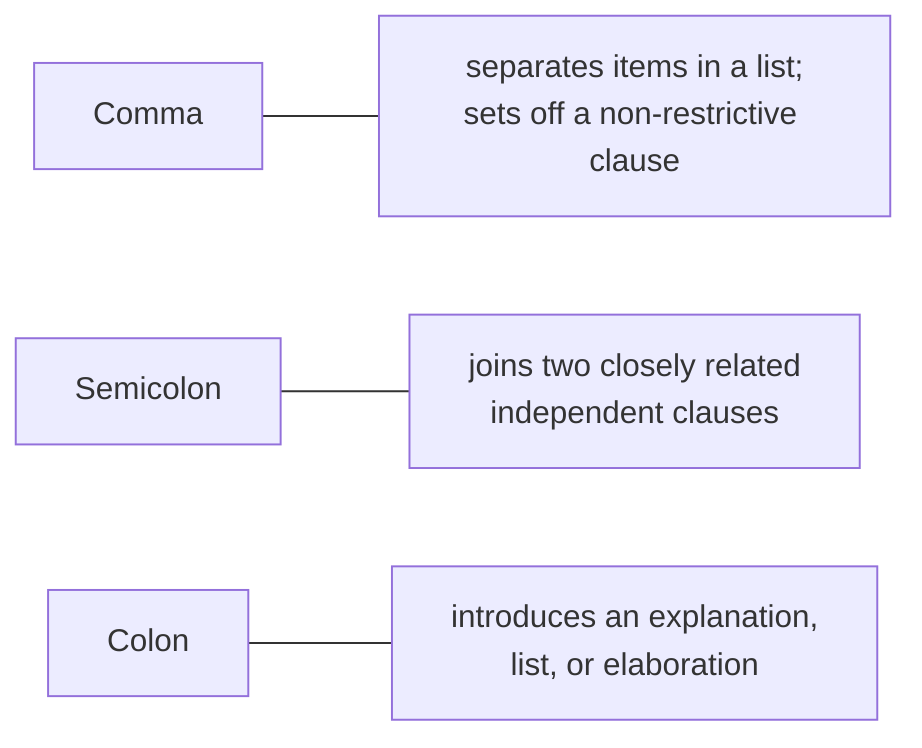

## Learning Objectives

- List the concrete, sentence-level and below decisions that make up "style specifics": titles and headings, opening paragraphs, sentence structure and ambiguity, tense, and punctuation conventions.
- Explain why a paper's title and headings should describe content precisely rather than tease or editorialize.
- Identify common sources of accidental ambiguity in technical sentences and how to rewrite around them.
- Apply a consistent tense convention across a paper: past tense for completed work, present tense for established fact.

## Context & Motivation

`good-style-economy-tone-and-audience` covered style at the level of the sentence and paragraph as a whole: economy, tone, audience. This concept goes one level further down, into the smaller, more mechanical decisions Zobel groups under "Style Specifics" and "Punctuation," decisions that individually look trivial, a comma placement, whether a heading is a noun phrase or a full sentence, and collectively signal to a careful reader whether the surrounding prose was written with real attention to detail. A technical reader, already primed by a paper's subject matter to expect precision, notices sloppiness at this level more readily than a casual reader would, which is precisely why these mechanics matter more in research writing than their apparent triviality would suggest.

## Core Theory

### Titles and headings that describe rather than tease

A paper's title and its section headings exist to let a reader navigate and decide what to read closely, which means they should describe content precisely rather than build suspense or use clever wordplay that obscures what the section actually contains. "A Novel Approach" as a heading tells a reader nothing checkable; "A Quorum-Based Replication Protocol for Partial Network Partitions" does. The same discipline applies to the paper's own title: a title vague enough to fit many different papers has failed at its one job, letting a reader searching the literature correctly judge relevance without opening the paper.

### Opening paragraphs that orient immediately

Zobel's guidance on opening paragraphs is direct: a technical paper's opening should orient the reader immediately, what problem, why it matters, what this paper does about it, rather than building toward that information gradually the way narrative prose might. A skeptical, time-pressured reader deciding whether to keep reading is making that decision within the first paragraph or two; an opening that delays the paper's actual point risks losing that reader before the real argument even begins.

### Ambiguity and sentence structure

```text
Ambiguous:   "We tested the algorithm on the dataset with missing values."
             (Does "with missing values" modify the algorithm or the dataset?)

Unambiguous: "We tested the algorithm on a dataset that contains missing
              values."
```

Most accidental ambiguity in technical writing comes from a small number of recurring structural patterns: a modifying phrase that could attach to more than one noun, a pronoun ("it," "this") whose antecedent is not immediately obvious, or a long sentence with multiple clauses where the relationship between them is left for the reader to infer. Zobel's advice is not to avoid complex sentences altogether, some ideas genuinely need them, but to read each sentence deliberately looking for a second, unintended parse before moving on, since the author, already knowing the intended meaning, is the person least likely to notice an available second reading.

### Tense as a consistent signal

A specific, learnable convention resolves most tense confusion in research writing: past tense describes what was actually done, the specific experiment run, the specific result obtained, because it happened at a specific point in the past and will not change. Present tense describes what is established, generally true, or true of the paper itself as an ongoing object: "the algorithm runs in O(n log n) time" (an established property), "Section 4 presents the evaluation" (true of the paper as it exists now). Mixing these inconsistently, describing a specific experiment's outcome in present tense, forces a reader to work out from context alone what the author actually means, exactly the kind of avoidable ambiguity this concept as a whole is about eliminating.

### Punctuation conventions that carry real information



Punctuation in technical writing is not stylistic flourish; a comma's presence or absence can change whether a clause is read as essential to a sentence's meaning or merely additional detail, and a semicolon versus a full stop signals to a reader whether two statements are meant to be read as tightly connected or as separate points. Zobel's punctuation guidance treats these as precision tools with the same weight as word choice, worth getting consistently right for exactly the reason ambiguity elsewhere in this concept is worth eliminating.

## Worked Examples

### Example 1: rewriting a vague heading

A section heading reads "Evaluation." Rewritten to describe its actual content: "Evaluation: Throughput and Latency Under Partial Network Partition." A reader scanning the paper's table of contents now knows, without opening the section, exactly what evidence it contains.

### Example 2: fixing an opening paragraph that delays the point

A draft opens: "Distributed systems have become increasingly important over the past decade, powering everything from web services to financial infrastructure. As systems have scaled, new challenges have emerged..." Three sentences in, the reader still does not know what this specific paper is about. Rewritten to orient immediately: "Quorum-based replication protocols degrade sharply under partial network partitions, a failure mode common in geo-distributed deployments; this paper presents a hybrid quorum design that avoids that degradation." The problem, its significance, and the paper's response are all present in the first two sentences.

### Example 3: resolving a tense inconsistency

A results section states: "The algorithm achieves a 12% improvement over the baseline." Read carefully, this uses present tense for a specific, one-time experimental outcome, which reads as an overgeneralized, ongoing claim rather than what was actually observed. Corrected to past tense: "The algorithm achieved a 12% improvement over the baseline on the tested workloads," which accurately scopes the claim to the specific experiment reported, while a nearby present-tense sentence, "the algorithm has O(n log n) time complexity," correctly states an established, general property.

## Common Misconceptions & Pitfalls

- **"A clever, intriguing title generates more interest."** Zobel's guidance treats this as counterproductive in technical writing specifically: a title's job is enabling accurate literature search and quick relevance judgment, which a vague or clever title actively undermines regardless of how much interest it generates once opened.
- **"Tense doesn't really matter as long as the meaning is roughly clear."** Consistent tense is one of the more reliable, checkable ways a reader distinguishes a specific experimental result from a general, established claim; inconsistency here creates exactly the kind of ambiguity this whole discipline is built to eliminate.
- **"Punctuation is a minor proofreading concern, not a real writing skill."** Punctuation choices directly affect whether a clause reads as essential or additional information, and getting this wrong is a real source of ambiguity, not merely an aesthetic lapse.

## Summary

Below paragraph-level style sit a set of smaller, concrete mechanics that collectively signal careful attention to a technical reader: titles and headings that describe content precisely rather than tease, opening paragraphs that orient a reader immediately rather than building up to the point, sentence structures checked deliberately for accidental ambiguity the author is unlikely to notice unaided, a consistent tense convention distinguishing specific past results from general established facts, and punctuation used as a precision tool rather than an afterthought. Each of these is a small, individually fixable habit, not an untaught matter of personal taste.

## Documentation Links

- [ACM Digital Library: Justin Zobel, Writing for Computer Science (3rd Edition, Springer, 2014)](https://dl.acm.org/doi/10.5555/2742708): Chapters 7, "Style Specifics," and 8, "Punctuation," are the direct source for the titles, headings, ambiguity, tense, and punctuation guidance covered here.
