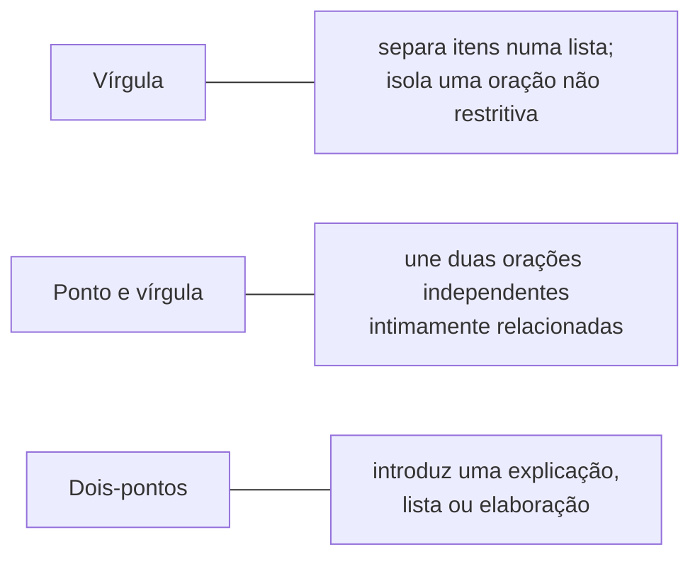

## Objetivos de Aprendizagem

- Listar as decisões concretas, em nível de frase e abaixo, que compõem as "especificidades de estilo": títulos e cabeçalhos, parágrafos de abertura, estrutura de frase e ambiguidade, tempo verbal e convenções de pontuação.
- Explicar por que o título e os cabeçalhos de um artigo devem descrever o conteúdo com precisão, em vez de instigar ou editorializar.
- Identificar fontes comuns de ambiguidade acidental em frases técnicas e como reescrevê-las para contorná-las.
- Aplicar uma convenção de tempo verbal consistente ao longo de um artigo: passado para trabalho concluído, presente para fato estabelecido.

## Contexto e Motivação

`good-style-economy-tone-and-audience` cobriu o estilo no nível da frase e do parágrafo como um todo: economia, tom, público. Este conceito desce um nível adiante, até as decisões menores e mais mecânicas que Zobel agrupa sob "Style Specifics" e "Punctuation", decisões que individualmente parecem triviais, a colocação de uma vírgula, se um cabeçalho é uma locução nominal ou uma frase completa, e que coletivamente sinalizam a um leitor cuidadoso se a prosa ao redor foi escrita com real atenção ao detalhe. Um leitor técnico, já predisposto pelo tema de um artigo a esperar precisão, nota o desleixo neste nível mais prontamente do que um leitor casual notaria, que é precisamente por que essas mecânicas importam mais na escrita de pesquisa do que a sua aparente trivialidade sugeriria.

## Teoria Central

### Títulos e cabeçalhos que descrevem em vez de instigar

O título de um artigo e os seus cabeçalhos de seção existem para deixar um leitor navegar e decidir o que ler de perto, o que significa que eles devem descrever o conteúdo com precisão, em vez de criar suspense ou usar um jogo de palavras esperto que obscurece o que a seção de fato contém. "Uma Abordagem Nova" como cabeçalho não diz nada conferível a um leitor; "Um Protocolo de Replicação Baseado em Quórum para Partições Parciais de Rede" diz. A mesma disciplina se aplica ao próprio título do artigo: um título vago o bastante para caber em muitos artigos diferentes falhou na sua única função, deixar um leitor que vasculha a literatura julgar corretamente a relevância sem abrir o artigo.

### Parágrafos de abertura que orientam de imediato

A orientação de Zobel sobre parágrafos de abertura é direta: a abertura de um artigo técnico deve orientar o leitor de imediato, qual problema, por que ele importa, o que este artigo faz a respeito, em vez de construir rumo a essa informação aos poucos, do jeito que a prosa narrativa poderia. Um leitor cético e pressionado pelo tempo, decidindo se continua lendo, está tomando essa decisão dentro do primeiro ou do segundo parágrafo; uma abertura que adia o ponto de fato do artigo arrisca perder esse leitor antes mesmo de o argumento real começar.

### Ambiguidade e estrutura de frase

```text
Ambíguo:     "Testamos o algoritmo no conjunto de dados com valores faltantes."
             (O "com valores faltantes" modifica o algoritmo ou o conjunto de dados?)

Sem ambiguidade: "Testamos o algoritmo num conjunto de dados que contém valores
              faltantes."
```

A maior parte da ambiguidade acidental na escrita técnica vem de um pequeno número de padrões estruturais recorrentes: uma locução modificadora que poderia se ligar a mais de um substantivo, um pronome ("ele", "isso") cujo antecedente não é imediatamente óbvio, ou uma frase longa com várias orações onde a relação entre elas é deixada para o leitor inferir. O conselho de Zobel não é evitar frases complexas por completo, algumas ideias genuinamente precisam delas, mas ler cada frase deliberadamente em busca de uma segunda leitura não intencional antes de seguir adiante, já que o autor, que já conhece o significado pretendido, é a pessoa menos propensa a notar uma segunda leitura disponível.

### Tempo verbal como sinal consistente

Uma convenção específica e aprendível resolve a maior parte da confusão de tempo verbal na escrita de pesquisa: o passado descreve o que foi de fato feito, o experimento específico realizado, o resultado específico obtido, porque aconteceu num ponto específico do passado e não vai mudar. O presente descreve o que é estabelecido, geralmente verdadeiro, ou verdadeiro do próprio artigo como objeto em curso: "o algoritmo roda em tempo O(n log n)" (uma propriedade estabelecida), "a Seção 4 apresenta a avaliação" (verdadeiro do artigo tal como ele existe agora). Misturar isso de forma inconsistente, descrever o resultado de um experimento específico no presente, força um leitor a deduzir só do contexto o que o autor de fato quer dizer, exatamente o tipo de ambiguidade evitável sobre o qual este conceito como um todo trata de eliminar.

### Convenções de pontuação que carregam informação real



A pontuação na escrita técnica não é floreio estilístico; a presença ou a ausência de uma vírgula pode mudar se uma oração é lida como essencial ao significado de uma frase ou como mero detalhe adicional, e um ponto e vírgula versus um ponto final sinaliza a um leitor se duas afirmações são para ser lidas como estreitamente conectadas ou como pontos separados. A orientação de pontuação de Zobel as trata como ferramentas de precisão com o mesmo peso da escolha de palavras, dignas de acertar de forma consistente exatamente pelo mesmo motivo que a ambiguidade em outras partes deste conceito vale a pena eliminar.

## Exemplos Resolvidos

### Exemplo 1: reescrever um cabeçalho vago

Um cabeçalho de seção diz "Avaliação". Reescrito para descrever o seu conteúdo de fato: "Avaliação: Vazão e Latência Sob Partição Parcial de Rede." Um leitor que percorre o sumário do artigo agora sabe, sem abrir a seção, exatamente que evidência ela contém.

### Exemplo 2: corrigir um parágrafo de abertura que adia o ponto

Um rascunho abre: "Os sistemas distribuídos se tornaram cada vez mais importantes ao longo da última década, movendo tudo, de serviços web a infraestrutura financeira. Conforme os sistemas escalaram, novos desafios surgiram..." Três frases adentro, o leitor ainda não sabe do que trata este artigo específico. Reescrito para orientar de imediato: "Protocolos de replicação baseados em quórum se degradam de forma acentuada sob partições parciais de rede, um modo de falha comum em implantações geodistribuídas; este artigo apresenta um projeto híbrido de quórum que evita essa degradação." O problema, a sua significância e a resposta do artigo estão todos presentes nas duas primeiras frases.

### Exemplo 3: resolver uma inconsistência de tempo verbal

Uma seção de resultados afirma: "O algoritmo alcança uma melhoria de 12% sobre a linha de base." Lida com cuidado, isso usa o presente para um resultado experimental específico e único, o que se lê como uma afirmação supergeneralizada e em curso, em vez do que foi de fato observado. Corrigido para o passado: "O algoritmo alcançou uma melhoria de 12% sobre a linha de base nas cargas testadas", o que delimita com precisão a afirmação ao experimento específico relatado, enquanto uma frase vizinha no presente, "o algoritmo tem complexidade de tempo O(n log n)", enuncia corretamente uma propriedade estabelecida e geral.

## Equívocos Comuns e Armadilhas

- **"Um título esperto e intrigante gera mais interesse."** A orientação de Zobel trata isso como contraproducente na escrita técnica especificamente: a função de um título é viabilizar a busca acurada na literatura e o julgamento rápido de relevância, que um título vago ou esperto ativamente mina, independentemente de quanto interesse ele gere uma vez aberto.
- **"O tempo verbal não importa muito, desde que o sentido fique mais ou menos claro."** O tempo verbal consistente é uma das formas mais confiáveis e conferíveis de um leitor distinguir um resultado experimental específico de uma afirmação geral e estabelecida; a inconsistência aqui cria exatamente o tipo de ambiguidade que esta disciplina inteira é construída para eliminar.
- **"A pontuação é uma preocupação menor de revisão, não uma habilidade real de escrita."** As escolhas de pontuação afetam diretamente se uma oração é lida como informação essencial ou adicional, e errar isso é uma fonte real de ambiguidade, e não um mero lapso estético.

## Resumo

Abaixo do estilo em nível de parágrafo há um conjunto de mecânicas menores e concretas que coletivamente sinalizam atenção cuidadosa a um leitor técnico: títulos e cabeçalhos que descrevem o conteúdo com precisão em vez de instigar, parágrafos de abertura que orientam o leitor de imediato em vez de construir rumo ao ponto, estruturas de frase conferidas deliberadamente em busca de ambiguidade acidental que o autor dificilmente notaria sem ajuda, uma convenção de tempo verbal consistente distinguindo resultados passados específicos de fatos gerais estabelecidos, e a pontuação usada como ferramenta de precisão, e não como algo acessório. Cada uma dessas é um hábito pequeno e individualmente corrigível, e não uma questão não ensinada de gosto pessoal.

## Documentation Links

- [ACM Digital Library: Justin Zobel, Writing for Computer Science (3ª edição, Springer, 2014)](https://dl.acm.org/doi/10.5555/2742708): os Capítulos 7, "Style Specifics", e 8, "Punctuation", são a fonte direta da orientação sobre títulos, cabeçalhos, ambiguidade, tempo verbal e pontuação coberta aqui.
