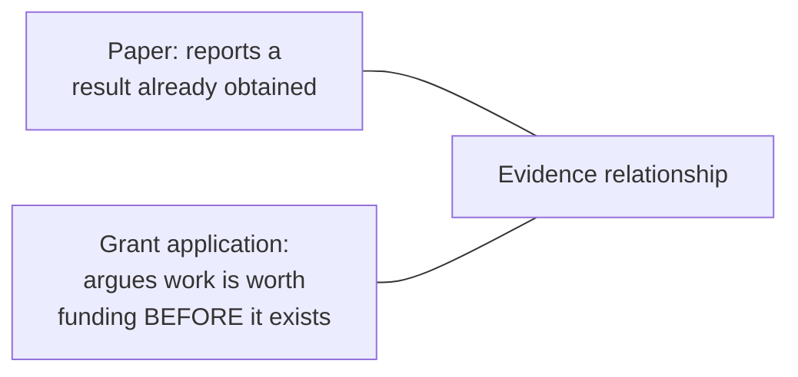

## Learning Objectives

- Distinguish a technical report's typical audience and purpose from a paper's, and explain why a report often has to supply background a paper would cite in one sentence.
- Explain why a grant application inverts a paper's usual relationship to evidence: arguing for feasibility and significance before the work exists, rather than reporting a result already obtained.
- Identify the concrete structural elements both genres share with paper-writing, and the elements each genre adds or changes.
- Apply a scoping question, understanding precisely what a specific report or application is actually being asked to do, before drafting either genre.

## Context & Motivation

Graduate research produces written artifacts beyond papers and theses, and treating every one of them as a slightly smaller or slightly less formal paper produces writing that fits neither its actual audience nor its actual purpose well. Zobel's chapter on "Other Professional Writing" covers exactly this gap, technical reports and grant applications specifically, as genres with their own real structural logic, building on, but genuinely distinct from, the paper-writing skills covered earlier in this discipline.

## Core Theory

### Scoping the task first

Zobel's first, and in practice most consequential, piece of advice for both genres is understanding precisely what the specific piece of writing is being asked to do before drafting begins: who exactly will read a given technical report, and what decision or understanding are they meant to take from it; what exactly is a specific grant call asking applicants to argue, since funding bodies vary in whether they prioritize novelty, feasibility, or broader impact. Skipping this scoping step and drafting from a generic template is a more common and more costly failure in these genres than in paper-writing, precisely because reports and grant applications vary more, by audience and by funder, than the comparatively standardized genre of a research paper does.

### Technical reports: a wider, less specialist audience

```text
Paper's related work:   "Prior work has established X [citation]."
                         (assumes the reader already knows the area)

Report's equivalent:    a fuller explanation of X and why it matters,
                         because the report's reader may be a manager,
                         a client, or a researcher from an adjacent
                         field who does not share the paper reader's
                         specialist background.
```

A technical report is often written for a reader who needs to make a decision, whether to adopt a technique, whether to fund further work, based on the report, without necessarily sharing the deep specialist background a paper's peer reviewer would have. This changes real structural choices: more explanation of background a paper would compress into a citation, a clearer, more prominent statement of practical implications, and often a more direct, less hedged statement of recommendations than a paper's more measured discussion section would typically include.

### Grant applications: arguing before the result exists



A paper's central rhetorical task is persuading a reader that an already-obtained result is real and significant. A grant application inverts this entirely: there is no completed result yet to point to, so the persuasive burden shifts to arguing feasibility, why this specific approach is likely to succeed, given preliminary evidence, relevant prior expertise, or a sound methodological plan, and significance, why the problem matters enough, and the proposed approach is promising enough, to justify the investment before any outcome is guaranteed. Grant reviewers are evaluating a bet on future work, not verifying a completed claim, which changes what kind of evidence a strong application actually needs: preliminary results and a credible plan carry more weight here than they would in a paper claiming a finished, defended result.

### What carries over from paper-writing, and what changes

Both genres still rely on the economy, tone, and audience-awareness covered in `good-style-economy-tone-and-audience`, and both still benefit from the "tell a story" organizational discipline from `the-shape-of-a-paper-scope-story-and-organization`, a report or application with a clear, single throughline is more persuasive than one that lists disconnected points. What changes is the specific claim being argued and the specific evidence available to argue it: a report argues for a conclusion or recommendation using completed work, aimed at a broader, more mixed audience; a grant application argues for future funding using a plan and preliminary evidence, aimed at reviewers evaluating risk and potential impact rather than verifying a finished result.

## Worked Examples

### Example 1: scoping a technical report correctly

A researcher is asked to write a report on a new caching technique's viability for an engineering team, not a research audience. Scoped correctly, the report leads with the practical question, does this improve our system's actual performance and is it worth the integration cost, rather than opening with the kind of related-work survey a paper aimed at peer researchers would include; the engineering audience needs a recommendation and its practical basis, not a literature review.

### Example 2: arguing feasibility without a finished result

A grant application proposes a new approach to verifying distributed protocol correctness. Rather than claiming the approach already works, since it does not yet exist as finished work, the application argues feasibility through a small, preliminary case study on a simplified protocol, showing the core technique functions at a small scale, combined with a credible, staged plan for scaling the approach, exactly the kind of preliminary-evidence-plus-plan argument grant reviewers are positioned to evaluate.

### Example 3: adapting the "tell a story" discipline to a report

A draft report lists five separate, loosely related findings from an internal evaluation with no overall throughline. Restructured around one central recommendation, informed by, but not simply listing, the five findings, the report becomes more persuasive to its actual reader, a decision-maker who needs one clear takeaway more than an exhaustive inventory of everything observed.

## Common Misconceptions & Pitfalls

- **"A technical report is basically a paper without peer review."** The difference in audience, often broader and less specialist than a paper's peer readership, changes real structural choices, not just the review process the document does or does not go through.
- **"A grant application should focus mainly on how interesting the idea is."** Reviewers are evaluating a bet on future success; feasibility, credible evidence the proposed approach can actually work, carries as much or more weight than novelty alone.
- **"The same draft, lightly reformatted, can serve as both a report and a paper on the same work."** Scoping the specific audience and purpose first, per this concept's central lesson, usually means the two documents need genuinely different structure and emphasis, not just a different template applied to identical content.

## Summary

Technical reports and grant applications are distinct, learnable genres, not lesser or simpler versions of a paper: a report often has to supply background and practical framing a paper's specialist peer reader would not need, while a grant application inverts a paper's usual relationship to evidence entirely, arguing for feasibility and significance before any result exists, using preliminary evidence and a credible plan rather than a completed, defended claim. Both still draw on the economy, tone, and organizational discipline built up earlier in this discipline, but scoping precisely what a specific report or application is actually being asked to do, for exactly which reader, is the first and most consequential step in either genre.

## Documentation Links

- [ACM Digital Library: Justin Zobel, Writing for Computer Science (3rd Edition, Springer, 2014)](https://dl.acm.org/doi/10.5555/2742708): Chapter 12, "Other Professional Writing," is the direct source for the scoping, technical-report, and grant-application guidance covered here.
