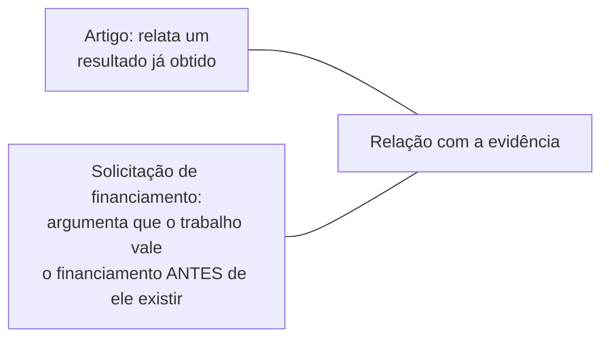

## Objetivos de Aprendizagem

- Distinguir o público e o propósito típicos de um relatório técnico dos de um artigo, e explicar por que um relatório muitas vezes tem de fornecer um contexto que um artigo citaria numa frase.
- Explicar por que uma solicitação de financiamento inverte a relação usual de um artigo com a evidência: argumentar por viabilidade e significância antes de o trabalho existir, em vez de relatar um resultado já obtido.
- Identificar os elementos estruturais concretos que ambos os gêneros compartilham com a escrita de artigos, e os elementos que cada gênero acrescenta ou muda.
- Aplicar uma pergunta de delimitação de escopo, entender com precisão o que um relatório ou solicitação específico está de fato sendo pedido a fazer, antes de rascunhar qualquer um dos gêneros.

## Contexto e Motivação

A pesquisa de pós-graduação produz artefatos escritos além de artigos e teses, e tratar cada um deles como um artigo um pouco menor ou um pouco menos formal produz uma escrita que não se ajusta bem nem ao seu público de fato nem ao seu propósito de fato. O capítulo de Zobel sobre "Other Professional Writing" cobre exatamente essa lacuna, relatórios técnicos e solicitações de financiamento especificamente, como gêneros com a sua própria lógica estrutural real, construída sobre, mas genuinamente distinta das, habilidades de escrita de artigos cobertas antes nesta disciplina.

## Teoria Central

### Delimitar o escopo da tarefa primeiro

O primeiro, e na prática mais consequente, conselho de Zobel para ambos os gêneros é entender com precisão o que o texto específico está sendo pedido a fazer antes de o rascunho começar: quem exatamente vai ler um dado relatório técnico, e que decisão ou entendimento ele deve tirar dele; o que exatamente uma chamada de financiamento específica está pedindo que os candidatos argumentem, já que as agências de fomento variam quanto a priorizar novidade, viabilidade ou impacto mais amplo. Pular essa etapa de delimitação de escopo e rascunhar a partir de um modelo genérico é uma falha mais comum e mais custosa nesses gêneros do que na escrita de artigos, precisamente porque relatórios e solicitações de financiamento variam mais, por público e por financiador, do que o gênero comparativamente padronizado de um artigo de pesquisa varia.

### Relatórios técnicos: um público mais amplo e menos especialista

```text
Trabalhos relacionados de um artigo:   "Trabalhos anteriores estabeleceram X [citação]."
                         (assume que o leitor já conhece a área)

Equivalente num relatório:    uma explicação mais completa de X e por que ele importa,
                         porque o leitor do relatório pode ser um gestor,
                         um cliente, ou um pesquisador de uma área
                         adjacente que não compartilha o contexto
                         especialista do leitor de artigos.
```

Um relatório técnico é muitas vezes escrito para um leitor que precisa tomar uma decisão, se adota uma técnica, se financia mais trabalho, com base no relatório, sem necessariamente compartilhar o profundo contexto especialista que um avaliador por pares de um artigo teria. Isso muda escolhas estruturais reais: mais explicação de um contexto que um artigo comprimiria numa citação, uma afirmação mais clara e mais proeminente das implicações práticas, e muitas vezes uma afirmação mais direta e menos ressalvada das recomendações do que uma seção de discussão mais comedida de um artigo normalmente incluiria.

### Solicitações de financiamento: argumentar antes de o resultado existir



A tarefa retórica central de um artigo é persuadir um leitor de que um resultado já obtido é real e significativo. Uma solicitação de financiamento inverte isso por completo: não há ainda nenhum resultado concluído para apontar, então o ônus persuasivo se desloca para argumentar viabilidade, por que esta abordagem específica tem probabilidade de dar certo, dada uma evidência preliminar, uma expertise prévia relevante ou um plano metodológico sólido, e significância, por que o problema importa o bastante, e a abordagem proposta é promissora o bastante, para justificar o investimento antes de qualquer desfecho ser garantido. Os avaliadores de financiamento estão avaliando uma aposta em trabalho futuro, e não verificando uma afirmação concluída, o que muda que tipo de evidência uma solicitação forte de fato precisa: resultados preliminares e um plano crível carregam mais peso aqui do que carregariam num artigo que alega um resultado terminado e defendido.

### O que vem da escrita de artigos, e o que muda

Ambos os gêneros ainda dependem da economia, do tom e da consciência de público cobertos em `good-style-economy-tone-and-audience`, e ambos ainda se beneficiam da disciplina organizacional de "contar uma história" de `the-shape-of-a-paper-scope-story-and-organization`, um relatório ou solicitação com um fio condutor claro e único é mais persuasivo do que um que lista pontos desconectados. O que muda é a afirmação específica sendo argumentada e a evidência específica disponível para argumentá-la: um relatório argumenta por uma conclusão ou recomendação usando trabalho concluído, dirigido a um público mais amplo e mais misto; uma solicitação de financiamento argumenta por financiamento futuro usando um plano e evidência preliminar, dirigida a avaliadores que avaliam risco e impacto potencial, em vez de verificar um resultado terminado.

## Exemplos Resolvidos

### Exemplo 1: delimitar o escopo de um relatório técnico corretamente

Um pesquisador é pedido a escrever um relatório sobre a viabilidade de uma nova técnica de cache para uma equipe de engenharia, e não para um público de pesquisa. Com o escopo delimitado corretamente, o relatório abre com a pergunta prática, isto melhora o desempenho de fato do nosso sistema e vale o custo de integração, em vez de abrir com o tipo de levantamento de trabalhos relacionados que um artigo dirigido a pesquisadores pares incluiria; o público de engenharia precisa de uma recomendação e da sua base prática, não de uma revisão de literatura.

### Exemplo 2: argumentar viabilidade sem um resultado terminado

Uma solicitação de financiamento propõe uma nova abordagem para verificar a correção de protocolos distribuídos. Em vez de alegar que a abordagem já funciona, já que ela ainda não existe como trabalho terminado, a solicitação argumenta viabilidade por meio de um pequeno estudo de caso preliminar sobre um protocolo simplificado, mostrando que a técnica central funciona numa escala pequena, combinado com um plano crível e escalonado para ampliar a abordagem, exatamente o tipo de argumento de evidência preliminar somada a plano que os avaliadores de financiamento estão posicionados para avaliar.

### Exemplo 3: adaptar a disciplina de "contar uma história" a um relatório

Um rascunho de relatório lista cinco descobertas separadas e frouxamente relacionadas de uma avaliação interna sem nenhum fio condutor geral. Reestruturado em torno de uma recomendação central, informada por, mas não simplesmente listando, as cinco descobertas, o relatório fica mais persuasivo para o seu leitor de fato, um tomador de decisão que precisa de uma conclusão clara mais do que de um inventário exaustivo de tudo o que foi observado.

## Equívocos Comuns e Armadilhas

- **"Um relatório técnico é basicamente um artigo sem avaliação por pares."** A diferença de público, muitas vezes mais amplo e menos especialista do que a leitoria par de um artigo, muda escolhas estruturais reais, e não só o processo de avaliação pelo qual o documento passa ou não passa.
- **"Uma solicitação de financiamento deve se concentrar principalmente em quão interessante é a ideia."** Os avaliadores estão avaliando uma aposta no sucesso futuro; a viabilidade, evidência crível de que a abordagem proposta pode de fato funcionar, carrega tanto peso quanto ou mais do que a novidade sozinha.
- **"O mesmo rascunho, levemente reformatado, pode servir tanto como relatório quanto como artigo sobre o mesmo trabalho."** Delimitar primeiro o público e o propósito específicos, conforme a lição central deste conceito, costuma significar que os dois documentos precisam de estrutura e ênfase genuinamente diferentes, e não só de um modelo diferente aplicado a um conteúdo idêntico.

## Resumo

Relatórios técnicos e solicitações de financiamento são gêneros distintos e aprendíveis, e não versões menores ou mais simples de um artigo: um relatório muitas vezes tem de fornecer um contexto e um enquadramento prático de que o leitor par especialista de um artigo não precisaria, enquanto uma solicitação de financiamento inverte por completo a relação usual de um artigo com a evidência, argumentando por viabilidade e significância antes de qualquer resultado existir, usando evidência preliminar e um plano crível, em vez de uma afirmação concluída e defendida. Ambos ainda se valem da economia, do tom e da disciplina organizacional construídos antes nesta disciplina, mas delimitar com precisão o que um relatório ou solicitação específico está de fato sendo pedido a fazer, para exatamente qual leitor, é a primeira e mais consequente etapa em qualquer um dos gêneros.

## Documentation Links

- [ACM Digital Library: Justin Zobel, Writing for Computer Science (3ª edição, Springer, 2014)](https://dl.acm.org/doi/10.5555/2742708): o Capítulo 12, "Other Professional Writing", é a fonte direta da orientação sobre delimitação de escopo, relatório técnico e solicitação de financiamento coberta aqui.
