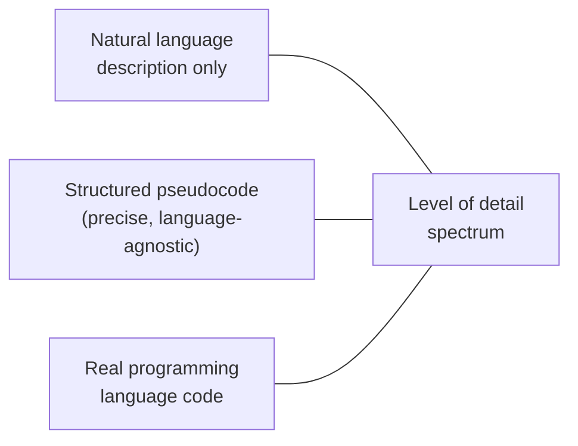

## Learning Objectives

- Explain why mathematical notation and theorem statements need the same clarity discipline as ordinary prose, not an exemption from it.
- Describe the tradeoff involved in choosing a level of formalism and detail for presenting an algorithm: precise enough to be unambiguous, not so literal it duplicates real code.
- Apply consistent notation and numbering conventions across a paper's mathematical content.
- Decide when a derivation belongs in a paper's main body versus an appendix.

## Context & Motivation

Computer science research writing routinely mixes ordinary prose with mathematical notation and algorithmic pseudocode, and both carry the same underlying obligation `the-shape-of-a-paper-scope-story-and-organization` established for prose generally: a skeptical reader has to be able to follow and verify the argument, not simply trust that it is correct. This curriculum's own `algorithm-laboratory` and `algorithms` disciplines already make real, consistent choices in every worked example about how formally to present an algorithm; this concept makes that choice explicit and teachable on its own terms, as a research-writing skill rather than an unstated convention absorbed by imitation.

## Core Theory

### Clarity in mathematics is not optional

A theorem statement, like a prose sentence, can be ambiguous, and ambiguity in a formal statement is, if anything, more costly than in prose, because a reader expects mathematical notation to resolve exactly the kind of vagueness natural language sometimes tolerates. Zobel's guidance treats a theorem or definition's clarity as judged the same way a sentence's clarity is: could a careful reader construct two different, both-plausible readings of what is being claimed. Where prose ambiguity might merely slow a reader down, a genuinely ambiguous formal claim can make an entire proof unverifiable.

### Readability of proofs and derivations

```text
Less readable:  a long derivation presented as an unbroken sequence of
                symbolic manipulation, with no prose connecting one step
                to the next or explaining WHY a given step is valid.

More readable:  the same derivation with brief prose at each significant
                step, stating what is being done and why, so a reader
                can follow the argument's logic, not just verify each
                individual algebraic manipulation.
```

A derivation exists to convince a reader a result is true, not merely to demonstrate that the author can perform the manipulation correctly; readability, in this sense, is about making the logical structure of an argument visible, not just its individual steps checkable.

### Presenting algorithms: choosing a level of formalism



Zobel identifies a genuine tradeoff along this spectrum. A purely natural-language description of an algorithm is often too imprecise to verify correctness or complexity claims against. Real code in a specific programming language is unambiguous but couples the algorithm's essential logic to language-specific syntax and idiom a reader may not know, and burdens the reader with implementation detail irrelevant to the algorithm's actual contribution. Structured pseudocode, precise enough that control flow, data structures, and operations are unambiguous, but abstracted away from any one language's syntax, is the level this curriculum's own algorithm content consistently chooses, and Zobel's guidance treats it as the right default for research writing specifically, for the same reason: it is unambiguous without being needlessly coupled to implementation choices that are not the point being made.

### Notation and numbering discipline

A paper that introduces new notation should define it once, clearly, and then reuse it consistently; redefining a symbol partway through a paper, or using the same symbol for two different things in different sections, forces a reader to constantly re-derive which meaning applies where. Consistent numbering of equations, theorems, and algorithms, referenced by number rather than by vague pointers like "the equation above," lets a reader navigate back to a specific piece of formal content precisely, the same navigational function `language-mechanics-style-specifics-and-punctuation` already established for descriptive headings.

### Body versus appendix

A derivation or proof belongs in a paper's main body when following it is necessary to be convinced the central claim is true; a derivation belongs in an appendix when it substantiates a claim a reader is likely to accept on the strength of the stated result and a brief sketch, but where the full mechanical detail would interrupt the paper's main argument without adding much persuasive value for most readers. This is a judgment about the paper's actual audience and argument, not a rule that all lengthy proofs are automatically appendix material.

## Worked Examples

### Example 1: an ambiguous theorem statement, clarified

Draft: "For large inputs, the algorithm runs efficiently." This is not a theorem at all, it lacks a precise claim to verify. Clarified: "For inputs of size n > 1000, the algorithm's expected running time is O(n log n)," a statement with a specific, checkable scope and complexity bound.

### Example 2: choosing pseudocode over real code

A paper presenting a new graph traversal variant could present it as Python code, complete with import statements and language-specific idiom, or as structured pseudocode using standard control-flow constructs and explicit variable names. The pseudocode version is the better choice here specifically because the contribution is the traversal logic itself, not an implementation in any particular language, and Python-specific syntax would cost non-Python readers real effort understanding logic that has nothing to do with Python.

### Example 3: deciding body versus appendix

A paper's central claim rests on a complexity bound whose proof is three lines and directly clarifies why the bound holds; this belongs in the main body, since following it is part of being convinced of the claim. A separate, much longer proof establishing a tight lower bound that corroborates but is not strictly necessary for the paper's main argument is moved to an appendix, with the main body stating the result and its significance directly.

## Common Misconceptions & Pitfalls

- **"Mathematical notation is inherently precise, so ambiguity isn't really a risk there."** A theorem statement can be just as ambiguous as a prose sentence if it admits more than one reasonable reading; formal notation does not automatically guarantee clarity.
- **"The most detailed, most formal presentation of an algorithm is always the best one."** Real code can be less useful to a reader than pseudocode precisely because it couples the algorithm's essential logic to irrelevant, language-specific detail; the right level of formalism depends on what the paper is actually trying to convey.
- **"Every proof belongs in the main body, since removing it seems like hiding evidence."** An appendix is not hiding evidence, it is a legitimate organizational choice for supporting detail a typical reader does not need to follow in order to be convinced of the paper's central claim.

## Summary

Mathematics and algorithms are written for readers, and carry the same clarity obligation ordinary prose does: a theorem statement or a derivation can be ambiguous in exactly the way a sentence can, and readability means making an argument's logical structure visible, not just its individual steps technically checkable. Presenting an algorithm involves a real, deliberate tradeoff between natural-language description, structured pseudocode, and real code, with pseudocode usually the right default for research writing because it is unambiguous without coupling the algorithm to irrelevant implementation detail, and consistent notation, numbering, and a deliberate body-versus-appendix judgment round out the concrete decisions this concept covers.

## Documentation Links

- [ACM Digital Library: Justin Zobel, Writing for Computer Science (3rd Edition, Springer, 2014)](https://dl.acm.org/doi/10.5555/2742708): Chapters 9, "Mathematics," and 10, "Algorithms," are the direct source for the clarity, formalism, and notation guidance covered here.
- [IEEE Author Center: IEEE Editorial Style Manual for Authors](https://journals.ieeeauthorcenter.ieee.org/create-your-ieee-journal-article/create-the-text-of-your-article/ieee-editorial-style-manual/): a real, current example of the equation and notation formatting conventions a formal publication venue enforces.
