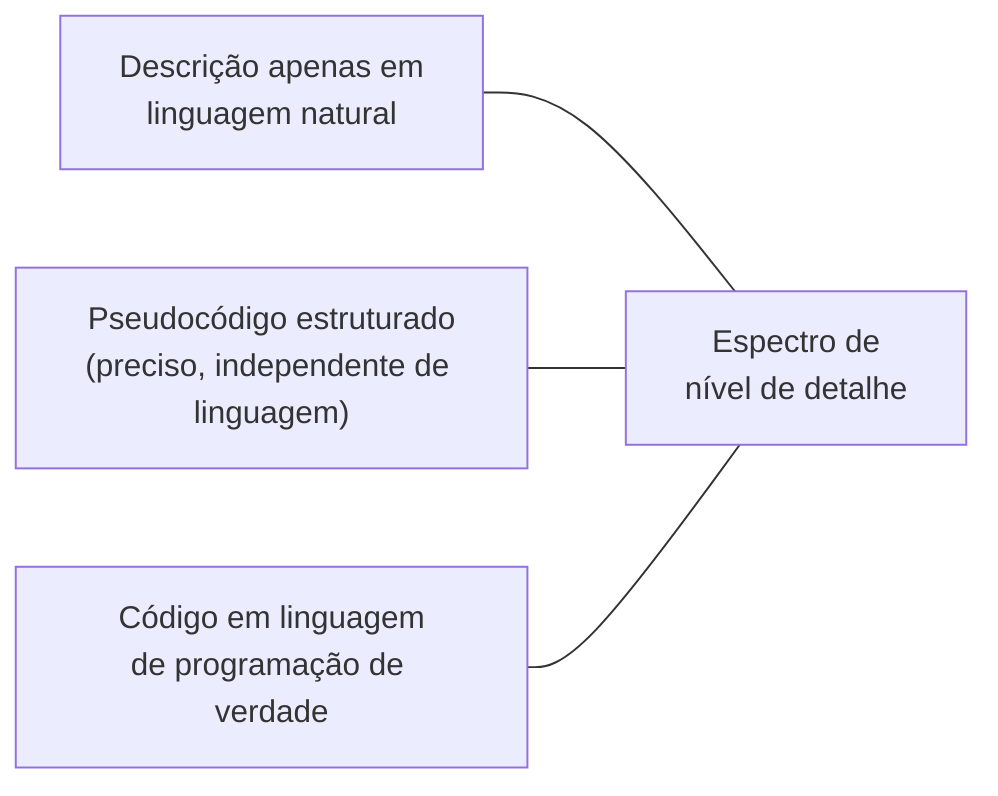

## Objetivos de Aprendizagem

- Explicar por que a notação matemática e os enunciados de teoremas precisam da mesma disciplina de clareza que a prosa comum, e não de uma isenção dela.
- Descrever o trade-off envolvido em escolher um nível de formalismo e detalhe para apresentar um algoritmo: preciso o bastante para ser inequívoco, não tão literal a ponto de duplicar código de verdade.
- Aplicar convenções consistentes de notação e numeração ao longo do conteúdo matemático de um artigo.
- Decidir quando uma derivação pertence ao corpo principal de um artigo versus a um apêndice.

## Contexto e Motivação

A escrita de pesquisa em ciência da computação rotineiramente mistura prosa comum com notação matemática e pseudocódigo algorítmico, e ambos carregam a mesma obrigação subjacente que `the-shape-of-a-paper-scope-story-and-organization` estabeleceu para a prosa em geral: um leitor cético tem de conseguir acompanhar e verificar o argumento, e não simplesmente confiar que ele está correto. As próprias disciplinas `algorithm-laboratory` e `algorithms` deste currículo já fazem escolhas reais e consistentes em todo exemplo resolvido sobre quão formalmente apresentar um algoritmo; este conceito torna essa escolha explícita e ensinável em seus próprios termos, como uma habilidade de escrita de pesquisa, e não como uma convenção não enunciada absorvida por imitação.

## Teoria Central

### Clareza em matemática não é opcional

O enunciado de um teorema, como uma frase de prosa, pode ser ambíguo, e a ambiguidade num enunciado formal é, no mínimo, mais custosa do que na prosa, porque um leitor espera que a notação matemática resolva exatamente o tipo de vagueza que a linguagem natural às vezes tolera. A orientação de Zobel trata a clareza de um teorema ou definição como julgada do mesmo jeito que a clareza de uma frase é: um leitor cuidadoso conseguiria construir duas leituras diferentes, ambas plausíveis, do que está sendo afirmado. Onde a ambiguidade na prosa poderia meramente atrasar um leitor, uma afirmação formal genuinamente ambígua pode tornar uma prova inteira não verificável.

### Legibilidade de provas e derivações

```text
Menos legível:  uma derivação longa apresentada como uma sequência ininterrupta
                de manipulação simbólica, sem prosa conectando um passo ao
                seguinte ou explicando POR QUE um dado passo é válido.

Mais legível:   a mesma derivação com uma breve prosa a cada passo significativo,
                enunciando o que está sendo feito e por quê, para que um leitor
                possa acompanhar a lógica do argumento, e não só verificar cada
                manipulação algébrica individual.
```

Uma derivação existe para convencer um leitor de que um resultado é verdadeiro, não meramente para demonstrar que o autor consegue realizar a manipulação corretamente; a legibilidade, nesse sentido, trata de tornar visível a estrutura lógica de um argumento, não só de tornar conferíveis os seus passos individuais.

### Apresentando algoritmos: escolher um nível de formalismo



Zobel identifica um trade-off genuíno ao longo desse espectro. Uma descrição de um algoritmo puramente em linguagem natural é muitas vezes imprecisa demais para verificar afirmações de correção ou de complexidade. Código de verdade numa linguagem de programação específica é inequívoco, mas acopla a lógica essencial do algoritmo a uma sintaxe e a um idioma específicos de linguagem que um leitor pode não conhecer, e sobrecarrega o leitor com detalhe de implementação irrelevante para a contribuição de fato do algoritmo. Pseudocódigo estruturado, preciso o bastante para que fluxo de controle, estruturas de dados e operações sejam inequívocos, mas abstraído da sintaxe de qualquer linguagem, é o nível que o próprio conteúdo de algoritmos deste currículo escolhe de forma consistente, e a orientação de Zobel o trata como o padrão certo para a escrita de pesquisa especificamente, pelo mesmo motivo: é inequívoco sem ser desnecessariamente acoplado a escolhas de implementação que não são o ponto que está sendo feito.

### Disciplina de notação e numeração

Um artigo que introduz uma notação nova deve defini-la uma vez, com clareza, e depois reusá-la de forma consistente; redefinir um símbolo no meio de um artigo, ou usar o mesmo símbolo para duas coisas diferentes em seções diferentes, força um leitor a rederivar constantemente qual significado se aplica onde. A numeração consistente de equações, teoremas e algoritmos, referenciados por número, e não por ponteiros vagos como "a equação acima", deixa um leitor navegar de volta a um pedaço específico de conteúdo formal com precisão, a mesma função navegacional que `language-mechanics-style-specifics-and-punctuation` já estabeleceu para os cabeçalhos descritivos.

### Corpo versus apêndice

Uma derivação ou prova pertence ao corpo principal de um artigo quando acompanhá-la é necessário para se convencer de que a afirmação central é verdadeira; uma derivação pertence a um apêndice quando ela substancia uma afirmação que um leitor provavelmente aceitará com base no resultado enunciado e num breve esboço, mas onde o detalhe mecânico completo interromperia o argumento principal do artigo sem acrescentar muito valor persuasivo para a maioria dos leitores. Isso é um julgamento sobre o público e o argumento de fato do artigo, e não uma regra de que toda prova longa é automaticamente material de apêndice.

## Exemplos Resolvidos

### Exemplo 1: um enunciado de teorema ambíguo, esclarecido

Rascunho: "Para entradas grandes, o algoritmo roda de forma eficiente." Isso não é um teorema de forma alguma, falta-lhe uma afirmação precisa a verificar. Esclarecido: "Para entradas de tamanho n > 1000, o tempo de execução esperado do algoritmo é O(n log n)", uma afirmação com um escopo e um limite de complexidade específicos e conferíveis.

### Exemplo 2: escolher pseudocódigo em vez de código de verdade

Um artigo que apresenta uma nova variante de travessia de grafo poderia apresentá-la como código Python, completo com declarações de importação e idioma específico de linguagem, ou como pseudocódigo estruturado usando construções padrão de fluxo de controle e nomes de variável explícitos. A versão em pseudocódigo é a melhor escolha aqui especificamente porque a contribuição é a própria lógica de travessia, e não uma implementação em qualquer linguagem específica, e a sintaxe específica de Python custaria aos leitores que não usam Python um esforço real para entender uma lógica que nada tem a ver com Python.

### Exemplo 3: decidir corpo versus apêndice

A afirmação central de um artigo repousa sobre um limite de complexidade cuja prova tem três linhas e esclarece diretamente por que o limite se sustenta; isso pertence ao corpo principal, já que acompanhá-la é parte de se convencer da afirmação. Uma prova separada e muito mais longa estabelecendo um limite inferior apertado que corrobora, mas não é estritamente necessário para o argumento principal do artigo, é movida para um apêndice, com o corpo principal enunciando o resultado e a sua significância diretamente.

## Equívocos Comuns e Armadilhas

- **"A notação matemática é inerentemente precisa, então a ambiguidade não é um risco real ali."** O enunciado de um teorema pode ser tão ambíguo quanto uma frase de prosa se admitir mais de uma leitura razoável; a notação formal não garante clareza automaticamente.
- **"A apresentação mais detalhada e mais formal de um algoritmo é sempre a melhor."** Código de verdade pode ser menos útil a um leitor do que o pseudocódigo precisamente porque acopla a lógica essencial do algoritmo a detalhe irrelevante e específico de linguagem; o nível certo de formalismo depende do que o artigo está de fato tentando transmitir.
- **"Toda prova pertence ao corpo principal, já que removê-la parece esconder evidência."** Um apêndice não é esconder evidência, é uma escolha organizacional legítima para o detalhe de apoio que um leitor típico não precisa acompanhar para se convencer da afirmação central do artigo.

## Resumo

Matemática e algoritmos são escritos para leitores, e carregam a mesma obrigação de clareza que a prosa comum: o enunciado de um teorema ou uma derivação pode ser ambíguo exatamente do jeito que uma frase pode, e a legibilidade significa tornar visível a estrutura lógica de um argumento, não só tornar os seus passos individuais tecnicamente conferíveis. Apresentar um algoritmo envolve um trade-off real e deliberado entre descrição em linguagem natural, pseudocódigo estruturado e código de verdade, sendo o pseudocódigo normalmente o padrão certo para a escrita de pesquisa porque é inequívoco sem acoplar o algoritmo a detalhe de implementação irrelevante, e a notação consistente, a numeração e um julgamento deliberado de corpo versus apêndice completam as decisões concretas que este conceito cobre.

## Documentation Links

- [ACM Digital Library: Justin Zobel, Writing for Computer Science (3ª edição, Springer, 2014)](https://dl.acm.org/doi/10.5555/2742708): os Capítulos 9, "Mathematics", e 10, "Algorithms", são a fonte direta da orientação sobre clareza, formalismo e notação coberta aqui.
- [IEEE Author Center: IEEE Editorial Style Manual for Authors](https://journals.ieeeauthorcenter.ieee.org/create-your-ieee-journal-article/create-the-text-of-your-article/ieee-editorial-style-manual/): um exemplo real e atual das convenções de formatação de equação e notação que um veículo de publicação formal impõe.
