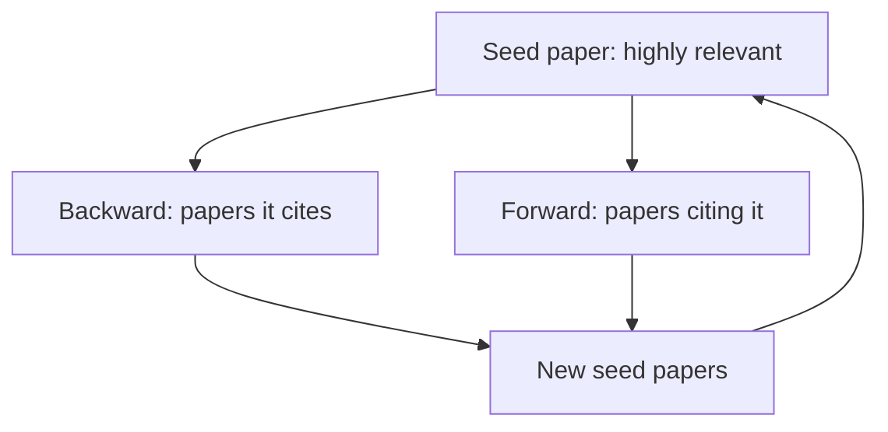

## Learning Objectives

- Distinguish finding research literature from reading it critically, and explain why both are active, learnable skills rather than one passive activity.
- Describe an effective strategy for finding relevant papers that goes beyond a single keyword search: working outward through citations and citing papers from a small seed set of highly relevant work.
- Apply a concrete set of questions for evaluating a paper's claims critically: what evidence supports each claim, and is that evidence strong enough to bear the weight placed on it.
- Explain why a literature review is a structured argument about the state of a field, not a list of paper summaries, and identify what that argument needs to contain.

## Context & Motivation

Reading is often treated as the easy half of research, something a student already knows how to do from years of coursework, while writing is treated as the skill that needs deliberate teaching. Zobel's *Writing for Computer Science* rejects that framing directly, dedicating a full chapter, "Reading and Reviewing," to reading as its own discipline with its own failure modes, because a literature review built on shallow or uncritical reading fails for reasons that have nothing to do with prose style. A review can be beautifully written and still be worthless if it misrepresents what the cited papers actually showed, or if it never identifies a genuine gap in the field.

This concept matters early in `academic-writing` because nearly everything downstream depends on it: the research question shaped in `shaping-a-research-project-and-getting-started` needs to survive contact with what has actually been published, and the paper eventually written in `the-shape-of-a-paper-scope-story-and-organization` needs an honest account of prior work to establish what is actually new. Reading critically is the connective skill between those two.

## Core Theory

### Finding literature: working outward from a seed set

A single keyword search on a paper database is a reasonable starting point, but Zobel is explicit that it is not sufficient on its own, because terminology varies across subfields and even across individual research groups working on the same underlying problem. The more reliable strategy is to find a small number of highly relevant papers first, however that seed set is found, then work outward in two directions: backward through that paper's own citations (what work did it build on), and forward through papers that cite it (who has built on it since, and how). Repeating this outward walk from multiple seed papers converges on a much more complete picture of a subfield than any single search query, because it follows the actual citation structure researchers in the field use to relate their own work to each other's.

### Critical reading: what to ask of every claim

Reading critically means treating every substantive claim in a paper as something to be evaluated, not simply absorbed. For each claim, the concrete question is: what evidence does the paper actually offer, and is that evidence strong enough to bear the weight the authors are putting on it. A claim of "state of the art performance" backed only by comparison against a single, older baseline is weaker evidence than the same claim backed against several recent, strong baselines across multiple datasets, even though both papers might use the same confident-sounding language. Critical reading also means noticing what a paper does not claim, and does not test, since the boundary of a paper's actual contribution is often narrower than its introduction implies.

### From reading notes to a review's structure

Zobel's content-of-reviews guidance treats a literature review as an argument with real structure, not a sequence of paper summaries. A review needs to establish what is settled and largely agreed upon in the area, what is actively contested or unresolved between different published results, and, most importantly for a research project, what specific gap remains open that the current work is positioned to fill. A list of "Paper A did X, Paper B did Y, Paper C did Z" fails this structure even if every individual summary is accurate, because it never synthesizes the papers against each other or arrives at a stated gap.

### Drafting and checking a review

A first draft of a review is best organized around the ideas and themes in the field, not around the chronological order papers happened to be read in; grouping by theme forces the kind of synthesis a chronological list avoids by construction. Checking a drafted review means re-verifying, against the actual cited papers rather than against the reviewer's memory of them, that every claim attributed to a source is accurate, since misrepresenting a cited paper's finding, even unintentionally, is one of the more damaging and avoidable errors a review can contain.

## Worked Examples

### Example 1: the citation-walk in practice

A student researching leaderless replication design finds one strong, recent paper on the topic. Reading its related-work section surfaces three earlier foundational papers it builds on; searching for papers that cite it surfaces two very recent workshop papers extending its approach. None of these five additional papers would necessarily surface from a single keyword search using the student's own vocabulary, because the field's terminology shifted between the foundational papers and the recent one.

### Example 2: evaluating the strength of a claim

Two papers both claim their proposed algorithm is "significantly faster" than a baseline. Paper A reports the comparison on one synthetic workload with no variance reported across runs. Paper B reports the same kind of comparison across five real-world workloads, with confidence intervals, and includes a workload where the improvement was smaller than average. Critical reading distinguishes these: Paper B's claim rests on stronger, more honestly reported evidence, even though both papers use similarly confident language.

### Example 3: a review organized by theme, not chronology

A draft review on consistency models initially lists papers in publication-date order. Restructured around themes, strong consistency guarantees and their cost, weaker guarantees and their performance benefits, and hybrid approaches attempting both, the same set of papers now supports an explicit conclusion: hybrid approaches remain underexplored specifically for geo-distributed deployments, which becomes the stated gap the student's own project addresses.

## Common Misconceptions & Pitfalls

- **"A literature review is a summary of the papers I read."** Zobel's content-of-reviews framing treats this as the single most common structural failure: a review has to synthesize and argue, using the read papers as evidence, not merely report on each one in turn.
- **"If I read enough papers, the gap will be obvious."** Reading widely is necessary but not sufficient; the gap only becomes visible once the papers are actively compared and contrasted against each other, which is a distinct synthesis step from reading itself.
- **"A confident claim in a published paper is reliable by default."** Peer review filters out many errors but not all of them, and even accepted papers vary widely in how strong their supporting evidence actually is; critical reading means checking the evidence for every claim used to justify a new project, not trusting the paper's own framing of its results.

## Summary

Finding research literature and reading it critically are two distinct, active skills: finding well means working outward through citations from a small seed set rather than relying on a single keyword search, and reading critically means asking, for every claim, what evidence actually supports it and whether that evidence is strong enough. A literature review built on that reading is a structured argument, establishing what is settled, what is contested, and what specific gap remains open, rather than a list of paper summaries, and drafting one around themes rather than chronology is what makes that synthesis visible on the page.

## Documentation Links

- [ACM Digital Library: Justin Zobel, Writing for Computer Science (3rd Edition, Springer, 2014)](https://dl.acm.org/doi/10.5555/2742708): Chapter 3, "Reading and Reviewing," is the direct source for the citation-walk search strategy, critical-reading questions, and review-drafting guidance covered here.
