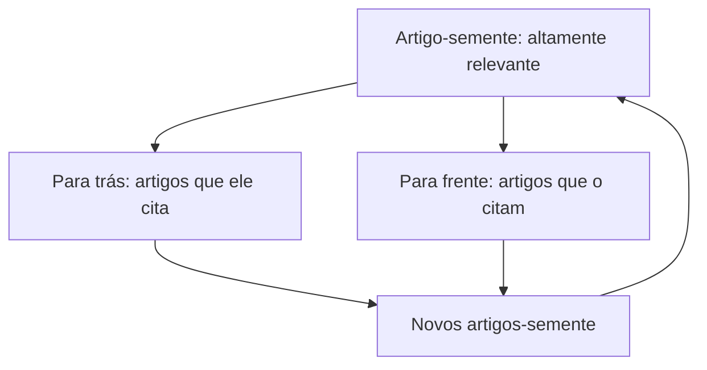

## Objetivos de Aprendizagem

- Distinguir encontrar literatura de pesquisa de lê-la criticamente, e explicar por que ambas são habilidades ativas e aprendíveis, e não uma única atividade passiva.
- Descrever uma estratégia eficaz para encontrar artigos relevantes que vá além de uma única busca por palavra-chave: trabalhar para fora pelas citações e pelos artigos citantes a partir de um pequeno conjunto-semente de trabalho altamente relevante.
- Aplicar um conjunto concreto de perguntas para avaliar criticamente as afirmações de um artigo: que evidência sustenta cada afirmação, e se essa evidência é forte o bastante para aguentar o peso colocado sobre ela.
- Explicar por que uma revisão de literatura é um argumento estruturado sobre o estado de uma área, e não uma lista de resumos de artigos, e identificar o que esse argumento precisa conter.

## Contexto e Motivação

A leitura é muitas vezes tratada como a metade fácil da pesquisa, algo que um estudante já sabe fazer de anos de disciplinas, enquanto a escrita é tratada como a habilidade que precisa de ensino deliberado. *Writing for Computer Science*, de Zobel, rejeita esse enquadramento diretamente, dedicando um capítulo inteiro, "Reading and Reviewing", à leitura como disciplina própria com os seus próprios modos de falha, porque uma revisão de literatura construída sobre uma leitura rasa ou não crítica falha por motivos que nada têm a ver com estilo de prosa. Uma revisão pode ser lindamente escrita e ainda ser inútil se deturpar o que os artigos citados de fato mostraram, ou se nunca identificar uma lacuna genuína na área.

Este conceito importa cedo em `academic-writing` porque quase tudo a jusante depende dele: a questão de pesquisa moldada em `shaping-a-research-project-and-getting-started` precisa sobreviver ao contato com o que de fato foi publicado, e o artigo eventualmente escrito em `the-shape-of-a-paper-scope-story-and-organization` precisa de um relato honesto do trabalho anterior para estabelecer o que de fato é novo. Ler criticamente é a habilidade conectiva entre esses dois.

## Teoria Central

### Encontrar literatura: trabalhar para fora a partir de um conjunto-semente

Uma única busca por palavra-chave numa base de dados de artigos é um ponto de partida razoável, mas Zobel é explícito ao dizer que ela não é suficiente por si só, porque a terminologia varia entre subáreas e até entre grupos de pesquisa individuais trabalhando no mesmo problema subjacente. A estratégia mais confiável é encontrar primeiro um pequeno número de artigos altamente relevantes, seja como for que esse conjunto-semente seja encontrado, e depois trabalhar para fora em duas direções: para trás pelas próprias citações desse artigo (sobre que trabalho ele se construiu), e para frente pelos artigos que o citam (quem se construiu sobre ele desde então, e como). Repetir essa caminhada para fora a partir de vários artigos-semente converge para um retrato muito mais completo de uma subárea do que qualquer consulta de busca única, porque segue a estrutura de citação de fato que os pesquisadores da área usam para relacionar o seu próprio trabalho ao dos outros.

### Leitura crítica: o que perguntar de toda afirmação

Ler criticamente significa tratar toda afirmação substantiva de um artigo como algo a ser avaliado, e não simplesmente absorvido. Para cada afirmação, a pergunta concreta é: que evidência o artigo de fato oferece, e se essa evidência é forte o bastante para aguentar o peso que os autores estão pondo sobre ela. Uma afirmação de "desempenho de ponta" apoiada só na comparação contra uma única linha de base mais antiga é uma evidência mais fraca do que a mesma afirmação apoiada contra várias linhas de base recentes e fortes ao longo de múltiplos conjuntos de dados, mesmo que os dois artigos possam usar a mesma linguagem de som confiante. A leitura crítica também significa notar o que um artigo não afirma, e não testa, já que a fronteira da contribuição de fato de um artigo é muitas vezes mais estreita do que a sua introdução sugere.

### Das notas de leitura à estrutura de uma revisão

A orientação de Zobel sobre o conteúdo das revisões trata uma revisão de literatura como um argumento com estrutura real, e não como uma sequência de resumos de artigos. Uma revisão precisa estabelecer o que está assentado e em grande parte concordado na área, o que é ativamente contestado ou não resolvido entre resultados publicados diferentes, e, o mais importante para um projeto de pesquisa, que lacuna específica permanece aberta que o trabalho atual está posicionado para preencher. Uma lista de "o Artigo A fez X, o Artigo B fez Y, o Artigo C fez Z" falha nessa estrutura mesmo que cada resumo individual seja acurado, porque nunca sintetiza os artigos uns contra os outros nem chega a uma lacuna enunciada.

### Rascunhar e conferir uma revisão

Um primeiro rascunho de uma revisão é mais bem organizado em torno das ideias e dos temas da área, e não em torno da ordem cronológica em que os artigos por acaso foram lidos; agrupar por tema força o tipo de síntese que uma lista cronológica evita por construção. Conferir uma revisão rascunhada significa reverificar, contra os artigos de fato citados, e não contra a memória que o revisor tem deles, que toda afirmação atribuída a uma fonte é acurada, já que deturpar a descoberta de um artigo citado, mesmo que sem intenção, é um dos erros mais danosos e evitáveis que uma revisão pode conter.

## Exemplos Resolvidos

### Exemplo 1: a caminhada de citação na prática

Um estudante que pesquisa o projeto de replicação sem líder encontra um artigo forte e recente sobre o tema. Ler a sua seção de trabalhos relacionados revela três artigos fundamentais anteriores sobre os quais ele se constrói; buscar por artigos que o citam revela dois artigos de workshop muito recentes que estendem a sua abordagem. Nenhum desses cinco artigos adicionais necessariamente apareceria numa única busca por palavra-chave usando o vocabulário do próprio estudante, porque a terminologia da área mudou entre os artigos fundamentais e o recente.

### Exemplo 2: avaliar a força de uma afirmação

Dois artigos ambos alegam que o seu algoritmo proposto é "significativamente mais rápido" do que uma linha de base. O Artigo A relata a comparação em uma carga sintética sem variância relatada entre execuções. O Artigo B relata o mesmo tipo de comparação ao longo de cinco cargas do mundo real, com intervalos de confiança, e inclui uma carga onde a melhoria foi menor do que a média. A leitura crítica distingue esses: a afirmação do Artigo B repousa sobre uma evidência mais forte e mais honestamente relatada, mesmo que os dois artigos usem uma linguagem de confiança semelhante.

### Exemplo 3: uma revisão organizada por tema, não por cronologia

Um rascunho de revisão sobre modelos de consistência inicialmente lista os artigos em ordem de data de publicação. Reestruturado em torno de temas, garantias de consistência forte e o seu custo, garantias mais fracas e os seus benefícios de desempenho, e abordagens híbridas tentando ambos, o mesmo conjunto de artigos agora apoia uma conclusão explícita: as abordagens híbridas permanecem subexploradas especificamente para implantações geodistribuídas, o que se torna a lacuna enunciada que o próprio projeto do estudante aborda.

## Equívocos Comuns e Armadilhas

- **"Uma revisão de literatura é um resumo dos artigos que li."** O enquadramento de Zobel sobre o conteúdo das revisões trata isso como a falha estrutural mais comum: uma revisão tem de sintetizar e argumentar, usando os artigos lidos como evidência, e não meramente relatar cada um por vez.
- **"Se eu ler artigos suficientes, a lacuna ficará óbvia."** Ler amplamente é necessário, mas não suficiente; a lacuna só fica visível uma vez que os artigos são ativamente comparados e contrastados uns com os outros, o que é uma etapa de síntese distinta da leitura em si.
- **"Uma afirmação confiante num artigo publicado é confiável por padrão."** A avaliação por pares filtra muitos erros, mas não todos, e mesmo artigos aceitos variam bastante em quão forte a sua evidência de apoio de fato é; ler criticamente significa conferir a evidência de toda afirmação usada para justificar um novo projeto, e não confiar no enquadramento que o próprio artigo faz dos seus resultados.

## Resumo

Encontrar literatura de pesquisa e lê-la criticamente são duas habilidades distintas e ativas: encontrar bem significa trabalhar para fora pelas citações a partir de um pequeno conjunto-semente, em vez de depender de uma única busca por palavra-chave, e ler criticamente significa perguntar, para toda afirmação, que evidência de fato a sustenta e se essa evidência é forte o bastante. Uma revisão de literatura construída sobre essa leitura é um argumento estruturado, estabelecendo o que está assentado, o que é contestado e que lacuna específica permanece aberta, em vez de uma lista de resumos de artigos, e rascunhá-la em torno de temas, e não da cronologia, é o que torna essa síntese visível na página.

## Documentation Links

- [ACM Digital Library: Justin Zobel, Writing for Computer Science (3ª edição, Springer, 2014)](https://dl.acm.org/doi/10.5555/2742708): o Capítulo 3, "Reading and Reviewing", é a fonte direta da estratégia de busca por caminhada de citação, das perguntas de leitura crítica e da orientação de rascunho de revisão coberta aqui.
