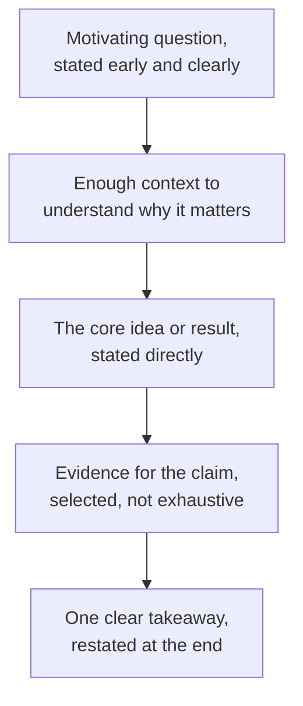

## Learning Objectives

- Explain why a research talk cannot simply mirror a paper's written structure, given the real constraints a live audience and a fixed time limit impose.
- Describe what a talk's organization should prioritize instead: an early, explicit motivating question and one clear, repeated takeaway rather than an exhaustive results account.
- Identify common, avoidable failure modes in research talks: slides that duplicate what the speaker is saying, and a rushed, compressed final section.
- Apply honest, direct handling of audience questions as part of a talk's credibility, not a separate skill from the talk itself.

## Context & Motivation

A thesis defense, a conference talk, or a lab presentation is a second, distinct act of persuasion built on the same underlying research a written paper already argues, but under a genuinely different set of constraints. `the-shape-of-a-paper-scope-story-and-organization` built a paper's structure around a reader who can reread a difficult sentence, skip ahead, and spend as long as needed on any one part. A live audience can do none of that: a listener who misses one sentence cannot rewind it, and a talk has a fixed, usually short, time limit that makes the paper's full content genuinely impossible to cover in the same depth. Zobel's chapter on "Presentations" treats this as reason enough that a talk's organization has to be planned separately from the paper's, not derived from it by simply cutting material down to fit the clock.

## Core Theory

### Why a talk cannot mirror the paper

```text
Paper reader:  can reread, skip ahead, pause, look up an unfamiliar term,
               spend unlimited time on the results section specifically.

Talk audience: hears each sentence once, cannot pause or rewind, and has
               a fixed, shared amount of time regardless of how much the
               material actually needs.
```

Given this, a talk organized as a compressed version of the paper's full structure, motivation, related work, method, results, discussion, each covered briefly, tends to leave an audience with a shallow, fragmented impression of all of it rather than a solid grasp of the one thing that actually matters most. Zobel's guidance, echoed independently in Simon Peyton Jones's own presentation advice, is that a talk needs its own, distinct organization built around what an audience can actually retain from a single, real-time hearing.

### An early, explicit motivating question and one clear takeaway



A talk's introduction has less room than a paper's to build up context gradually; stating the motivating question early and directly gives the audience a frame for understanding everything that follows, in the same way a well-organized paper's opening paragraph orients a reader immediately, a discipline `language-mechanics-style-specifics-and-punctuation` already covered for prose. The content that follows should be selected, not exhaustive: a talk successfully conveying one clear, well-supported takeaway that the audience can restate afterward is a stronger outcome than a talk that mentions every result the paper contains but leaves the audience unable to say what the work actually showed.

### Common failure modes

Slides that duplicate, word for word, what the speaker is saying force an audience to choose between reading and listening, generally losing information either way; slides work better as a visual support, a diagram, a key result, a short phrase, that reinforces what is being said aloud rather than substituting for it. A rushed, compressed final section, common when a speaker has not rehearsed against the actual time limit and runs out of time during the results or conclusion, is especially costly because the conclusion is exactly where the talk's one clear takeaway needs to be stated and reinforced; a talk that runs out of time precisely where the takeaway belongs undermines the whole presentation regardless of how well the earlier sections went.

### Question time as part of the talk's credibility

Handling audience questions honestly, including directly acknowledging the limits of what is known or what the work did not test, rather than deflecting or overstating confidence under pressure, is part of a talk's overall persuasiveness, not a separate skill unrelated to the prepared content. A skeptical audience member's question is, in effect, the live equivalent of the skeptical reader this entire discipline has been organized around; answering it honestly extends the same credibility the talk itself, and the paper behind it, is trying to establish.

## Worked Examples

### Example 1: reorganizing a talk instead of compressing the paper

A ten-page paper on a new consensus protocol has a fifteen-minute conference slot. Compressed naively, every paper section gets roughly two minutes, leaving the audience with a shallow pass over everything. Reorganized for the talk specifically: two minutes motivating why partial-partition tolerance matters, three minutes on the core protocol idea stated directly, seven minutes on the strongest single piece of supporting evidence, and three minutes restating the one takeaway and its practical implication, leaving the rest of the paper's content available only if a question raises it.

### Example 2: fixing slides that duplicate speech

A draft slide contains the full sentence: "Our evaluation shows that the hybrid quorum design reduces tail latency by an average of 18% across all tested workloads compared to the fixed quorum baseline." Spoken aloud verbatim while the audience reads the same sentence, this actively works against retention. Revised, the slide shows only "18% lower tail latency vs. fixed quorum," while the speaker delivers the full explanation aloud, giving the audience one thing to read and a different, complementary thing to hear.

### Example 3: answering a question honestly under pressure

Asked whether the proposed protocol has been tested at a larger scale than the paper's evaluation covers, a speaker who has not tested this is tempted to imply it likely would scale well. The more credible, and Zobel-consistent, response states plainly that this was not tested, and describes what would be needed to test it, extending the same honest calibration between claim and evidence this discipline has emphasized throughout, live, in front of the exact skeptical audience the talk exists to persuade.

## Common Misconceptions & Pitfalls

- **"A good talk covers everything the paper covers, just faster."** A live audience cannot reread or pause, which means compressing the paper's full structure typically produces a shallow, forgettable talk rather than a faithful summary; a talk needs its own organization built around what an audience can retain from one hearing.
- **"More detailed slides help the audience follow along."** Slides duplicating the spoken content force a choice between reading and listening; slides work best as visual reinforcement of a small number of key points, not a written transcript projected behind the speaker.
- **"Admitting a limitation during question time undermines the talk."** The opposite is closer to true: honest, direct handling of a genuinely unanswered question extends the same evidence-matched-to-claim credibility the rest of the talk, and the underlying research, depends on.

## Summary

A research talk is a distinct act of persuasion from the paper it is based on, constrained by a live audience that cannot reread and a fixed time limit that makes full coverage impossible, which means its organization, an early, explicit motivating question, selected rather than exhaustive evidence, and one clear takeaway restated at the end, has to be planned on its own terms rather than derived by simply compressing the paper. Slides that duplicate spoken content and a rushed final section are common, avoidable failures, and honest, direct handling of audience questions, including acknowledging real limitations under pressure, is part of what makes a talk credible, not a separate concern from its prepared content.

## Documentation Links

- [ACM Digital Library: Justin Zobel, Writing for Computer Science (3rd Edition, Springer, 2014)](https://dl.acm.org/doi/10.5555/2742708): Chapter 16, "Presentations," is the direct source for the talk-organization, slide, and question-handling guidance covered here.
- [Microsoft Research: Simon Peyton Jones, How to Write a Great Research Paper](https://www.microsoft.com/en-us/research/academic-program/write-great-research-paper/): includes presentation-specific advice converging independently on the same audience-first organizational approach.
