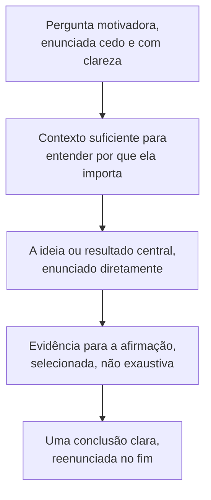

## Objetivos de Aprendizagem

- Explicar por que uma palestra de pesquisa não pode simplesmente espelhar a estrutura escrita de um artigo, dadas as restrições reais que um público ao vivo e um limite de tempo fixo impõem.
- Descrever o que a organização de uma palestra deve priorizar em vez disso: uma pergunta motivadora cedo e explícita e uma conclusão clara e repetida, em vez de um relato exaustivo de resultados.
- Identificar modos de falha comuns e evitáveis em palestras de pesquisa: slides que duplicam o que o palestrante está dizendo, e uma seção final apressada e comprimida.
- Aplicar um tratamento honesto e direto das perguntas do público como parte da credibilidade de uma palestra, e não como uma habilidade separada da palestra em si.

## Contexto e Motivação

Uma defesa de tese, uma palestra de conferência ou uma apresentação de laboratório é um segundo ato de persuasão, distinto, construído sobre a mesma pesquisa subjacente que um artigo escrito já argumenta, mas sob um conjunto de restrições genuinamente diferente. `the-shape-of-a-paper-scope-story-and-organization` construiu a estrutura de um artigo em torno de um leitor que pode reler uma frase difícil, pular adiante e gastar o tempo que for preciso em qualquer parte. Um público ao vivo não pode fazer nada disso: um ouvinte que perde uma frase não pode rebobiná-la, e uma palestra tem um limite de tempo fixo, normalmente curto, que torna o conteúdo completo do artigo genuinamente impossível de cobrir na mesma profundidade. O capítulo de Zobel sobre "Presentations" trata isso como motivo suficiente para que a organização de uma palestra tenha de ser planejada separadamente da do artigo, e não derivada dela simplesmente cortando material para caber no relógio.

## Teoria Central

### Por que uma palestra não pode espelhar o artigo

```text
Leitor do artigo:  pode reler, pular adiante, pausar, consultar um termo
               desconhecido, gastar tempo ilimitado na seção de resultados
               especificamente.

Público da palestra: ouve cada frase uma vez, não pode pausar nem rebobinar, e tem
               uma quantidade fixa e compartilhada de tempo, não importa quanto o
               material de fato precise.
```

Dado isso, uma palestra organizada como uma versão comprimida da estrutura completa do artigo, motivação, trabalhos relacionados, método, resultados, discussão, cada um coberto brevemente, tende a deixar um público com uma impressão rasa e fragmentada de tudo, em vez de uma compreensão sólida da única coisa que de fato mais importa. A orientação de Zobel, ecoada de forma independente no próprio conselho de apresentação de Simon Peyton Jones, é que uma palestra precisa da sua própria organização distinta, construída em torno do que um público consegue de fato reter de uma única audição em tempo real.

### Uma pergunta motivadora cedo e explícita e uma conclusão clara



A introdução de uma palestra tem menos espaço do que a de um artigo para construir o contexto aos poucos; enunciar a pergunta motivadora cedo e diretamente dá ao público um quadro para entender tudo o que se segue, do mesmo jeito que o parágrafo de abertura de um artigo bem organizado orienta um leitor de imediato, uma disciplina que `language-mechanics-style-specifics-and-punctuation` já cobriu para a prosa. O conteúdo que se segue deve ser selecionado, não exaustivo: uma palestra que transmite com sucesso uma conclusão clara e bem apoiada que o público consiga reenunciar depois é um desfecho mais forte do que uma palestra que menciona todo resultado que o artigo contém, mas deixa o público incapaz de dizer o que o trabalho de fato mostrou.

### Modos de falha comuns

Slides que duplicam, palavra por palavra, o que o palestrante está dizendo forçam um público a escolher entre ler e ouvir, geralmente perdendo informação de qualquer jeito; os slides funcionam melhor como um apoio visual, um diagrama, um resultado-chave, uma frase curta, que reforça o que está sendo dito em voz alta, em vez de substituí-lo. Uma seção final apressada e comprimida, comum quando um palestrante não ensaiou contra o limite de tempo de fato e fica sem tempo durante os resultados ou a conclusão, é especialmente custosa porque a conclusão é exatamente onde a única conclusão clara da palestra precisa ser enunciada e reforçada; uma palestra que fica sem tempo precisamente onde a conclusão pertence mina a apresentação inteira, por melhor que as seções anteriores tenham ido.

### O tempo de perguntas como parte da credibilidade da palestra

Lidar honestamente com as perguntas do público, incluindo reconhecer diretamente os limites do que se sabe ou do que o trabalho não testou, em vez de desviar ou exagerar a confiança sob pressão, é parte da persuasividade geral de uma palestra, e não uma habilidade separada e sem relação com o conteúdo preparado. A pergunta de um membro cético do público é, com efeito, o equivalente ao vivo do leitor cético em torno do qual esta disciplina inteira foi organizada; respondê-la honestamente estende a mesma credibilidade que a própria palestra, e o artigo por trás dela, está tentando estabelecer.

## Exemplos Resolvidos

### Exemplo 1: reorganizar uma palestra em vez de comprimir o artigo

Um artigo de dez páginas sobre um novo protocolo de consenso tem um espaço de conferência de quinze minutos. Comprimido de forma ingênua, cada seção do artigo ganha mais ou menos dois minutos, deixando o público com uma passagem rasa por tudo. Reorganizado especificamente para a palestra: dois minutos motivando por que a tolerância a partição parcial importa, três minutos sobre a ideia central do protocolo enunciada diretamente, sete minutos sobre o único pedaço mais forte de evidência de apoio, e três minutos reenunciando a única conclusão e a sua implicação prática, deixando o resto do conteúdo do artigo disponível só se uma pergunta o levantar.

### Exemplo 2: corrigir slides que duplicam a fala

Um slide de rascunho contém a frase completa: "Nossa avaliação mostra que o projeto de quórum híbrido reduz a latência de cauda numa média de 18% em todas as cargas testadas, em comparação com a linha de base de quórum fixo." Dita em voz alta literalmente enquanto o público lê a mesma frase, isso trabalha ativamente contra a retenção. Revisado, o slide mostra só "18% menos latência de cauda vs. quórum fixo", enquanto o palestrante profere a explicação completa em voz alta, dando ao público uma coisa para ler e uma coisa diferente e complementar para ouvir.

### Exemplo 3: responder a uma pergunta honestamente sob pressão

Perguntado se o protocolo proposto foi testado numa escala maior do que a que a avaliação do artigo cobre, um palestrante que não testou isso é tentado a sugerir que provavelmente escalaria bem. A resposta mais crível, e consistente com Zobel, enuncia de forma clara que isso não foi testado, e descreve o que seria necessário para testá-lo, estendendo a mesma calibração honesta entre afirmação e evidência que esta disciplina enfatizou por toda parte, ao vivo, diante do exato público cético que a palestra existe para persuadir.

## Equívocos Comuns e Armadilhas

- **"Uma boa palestra cobre tudo o que o artigo cobre, só que mais depressa."** Um público ao vivo não pode reler nem pausar, o que significa que comprimir a estrutura completa do artigo tipicamente produz uma palestra rasa e esquecível, em vez de um resumo fiel; uma palestra precisa da sua própria organização construída em torno do que um público consegue reter de uma audição.
- **"Slides mais detalhados ajudam o público a acompanhar."** Slides que duplicam o conteúdo falado forçam uma escolha entre ler e ouvir; os slides funcionam melhor como reforço visual de um pequeno número de pontos-chave, e não como uma transcrição escrita projetada atrás do palestrante.
- **"Admitir uma limitação durante o tempo de perguntas mina a palestra."** O oposto é mais próximo da verdade: o tratamento honesto e direto de uma pergunta genuinamente sem resposta estende a mesma credibilidade de evidência ajustada à afirmação de que o resto da palestra, e a pesquisa subjacente, depende.

## Resumo

Uma palestra de pesquisa é um ato de persuasão distinto do artigo em que se baseia, restringido por um público ao vivo que não pode reler e por um limite de tempo fixo que torna a cobertura completa impossível, o que significa que a sua organização, uma pergunta motivadora cedo e explícita, evidência selecionada em vez de exaustiva, e uma conclusão clara reenunciada no fim, tem de ser planejada em seus próprios termos, e não derivada simplesmente comprimindo o artigo. Slides que duplicam o conteúdo falado e uma seção final apressada são falhas comuns e evitáveis, e o tratamento honesto e direto das perguntas do público, incluindo reconhecer limitações reais sob pressão, é parte do que torna uma palestra crível, e não uma preocupação separada do seu conteúdo preparado.

## Documentation Links

- [ACM Digital Library: Justin Zobel, Writing for Computer Science (3ª edição, Springer, 2014)](https://dl.acm.org/doi/10.5555/2742708): o Capítulo 16, "Presentations", é a fonte direta da orientação sobre organização de palestra, slides e tratamento de perguntas coberta aqui.
- [Microsoft Research: Simon Peyton Jones, How to Write a Great Research Paper](https://www.microsoft.com/en-us/research/academic-program/write-great-research-paper/): inclui conselhos específicos de apresentação que convergem de forma independente para a mesma abordagem organizacional que coloca o público em primeiro lugar.
