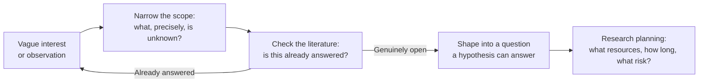

## Learning Objectives

- Describe why a graduate research project almost never starts as a clean, well-formed question, and what kind of work is needed to turn a vague interest into an investigable one.
- Explain the practical steps of research planning: narrowing scope, checking a problem is not already solved, and setting expectations with an advisor.
- Connect the undergraduate capstone's question-first cycle (`independent-research`) to graduate research as the same cycle run at greater depth, not a different process.
- Use a realistic checklist to evaluate whether a candidate research idea is ready to move from "interesting" to "actionable."

## Context & Motivation

This platform's undergraduate capstone, `independent-research`, already teaches one cycle explicitly: question, literature, papers, hypothesis, implementation, experiment, result, reflection, new question. That cycle is not replaced once a student moves into graduate work; it is run again, at far greater depth, over a far longer timeline, with far higher stakes attached to getting the early steps right. This concept is about those early steps specifically, the part of the cycle that happens before "hypothesis" is even reachable: turning a vague interest into a project that can actually be planned.

Zobel's *Writing for Computer Science* treats this directly under "Getting Started" and "Shaping a Research Project," and the observation that grounds the whole chapter is one every new graduate student eventually confirms from experience: almost nobody arrives with a fully-formed research question. Most projects begin as something much rougher, a nagging feeling that a widely used technique has an unexamined weakness, a tool that seems to be missing from an otherwise well-covered area, a result in a published paper that does not quite add up on close reading, or simply a broad area an advisor or funding source has pointed the student toward. The skill this concept covers is the deliberate, learnable process of narrowing that rough starting material into something with the two properties a real research question needs: it has to be specific enough to actually investigate, and it has to be genuinely open, not already answered by existing work the student simply has not found yet.

## Core Theory

### From vague interest to investigable question



Narrowing scope is not the same activity as reading the literature, even though the two feed each other constantly. Narrowing scope is a discipline of asking, repeatedly, "what specifically do I not know here," until the answer is concrete enough that a reasonable reader could imagine what evidence would settle it. "I'm interested in distributed consensus" is not yet a research question; "does a hybrid quorum design reduce tail latency under partial network partition compared to a fixed quorum, and by how much" is closer to one, because it names a specific comparison and a specific, measurable outcome.

### Checking a problem is not already solved

A large fraction of early-stage research time is legitimately spent finding out that an idea, however good it feels, has already been published, sometimes years earlier, under different terminology. This is not wasted time and should not be treated as a discouraging result; catching this early, before months are invested, is exactly what the literature-search skill (covered in depth in this discipline's own `reading-critically-and-writing-a-literature-review`) is for. Zobel is explicit that this checking is a normal, expected part of getting started, not a sign a student has chosen badly, and that most workable research questions survive this check only after being narrowed once or twice in response to what the literature search turns up.

### Research planning and the advisor relationship

Once a question survives the narrowing-and-checking cycle, real planning follows: what resources (compute, data, access to a system) does answering it require, how long is a realistic timeline, and what is the actual risk that the investigation fails to produce a publishable result even if executed well. Zobel treats the student-advisor relationship as a structural part of this planning, not an interpersonal afterthought: a good early conversation with an advisor sets realistic expectations on both sides about scope, pace, and what "enough" looks like for a given milestone, and misaligned expectations here, discovered late, are a common, avoidable source of wasted effort in graduate research specifically.

### A "Getting Started" checklist

```text
- Can I state the question in one or two sentences a non-expert could parse?
- Have I checked, specifically, whether this exact question has already
  been answered (not just "is this area popular")?
- Do I know, roughly, what evidence would answer this question if I found it?
- Have I discussed scope and timeline with an advisor or equivalent?
- Is the scope small enough to plausibly finish, and large enough to matter?
```

## Worked Examples

### Example 1: narrowing a vague interest

A student starts with "I want to work on machine learning fairness." That is an area, not a question. Narrowing it: which fairness definition (demographic parity, equalized odds), applied to which kind of model, evaluated on what kind of data, comparing against what alternative. After two rounds of narrowing and a literature check, the student lands on: "does a post-processing calibration step reduce equalized-odds gap on tabular credit-scoring models without a statistically significant drop in overall accuracy, compared to in-training regularization approaches." That is investigable in a way the original interest was not.

### Example 2: discovering the question is already answered

A student wants to investigate whether a particular cache-replacement policy improves hit rate under skewed access patterns. A careful literature search during the "shaping" phase turns up a paper from several years earlier answering exactly this, under a different name for the same policy. Rather than a failure, this is the process working correctly: the student pivots, using the found paper's stated limitations, perhaps its evaluation only covered synthetic workloads, as the genuine gap for a narrower, still-open follow-up question.

### Example 3: a scope negotiation with an advisor

A student proposes a project ambitious enough for a full PhD dissertation but is six months into a one-year master's research component. A direct conversation, framed around the checklist's timeline question, surfaces the mismatch early; the scope is narrowed to one defensible sub-question of the original ambitious plan, with the larger idea explicitly noted as future work rather than abandoned.

## Common Misconceptions & Pitfalls

- **"A good researcher arrives with the right question already formed."** Zobel's own account, and the shared experience of most working researchers, contradicts this directly: shaping a vague interest into an investigable question is itself a skill, exercised at the start of nearly every project, not a sign of insufficient preparation.
- **"Finding out my idea is already published means I chose badly."** This confuses a normal, expected outcome of a necessary check with a personal failure; it is evidence the checking process is working, not that the researcher is behind.
- **"Getting started is just picking a topic; the real skill is in the experiments later."** The narrowing-and-checking cycle covered here determines whether later experiments are even answering a real, open question, which makes it a genuine prerequisite skill, not preliminary busywork.

## Summary

Graduate research projects almost never begin as clean, well-formed questions; they begin as vague interests, observations, or gaps, and the real, learnable skill this concept covers is narrowing that starting material through repeated scoping and literature checking until it becomes a specific, genuinely open question a hypothesis can eventually answer, followed by realistic planning around resources, timeline, and an honest conversation with an advisor. This is the same cycle the `independent-research` capstone already introduces at a shallower depth, run here with the added weight and stakes of graduate-level work.

## Documentation Links

- [ACM Digital Library: Justin Zobel, Writing for Computer Science (3rd Edition, Springer, 2014)](https://dl.acm.org/doi/10.5555/2742708): Chapter 2, "Getting Started," is the direct source for the narrowing, literature-checking, and research-planning process covered here.
