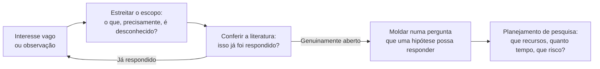

## Objetivos de Aprendizagem

- Descrever por que um projeto de pesquisa de pós-graduação quase nunca começa como uma pergunta limpa e bem formada, e que tipo de trabalho é necessário para transformar um interesse vago num investigável.
- Explicar os passos práticos do planejamento de pesquisa: estreitar o escopo, conferir que um problema ainda não foi resolvido, e alinhar expectativas com um orientador.
- Conectar o ciclo com a pergunta primeiro do trabalho de conclusão de graduação (`independent-research`) à pesquisa de pós-graduação como o mesmo ciclo rodado com maior profundidade, e não como um processo diferente.
- Usar uma lista de checagem realista para avaliar se uma ideia de pesquisa candidata está pronta para passar de "interessante" a "acionável".

## Contexto e Motivação

O trabalho de conclusão de graduação desta plataforma, `independent-research`, já ensina um ciclo explicitamente: pergunta, literatura, artigos, hipótese, implementação, experimento, resultado, reflexão, nova pergunta. Esse ciclo não é substituído uma vez que um estudante passa para o trabalho de pós-graduação; ele é rodado de novo, com muito maior profundidade, ao longo de uma linha de tempo muito mais longa, com um risco muito maior atrelado a acertar os passos iniciais. Este conceito é sobre esses passos iniciais especificamente, a parte do ciclo que acontece antes de "hipótese" sequer ser alcançável: transformar um interesse vago num projeto que possa de fato ser planejado.

*Writing for Computer Science*, de Zobel, trata disso diretamente em "Getting Started" e "Shaping a Research Project", e a observação que fundamenta o capítulo inteiro é uma que todo novo estudante de pós-graduação eventualmente confirma pela experiência: quase ninguém chega com uma pergunta de pesquisa plenamente formada. A maioria dos projetos começa como algo muito mais tosco, uma sensação incômoda de que uma técnica amplamente usada tem uma fraqueza não examinada, uma ferramenta que parece estar faltando numa área de resto bem coberta, um resultado num artigo publicado que não fecha de todo numa leitura atenta, ou simplesmente uma área ampla para a qual um orientador ou uma fonte de financiamento apontou o estudante. A habilidade que este conceito cobre é o processo deliberado e aprendível de estreitar esse material de partida tosco em algo com as duas propriedades que uma pergunta de pesquisa real precisa: ela tem de ser específica o bastante para de fato investigar, e tem de ser genuinamente aberta, não já respondida por trabalho existente que o estudante simplesmente ainda não encontrou.

## Teoria Central

### De interesse vago a pergunta investigável



Estreitar o escopo não é a mesma atividade que ler a literatura, ainda que as duas se alimentem constantemente. Estreitar o escopo é uma disciplina de perguntar, repetidamente, "o que especificamente eu não sei aqui", até que a resposta seja concreta o bastante para que um leitor razoável consiga imaginar que evidência a resolveria. "Tenho interesse em consenso distribuído" ainda não é uma pergunta de pesquisa; "um projeto de quórum híbrido reduz a latência de cauda sob partição parcial de rede em comparação com um quórum fixo, e em quanto" está mais perto de uma, porque nomeia uma comparação específica e um desfecho específico e mensurável.

### Conferir que um problema ainda não foi resolvido

Uma grande fração do tempo de pesquisa em estágio inicial é legitimamente gasta descobrindo que uma ideia, por melhor que ela pareça, já foi publicada, às vezes anos antes, sob uma terminologia diferente. Isso não é tempo desperdiçado e não deve ser tratado como um resultado desencorajador; pegar isso cedo, antes que meses sejam investidos, é exatamente para o que a habilidade de busca de literatura (coberta em profundidade no `reading-critically-and-writing-a-literature-review` desta própria disciplina) serve. Zobel é explícito ao dizer que essa checagem é uma parte normal e esperada de começar, e não um sinal de que um estudante escolheu mal, e que a maioria das perguntas de pesquisa viáveis sobrevive a essa checagem só depois de ser estreitada uma ou duas vezes em resposta ao que a busca de literatura revela.

### Planejamento de pesquisa e a relação com o orientador

Uma vez que uma pergunta sobrevive ao ciclo de estreitar e conferir, segue-se um planejamento real: que recursos (computação, dados, acesso a um sistema) respondê-la exige, quão longa é uma linha de tempo realista, e qual é o risco de fato de que a investigação deixe de produzir um resultado publicável mesmo se executada bem. Zobel trata a relação estudante-orientador como uma parte estrutural desse planejamento, e não como um acessório interpessoal: uma boa conversa inicial com um orientador estabelece expectativas realistas dos dois lados sobre escopo, ritmo e como "o suficiente" se parece para um dado marco, e expectativas desalinhadas aqui, descobertas tarde, são uma fonte comum e evitável de esforço desperdiçado na pesquisa de pós-graduação especificamente.

### Uma lista de checagem de "Começar"

```text
- Consigo enunciar a pergunta em uma ou duas frases que um não especialista
  conseguiria analisar?
- Conferi, especificamente, se esta pergunta exata já foi respondida
  (não só "esta área é popular")?
- Sei, mais ou menos, que evidência responderia a esta pergunta se eu a encontrasse?
- Discuti escopo e linha de tempo com um orientador ou equivalente?
- O escopo é pequeno o bastante para plausivelmente concluir, e grande o bastante para importar?
```

## Exemplos Resolvidos

### Exemplo 1: estreitar um interesse vago

Um estudante começa com "quero trabalhar em justiça (fairness) de aprendizado de máquina". Isso é uma área, não uma pergunta. Estreitando-a: qual definição de justiça (paridade demográfica, equalized odds), aplicada a que tipo de modelo, avaliada em que tipo de dados, comparando contra que alternativa. Depois de duas rodadas de estreitamento e uma checagem de literatura, o estudante chega a: "um passo de calibração pós-processamento reduz a lacuna de equalized-odds em modelos tabulares de credit-scoring sem uma queda estatisticamente significativa na acurácia geral, em comparação com abordagens de regularização durante o treino". Isso é investigável de uma forma que o interesse original não era.

### Exemplo 2: descobrir que a pergunta já foi respondida

Um estudante quer investigar se uma política específica de substituição de cache melhora a taxa de acerto sob padrões de acesso enviesados. Uma busca de literatura cuidadosa durante a fase de "moldagem" revela um artigo de vários anos antes respondendo exatamente isso, sob um nome diferente para a mesma política. Em vez de uma falha, isso é o processo funcionando corretamente: o estudante pivota, usando as limitações enunciadas do artigo encontrado, talvez a sua avaliação só tenha coberto cargas sintéticas, como a lacuna genuína para uma pergunta de acompanhamento mais estreita e ainda aberta.

### Exemplo 3: uma negociação de escopo com um orientador

Um estudante propõe um projeto ambicioso o bastante para uma dissertação completa de doutorado, mas está a seis meses de um componente de pesquisa de mestrado de um ano. Uma conversa direta, enquadrada em torno da pergunta de linha de tempo da lista de checagem, revela o descompasso cedo; o escopo é estreitado a uma subpergunta defensável do plano ambicioso original, com a ideia maior explicitamente anotada como trabalho futuro, em vez de abandonada.

## Equívocos Comuns e Armadilhas

- **"Um bom pesquisador chega com a pergunta certa já formada."** O próprio relato de Zobel, e a experiência compartilhada da maioria dos pesquisadores em atividade, contradiz isso diretamente: moldar um interesse vago numa pergunta investigável é, ela mesma, uma habilidade, exercida no começo de quase todo projeto, e não um sinal de preparo insuficiente.
- **"Descobrir que a minha ideia já está publicada significa que escolhi mal."** Isso confunde um desfecho normal e esperado de uma checagem necessária com uma falha pessoal; é evidência de que o processo de checagem está funcionando, e não de que o pesquisador está atrasado.
- **"Começar é só escolher um tópico; a habilidade real está nos experimentos depois."** O ciclo de estreitar e conferir coberto aqui determina se os experimentos posteriores estão sequer respondendo a uma pergunta real e aberta, o que o torna uma habilidade pré-requisito genuína, e não trabalho burocrático preliminar.

## Resumo

Os projetos de pesquisa de pós-graduação quase nunca começam como perguntas limpas e bem formadas; eles começam como interesses vagos, observações ou lacunas, e a habilidade real e aprendível que este conceito cobre é estreitar esse material de partida por meio de delimitação de escopo e checagem de literatura repetidas, até que ele se torne uma pergunta específica e genuinamente aberta que uma hipótese possa eventualmente responder, seguida de um planejamento realista em torno de recursos, linha de tempo e uma conversa honesta com um orientador. Este é o mesmo ciclo que o trabalho de conclusão `independent-research` já introduz numa profundidade mais rasa, rodado aqui com o peso e o risco adicionais do trabalho em nível de pós-graduação.

## Documentation Links

- [ACM Digital Library: Justin Zobel, Writing for Computer Science (3ª edição, Springer, 2014)](https://dl.acm.org/doi/10.5555/2742708): o Capítulo 2, "Getting Started", é a fonte direta do processo de estreitar, conferir a literatura e planejar a pesquisa coberto aqui.
