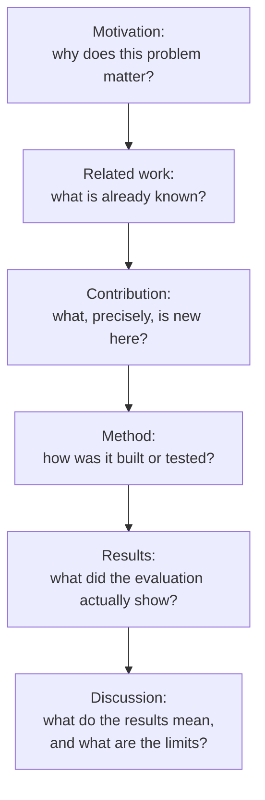

## Learning Objectives

- Explain why choosing the right scope for a paper, neither too little nor too much material for one central claim, is a decision made before writing begins, not discovered while writing.
- Describe what it means for a paper to "tell a story," in Zobel's and Simon Peyton Jones's shared sense, and why a chronological account of what the author did is not the same thing.
- Name the standard organizational shape a research paper follows and explain what work each part does for a skeptical reader.
- Distinguish a first draft's purpose from a finished paper's, and describe what changes between drafting and submission.

## Context & Motivation

`kinds-of-scientific-publication-and-writing-for-a-skeptical-reader` established the working assumption behind this entire discipline: a paper's reader is skeptical and must be persuaded. This concept is about the single decision that determines whether persuasion is even possible before a word of the body is written: what, precisely, is this paper's one claim, and what is the right amount of material to support it convincingly without either starving it of evidence or burying it under everything the author happens to know.

Zobel's chapter on writing a paper and Simon Peyton Jones's independently developed talk converge on the same core insight, arrived at from different angles: a paper is not a chronological report of what the researcher did, in the order they did it. It is a constructed argument for one claim, and the actual chronological order of a research project, false starts, abandoned approaches, dead ends explored and discarded, is almost never the right order to present the finished argument in. Peyton Jones frames this as "tell a story"; Zobel frames it as choosing the paper's scope and organization deliberately rather than inheriting it from the project's own history. Both amount to the same discipline.

## Core Theory

### Scope: one claim, not a project diary

The single most common early-career mistake Zobel identifies is scope mismatch: a paper trying to report everything a multi-month project produced, rather than the one central, defensible claim the project's strongest result actually supports. A paper with too broad a scope dilutes its evidence across too many secondary points, none of which gets the depth needed to convince a skeptical reader; a paper with too narrow a scope, a single minor observation stretched to fill a paper's expected length, invites the opposite problem, padding that a skeptical reader recognizes immediately. The right scope is found by asking what one claim the strongest available evidence actually supports, and building the paper entirely around defending that claim well, deferring everything else, including genuinely interesting side findings, to future work or a separate paper.

### Telling a story versus reporting a chronology

```text
Chronological account (what NOT to write):
  "First we tried approach A, which didn't work well. Then we tried
  approach B, which had a different problem. Eventually we combined
  ideas from both into approach C, which is what we present here..."

A constructed argument (what to write instead):
  "We present approach C, motivated by [the real insight from A and B].
  We show it outperforms existing methods because [the reason, stated
  directly, not rediscovered narratively]..."
```

A skeptical reader is not interested in the emotional or historical journey of discovery; they are interested in whether the final claim is true and well-supported. Presenting the paper as a constructed argument for the strongest version of the finding, rather than a faithful diary of the process that led there, is not dishonest, the actual results and evidence remain exactly the same, it is simply choosing the organization that best serves the reader's actual task: evaluating the claim.

### The standard shape and what each part is for



Each part exists to answer a specific question a skeptical reader is asking at that point in the paper: motivation answers "why should I keep reading," related work answers "how do I know this hasn't been done," the contribution statement answers "what, exactly, is this paper claiming," method and results answer "how do I know the claim is true," and discussion answers "what does this actually mean, and where does it stop applying." A paper that skips or buries any one of these leaves a skeptical reader's corresponding question unanswered, which is where persuasion breaks down regardless of how strong the underlying result actually is.

### The first draft, and what changes before submission

Zobel treats the first draft as deliberately rough, its job is to get the argument's skeleton down in the right order, not to be well-written. Trying to perfect sentence-level style during the first draft slows down the much more important work of getting the scope and organization right first; style is the concern of later concepts in this discipline (`good-style-economy-tone-and-audience`, `editing-and-revision`), applied once the shape is settled. What changes between a completed first draft and a submitted paper is substantial: sections get reordered once the actual argument becomes clear from having written it once, claims get tightened to match exactly what the evidence supports, and material that seemed essential while drafting often turns out to belong in future work instead.

## Worked Examples

### Example 1: fixing a scope mismatch

A draft paper reports three different optimizations to a database index structure, each tested lightly, alongside one deeper, well-evaluated result. Scoped correctly, the paper keeps only the deep result as its central claim, mentioning the other two optimizations briefly as future work rather than trying to defend all three with the same limited evidence; this produces a shorter, more convincing paper than the original draft covering all three.

### Example 2: rewriting a chronological account as an argument

A student's first draft of a results section reads: "We initially measured throughput, but the numbers seemed off, so we re-ran the experiment with warm caches, which gave more consistent results, shown below." Restructured as an argument: "All throughput measurements use warm caches, following standard practice for this workload [citation]; Table 2 reports the results." The evidence and methodology are identical; only the presentation changed, from narrating the process of arriving at a decision to simply stating the decision and its justification.

### Example 3: reordering after a first draft

A first draft presents the method in the order it was developed: a naive baseline, then problem discovered with the baseline, then the fix. On reread, the actual contribution is the fix, and readers do not need the full narrative of the naive baseline's failure to understand it. The revised organization states the final method directly, then discusses the naive baseline only briefly, in related work, as the approach being improved upon.

## Common Misconceptions & Pitfalls

- **"A paper should report everything we did, so readers see the full picture."** This is precisely the scope mismatch Zobel warns against; a skeptical reader wants the strongest defensible claim argued well, not a complete project history diluted across too many secondary points.
- **"The first draft should already be well written."** Conflating drafting with polishing slows down the more important early work of getting scope and organization right, which is likely to change the paper's shape enough that early sentence-level polish gets discarded anyway.
- **"Telling a story means dramatizing the research process."** Both Zobel and Peyton Jones mean something narrower and more useful: constructing the clearest possible argument for the paper's one claim, which is often the opposite of a dramatized, chronological account of how the work actually unfolded.

## Summary

Choosing a paper's scope, the one claim the strongest available evidence actually supports, is a decision made deliberately before writing, not discovered along the way, and it determines whether the paper can be convincingly argued at all. Telling a story, in the sense both Zobel and Simon Peyton Jones mean it, is constructing the clearest possible argument for that one claim, not narrating the chronological, often messy, history of the research process. The standard organizational shape, motivation, related work, contribution, method, results, discussion, exists because each part answers a specific question a skeptical reader is asking, and a rough, deliberately unpolished first draft exists to get that shape right before any concern with sentence-level style.

## Documentation Links

- [ACM Digital Library: Justin Zobel, Writing for Computer Science (3rd Edition, Springer, 2014)](https://dl.acm.org/doi/10.5555/2742708): Chapter 5, "Writing a Paper," is the direct source for the scope, organization, first-draft, and drafting-to-submission guidance covered here.
- [Microsoft Research: Simon Peyton Jones, How to Write a Great Research Paper](https://www.microsoft.com/en-us/research/academic-program/write-great-research-paper/): the source of the "tell a story" framing, developed independently and converging on the same organizational advice as Zobel.
