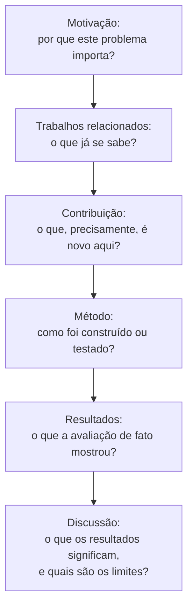

## Objetivos de Aprendizagem

- Explicar por que escolher o escopo certo para um artigo, nem pouco nem muito material para uma afirmação central, é uma decisão tomada antes de a escrita começar, e não descoberta durante a escrita.
- Descrever o que significa um artigo "contar uma história", no sentido compartilhado por Zobel e Simon Peyton Jones, e por que um relato cronológico do que o autor fez não é a mesma coisa.
- Nomear o formato organizacional padrão que um artigo de pesquisa segue e explicar que trabalho cada parte faz para um leitor cético.
- Distinguir o propósito de um primeiro rascunho do de um artigo pronto, e descrever o que muda entre o rascunho e a submissão.

## Contexto e Motivação

`kinds-of-scientific-publication-and-writing-for-a-skeptical-reader` estabeleceu a suposição de trabalho por trás desta disciplina inteira: o leitor de um artigo é cético e precisa ser persuadido. Este conceito é sobre a única decisão que determina se a persuasão é sequer possível antes de uma palavra do corpo ser escrita: qual, precisamente, é a única afirmação deste artigo, e qual é a quantidade certa de material para apoiá-la de forma convincente sem nem privá-la de evidência nem soterrá-la sob tudo o que o autor por acaso sabe.

O capítulo de Zobel sobre escrever um artigo e a palestra desenvolvida de forma independente por Simon Peyton Jones convergem para a mesma percepção central, alcançada de ângulos diferentes: um artigo não é um relato cronológico do que o pesquisador fez, na ordem em que fez. É um argumento construído para uma afirmação, e a ordem cronológica de fato de um projeto de pesquisa, partidas falsas, abordagens abandonadas, becos sem saída explorados e descartados, quase nunca é a ordem certa de apresentar o argumento pronto. Peyton Jones enquadra isso como "conte uma história"; Zobel enquadra como escolher o escopo e a organização do artigo deliberadamente, em vez de herdá-los da própria história do projeto. Ambos equivalem à mesma disciplina.

## Teoria Central

### Escopo: uma afirmação, não um diário de projeto

O erro de início de carreira mais comum que Zobel identifica é o descompasso de escopo: um artigo tentando relatar tudo o que um projeto de vários meses produziu, em vez da única afirmação central e defensável que o resultado mais forte do projeto de fato apoia. Um artigo com escopo amplo demais dilui a sua evidência por pontos secundários demais, nenhum dos quais ganha a profundidade necessária para convencer um leitor cético; um artigo com escopo estreito demais, uma única observação menor esticada para preencher o comprimento esperado de um artigo, convida o problema oposto, enchimento que um leitor cético reconhece de imediato. O escopo certo é encontrado perguntando que única afirmação a evidência mais forte disponível de fato apoia, e construindo o artigo inteiramente em torno de defender bem essa afirmação, adiando todo o resto, incluindo descobertas secundárias genuinamente interessantes, para trabalho futuro ou um artigo separado.

### Contar uma história versus relatar uma cronologia

```text
Relato cronológico (o que NÃO escrever):
  "Primeiro tentamos a abordagem A, que não funcionou bem. Depois tentamos
  a abordagem B, que teve um problema diferente. Por fim combinamos
  ideias das duas na abordagem C, que é o que apresentamos aqui..."

Um argumento construído (o que escrever em vez disso):
  "Apresentamos a abordagem C, motivada por [a percepção real de A e B].
  Mostramos que ela supera os métodos existentes porque [o motivo, enunciado
  diretamente, não redescoberto de forma narrativa]..."
```

Um leitor cético não está interessado na jornada emocional ou histórica da descoberta; está interessado em se a afirmação final é verdadeira e bem apoiada. Apresentar o artigo como um argumento construído para a versão mais forte da descoberta, em vez de um diário fiel do processo que levou até ela, não é desonesto, os resultados e a evidência de fato permanecem exatamente os mesmos, é simplesmente escolher a organização que melhor serve à tarefa de fato do leitor: avaliar a afirmação.

### O formato padrão e para que serve cada parte



Cada parte existe para responder a uma pergunta específica que um leitor cético está fazendo naquele ponto do artigo: a motivação responde "por que eu deveria continuar lendo", os trabalhos relacionados respondem "como eu sei que isto não foi feito", a afirmação de contribuição responde "o que, exatamente, este artigo está alegando", o método e os resultados respondem "como eu sei que a afirmação é verdadeira", e a discussão responde "o que isto de fato significa, e onde ele para de se aplicar". Um artigo que pula ou soterra qualquer uma dessas deixa a pergunta correspondente de um leitor cético sem resposta, que é onde a persuasão se desfaz, por mais forte que o resultado subjacente de fato seja.

### O primeiro rascunho, e o que muda antes da submissão

Zobel trata o primeiro rascunho como deliberadamente tosco, a sua função é colocar o esqueleto do argumento na ordem certa, e não ser bem escrito. Tentar aperfeiçoar o estilo em nível de frase durante o primeiro rascunho atrasa o trabalho muito mais importante de acertar primeiro o escopo e a organização; o estilo é a preocupação de conceitos posteriores desta disciplina (`good-style-economy-tone-and-audience`, `editing-and-revision`), aplicado uma vez que o formato está assentado. O que muda entre um primeiro rascunho concluído e um artigo submetido é substancial: as seções são reordenadas uma vez que o argumento de fato fica claro por tê-lo escrito uma vez, as afirmações são apertadas para bater exatamente com o que a evidência apoia, e material que parecia essencial enquanto se rascunhava muitas vezes acaba pertencendo a trabalho futuro.

## Exemplos Resolvidos

### Exemplo 1: corrigir um descompasso de escopo

Um rascunho de artigo relata três otimizações diferentes de uma estrutura de índice de banco de dados, cada uma testada de leve, ao lado de um resultado mais profundo e bem avaliado. Com o escopo correto, o artigo mantém só o resultado profundo como a sua afirmação central, mencionando as outras duas otimizações brevemente como trabalho futuro, em vez de tentar defender as três com a mesma evidência limitada; isso produz um artigo mais curto e mais convincente do que o rascunho original que cobre as três.

### Exemplo 2: reescrever um relato cronológico como um argumento

O primeiro rascunho de uma seção de resultados de um estudante diz: "Inicialmente medimos a vazão, mas os números pareciam estranhos, então reexecutamos o experimento com caches quentes, o que deu resultados mais consistentes, mostrados abaixo." Reestruturado como um argumento: "Todas as medições de vazão usam caches quentes, seguindo a prática padrão para esta carga [citação]; a Tabela 2 relata os resultados." A evidência e a metodologia são idênticas; só a apresentação mudou, de narrar o processo de chegar a uma decisão para simplesmente enunciar a decisão e a sua justificativa.

### Exemplo 3: reordenar após um primeiro rascunho

Um primeiro rascunho apresenta o método na ordem em que ele foi desenvolvido: uma linha de base ingênua, depois o problema descoberto com a linha de base, depois a correção. Numa releitura, a contribuição de fato é a correção, e os leitores não precisam da narrativa completa do fracasso da linha de base ingênua para entendê-la. A organização revisada enuncia o método final diretamente, e depois discute a linha de base ingênua só brevemente, nos trabalhos relacionados, como a abordagem que está sendo melhorada.

## Equívocos Comuns e Armadilhas

- **"Um artigo deve relatar tudo o que fizemos, para que os leitores vejam o quadro completo."** Esse é precisamente o descompasso de escopo contra o qual Zobel adverte; um leitor cético quer a afirmação mais forte e defensável bem argumentada, e não uma história completa de projeto diluída por pontos secundários demais.
- **"O primeiro rascunho já deve ser bem escrito."** Confundir rascunhar com polir atrasa o trabalho inicial mais importante de acertar escopo e organização, que provavelmente mudará o formato do artigo o bastante para que o polimento inicial em nível de frase seja descartado mesmo assim.
- **"Contar uma história significa dramatizar o processo de pesquisa."** Tanto Zobel quanto Peyton Jones querem dizer algo mais estreito e mais útil: construir o argumento mais claro possível para a única afirmação do artigo, que muitas vezes é o oposto de um relato cronológico e dramatizado de como o trabalho de fato se desenrolou.

## Resumo

Escolher o escopo de um artigo, a única afirmação que a evidência mais forte disponível de fato apoia, é uma decisão tomada deliberadamente antes da escrita, e não descoberta pelo caminho, e ela determina se o artigo pode sequer ser argumentado de forma convincente. Contar uma história, no sentido em que tanto Zobel quanto Simon Peyton Jones o entendem, é construir o argumento mais claro possível para essa única afirmação, e não narrar a história cronológica, muitas vezes bagunçada, do processo de pesquisa. O formato organizacional padrão, motivação, trabalhos relacionados, contribuição, método, resultados, discussão, existe porque cada parte responde a uma pergunta específica que um leitor cético está fazendo, e um primeiro rascunho tosco e deliberadamente não polido existe para acertar esse formato antes de qualquer preocupação com o estilo em nível de frase.

## Documentation Links

- [ACM Digital Library: Justin Zobel, Writing for Computer Science (3ª edição, Springer, 2014)](https://dl.acm.org/doi/10.5555/2742708): o Capítulo 5, "Writing a Paper", é a fonte direta da orientação sobre escopo, organização, primeiro rascunho e da passagem do rascunho à submissão coberta aqui.
- [Microsoft Research: Simon Peyton Jones, How to Write a Great Research Paper](https://www.microsoft.com/en-us/research/academic-program/write-great-research-paper/): a fonte do enquadramento de "contar uma história", desenvolvido de forma independente e convergindo para o mesmo conselho organizacional de Zobel.
