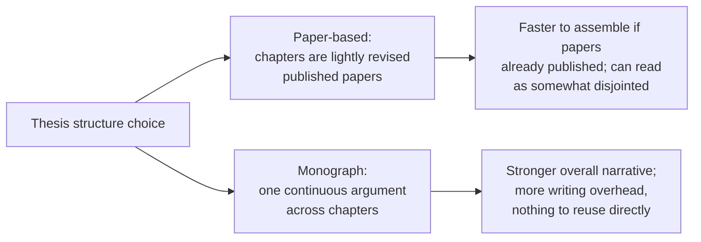

## Learning Objectives

- Explain how a thesis's different reader, an examiner whose job is to certify the work meets a standard, and different purpose, a deep or definitive treatment of one problem rather than one persuasive claim, change its structure relative to a paper.
- Describe the specific structural elements a thesis typically needs that a paper often can omit: an extended literature review arguing for a gap, chapters that can stand individually, and an honest discussion of limitations.
- Distinguish a thesis built by stitching together already-published papers from one built as a single continuous argument, and state a real tradeoff between the two approaches.
- Apply this structural distinction to plan a thesis or dissertation outline from an existing body of research.

## Context & Motivation

`the-shape-of-a-paper-scope-story-and-organization` covered how to build a paper around one claim for a skeptical, time-pressured reader. A thesis, as `kinds-of-scientific-publication-and-writing-for-a-skeptical-reader` already distinguished, is read differently: by a small number of examiners whose job is not merely to be persuaded of one claim but to certify that the work as a whole meets the standard expected of the degree being awarded. That different reader and different purpose is not a minor variation on paper-writing; it changes real structural decisions throughout the document, which is why Justin Zobel, together with Paul Gruba and David Evans, wrote a dedicated companion text, *How to Write a Better Thesis*, treating thesis writing as its own genre rather than an extended paper.

This matters directly for `graduate-studies`: the discipline's whole purpose is producing work that culminates in exactly this kind of document, whether a master's dissertation or a doctoral thesis, and treating it as "a longer paper" produces a document that satisfies neither genre's actual requirements.

## Core Theory

### What changes between a paper's reader and a thesis's reader

```text
Paper reader (skeptical peer, time-pressured):
  - Needs to be persuaded of ONE claim, efficiently
  - Trusts standard background is already known
  - May skim; organization optimizes for the paper's central argument

Thesis reader (examiner, obligated to be thorough):
  - Must certify the WHOLE body of work meets a standard
  - Explicitly evaluates whether the author demonstrates full command
    of the area, not just the one contribution
  - Reads closely, including material a paper would leave implicit
```

Because the examiner's task is certification rather than quick persuasion, a thesis has to demonstrate things a paper can leave implicit: full awareness of the surrounding field, not just the slice directly relevant to one claim, and honest engagement with the work's own limitations, since an examiner is specifically looking for evidence the author understands what their work does not show, not only what it does.

### An extended literature review that argues for a gap

A thesis's literature review chapter is substantially longer and more argumentative than a paper's related-work section. Where a paper's related work exists mainly to establish that the specific contribution is new, a thesis's literature review has to do the fuller synthesis work covered in `reading-critically-and-writing-a-literature-review`: establishing what is settled in the area, what is contested, and building an explicit, defensible argument that the specific gap the thesis addresses is real and significant enough to justify a whole body of work, not just one paper's worth.

### Chapters that stand individually versus one continuous argument



Many doctoral theses today are explicitly built from a set of the candidate's own published or publishable papers, lightly revised and connected by introduction and conclusion chapters that provide the unifying argument the individual papers, by design, do not each carry alone. This is a legitimate, common structure, and it has a real advantage: chapters are independently defensible, each having already survived some form of peer scrutiny. Its real cost is that the thesis can read as a collection of related but separately-argued pieces rather than one sustained argument, which is why the connective introduction and conclusion chapters carry more weight in this structure than they might first appear to. The alternative, a monograph-style thesis built as one continuous argument from the start, produces a more unified document but sacrifices the ability to reuse already-written, already-reviewed material.

### Limitations: a section a paper can often omit but a thesis cannot

A conference paper under a strict page limit can sometimes leave limitations implicit or address them in a single closing paragraph. An examiner reading a thesis is specifically assessing whether the candidate understands the boundaries of their own contribution, which means a thesis needs an honest, reasonably thorough limitations discussion, not because the work is expected to be flawless, no real research is, but because failing to identify real limitations reads to an examiner as a gap in the candidate's own critical judgment, which is precisely the capability a thesis is meant to demonstrate.

## Worked Examples

### Example 1: choosing a structure before writing begins

A doctoral candidate has three papers accepted at different venues across their candidature, all related to consensus protocol design. Rather than writing a fourth, unifying monograph from scratch, the candidate structures the thesis around the three papers as individual chapters, adding a substantial introduction chapter that argues for the shared gap all three address together, and a conclusion chapter synthesizing what the three results say collectively that no individual paper claims alone.

### Example 2: expanding a paper's related work into a thesis literature review

A paper's related-work section states, in two paragraphs, that prior consistency-model work has not addressed geo-distributed hybrid approaches. The corresponding thesis chapter expands this into a full argument: surveying strong-consistency approaches and their costs, weaker-consistency approaches and their benefits, and hybrid approaches attempted in non-geo-distributed settings, before arriving at the same gap the paper stated directly, now earned through visible synthesis rather than asserted.

### Example 3: writing an honest limitations section

A thesis chapter's evaluation covers three real-world workloads. Rather than implying the result generalizes broadly, the limitations discussion states plainly that all three workloads share a particular access pattern, and that the claim should be read as scoped to that pattern until tested more broadly, directly addressing what an examiner would otherwise have to ask about unprompted.

## Common Misconceptions & Pitfalls

- **"A thesis is just a longer paper."** The different reader, an examiner certifying the whole body of work rather than a peer being persuaded of one claim, changes real structural requirements: a fuller literature review, chapters that can stand individually, and an explicit limitations discussion a paper can sometimes omit.
- **"Stitching together published papers is a shortcut that produces a weaker thesis."** It is a legitimate, common structure with a real tradeoff, not an inherently lesser one; its weakness, reading as disjointed, is specifically addressed by investing real effort in the connective introduction and conclusion chapters.
- **"Admitting limitations weakens a thesis."** An examiner is specifically assessing critical judgment; a thesis that omits real, identifiable limitations reads as less rigorous, not more, than one that states them honestly.

## Summary

A thesis is read by an examiner whose task is certifying that a whole body of work meets a standard, not a skeptical peer being persuaded of one claim, and that different reader changes concrete structural decisions: a fuller, more argumentative literature review establishing the gap the whole thesis addresses, a real choice between paper-based and monograph-style chapter structure with a genuine tradeoff between them, and an honest limitations discussion that a paper can sometimes leave implicit but a thesis cannot, since it is direct evidence of the critical judgment a degree is meant to certify.

## Documentation Links

- [ACM Digital Library: Justin Zobel, Writing for Computer Science (3rd Edition, Springer, 2014)](https://dl.acm.org/doi/10.5555/2742708): Chapter 5's "Theses" section is the direct source for the paper-versus-thesis reader distinction used throughout this concept.
- [ACM Digital Library: David Evans, Paul Gruba, Justin Zobel, How to Write a Better Thesis (Springer, 2014)](https://dl.acm.org/doi/10.5555/2633585): a dedicated, book-length treatment of thesis structure specifically, the direct source for the paper-based-versus-monograph structural choice and the limitations-section guidance.
