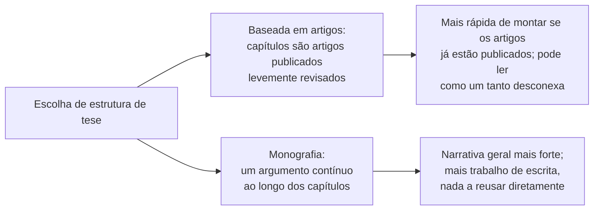

## Objetivos de Aprendizagem

- Explicar como o leitor diferente de uma tese, um examinador cuja função é certificar que o trabalho atinge um padrão, e o propósito diferente, um tratamento profundo ou definitivo de um problema, em vez de uma afirmação persuasiva, mudam a sua estrutura em relação a um artigo.
- Descrever os elementos estruturais específicos de que uma tese tipicamente precisa e que um artigo muitas vezes pode omitir: uma revisão de literatura estendida argumentando por uma lacuna, capítulos que podem se sustentar individualmente, e uma discussão honesta de limitações.
- Distinguir uma tese construída costurando artigos já publicados de uma construída como um único argumento contínuo, e enunciar um trade-off real entre as duas abordagens.
- Aplicar essa distinção estrutural para planejar um roteiro de tese ou dissertação a partir de um corpo de pesquisa existente.

## Contexto e Motivação

`the-shape-of-a-paper-scope-story-and-organization` cobriu como construir um artigo em torno de uma afirmação para um leitor cético e pressionado pelo tempo. Uma tese, como `kinds-of-scientific-publication-and-writing-for-a-skeptical-reader` já distinguiu, é lida de forma diferente: por um pequeno número de examinadores cuja função não é meramente se persuadir de uma afirmação, mas certificar que o trabalho como um todo atinge o padrão esperado do diploma sendo concedido. Esse leitor diferente e propósito diferente não é uma variação menor da escrita de artigos; muda decisões estruturais reais ao longo do documento, e é por isso que Justin Zobel, junto de Paul Gruba e David Evans, escreveu um texto companheiro dedicado, *How to Write a Better Thesis*, tratando a escrita de teses como um gênero próprio, e não como um artigo estendido.

Isso importa diretamente para `graduate-studies`: o propósito inteiro da disciplina é produzir trabalho que culmina exatamente neste tipo de documento, seja uma dissertação de mestrado ou uma tese de doutorado, e tratá-lo como "um artigo mais longo" produz um documento que não satisfaz os requisitos de fato de nenhum dos gêneros.

## Teoria Central

### O que muda entre o leitor de um artigo e o leitor de uma tese

```text
Leitor de artigo (par cético, pressionado pelo tempo):
  - Precisa ser persuadido de UMA afirmação, de forma eficiente
  - Confia que o contexto padrão já é conhecido
  - Pode passar o olho; a organização otimiza para o argumento central do artigo

Leitor de tese (examinador, obrigado a ser minucioso):
  - Precisa certificar que TODO o corpo de trabalho atinge um padrão
  - Avalia explicitamente se o autor demonstra pleno domínio
    da área, não só da única contribuição
  - Lê de perto, incluindo material que um artigo deixaria implícito
```

Como a tarefa do examinador é certificação, e não persuasão rápida, uma tese tem de demonstrar coisas que um artigo pode deixar implícitas: plena consciência do campo ao redor, não só a fatia diretamente relevante a uma afirmação, e um engajamento honesto com as próprias limitações do trabalho, já que um examinador procura especificamente evidência de que o autor entende o que o seu trabalho não mostra, não só o que ele mostra.

### Uma revisão de literatura estendida que argumenta por uma lacuna

O capítulo de revisão de literatura de uma tese é substancialmente mais longo e mais argumentativo do que a seção de trabalhos relacionados de um artigo. Onde os trabalhos relacionados de um artigo existem principalmente para estabelecer que a contribuição específica é nova, a revisão de literatura de uma tese tem de fazer o trabalho mais completo de síntese coberto em `reading-critically-and-writing-a-literature-review`: estabelecer o que está assentado na área, o que é contestado, e construir um argumento explícito e defensável de que a lacuna específica que a tese aborda é real e significativa o bastante para justificar um corpo inteiro de trabalho, e não só o equivalente a um artigo.

### Capítulos que se sustentam individualmente versus um argumento contínuo



Muitas teses de doutorado hoje são explicitamente construídas a partir de um conjunto dos próprios artigos publicados ou publicáveis do candidato, levemente revisados e conectados por capítulos de introdução e conclusão que fornecem o argumento unificador que os artigos individuais, por projeto, não carregam cada um sozinho. Essa é uma estrutura legítima e comum, e tem uma vantagem real: os capítulos são defensáveis de forma independente, cada um já tendo sobrevivido a alguma forma de escrutínio por pares. O seu custo real é que a tese pode ler como uma coleção de peças relacionadas, mas argumentadas separadamente, em vez de um argumento sustentado, e é por isso que os capítulos conectivos de introdução e conclusão carregam mais peso nessa estrutura do que podem parecer à primeira vista. A alternativa, uma tese em estilo de monografia construída como um argumento contínuo desde o começo, produz um documento mais unificado, mas sacrifica a capacidade de reusar material já escrito e já avaliado.

### Limitações: uma seção que um artigo muitas vezes pode omitir, mas uma tese não

Um artigo de conferência sob um limite estrito de páginas às vezes pode deixar as limitações implícitas ou tratá-las num único parágrafo de encerramento. Um examinador lendo uma tese está especificamente avaliando se o candidato entende as fronteiras da sua própria contribuição, o que significa que uma tese precisa de uma discussão de limitações honesta e razoavelmente minuciosa, não porque se espera que o trabalho seja impecável, nenhuma pesquisa real é, mas porque deixar de identificar limitações reais soa, para um examinador, como uma lacuna no próprio julgamento crítico do candidato, que é precisamente a capacidade que uma tese deve demonstrar.

## Exemplos Resolvidos

### Exemplo 1: escolher uma estrutura antes de a escrita começar

Um candidato a doutorado tem três artigos aceitos em veículos diferentes ao longo do seu doutorado, todos relacionados ao projeto de protocolos de consenso. Em vez de escrever uma quarta monografia unificadora do zero, o candidato estrutura a tese em torno dos três artigos como capítulos individuais, acrescentando um capítulo de introdução substancial que argumenta pela lacuna compartilhada que os três abordam juntos, e um capítulo de conclusão sintetizando o que os três resultados dizem coletivamente que nenhum artigo individual alega sozinho.

### Exemplo 2: expandir os trabalhos relacionados de um artigo numa revisão de literatura de tese

A seção de trabalhos relacionados de um artigo enuncia, em dois parágrafos, que o trabalho anterior sobre modelos de consistência não abordou abordagens híbridas geodistribuídas. O capítulo de tese correspondente expande isso num argumento completo: levantando as abordagens de consistência forte e os seus custos, as abordagens de consistência mais fraca e os seus benefícios, e as abordagens híbridas tentadas em cenários não geodistribuídos, antes de chegar à mesma lacuna que o artigo enunciou diretamente, agora conquistada por meio de uma síntese visível, em vez de asserida.

### Exemplo 3: escrever uma seção de limitações honesta

A avaliação de um capítulo de tese cobre três cargas do mundo real. Em vez de sugerir que o resultado generaliza amplamente, a discussão de limitações enuncia de forma clara que as três cargas compartilham um padrão de acesso específico, e que a afirmação deve ser lida como delimitada a esse padrão até ser testada mais amplamente, abordando diretamente aquilo que um examinador, de outra forma, teria de perguntar por conta própria.

## Equívocos Comuns e Armadilhas

- **"Uma tese é só um artigo mais longo."** O leitor diferente, um examinador certificando todo o corpo de trabalho, em vez de um par sendo persuadido de uma afirmação, muda requisitos estruturais reais: uma revisão de literatura mais completa, capítulos que podem se sustentar individualmente, e uma discussão explícita de limitações que um artigo às vezes pode omitir.
- **"Costurar artigos publicados é um atalho que produz uma tese mais fraca."** É uma estrutura legítima e comum com um trade-off real, e não uma inerentemente menor; a sua fraqueza, ler como desconexa, é especificamente abordada investindo esforço real nos capítulos conectivos de introdução e conclusão.
- **"Admitir limitações enfraquece uma tese."** Um examinador está especificamente avaliando o julgamento crítico; uma tese que omite limitações reais e identificáveis soa menos rigorosa, e não mais, do que uma que as enuncia honestamente.

## Resumo

Uma tese é lida por um examinador cuja tarefa é certificar que todo um corpo de trabalho atinge um padrão, e não por um par cético sendo persuadido de uma afirmação, e esse leitor diferente muda decisões estruturais concretas: uma revisão de literatura mais completa e mais argumentativa estabelecendo a lacuna que a tese inteira aborda, uma escolha real entre a estrutura de capítulos baseada em artigos e a em estilo de monografia com um trade-off genuíno entre elas, e uma discussão honesta de limitações que um artigo às vezes pode deixar implícita, mas uma tese não, já que ela é evidência direta do julgamento crítico que um diploma deve certificar.

## Documentation Links

- [ACM Digital Library: Justin Zobel, Writing for Computer Science (3ª edição, Springer, 2014)](https://dl.acm.org/doi/10.5555/2742708): a seção "Theses" do Capítulo 5 é a fonte direta da distinção entre o leitor de artigo e o de tese usada ao longo deste conceito.
- [ACM Digital Library: David Evans, Paul Gruba, Justin Zobel, How to Write a Better Thesis (Springer, 2014)](https://dl.acm.org/doi/10.5555/2633585): um tratamento dedicado, em tamanho de livro, da estrutura de tese especificamente, a fonte direta da escolha estrutural entre baseada em artigos e monografia e da orientação sobre a seção de limitações.
