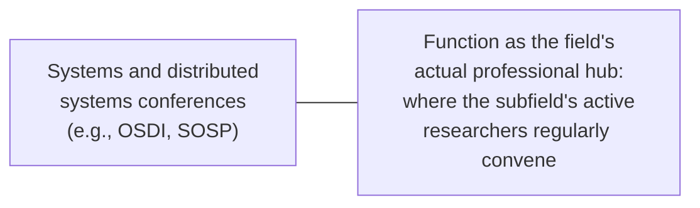

## Learning Objectives

- Explain why a conference is a professional venue for networking and early feedback, not only a publication outlet, and how this differs from simply reading a conference's published proceedings.
- Describe concrete, practical strategies for building a research network at a conference, distinct from the presentation skills `academic-writing` already covers.
- Identify why systems and distributed-systems conferences specifically function as real hubs for that subfield's professional community.
- Apply networking and conference-attendance strategy to a described early-career researcher's first conference attendance.

## Context & Motivation

`program-committees-and-the-conference-review-cycle` covered the institutional machinery behind how a conference decides what to publish. This concept covers what happens once a researcher is actually there, in person, drawing on Marie desJardins's direct, practical guidance on attending conferences and networking as a graduate student. A conference's published proceedings can be read from anywhere; what cannot be replicated remotely is the direct, informal interaction, meeting the authors of papers being read, getting early, informal feedback on unpublished ideas, and building the professional relationships that shape collaborations and future opportunities well beyond any single conference.

## Core Theory

### A conference as more than a publication venue

```text
What proceedings alone provide:      the finished, published papers

What attending in person adds:       direct conversation with authors
                                      about work not fully captured in
                                      the paper itself; informal
                                      feedback on early-stage or
                                      unpublished ideas; visibility
                                      into what a subfield's active
                                      researchers are currently
                                      working on, ahead of publication
```

desJardins treats conference attendance as a distinct professional skill from simply keeping up with a field's published literature, precisely because the value it adds, direct interaction and early, informal exposure to ongoing work, is unavailable through the proceedings alone.

### Practical networking strategies

Concrete, practical strategies desJardins recommends include: introducing oneself to the authors of papers one has found genuinely interesting, rather than assuming an introduction should wait for a more "important" occasion; asking specific, substantive questions during or after a talk rather than staying silent out of uncertainty about whether a question is worth asking; and following up after a conference, a brief email referencing the specific conversation, with researchers whose work or conversation was genuinely relevant, rather than letting a promising in-person connection lapse without any further contact.

### Systems conferences as a real professional hub



This curriculum's own stated focus on Distributed Systems as a research anchor makes this concrete rather than abstract: major systems venues function as the subfield's real, recurring professional hub, where the specific researchers whose papers a distributed systems graduate student has been reading in `distributed-systems-ii` and building on in `research-statistics`'s `designing-experiments-for-distributed-systems-research` are directly, physically present and approachable, not distant names on a paper's author line.

### Networking as compounding, not transactional

desJardins's framing of networking treats it as a long-term, compounding professional practice rather than a transactional exchange conducted only when something specific is needed. A relationship built through a genuine, substantive conversation at one conference, followed by occasional real contact afterward, is what actually produces future collaboration opportunities, job prospects, and useful professional advice years later, not a contact list collected without any sustained relationship behind it.

## Worked Examples

### Example 1: introducing oneself after a talk

A graduate student attends a talk on a paper closely related to their own thesis direction. Rather than waiting for a more "significant" opportunity, the student approaches the author afterward, mentions a specific, genuine question about a detail the talk did not fully cover, and has a substantive five-minute conversation, exactly the kind of direct engagement desJardins treats as the real, distinctive value of attending in person.

### Example 2: following up after the conference

Several weeks after a conference, a student sends a brief email to a researcher they had a genuinely useful conversation with, referencing the specific topic discussed and sharing a relevant follow-up thought. This small, low-effort action is what turns a single promising conversation into an ongoing professional relationship, rather than letting it lapse as a one-time interaction with no lasting connection.

### Example 3: recognizing a subfield's professional hub

A student working on distributed consensus protocols identifies that the researchers most active in that specific area consistently present and attend the same one or two major systems venues each year. Prioritizing attendance at those specific venues, rather than spreading limited conference travel across many loosely related events, is a deliberate, strategic application of this concept's core theory to the student's own specific research area.

## Common Misconceptions & Pitfalls

- **"Reading a conference's proceedings gives essentially the same value as attending."** Proceedings provide the finished, published content; attendance adds direct interaction, informal feedback on unpublished work, and relationship-building that proceedings alone cannot replicate.
- **"Networking is something to do only when actively looking for a job or collaborator."** desJardins's framing treats networking as a long-term, compounding practice; relationships built through genuine engagement over time, not only when something specific is needed, are what actually produce future opportunities.
- **"Introducing myself to an author whose work I admire requires some special occasion or credential."** desJardins's direct advice is to introduce oneself when genuinely interested in someone's work, without waiting for a more "important" moment that may never clearly arrive.

## Summary

A conference provides real professional value beyond its published proceedings, direct conversation with authors, informal feedback on early-stage ideas, and visibility into a subfield's ongoing work, which is exactly what desJardins's practical guidance on attending conferences and networking addresses, distinct from the presentation and writing skills `academic-writing` already covers. Practical strategies, introducing oneself to authors of interesting work, asking substantive questions, and following up meaningfully afterward, turn conference attendance into a long-term, compounding professional practice rather than a one-time transaction, and for this curriculum's own Distributed Systems focus specifically, major systems venues function as the subfield's real, recurring professional hub where that community's active researchers are directly approachable.

## Documentation Links

- [Marie desJardins, How to Be a Good Graduate Student (1994)](https://www.physlink.com/education/grad_how2.cfm): the direct source for the conference-attendance and networking guidance covered here.
