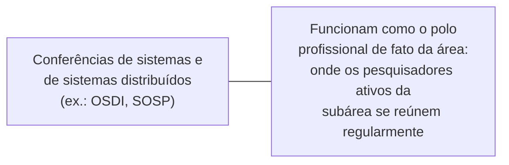

## Objetivos de Aprendizagem

- Explicar por que uma conferência é um veículo profissional para networking e feedback inicial, e não só um canal de publicação, e como isso difere de simplesmente ler os anais publicados de uma conferência.
- Descrever estratégias concretas e práticas para construir uma rede de pesquisa numa conferência, distintas das habilidades de apresentação que `academic-writing` já cobre.
- Identificar por que as conferências de sistemas e de sistemas distribuídos funcionam especificamente como polos reais da comunidade profissional dessa subárea.
- Aplicar uma estratégia de networking e de participação em conferências à primeira participação de um pesquisador de início de carreira descrito.

## Contexto e Motivação

`program-committees-and-the-conference-review-cycle` cobriu a maquinaria institucional por trás de como uma conferência decide o que publicar. Este conceito cobre o que acontece uma vez que um pesquisador está de fato lá, presencialmente, valendo-se da orientação direta e prática de Marie desJardins sobre participar de conferências e fazer networking como estudante de pós-graduação. Os anais publicados de uma conferência podem ser lidos de qualquer lugar; o que não pode ser replicado remotamente é a interação direta e informal, conhecer os autores dos artigos sendo lidos, obter feedback inicial e informal sobre ideias não publicadas, e construir as relações profissionais que moldam colaborações e oportunidades futuras bem além de qualquer conferência isolada.

## Teoria Central

### Uma conferência como mais do que um veículo de publicação

```text
O que os anais sozinhos fornecem:      os artigos prontos e publicados

O que participar presencialmente acrescenta:  conversa direta com autores
                                      sobre trabalho não plenamente captado no
                                      próprio artigo; feedback
                                      informal sobre ideias em estágio
                                      inicial ou não publicadas; visibilidade
                                      sobre o que os pesquisadores ativos de
                                      uma subárea estão trabalhando no
                                      momento, antes da publicação
```

desJardins trata a participação em conferências como uma habilidade profissional distinta de simplesmente acompanhar a literatura publicada de uma área, precisamente porque o valor que ela acrescenta, interação direta e exposição inicial e informal a trabalho em curso, é indisponível apenas pelos anais.

### Estratégias práticas de networking

Estratégias concretas e práticas que desJardins recomenda incluem: apresentar-se aos autores de artigos que se achou genuinamente interessantes, em vez de assumir que uma apresentação deva esperar por uma ocasião mais "importante"; fazer perguntas específicas e substantivas durante ou depois de uma palestra, em vez de ficar em silêncio por incerteza sobre se uma pergunta vale a pena; e dar seguimento depois de uma conferência, um breve e-mail referenciando a conversa específica, com pesquisadores cujo trabalho ou conversa foi genuinamente relevante, em vez de deixar uma conexão presencial promissora expirar sem qualquer contato adicional.

### Conferências de sistemas como um polo profissional real



O foco declarado deste próprio currículo em Sistemas Distribuídos como âncora de pesquisa torna isso concreto, em vez de abstrato: os grandes veículos de sistemas funcionam como o polo profissional real e recorrente da subárea, onde os pesquisadores específicos cujos artigos um estudante de pós-graduação em sistemas distribuídos vinha lendo em `distributed-systems-ii` e sobre os quais vem construindo em `designing-experiments-for-distributed-systems-research` de `research-statistics` estão direta e fisicamente presentes e acessíveis, e não nomes distantes numa linha de autoria de artigo.

### Networking como algo que se acumula, não transacional

O enquadramento de desJardins sobre networking o trata como uma prática profissional de longo prazo e que se acumula, e não como uma troca transacional conduzida só quando algo específico é necessário. Uma relação construída por meio de uma conversa genuína e substantiva numa conferência, seguida de contato real ocasional depois, é o que de fato produz oportunidades futuras de colaboração, perspectivas de emprego e conselho profissional útil anos depois, e não uma lista de contatos coletada sem qualquer relação sustentada por trás.

## Exemplos Resolvidos

### Exemplo 1: apresentar-se depois de uma palestra

Um estudante de pós-graduação participa de uma palestra sobre um artigo intimamente relacionado à sua própria direção de tese. Em vez de esperar por uma oportunidade mais "significativa", o estudante aborda o autor depois, menciona uma pergunta específica e genuína sobre um detalhe que a palestra não cobriu por completo, e tem uma conversa substantiva de cinco minutos, exatamente o tipo de engajamento direto que desJardins trata como o valor real e distintivo de participar presencialmente.

### Exemplo 2: dar seguimento depois da conferência

Várias semanas depois de uma conferência, um estudante envia um breve e-mail a um pesquisador com quem teve uma conversa genuinamente útil, referenciando o tópico específico discutido e compartilhando uma reflexão de acompanhamento relevante. Essa ação pequena e de baixo esforço é o que transforma uma única conversa promissora numa relação profissional contínua, em vez de deixá-la expirar como uma interação única sem conexão duradoura.

### Exemplo 3: reconhecer o polo profissional de uma subárea

Um estudante trabalhando em protocolos de consenso distribuído identifica que os pesquisadores mais ativos nessa área específica consistentemente apresentam e participam dos mesmos um ou dois grandes veículos de sistemas a cada ano. Priorizar a participação nesses veículos específicos, em vez de espalhar uma viagem a conferências limitada por muitos eventos frouxamente relacionados, é uma aplicação deliberada e estratégica da teoria central deste conceito à própria área de pesquisa específica do estudante.

## Equívocos Comuns e Armadilhas

- **"Ler os anais de uma conferência dá essencialmente o mesmo valor que participar."** Os anais fornecem o conteúdo pronto e publicado; a participação acrescenta interação direta, feedback informal sobre trabalho não publicado e construção de relações que os anais sozinhos não conseguem replicar.
- **"Networking é algo para fazer só quando se está ativamente procurando um emprego ou colaborador."** O enquadramento de desJardins trata o networking como uma prática de longo prazo e que se acumula; relações construídas por meio de engajamento genuíno ao longo do tempo, e não só quando algo específico é necessário, são o que de fato produz oportunidades futuras.
- **"Apresentar-me a um autor cujo trabalho admiro exige alguma ocasião ou credencial especial."** O conselho direto de desJardins é apresentar-se quando genuinamente interessado no trabalho de alguém, sem esperar por um momento mais "importante" que pode nunca chegar com clareza.

## Resumo

Uma conferência fornece valor profissional real além dos seus anais publicados, conversa direta com autores, feedback informal sobre ideias em estágio inicial e visibilidade sobre o trabalho em curso de uma subárea, que é exatamente o que a orientação prática de desJardins sobre participar de conferências e fazer networking aborda, distinta das habilidades de apresentação e escrita que `academic-writing` já cobre. Estratégias práticas, apresentar-se aos autores de trabalho interessante, fazer perguntas substantivas e dar seguimento de forma significativa depois, transformam a participação em conferências numa prática profissional de longo prazo e que se acumula, em vez de numa transação única, e para o próprio foco em Sistemas Distribuídos deste currículo especificamente, os grandes veículos de sistemas funcionam como o polo profissional real e recorrente da subárea, onde os pesquisadores ativos dessa comunidade são diretamente acessíveis.

## Documentation Links

- [Marie desJardins, How to Be a Good Graduate Student (1994)](https://www.physlink.com/education/grad_how2.cfm): a fonte direta da orientação sobre participação em conferências e networking coberta aqui.
