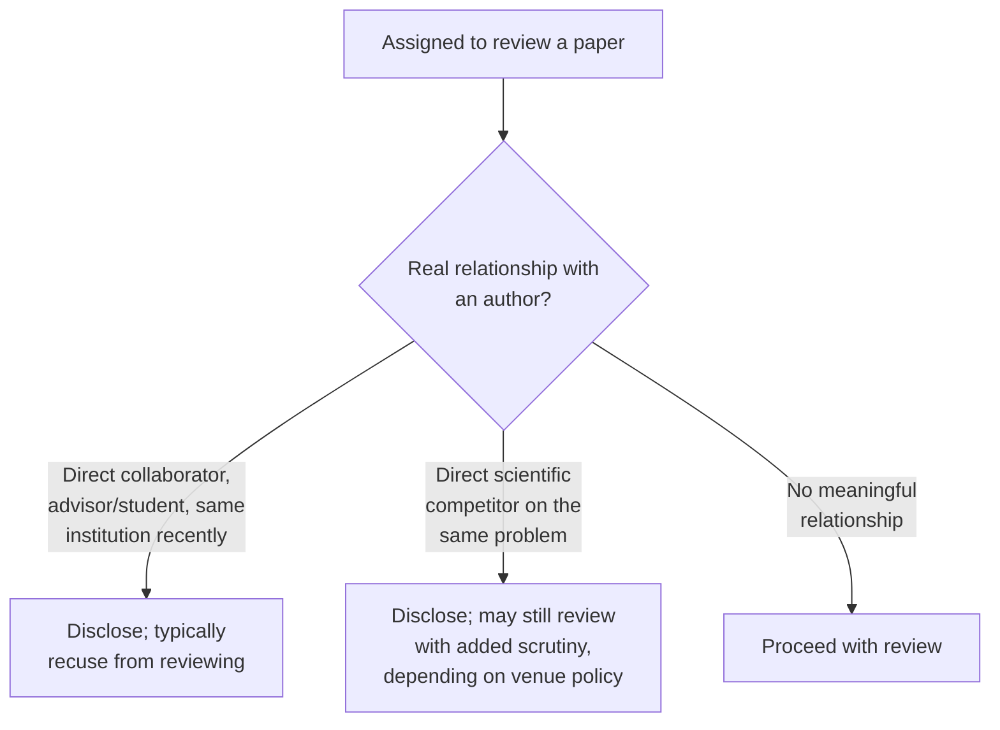

## Learning Objectives

- Explain why reviewing unpublished work creates a real, specific confidentiality obligation, and what concretely that obligation prohibits.
- Define conflict of interest in the peer review context, and identify the categories of relationship that typically require disclosure.
- Distinguish a disqualifying conflict of interest from one that merely requires disclosure and can still permit a review to proceed.
- Apply these obligations to a described reviewing scenario to determine the appropriate action.

## Context & Motivation

`peer-review-from-the-referee-side` covered how to evaluate a paper well; `research-ethics-authorship-and-misrepresentation` covered ownership and honest reporting of one's own work. This concept covers two further, concrete obligations that attach specifically to the reviewer role: confidentiality, because a reviewer sees unpublished work before almost anyone else, and conflict of interest, because a reviewer's own relationships and incentives can compromise, or appear to compromise, an honest evaluation. Zobel treats both as practical, checkable obligations, not abstract virtues, closing out the ethics material this discipline draws from his final chapter.

## Core Theory

### Confidentiality: what reviewing unpublished work actually obligates

```text
A reviewer sees, before publication:
  - the paper's specific technical approach, sometimes not yet
    protected by any prior publication or patent
  - preliminary results the authors may still be refining
  - the authors' own framing of what makes the work novel

The confidentiality obligation this creates:
  - do not share the paper's content with anyone not authorized
    to see it as part of the review process
  - do not use ideas or techniques from the unpublished paper in
    one's own work before it is published
  - treat the review assignment itself as confidential where the
    venue's process expects that
```

This obligation exists because peer review only works, as an institution, if authors can trust that submitting a paper for review does not risk having its unpublished ideas taken or disclosed before the authors themselves can publish them. A reviewer who reads a clever unpublished technique and, consciously or not, incorporates something similar into their own concurrent work has violated this trust regardless of whether they can technically argue independent invention.

### Conflict of interest: what requires disclosure



A conflict of interest exists when a reviewer's relationship to a paper's authors could reasonably compromise, or appear to compromise, an honest evaluation, close past collaboration, a current or recent advisor-student relationship, shared institutional affiliation, or being a direct scientific competitor actively working on the same specific problem. The appropriate response depends on the severity: a close personal or professional relationship typically means recusing from the review entirely, disclosing it to the editor so someone else is assigned, while a more distant conflict, like general competition within a broad subfield, may only require disclosure, letting the editor or committee weigh it, rather than automatic disqualification.

### Disclosure as the operative principle

The consistent underlying principle across both confidentiality and conflict of interest is that a reviewer's obligation is to make the relevant information visible to the people positioned to act on it, the editor or program committee, rather than to make a private, unilateral judgment call. A reviewer unsure whether a given relationship counts as a disqualifying conflict is expected to disclose it and let the editor decide, not to quietly self-assess as unbiased and proceed without flagging it.

## Worked Examples

### Example 1: a clear confidentiality violation

A reviewer, reading an unpublished paper describing a novel technique, later publishes a paper of their own using a strikingly similar technique before the original paper appears, without citing it, since it was not yet public. Regardless of intent, this is exactly the kind of confidentiality violation peer review's trust depends on avoiding; the appropriate practice would have been to recuse from any closely related concurrent work, or at minimum to be scrupulously careful about the boundary, once assigned to review the paper.

### Example 2: a disqualifying conflict of interest

A researcher is assigned to review a paper co-authored by their current PhD advisor. This is a clear, disqualifying conflict, the reviewer's own career and relationship with the advisor make an unbiased evaluation genuinely difficult to guarantee, and the appropriate action is disclosing this to the editor and recusing from the review, not attempting to review "carefully and fairly" despite the relationship.

### Example 3: a conflict requiring disclosure but not automatic recusal

A researcher is assigned to review a paper from a different research group working on a closely related but distinct problem in the same broad subfield, with no direct personal or professional relationship to the authors. This is a milder, more common situation many venues classify as requiring disclosure of the general competitive relationship (documented for the editor's awareness) without automatically disqualifying the reviewer, since some degree of subfield overlap is often unavoidable when finding genuinely qualified reviewers.

## Common Misconceptions & Pitfalls

- **"If I don't literally copy the unpublished paper's text, I haven't violated confidentiality."** The obligation covers ideas and techniques, not just literal text; using an unpublished paper's underlying approach in one's own concurrent work before it is published is a real violation even without any copied wording.
- **"I can judge for myself whether my relationship to the authors is a real conflict."** The expected practice is disclosure to the editor or committee, who are positioned to weigh it, rather than a reviewer's private, unilateral judgment that a relationship is not significant enough to mention.
- **"Any prior connection to an author automatically disqualifies a reviewer."** Milder, more distant relationships, like general subfield overlap, often only require disclosure rather than automatic recusal; treating every connection as disqualifying would make finding genuinely qualified reviewers in a specialized area nearly impossible.

## Summary

Reviewing unpublished work creates a real confidentiality obligation, not sharing its content and not using its ideas in one's own concurrent work before publication, because peer review as an institution depends on authors trusting their unpublished ideas are safe during review. Conflict of interest, a reviewer's relationship to a paper's authors that could compromise or appear to compromise an honest evaluation, ranges from disqualifying (a close collaborator or advisor-student relationship, requiring recusal) to milder cases requiring only disclosure, and the consistent operative principle across both concerns is that a reviewer's job is to make relevant information visible to the editor or committee, not to make a private, unilateral judgment call.

## Documentation Links

- [ACM Digital Library: Justin Zobel, Writing for Computer Science (3rd Edition, Springer, 2014)](https://dl.acm.org/doi/10.5555/2742708): Chapter 17's "Confidentiality and Conflict of Interest" section is the direct source for the reviewer obligations covered here.
