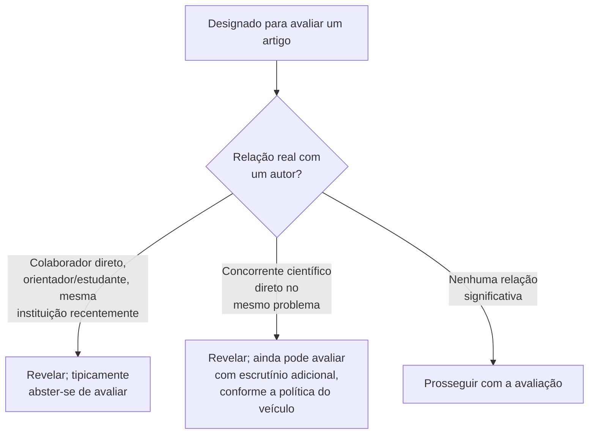

## Objetivos de Aprendizagem

- Explicar por que avaliar trabalho não publicado cria uma obrigação de confidencialidade real e específica, e o que concretamente essa obrigação proíbe.
- Definir conflito de interesse no contexto da avaliação por pares, e identificar as categorias de relação que tipicamente exigem revelação.
- Distinguir um conflito de interesse que desqualifica de um que meramente exige revelação e ainda pode permitir que uma avaliação prossiga.
- Aplicar essas obrigações a um cenário de avaliação descrito para determinar a ação apropriada.

## Contexto e Motivação

`peer-review-from-the-referee-side` cobriu como avaliar bem um artigo; `research-ethics-authorship-and-misrepresentation` cobriu a propriedade e o relato honesto do próprio trabalho. Este conceito cobre duas obrigações adicionais e concretas que se atrelam especificamente ao papel de avaliador: confidencialidade, porque um avaliador vê trabalho não publicado antes de quase qualquer outra pessoa, e conflito de interesse, porque as próprias relações e incentivos de um avaliador podem comprometer, ou parecer comprometer, uma avaliação honesta. Zobel trata ambas como obrigações práticas e conferíveis, e não como virtudes abstratas, encerrando o material de ética de que esta disciplina se vale do seu capítulo final.

## Teoria Central

### Confidencialidade: o que avaliar trabalho não publicado de fato obriga

```text
Um avaliador vê, antes da publicação:
  - a abordagem técnica específica do artigo, às vezes ainda não
    protegida por qualquer publicação prévia ou patente
  - resultados preliminares que os autores ainda podem estar refinando
  - o próprio enquadramento dos autores sobre o que torna o trabalho novo

A obrigação de confidencialidade que isso cria:
  - não compartilhar o conteúdo do artigo com ninguém não autorizado
    a vê-lo como parte do processo de avaliação
  - não usar ideias ou técnicas do artigo não publicado no
    próprio trabalho antes de ele ser publicado
  - tratar a própria designação de avaliação como confidencial onde o
    processo do veículo espera isso
```

Essa obrigação existe porque a avaliação por pares só funciona, como instituição, se os autores puderem confiar que submeter um artigo para avaliação não arrisca ter as suas ideias não publicadas tomadas ou reveladas antes de os próprios autores poderem publicá-las. Um avaliador que lê uma técnica não publicada engenhosa e, consciente ou não, incorpora algo semelhante no seu próprio trabalho concorrente violou essa confiança, independentemente de poder, tecnicamente, argumentar invenção independente.

### Conflito de interesse: o que exige revelação



Um conflito de interesse existe quando a relação de um avaliador com os autores de um artigo poderia razoavelmente comprometer, ou parecer comprometer, uma avaliação honesta, colaboração próxima no passado, uma relação atual ou recente de orientador-estudante, afiliação institucional compartilhada, ou ser um concorrente científico direto trabalhando ativamente no mesmo problema específico. A resposta apropriada depende da severidade: uma relação pessoal ou profissional próxima tipicamente significa abster-se da avaliação por completo, revelando-a ao editor para que outra pessoa seja designada, enquanto um conflito mais distante, como a concorrência geral dentro de uma subárea ampla, pode exigir só revelação, deixando o editor ou o comitê ponderá-la, em vez de desqualificação automática.

### A revelação como princípio operante

O princípio subjacente consistente tanto na confidencialidade quanto no conflito de interesse é que a obrigação de um avaliador é tornar a informação relevante visível às pessoas posicionadas para agir sobre ela, o editor ou o comitê de programa, em vez de fazer um julgamento privado e unilateral. Espera-se que um avaliador inseguro sobre se uma dada relação conta como um conflito que desqualifica a revele e deixe o editor decidir, e não que silenciosamente se autoavalie como imparcial e prossiga sem sinalizá-la.

## Exemplos Resolvidos

### Exemplo 1: uma violação clara de confidencialidade

Um avaliador, lendo um artigo não publicado que descreve uma técnica nova, depois publica um artigo próprio usando uma técnica surpreendentemente semelhante antes de o artigo original aparecer, sem citá-lo, já que ele ainda não era público. Independentemente da intenção, esse é exatamente o tipo de violação de confidencialidade que a confiança da avaliação por pares depende de evitar; a prática apropriada teria sido abster-se de qualquer trabalho concorrente intimamente relacionado, ou no mínimo ser escrupulosamente cuidadoso quanto à fronteira, uma vez designado para avaliar o artigo.

### Exemplo 2: um conflito de interesse que desqualifica

Um pesquisador é designado para avaliar um artigo coautorado pelo seu orientador de doutorado atual. Esse é um conflito claro e que desqualifica, a própria carreira do avaliador e a sua relação com o orientador tornam uma avaliação imparcial genuinamente difícil de garantir, e a ação apropriada é revelar isso ao editor e abster-se da avaliação, e não tentar avaliar "com cuidado e justiça" apesar da relação.

### Exemplo 3: um conflito que exige revelação, mas não abstenção automática

Um pesquisador é designado para avaliar um artigo de um grupo de pesquisa diferente trabalhando num problema intimamente relacionado, mas distinto, na mesma subárea ampla, sem relação pessoal ou profissional direta com os autores. Essa é uma situação mais branda e mais comum que muitos veículos classificam como exigindo a revelação da relação competitiva geral (documentada para o conhecimento do editor) sem desqualificar automaticamente o avaliador, já que algum grau de sobreposição de subárea é muitas vezes inevitável ao encontrar avaliadores genuinamente qualificados.

## Equívocos Comuns e Armadilhas

- **"Se eu não copiar literalmente o texto do artigo não publicado, não violei a confidencialidade."** A obrigação cobre ideias e técnicas, não só o texto literal; usar a abordagem subjacente de um artigo não publicado no próprio trabalho concorrente antes de ele ser publicado é uma violação real mesmo sem qualquer formulação copiada.
- **"Posso julgar por mim mesmo se a minha relação com os autores é um conflito real."** A prática esperada é a revelação ao editor ou ao comitê, que estão posicionados para ponderá-la, em vez de um julgamento privado e unilateral do avaliador de que uma relação não é significativa o bastante para mencionar.
- **"Qualquer conexão prévia com um autor desqualifica automaticamente um avaliador."** Relações mais brandas e mais distantes, como a sobreposição geral de subárea, muitas vezes exigem só revelação, em vez de abstenção automática; tratar toda conexão como desqualificadora tornaria quase impossível encontrar avaliadores genuinamente qualificados numa área especializada.

## Resumo

Avaliar trabalho não publicado cria uma obrigação de confidencialidade real, não compartilhar o seu conteúdo e não usar as suas ideias no próprio trabalho concorrente antes da publicação, porque a avaliação por pares como instituição depende de os autores confiarem que as suas ideias não publicadas estão seguras durante a avaliação. O conflito de interesse, a relação de um avaliador com os autores de um artigo que poderia comprometer ou parecer comprometer uma avaliação honesta, varia de desqualificador (uma relação de colaborador próximo ou de orientador-estudante, exigindo abstenção) a casos mais brandos que exigem só revelação, e o princípio operante consistente nas duas preocupações é que a função de um avaliador é tornar a informação relevante visível ao editor ou ao comitê, e não fazer um julgamento privado e unilateral.

## Documentation Links

- [ACM Digital Library: Justin Zobel, Writing for Computer Science (3ª edição, Springer, 2014)](https://dl.acm.org/doi/10.5555/2742708): a seção "Confidentiality and Conflict of Interest" do Capítulo 17 é a fonte direta das obrigações do avaliador cobertas aqui.
